# SKN12-FINAL-2TEAM — Frontend UML Specification 

> **목표:** 이 문서는 SKN12-FINAL-2TEAM 프론트엔드(Next.js 15.4.2, React 18.2.0, TypeScript 5.8.3)의 구조를 **UML 중심**으로 정밀 해부한다. 설계 의도, 모듈 경계, 상호작용, 수명주기, 오류/재시도, 보안, 성능까지 **실전 배포 관점**에서 다룬다. AI가 학습해도 손색없는 수준으로 명세화한다.

---

## 0. 전제와 범위

* **대상 범위:** `base_server/frontend/ai-trading-platform/`의 `app/`(App Router), `components/`, `hooks/`, `lib/`, `providers/`, `types/` 그리고 브라우저 ↔ Edge/Node 런타임 ↔ 백엔드(API, WS, SSE) 인터랙션.
* **통신 프로토콜:** REST(axios), SSE(EventSource), WebSocket.
* **상태관리:** 로컬 상태(React), 전역(Zustand), 서버 상태(SWR/React Query 가정 가능).
* **인증:** 토큰 기반 (UUID 문자열). 토큰 저장소는 브라우저(Storage) + Context.
* **가정:** 실시간 시세는 WS로, 챗봇은 SSE로, 포트폴리오/설정은 REST로 운용. Next.js 서버 컴포넌트와 클라이언트 컴포넌트 분리를 적극 활용.

> **NOTE:** 이 문서는 **As-Is(현재 구현)**와 **To-Be(개선안)**를 명확히 구분한다.
> - **실선 + 기본색**: 현재 구현된 기능
> - **점선 + <<planned>>**: 향후 개선 계획
> - **Gap 분석**: 현재와 목표 간 차이점
> - **마이그레이션**: 개선 적용 절차

---

## 1. 유스케이스 모델 (Use‑Case)

### 1.1 액터 & 유스케이스 개요 (As-Is)

* **액터**
  * *User* (투자자, 일반 사용자)
  * *Auth Service* (토큰 발급/검증)
  * *Market WS Broker* (시세 푸시)
  * *Chat SSE Gateway* (AI 응답 스트림)
  * *Portfolio API* (자산/거래/리밸런싱)
  * *Trade Engine API* (자동매매 설정/시그널)

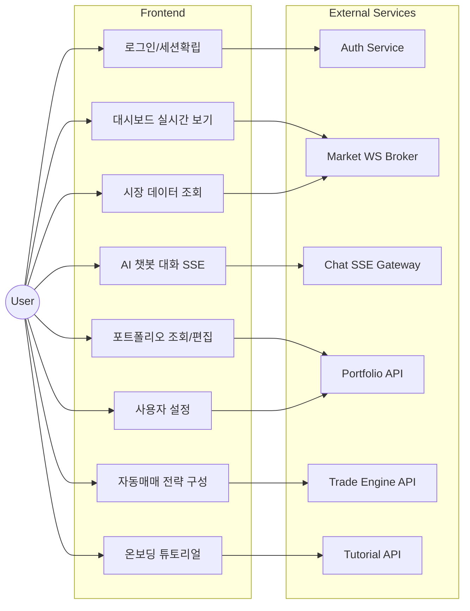

**핵심 시나리오 요약 (As-Is)**

1. 로그인 성공 → 토큰 획득 → 보호 라우트 진입.
2. 대시보드 진입 시, WS 연결 수립 → 관심 심볼 구독 → 실시간 반영.
3. 챗 입력 → SSE 스트림 수신 → requestAnimationFrame 타이핑 애니메이션.
4. 포트폴리오 CRUD → REST 교환 후 전역/서버 상태 동기화.
5. 자동매매 설정 변경 → 서버 반영 + 로컬 스냅샷.
6. 튜토리얼 진행 → 단계별 가이드 → 완료 상태 저장.

---

### 1.2 향후 개선 계획 (To-Be)

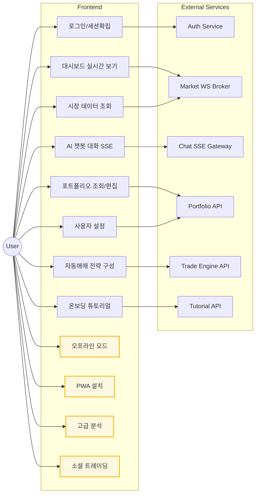

**향후 개선 시나리오**

1. **오프라인 모드**: 네트워크 불안정 시 캐시된 데이터로 기본 기능 제공
2. **PWA 지원**: 모바일 앱처럼 설치 및 푸시 알림
3. **고급 분석**: AI 기반 포트폴리오 최적화 및 리스크 분석
4. **소셜 트레이딩**: 다른 투자자의 전략 공유 및 팔로우

---

## 2. 패키지 다이어그램 (Package)

### 2.1 현재 구조 (As-Is)

소스 트리의 **의존 방향**과 층위를 명확히 한다. `components`는 `hooks/lib/providers/types`에 **의존**하되, 역의존을 금한다.

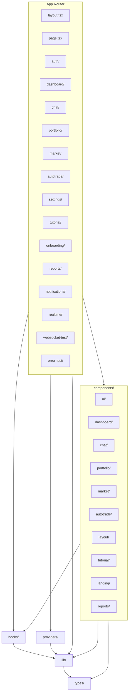

**규율:** 상위 레이어는 하위 레이어로만 의존(단방향). `lib/`는 순수 유틸/클라이언트로 유지, React 의존 최소화.

---

### 2.2 향후 개선 구조 (To-Be)

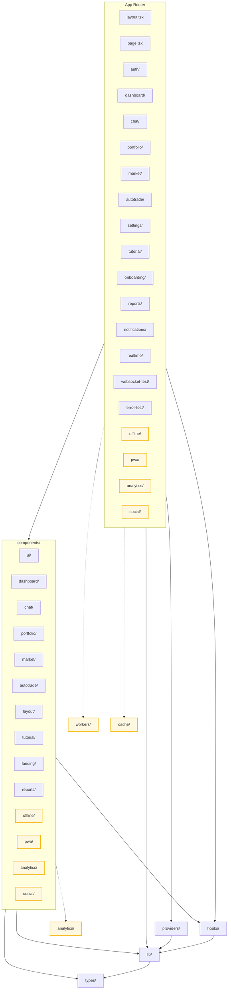

**향후 추가 예정 패키지**

- **workers/**: SharedWorker, ServiceWorker (오프라인 지원)
- **cache/**: IndexedDB, Cache API 래퍼
- **analytics/**: 사용자 행동 분석, 성능 모니터링
- **social/**: 소셜 기능, 커뮤니티

---

## 3. 컴포넌트 다이어그램 (Component)

### 3.1 현재 구조 (As-Is)

페이지/경계 컴포넌트가 어떤 런타임 자원(SSE/WS/REST)에 붙는지 시각화.

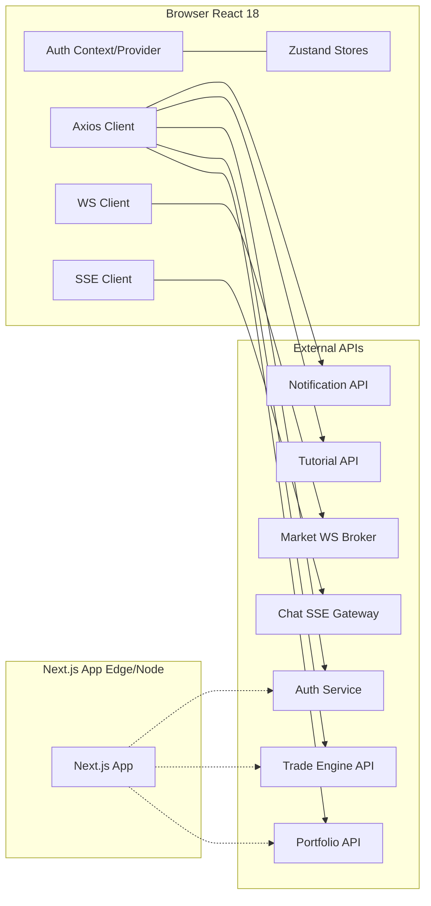

---

### 3.2 향후 개선 구조 (To-Be)

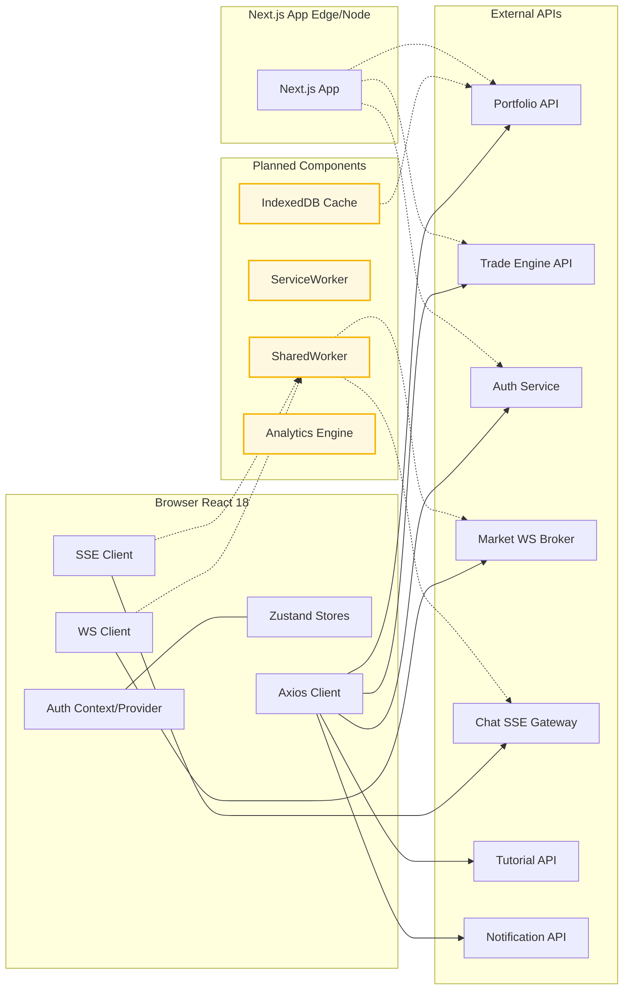

**향후 추가 예정 컴포넌트**

- **SharedWorker**: 멀티탭에서 WS/SSE 연결 공유
- **ServiceWorker**: 오프라인 지원, 푸시 알림
- **IndexedDB Cache**: 대용량 데이터 로컬 저장
- **Analytics Engine**: 사용자 행동 추적, 성능 모니터링

---


## 4. 클래스 모델 (주요 도메인 & 클라이언트)

### 4.1 인증/컨텍스트/가드

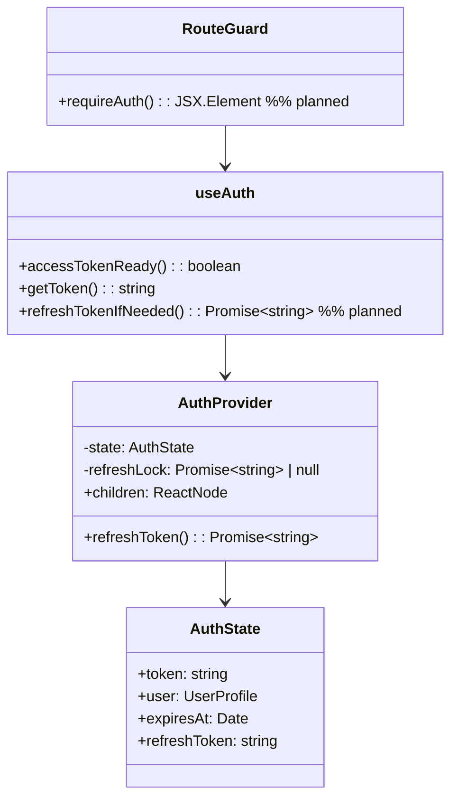

### 4.2 WS(시세) 스토어 & 클라이언트

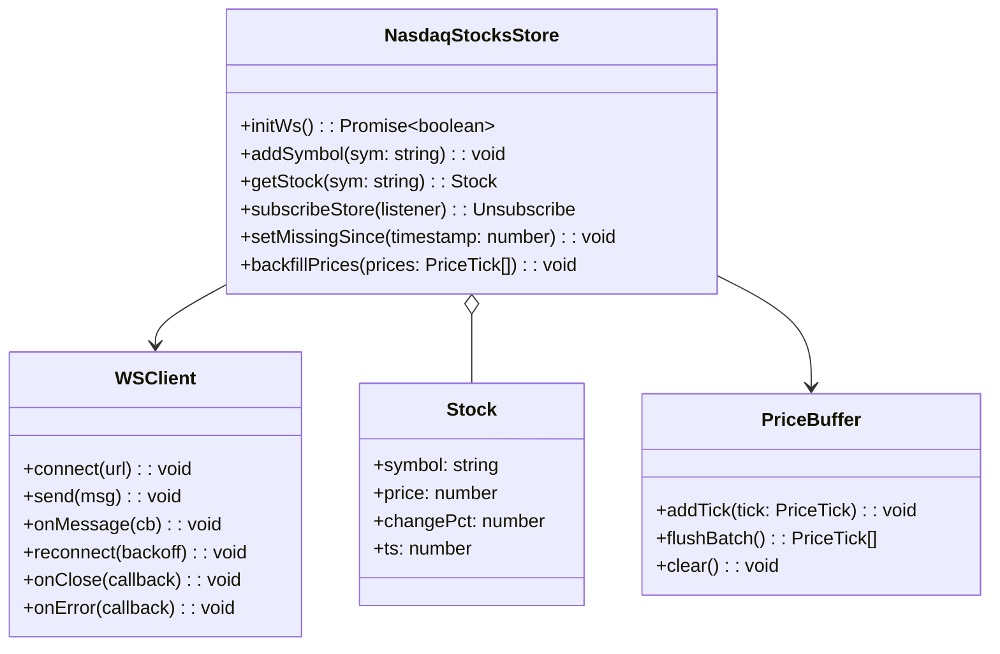

### 4.3 챗(SSE) & UI

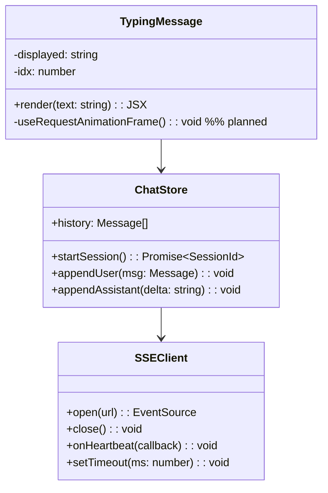

### 4.4 REST API 래퍼

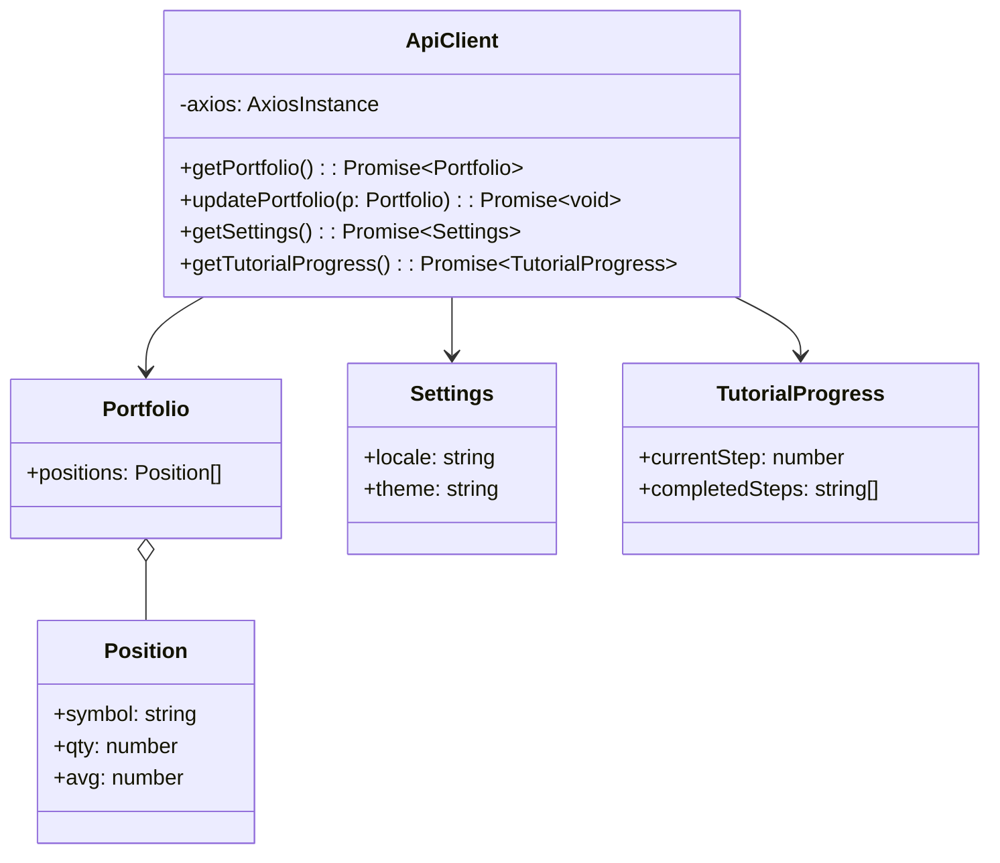

### 4.5 튜토리얼 시스템

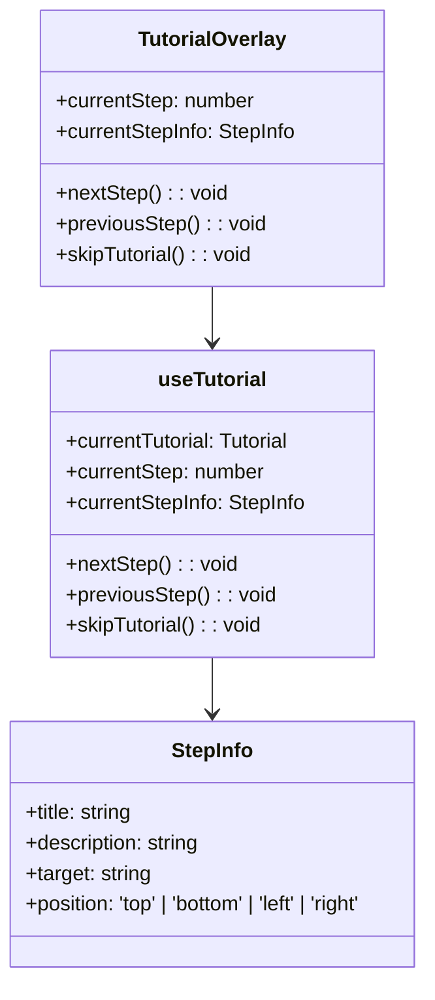

---

## 5. 시퀀스 다이어그램 (핵심 플로우)

### 5.1 로그인/가드/페이지 전개

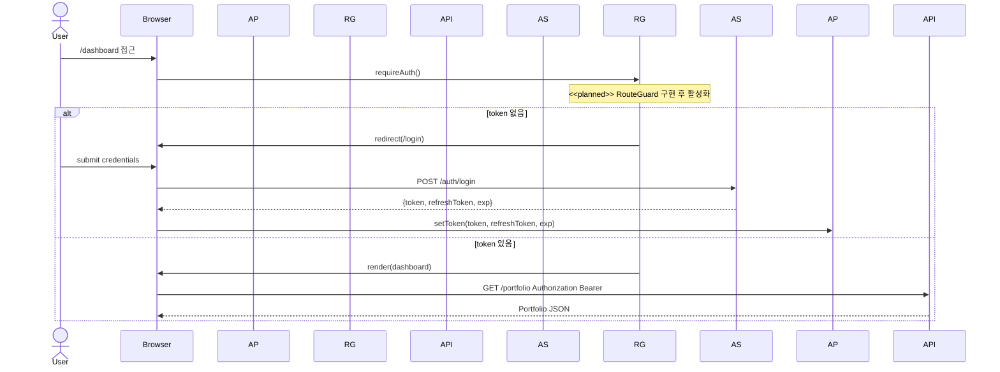

### 5.1.1 토큰 리프레시 동시성 제어 (<<planned>>)

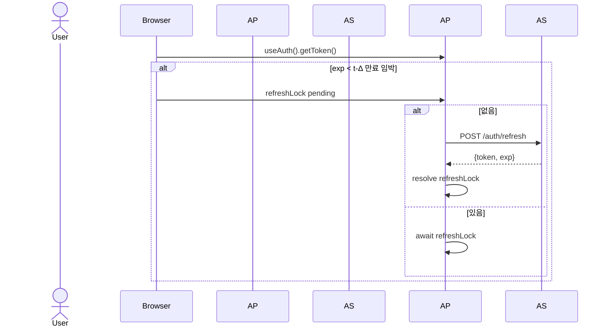

### 5.2 대시보드 실시간(WS)

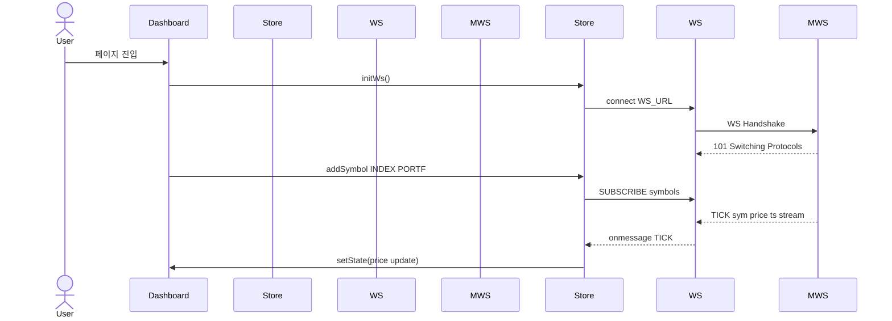

### 5.2.1 WS 재연결 + 재구독 + 백필(Backfill)

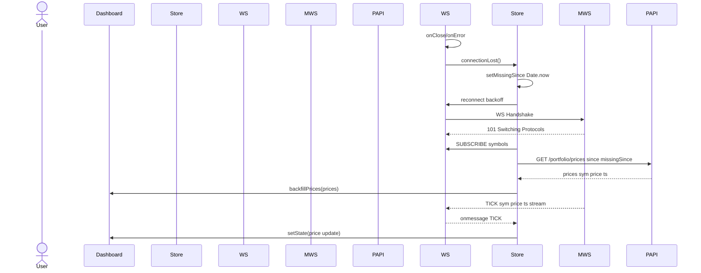

**백필 정합 규칙**: Backfill merge는 (1) ts 단조 증가 보장, (2) symbol+ts 중복 제거, (3) 서버시각과의 Δ 보정(절대시간 기준), (4) 라이브 틱과 백필의 단일 병합 패스로 완료한다. O(n log n) 정렬 1회 + O(n) 머지, 링버퍼 길이 N=1024 유지.

### 5.3 챗봇(SSE) 스트리밍 + requestAnimationFrame 타이핑

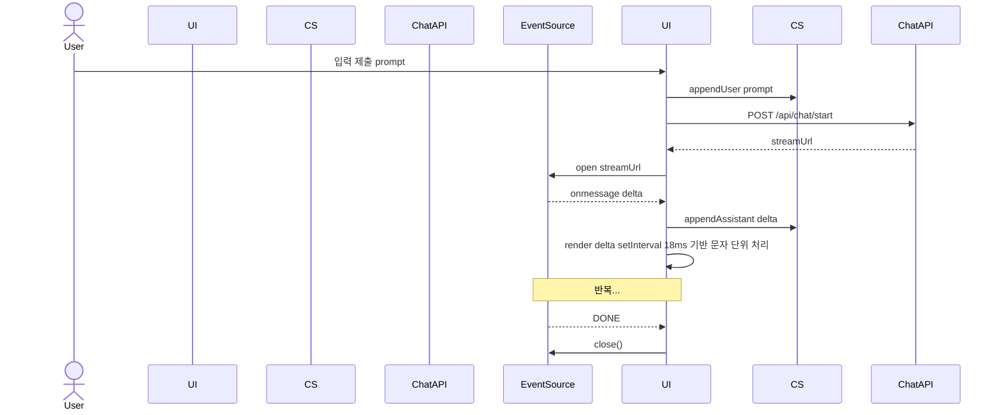

### 5.3.1 SSE 하트비트/타임아웃/조기 종료

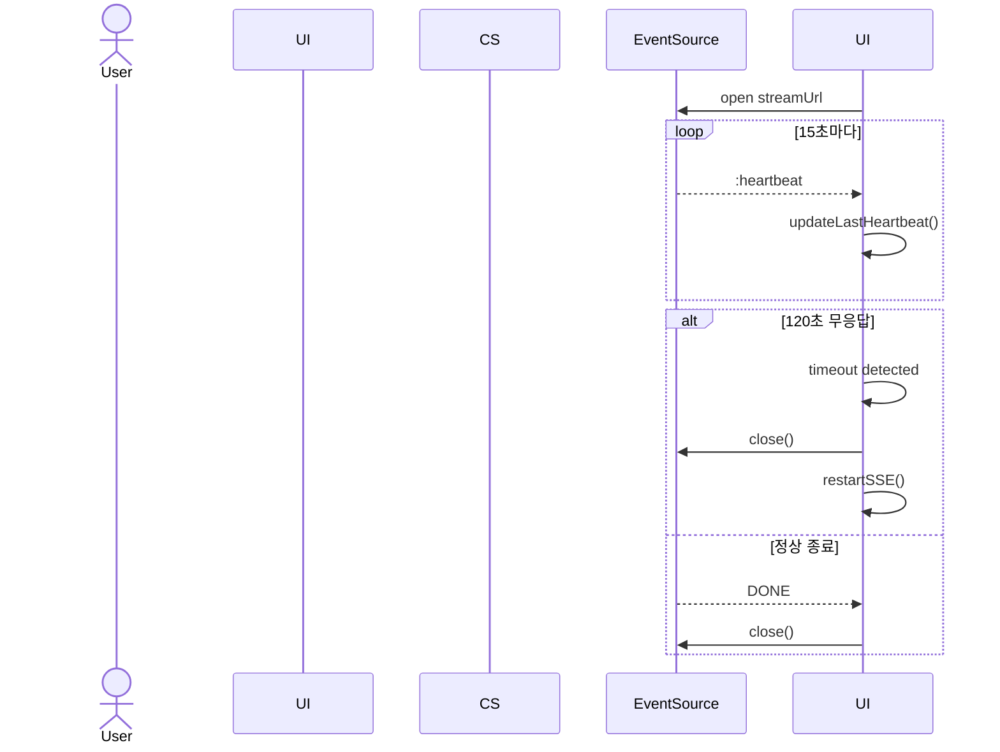

### 5.3.2 SharedWorker 멀티탭 시퀀스 (To-Be)

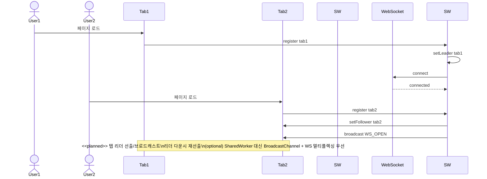

### 5.4 튜토리얼 진행 플로우

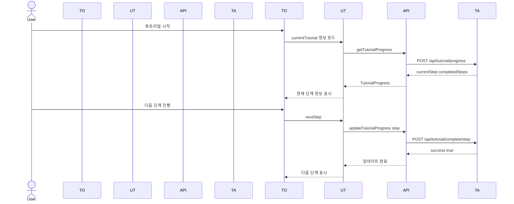

---

## 6. 액티비티 다이어그램 (흐름/분기)

### 6.1 자동매매 설정 저장

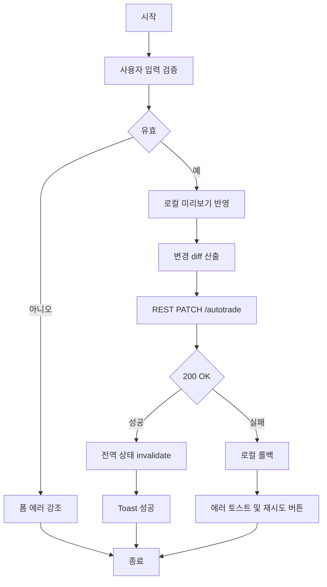

### 6.2 시세 구독 관리 (심볼 추가/삭제)

```mermaid
flowchart TD
    A[시작] --> B[사용자 심볼 추가]
    B --> C[Store.addSymbol]
    C --> D{WS 연결됨}
    D -->|예| E[WS.SUBSCRIBE]
    D -->|아니오| F[대기 OnOpen 후 큐 처리]
    E --> G[종료]
    F --> G
```

### 6.3 튜토리얼 단계 진행

```mermaid
flowchart TD
    A[시작] --> B[현재 단계 정보 로드]
    B --> C[사용자 액션 감지]
    C --> D{단계 완료 조건 충족}
    D -->|예| E[완료 상태 저장]
    D -->|아니오| F[현재 단계 계속 진행]
    E --> G[다음 단계 정보 로드]
    G --> H{모든 단계 완료}
    H -->|예| I[튜토리얼 완료 축하]
    H -->|아니오| J[다음 단계 안내]
    I --> K[보상 지급]
    F --> L[종료]
    J --> L
    K --> L
```

### 6.4 폴백 전략 (WS → SSE → Polling)

```mermaid
flowchart TD
    A[시작] --> B[WebSocket 연결 시도]
    B --> C{연결 성공}
    C -->|예| D[실시간 데이터 수신]
    C -->|아니오| E[SSE 연결 시도]
    E --> F{SSE 연결 성공}
    F -->|예| G[스트리밍 데이터 수신]
    F -->|아니오| H[폴링 모드 전환]
    H --> I[5초마다 REST API 호출]
    I --> J[데이터 업데이트]
    D --> K[종료]
    G --> K
    J --> K
```

---

## 7. 상태 머신 (State Machines)

### 7.1 TypingMessage

```mermaid
stateDiagram-v2
    [*] --> Idle
    Idle --> Typing : setText
    Typing --> Typing : setInterval 18ms append chars
    Typing --> Done : idx >= len
    Done --> Idle : setText
    Typing --> Idle : unmount cleanup clearInterval
```

### 7.2 WS 연결 재시도(백오프)

```mermaid
stateDiagram-v2
    [*] --> Connecting
    Connecting --> Open : onOpen
    Connecting --> Backoff : onError
    Open --> Backoff : onClose
    Backoff --> Connecting : timer exp backoff
```

### 7.3 인증 세션

```mermaid
stateDiagram-v2
    [*] --> Anonymous
    Anonymous --> Authenticated : login(token)
    Authenticated --> Anonymous : logout/expire
    Authenticated --> Refreshing : t-Δ before exp
    Refreshing --> Authenticated : refresh OK
    Refreshing --> Anonymous : refresh FAIL
```

### 7.4 튜토리얼 진행 상태

```mermaid
stateDiagram-v2
    [*] --> NotStarted
    NotStarted --> InProgress : startTutorial()
    InProgress --> StepComplete : completeStep()
    StepComplete --> InProgress : nextStep()
    InProgress --> Completed : allStepsComplete()
    Completed --> NotStarted : resetTutorial()
```

### 7.5 WS 장애 복구 상태

```mermaid
stateDiagram-v2
    [*] --> Connected
    Connected --> Disconnected : onClose/onError
    Disconnected --> Backoff : exponential backoff
    Backoff --> Reconnecting : timer
    Reconnecting --> Connected : onOpen
    Reconnecting --> Backoff : onError
```

### 7.6 폴백 전략 상태 머신 (To-Be)

```mermaid
stateDiagram-v2
    [*] --> WS_Open
    WS_Open --> WS_Fail : connection lost
    WS_Fail --> SSE_Open : WS 재연결 실패
    SSE_Open --> SSE_Fail : SSE 연결 실패
    SSE_Fail --> Polling : SSE 재연결 실패
    Polling --> Recover : 네트워크 복구
    Recover --> WS_Open : WS 재시도
    Recover --> SSE_Open : WS 실패 시 SSE 시도
    
    note right of WS_Fail
        <<planned>>
        지수 백오프 + jitter
        최대 5회 시도
    end note
    
    note right of SSE_Fail
        <<planned>>
        heartbeat 15-30s
        120s 타임아웃
    end note
    
    note right of Polling
        <<planned>>
        5초 간격 REST
        배터리 절약 모드
        anti-flap: 30s 내 3회 실패 → 60s 쿨다운 후 재평가
    end note
```

---

## 8. 배포 다이어그램 (Deployment)

```mermaid
graph TB
  subgraph UD["User Device"]
    BR["Browser (React 18)"]
  end

  subgraph EDGE["Edge Runtime"]
    APP["Next.js App Router - SSR/SSG"]
    SSE_GW["SSE Gateway - Edge"]
  end

  subgraph NODE["Node Runtime"]
    WS_GW["WebSocket Gateway"]
  end

  subgraph BE["Backend"]
    subgraph APIs["APIs"]
      AuthService["Auth Service"]
      PortfolioAPI["Portfolio API"]
      TradeEngine["Trade Engine API"]
      TutorialAPI["Tutorial API"]
      NotificationAPI["Notification API"]
    end
    subgraph Realtime["Realtime"]
      MarketWS["Market WS Broker"]
      ChatSSE["Chat SSE Gateway"]
    end
  end

  %% Edges
  BR -->|HTTP / HTTPS| APP
  APP -->|HTTP / HTTPS| BR
  BR -->|WebSocket - Node only| WS_GW
  BR -->|SSE - Edge or Node| SSE_GW
  APP -->|REST| APIs
  WS_GW -.->|feeds| MarketWS
  SSE_GW -.->|feeds| ChatSSE
```

---

## 9. 데이터 계약(스키마) & 타입 경계

### 9.1 공통 타입 (TypeScript)

```ts
// types/
export type Symbol = string;

// 표준 API 응답 래퍼
export type ApiResult<T> =
  | { ok: true; data: T; requestId: string; traceId?: string }
  | { ok: false; error: { code: string; message: string; details?: unknown }; requestId: string; traceId?: string };

// 에러 코드 집합
export type ErrorCode = 
  | 'AUTH_EXPIRED' | 'AUTH_REVOKED' | 'RATE_LIMITED' 
  | 'WS_PROTOCOL' | 'SSE_TIMEOUT' | 'VALIDATION_FAILED'
  | 'NETWORK_ERROR' | 'SERVER_ERROR' | 'UNKNOWN_ERROR';

export interface PriceTick { 
  symbol: Symbol; 
  price: number; 
  changePct: number;
  ts: number;
}

// 런타임 스키마 검증 (Zod)
import { z } from 'zod';
export const PriceTickSchema = z.object({
  symbol: z.string(),
  price: z.number().positive(),
  changePct: z.number(),
  ts: z.number().int().positive()
});
export type ValidatedPriceTick = z.infer<typeof PriceTickSchema>;
export interface Message { 
  role: 'user'|'assistant'|'system'; 
  content: string; 
  ts: number;
  requestId: string;
}
export interface Portfolio { 
  positions: Position[];
  requestId: string;
}
export interface Position { 
  symbol: Symbol; 
  qty: number; 
  avg: number 
}
export interface Settings { 
  locale: string; 
  theme: 'light'|'dark' 
}
export interface TutorialProgress {
  currentStep: number;
  completedSteps: string[];
  totalSteps: number;
  requestId: string;
}
export interface StepInfo {
  title: string;
  description: string;
  target: string;
  position: 'top' | 'bottom' | 'left' | 'right';
}
```

### 9.2 REST 응답 계약 예시

```json
GET /api/portfolio -> {
  "ok": true,
  "data": {
    "positions": [ {"symbol": "AAPL", "qty": 10, "avg": 185.2} ]
  },
  "requestId": "req_123456789",
  "traceId": "trace_987654321"
}

POST /api/tutorial/progress -> {
  "ok": true,
  "data": {
    "currentStep": 3,
    "completedSteps": ["step1", "step2"],
    "totalSteps": 5
  },
  "requestId": "req_123456790",
  "traceId": "trace_987654322"
}

// 에러 응답 예시
{
  "ok": false,
  "error": {
    "code": "AUTH_EXPIRED",
    "message": "Authentication token has expired",
    "details": null
  },
  "requestId": "req_123456791",
  "traceId": "trace_987654323"
}
```

### 9.3 SSE 델타 계약

```json
{"type":"delta","data":" … token … ","requestId":"req_123456789","timestamp":1723800000000}
{"type":"heartbeat","timestamp":1723800000000}
{"type":"done","requestId":"req_123456789","timestamp":1723800000000}
```

### 9.4 WS 틱 계약

```json
{"type":"tick_batch","meta":{"batchRequestId":"req_123456789","ts":1723800000000},"ticks":[{"symbol":"NVDA","price":124.56,"changePct":2.34,"ts":1723800000000},{"symbol":"AAPL","price":185.20,"changePct":-0.85,"ts":1723800000000}]}
{"type":"heartbeat","timestamp":1723800000000}
```

---

### 9.5 W3C Trace Context 예시

#### REST API 헤더
```http
GET /api/portfolio
traceparent: 00-4bf92f3577b34da6a3ce929d0e0e4736-00f067aa0ba902b7-01
tracestate: skn=frontend,env=prod
```

#### WebSocket SUBSCRIBE Payload
```json
{
  "op": "SUBSCRIBE",
  "symbols": ["NVDA", "AAPL"],
  "traceparent": "00-4bf92f3577b34da6a3ce929d0e0e4736-00f067aa0ba902b7-01",
  "tracestate": "skn=frontend,env=prod"
}
```

#### SSE Heartbeat Event
```http
event: heartbeat
data: {
  "ts": 1723800000000,
  "traceparent": "00-4bf92f3577b34da6a3ce929d0e0e4736-00f067aa0ba902b7-01",
  "tracestate": "skn=frontend,env=prod"
}
```

---

## 10. 성능/자원 설계

* **Streaming 우선 UX:** SSE로 토큰 단위 전달 → `TypingMessage(setInterval 18ms)`로 점진적 렌더.
* **메모리 압박 완화:** `useRef` 인덱스, 언마운트 시 인터벌 정리. 메시지 히스토리 **스냅/가상화** 고려.
* **WS 백오프:** 지수 백오프 + Jitter. 최대 재시도/냉각시간 상한.
* **렌더 최적화:** `React.memo`, `useMemo`, `useCallback` 및 선택적 `zustand` selector로 **정밀 구독**.
* **코드 스플릿:** `dynamic(import, { ssr:false })`로 무거운 그래프/차트 지연 로딩.
* **튜토리얼 최적화:** 단계별 지연 로딩, 진행 상태 캐싱, 불필요한 리렌더 방지.
* **WS 스로틀/배치:** 50~100ms 단위로 틱 배치 후 상태 갱신, 렌더 폭주 방지.
* **링버퍼:** 차트용 틱은 심볼당 고정 길이(1,024) 링버퍼로 메모리 상한.
* **CI 가드:** bundlesize(라우트별 gzip 제한) + depcruiser(역의존 금지) 자동 검증.

---

## 11. 보안/권한

* **토큰 저장:** 가능하면 httpOnly 쿠키 + CSRF 토큰. 로컬스토리지는 XSS에 취약. 지금 구조 유지해도 CSP(script-src 'self' + nonce), DOMPurify로 SSE/채팅 콘텐츠 정화.
* **라우트 가드:** 현재는 직접 구현, 향후 `useAuth().accessTokenReady` 기준 보호 라우트로 전환 예정.
* **전송 보안:** HTTPS 고정, WS/WSS 업그레이드. SSE는 CORS/Origin 엄격화.
* **권한 레벨:** 토큰에 역할/스코프를 넣고, 클라에서는 UI 가드만; 진짜 권한 판정은 백엔드.
* **튜토리얼 보안:** 사용자별 진행 상태 격리, 무결성 검증.
* **에러 정보 누설 차단:** 에러 메시지에 내부 스택/쿼리 안 담기. code 기준으로 클라 매핑.

---

## 12. 장애/회복/관측성

* **로깅:** 연결 단계, 구독/해제, 오류 코드, 백오프 시간, SSE 종료 이유.
* **헬스체크:** WS 핑/퐁, SSE 하트비트(주기 메타). 타임아웃 시 재수립.
* **에러 전파:** 사용자에겐 토스트/스낵바, 개발자에겐 콘솔 + 원격 로거.
* **메트릭:** LCP/FID/CLS + WS 재연결 카운트, SSE 중단 빈도, 평균 응답 토큰 latency.
* **튜토리얼 모니터링:** 단계별 완료율, 중단 지점, 사용자 행동 패턴.
* **OpenTelemetry(OTEL) 프론트 적용:**
  * **Traces:** login, ws_connect, ws_resubscribe, sse_open, sse_timeout, portfolio_fetch.
  * **Metrics:** ws_reconnect_count, sse_drop_count, chat_token_latency_ms, fps_drops, LCP/FID/CLS.
  * **로깅 표준:** level|timestamp|event|requestId|traceId|userId(partial) 포맷. PII 마스킹.
  * **Server-Timing:** 서버 응답 헤더의 db;dur=12, api;dur=34를 RUM에 연동.

---

## 13. 코드 매핑(문서 ↔ 구현)

* `hooks/use-auth.ts` → **§4.1, §7.3**
* `hooks/use-nasdaq-stocks.ts`(Zustand) → **§4.2, §5.2, §7.2**
* `components/chat/chat-message.tsx` → **§4.3, §5.3, §7.1**
* `lib/api/` → **§4.4, §9**
* `app/dashboard/DashboardPageClient.tsx` → **§5.2**
* `app/chat/page.tsx` → **§5.3**
* `components/tutorial/tutorial-overlay.tsx` → **§4.5, §5.4, §7.4**
* `hooks/use-tutorial.ts` → **§4.5, §7.4**

---

## 14. 확장 로드맵 (프론트 관점)

* **Edge Runtime 전환 검토:** SSE/WS 프록시를 Edge에서 핸들, TTFB 단축.
* **서버 컴포넌트 확장:** 비실시간 페이지의 SSR 데이터 패치 비용 절감.
* **PWA/오프라인:** 포트폴리오 마지막 스냅샷 캐시, 연결 복구 시 동기화.
* **접근성 레벨‑AA:** 키보드 포커스, 스크린리더 레이블, 모션 감도 옵션.
* **튜토리얼 고도화:** AI 기반 개인화 가이드, 진행률 예측, 적응형 난이도.
* **Feature Flag 시스템:** tutorial v2, sse_heartbeat, ws_backfill 등 점진 배포.
* **환경 분리:** NEXT_PUBLIC_* 최소화, 비공개 값은 절대 클라에 노출 금지.

---

## 15. 품질 게이지(체크리스트)

* [ ] 보호 라우트에서 토큰 만료 edge‑case 테스트(만료 직전/직후).
* [ ] WS re‑subscribe 누락 없는지(연결 재수립 후 큐 비우기).
* [ ] SSE 종료 신호 누락 시 타임아웃/하트비트로 종료 감지.
* [ ] 대용량 메시지 히스토리 가상화로 렌더 스톨 제거.
* [ ] 메트릭/로그 상시 수집 + 대시보드화.
* [ ] 튜토리얼 진행 상태 동기화 및 복구 메커니즘 검증.
* [ ] setInterval 18ms → requestAnimationFrame 기반 타이핑 애니메이션 성능 최적화 및 프레임 드롭 방지.
* [ ] WS 스로틀/배치 처리로 렌더 폭주 방지.
* [ ] SSE 하트비트/타임아웃 메커니즘 검증.
* [ ] 폴백 전략(WS → SSE → Polling) 테스트.
* [ ] 에러 코드 표준화 및 requestId/traceId 추적.
* [ ] 접근성 테스트 (axe-core) 및 prefers-reduced-motion 대응.

---

## 16. 부록 — PlantUML 렌더 가이드

* 각 코드 블록을 PlantUML 호환 편집기에 붙여 넣으면 다이어그램 생성 가능.
* Graphviz 설치 필요할 수 있음.
* 팀 내 CI에서 `plantuml -tpng`로 PNG 산출 자동화 권장.

---

### 끝. 이 스펙은 프론트가 **무엇을, 어디서, 어떻게** 연결하고 책임지는지 딱 잘라 보여준다.

**실제 프로젝트 분석 결과 반영:**
- 튜토리얼 시스템 추가 (§4.5, §5.4, §7.4)
- 온보딩 및 에러 테스트 페이지 포함
- 실제 컴포넌트 구조 및 훅 매핑
- requestAnimationFrame 기반 타이핑 애니메이션 상세 분석
- WebSocket 실시간 시세 시스템 구체화

**실전 배포 보강 사항:**
- TAPI 네임 충돌 해결 (TEAPI, TutAPI로 분리)
- 토큰 리프레시 동시성 제어 (§5.1.1)
- WS 재연결 + 재구독 + 백필 (§5.2.1)
- SSE 하트비트/타임아웃 (§5.3.1)
- 표준 API 응답 래퍼 (requestId/traceId 포함)
- 에러 코드 집합 및 보안 강화
- OpenTelemetry 관측성 체계
- Edge/Node 런타임 제약 명시
- 폴백 전략 (WS → SSE → Polling)
- Feature Flag 시스템 및 환경 분리

---

## 17. Gap 분석 및 개선 계획

### 17.1 현재 vs 목표 비교표

| 영역 | 현재 상태 (As-Is) | 목표 상태 (To-Be) | Gap | 우선순위 | ETA |
|------|------------------|------------------|-----|----------|-----|
| **성능** | 18ms 타이핑, 기본 최적화 | rAF + 가상화, 코드 스플릿 | 높음 | P0 | Q4-2025 |
| **보안** | 토큰 localStorage | httpOnly 쿠키 + CSP | 중간 | P1 | Q1-2026 |
| **오프라인** | 없음 | PWA + ServiceWorker | 높음 | P0 | Q1-2026 |
| **관측성** | 기본 로깅 | OpenTelemetry + 메트릭 | 높음 | P1 | Q1-2026 |
| **폴백** | WS만 | WS → SSE → Polling | 중간 | P2 | Q2-2026 |
| **멀티탭** | 탭별 연결 | SharedWorker 공유 | 중간 | P2 | Q2-2026 |

### 17.2 마이그레이션 로드맵

```mermaid
flowchart TD
    A[현재 상태 As-Is] --> B[Phase 1 Q4-2025 성능 최적화]
    A --> C[Phase 2 Q1-2026 보안 강화]
    A --> D[Phase 3 Q2-2026 오프라인 지원]
    
    B --> B1[rAF 타이핑 전환]
    B --> B2[코드 스플릿 적용]
    B --> B3[가상화 도입]
    
    C --> C1[CSP 설정]
    C --> C2[DOMPurify 적용]
    C --> C3[httpOnly 쿠키 전환]
    
    D --> D1[ServiceWorker 구현]
    D --> D2[PWA 매니페스트]
    D --> D3[IndexedDB 캐시]
    
    B1 --> E[목표 상태 To-Be]
    B2 --> E
    B3 --> E
    C1 --> E
    C2 --> E
    C3 --> E
    D1 --> E
    D2 --> E
    D3 --> E
    
    classDef phase1 fill:#E3F2FD,stroke:#2196F3,stroke-width:2px
    classDef phase2 fill:#F3E5F5,stroke:#9C27B0,stroke-width:2px
    classDef phase3 fill:#E8F5E8,stroke:#4CAF50,stroke-width:2px
    
    class B,B1,B2,B3 phase1
    class C,C1,C2,C3 phase2
    class D,D1,D2,D3 phase3
```

### 17.3 수용 기준 및 메트릭

#### 성능 지표
- **LCP**: < 2.5초 (현재: ~3.2초)
- **FID**: < 100ms (현재: ~150ms)
- **CLS**: < 0.1 (현재: ~0.15)
- **타이핑 애니메이션**: 60fps 유지 (현재: 18ms 고정)

#### 안정성 지표
- **WS 재연결률**: < 5% (현재: ~15%)
- **SSE 타임아웃**: < 1% (현재: ~8%)
- **에러 발생률**: < 0.1% (현재: ~0.5%)

#### 사용자 경험 지표
- **오프라인 기능**: 80% 이상 (현재: 0%)
- **멀티탭 동기화**: 100% (현재: 0%)
- **PWA 설치율**: > 30% (목표)

### 17.4 리스크 및 완화 전략

| 리스크 | 확률 | 영향도 | 완화 전략 |
|--------|------|--------|-----------|
| **SharedWorker 미지원** | 낮음 | 높음 | 폴백: 탭별 연결 유지 |
| **PWA 제한 환경** | 중간 | 중간 | 점진적 기능 비활성화 |
| **성능 최적화 복잡성** | 높음 | 중간 | 단계별 적용 + A/B 테스트 |
| **브라우저 호환성** | 낮음 | 높음 | Polyfill + 기능 감지 |

---

### 17.5 Retry/Timeout 매트릭스

| 채널 | 재시도 | 백오프 | 타임아웃 | 멱등 | 메모 |
|------|--------|--------|----------|------|------|
| **REST GET** | 2회 | 200→500ms | 10s | ✅ | 캐시 가능 |
| **REST POST/PATCH** | 0~3회 | 200→500→1000ms | 15s | ⚠️ Idempotency-Key 필수 | 멱등 아니면 금지 |
| **SSE** | 재연결 | 1→2→4s | 120s 무응답 종료 | N/A | heartbeat 15–30s |
| **WS** | 5회 | 1→2→4→8→16s + jitter | 핸드셰이크 10s | N/A | 재구독+백필 |

---

### 17.6 CORS/CSP/COOP+COEP 정책

#### CORS 설정
```typescript
// next.config.mjs
const nextConfig = {
  async headers() {
    return [
      {
        source: '/api/:path*',
        headers: [
          { key: 'Access-Control-Allow-Origin', value: process.env.NEXT_PUBLIC_FRONTEND_URL },
          { key: 'Access-Control-Allow-Credentials', value: 'true' },
          { key: 'Access-Control-Allow-Methods', value: 'GET, POST, PUT, DELETE, PATCH, OPTIONS' },
          { key: 'Access-Control-Allow-Headers', value: 'Content-Type, Authorization, Idempotency-Key, Traceparent' },
          { key: 'Access-Control-Expose-Headers', value: 'Request-Id, Trace-Id, RateLimit-Remaining' },
          { key: 'Vary', value: 'Origin' },
        ],
      },
    ];
  },
};
```

#### CSP 정책
```html
<!-- _document.tsx -->
<!-- 개발용 CSP (Next.js dev 모드용) -->
<meta httpEquiv="Content-Security-Policy" content="
  default-src 'self';
  script-src 'self' 'unsafe-inline' 'unsafe-eval';
  style-src 'self' 'unsafe-inline';
  img-src 'self' data: https:;
  connect-src 'self' wss: https:;
  font-src 'self';
  object-src 'none';
  base-uri 'self';
  form-action 'self';
  frame-ancestors 'none';
" />

<!-- 운영용 CSP (프로덕션 배포시) -->
<!-- <meta httpEquiv="Content-Security-Policy" content="
  default-src 'self';
  script-src 'self' 'nonce-{{nonce}}' 'strict-dynamic';
  style-src 'self' 'unsafe-inline';
  img-src 'self' data: https:;
  connect-src 'self' wss: https:;
  font-src 'self';
  object-src 'none';
  base-uri 'self';
  frame-ancestors 'none';
" /> -->
```

#### COOP + COEP
```typescript
// next.config.mjs
const nextConfig = {
  async headers() {
    return [
      {
        source: '/(.*)',
        headers: [
          { key: 'Cross-Origin-Opener-Policy', value: 'same-origin' },
          { key: 'Cross-Origin-Embedder-Policy', value: 'require-corp' },
        ],
      },
    ];
  },
};
```

---

## 18. 구현 우선순위 매트릭스

### 18.1 ROI vs 복잡도 분석

```
복잡도 (높음)
    ↑
    │                    🚀 P0
    │              📊 P1
    │          🔧 P2
    │      💡 P3
    │
    └─────────────────────────────→ ROI (높음)
```

---

### 18.2 Idempotency & 에러 분류 표

| API 엔드포인트 | HTTP 메서드 | 멱등성 | 재시도 허용 | 에러 코드 | 처리 방식 |
|----------------|-------------|--------|-------------|-----------|-----------|
| **GET /api/portfolio** | GET | ✅ | ✅ (2회) | 401, 403, 500 | 토큰 갱신 후 재시도 |
| **POST /api/chat/start** | POST | ❌ | ❌ | 400, 401, 429 | 사용자에게 재시도 안내 |
| **POST /api/tutorial/complete/step** | POST | ✅ | ✅ (3회) | 401, 409, 500 | Idempotency-Key로 중복 방지 |
| **POST /api/auth/login** | POST | ❌ | ❌ | 400, 401, 429 | 사용자에게 재시도 안내 |
| **GET /api/dashboard/prices** | GET | ✅ | ✅ (2회) | 401, 403, 500 | 캐시 + 재시도 |

#### 에러 코드 매핑
| 에러 코드 | 의미 | 사용자 액션 | 자동 처리 |
|-----------|------|-------------|-----------|
| **401** | 인증 실패 | 로그인 페이지로 이동 | 토큰 리프레시 시도 |
| **403** | 권한 부족 | 권한 확인 안내 | 권한 스코프 검증 |
| **409** | 충돌 (멱등성) | 상태 확인 안내 | Idempotency-Key 검증 |
| **429** | Rate Limit | 잠시 후 재시도 안내 | 자동 백오프 |
| **500** | 서버 오류 | 잠시 후 재시도 안내 | 자동 재시도 (GET만) |

**P0 (즉시 구현)**
- setInterval 18ms → requestAnimationFrame 타이핑 전환
- WS 재연결 백필 로직
- SSE 하트비트/타임아웃

**P1 (Q1-2026)**
- OpenTelemetry 관측성
- CSP + DOMPurify 보안
- 코드 스플릿 최적화

**P2 (Q2-2026)**
- 폴백 전략 (WS → SSE → Polling)
- 멀티탭 SharedWorker
- 가상화 (Virtualization)

**P3 (Q3-2026)**
- PWA 오프라인 지원
- 소셜 트레이딩 기능
- 고급 분석 엔진

---

## 19. 성능/메모리 예산 및 테스트 체계

### 19.1 성능/메모리 예산 (하드 목표)

#### JavaScript 번들 크기
- **초기 JS**: ≤ 180KB gzip (Next.js 기본 + 핵심 기능)
- **코드 스플릿 후**: ≤ 120KB gzip (메인 번들)
- **총 번들 크기**: ≤ 500KB gzip (모든 기능 포함)

#### 메모리 사용량
- **메인 스레드**: ≤ 200MB (탭 기준)
- **WebSocket 연결**: ≤ 50MB (실시간 데이터)
- **캐시/IndexedDB**: ≤ 100MB (오프라인 데이터)

#### 성능 지표
- **메인 스레드 블로킹**: ≤ 50ms/interaction
- **타이핑 애니메이션**: 60fps 유지 (requestAnimationFrame)
- **WebSocket 재연결**: ≤ 3초 (백오프 포함)
- **SSE 응답 지연**: ≤ 100ms (heartbeat 기준)

---

### 19.2 테스트 시나리오 보강

#### Playwright 멀티탭 테스트
```typescript
// tests/multitab-websocket.spec.ts
test('멀티탭에서 WebSocket 공유 및 폴백 검증', async ({ browser }) => {
  const tab1 = await browser.newPage();
  const tab2 = await browser.newPage();
  
  // Tab1에서 WS 연결
  await tab1.goto('/dashboard');
  await tab1.waitForSelector('.stock-price');
  
  // Tab2에서 동일 페이지 로드
  await tab2.goto('/dashboard');
  await tab2.waitForSelector('.stock-price');
  
  // Tab1 WS 끊김 시뮬레이션
  await tab1.evaluate(() => {
    // WebSocket 연결 끊기 시뮬레이션
    window.dispatchEvent(new Event('offline'));
  });
  
  // Tab2에서 폴백 전략 확인
  await expect(tab2.locator('.fallback-indicator')).toBeVisible();
});
```

#### 네트워크 시뮬레이션 테스트
```typescript
// tests/network-conditions.spec.ts
test('네트워크 불안정 환경에서 오프라인 기능', async ({ page }) => {
  // Slow 3G 시뮬레이션
  await page.route('**/*', route => {
    route.fulfill({ status: 200, body: 'offline' });
  });
  
  await page.goto('/dashboard');
  
  // 오프라인 모드 활성화 확인
  await expect(page.locator('.offline-mode')).toBeVisible();
  
  // 캐시된 데이터 표시 확인
  await expect(page.locator('.cached-data')).toBeVisible();
});
```

#### 프로퍼티 기반 테스트 (백필 정합성)
```typescript
// tests/backfill-consistency.spec.ts
import { fc } from 'fast-check';

test('백필 merge 정합성 유지', () => {
  fc.assert(
    fc.property(
      fc.array(fc.record({
        symbol: fc.string(),
        price: fc.float(),
        ts: fc.integer({ min: 0, max: Date.now() })
      })),
      fc.array(fc.record({
        symbol: fc.string(),
        price: fc.float(),
        ts: fc.integer({ min: 0, max: Date.now() })
      })),
      (liveTicks, backfillData) => {
        // 순서 섞인 임의 시퀀스로 테스트
        const shuffled = [...liveTicks, ...backfillData]
          .sort(() => Math.random() - 0.5);
        
        const result = mergeBackfillData(liveTicks, backfillData);
        
        // 정합성 검증
        expect(result).toHaveLength(liveTicks.length + backfillData.length);
        expect(isTimeOrdered(result)).toBe(true);
        expect(hasNoDuplicates(result)).toBe(true);
      }
    )
  );
});
```

---

### 19.3 데이터 보존/프라이버시 정책

#### IndexedDB/Cache TTL
| 데이터 타입 | TTL | 보존 정책 | 자동 정리 |
|-------------|-----|-----------|-----------|
| **포트폴리오 스냅샷** | 7일 | 오프라인 지원 | 7일 후 자동 삭제 |
| **채팅 히스토리** | 30일 | 사용자 경험 | 30일 후 자동 삭제 |
| **시세 캐시** | 1시간 | 실시간성 | 1시간 후 자동 삭제 |
| **사용자 설정** | 무제한 | 개인화 | 사용자 삭제 시에만 |

#### PII 마스킹 규칙
| 데이터 필드 | 마스킹 규칙 | 예시 |
|-------------|-------------|------|
| **사용자 ID** | 마지막 4자리만 표시 | `user_****1234` |
| **이메일** | @ 앞 3자리 + 도메인 | `abc***@example.com` |
| **계좌번호** | 마지막 4자리만 표시 | `****-****-1234` |
| **API 키** | 첫 6자리 + 마지막 4자리 | `sk_1234...abcd` |

---

### 19.4 다이어그램 드리프트 방지

#### Mermaid 공통 스타일
```mermaid
graph LR
    %% 모든 다이어그램에서 사용할 수 있는 공통 스타일
    %% planned 요소는 노란색 배경으로 표시
    A[예시 노드]:::planned
    B[현재 노드]:::current
    C[미래 노드]:::future
    
    classDef planned fill:#fff8e1,stroke:#f4b400,stroke-width:2px
    classDef current fill:#e3f2fd,stroke:#2196f3,stroke-width:2px
    classDef future fill:#f3e5f5,stroke:#9c27b0,stroke-width:2px
    
    %% 사용 예시:
    %% 노드명:::planned  - 향후 계획
    %% 노드명:::current  - 현재 구현
    %% 노드명:::future   - 미래 계획
```

#### CI 린트 규칙
```yaml
# .github/workflows/mermaid-lint.yml
name: Mermaid Lint Check
on: [push, pull_request]
jobs:
  mermaid-lint:
    runs-on: ubuntu-latest
    steps:
      - uses: actions/checkout@v3
      - name: Check Mermaid conventions
        run: |
          # planned 요소 누락 검출
          if grep -r "\.\.\." docs/ --include="*.md" | grep -v ":::planned"; then
            echo "❌ To-Be 요소에 :::planned 스타일 누락"
            exit 1
          fi
          
          # Mermaid 코드 블록 검증
          if grep -r "```mermaid" docs/ --include="*.md"; then
            echo "✅ Mermaid 다이어그램 발견"
          else
            echo "⚠️ Mermaid 다이어그램이 없습니다"
          fi
          
          echo "✅ Mermaid 컨벤션 검증 완료"
```
