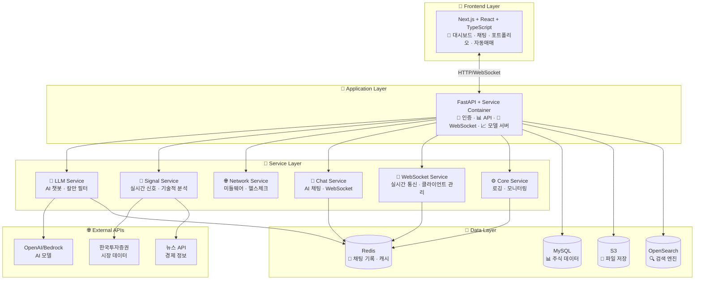
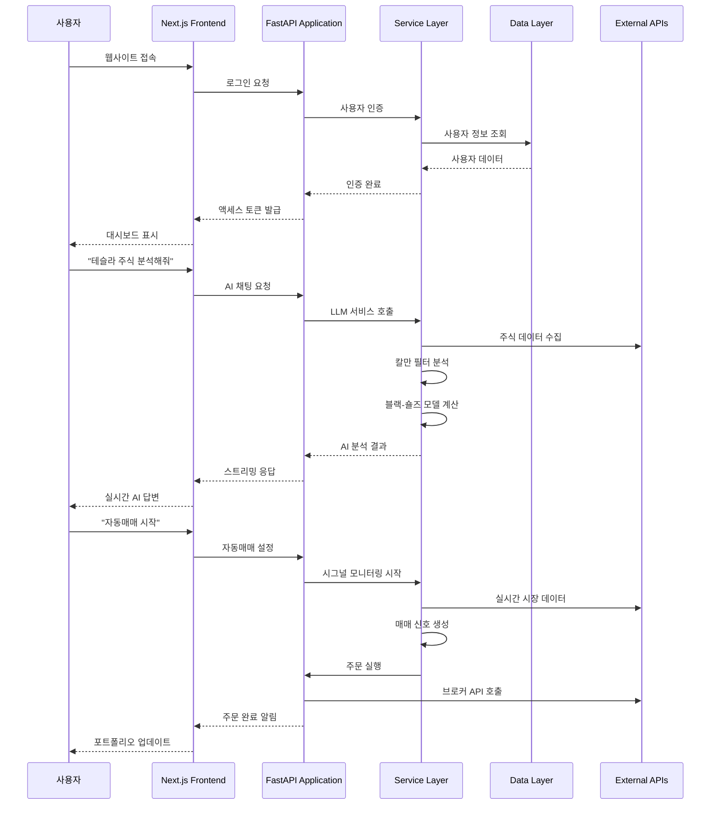
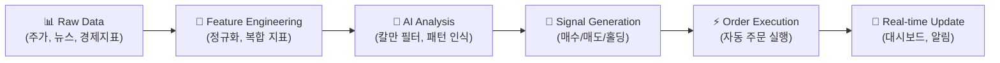

# 🏦 SKN12-FINAL-2TEAM — AI 기반 스마트 투자 플랫폼

> **"주린이도 쉽게, AI가 판단하고 실행하는 투자 시스템"**  
> **감정적 투자 NO! 데이터 기반 AI 투자 YES!**

<!-- Badges: clean dark labels + logos -->
<p align="center">
  <!-- status / langs -->
  <a href="#">
    
  </a>
  <a href="#">
    
  </a>
  <a href="#">
    
  </a>
  <a href="#">
    
  </a>
  <a href="#">
    
  </a>
  <a href="LICENSE">
    
  </a>
</p>

<p align="center">
  <!-- infra / ops -->
  <a href="#"></a>
  <a href="#"></a>
  <a href="#"></a>
  <a href="#"></a>
  <a href="#"></a>
</p>


# 👥 팀원 소개

<table>
  <tr>
    <!-- 카드 1 -->
    <td align="center" width="220" style="border:1px solid #2f3337; padding:14px;">
      <div style="font-weight:700; font-size:16px; margin-bottom:8px; text-align:center;">권성호</div>
      <hr style="border:0; border-top:1px solid #3e4348; margin:8px 0 14px 0;">
      
      <hr style="border:0; border-top:1px solid #3e4348; margin:14px 0 8px 0;">
      <div style="font-size:13px; line-height:1.45; text-align:center;">백엔드 · 인프라 · AWS</div>
    </td>
    <!-- 카드 2 -->
    <td align="center" width="220" style="border:1px solid #2f3337; padding:14px;">
      <div style="font-weight:700; font-size:16px; margin-bottom:8px; text-align:center;">지상원</div>
      <hr style="border:0; border-top:1px solid #3e4348; margin:8px 0 14px 0;">
      
      <hr style="border:0; border-top:1px solid #3e4348; margin:14px 0 8px 0;">
      <div style="font-size:13px; line-height:1.45; text-align:center;">프론트엔드 리드 · UI/UX</div>
    </td>
    <!-- 카드 3 -->
    <td align="center" width="220" style="border:1px solid #2f3337; padding:14px;">
      <div style="font-weight:700; font-size:16px; margin-bottom:8px; text-align:center;">김재현</div>
      <hr style="border:0; border-top:1px solid #3e4348; margin:8px 0 14px 0;">
      
      <hr style="border:0; border-top:1px solid #3e4348; margin:14px 0 8px 0;">
      <div style="font-size:13px; line-height:1.45; text-align:center;">ML 리드 · 모델/서빙</div>
    </td>
    <!-- 카드 4 -->
    <td align="center" width="220" style="border:1px solid #2f3337; padding:14px;">
      <div style="font-weight:700; font-size:16px; margin-bottom:8px; text-align:center;">윤권</div>
      <hr style="border:0; border-top:1px solid #3e4348; margin:8px 0 14px 0;">
      
      <hr style="border:0; border-top:1px solid #3e4348; margin:14px 0 8px 0;">
      <div style="font-size:13px; line-height:1.45; text-align:center;">PM · ML 엔지니어</div>
    </td>
    <!-- 카드 5 -->
    <td align="center" width="220" style="border:1px solid #2f3337; padding:14px;">
      <div style="font-weight:700; font-size:16px; margin-bottom:8px; text-align:center;">박진양</div>
      <hr style="border:0; border-top:1px solid #3e4348; margin:8px 0 14px 0;">
      
      <hr style="border:0; border-top:1px solid #3e4348; margin:14px 0 8px 0;">
      <div style="font-size:13px; line-height:1.45; text-align:center;">리소스 · 데이터 엔지니어</div>
    </td>

  </tr>
</table>

---

## 🎯 프로젝트 목적: 왜 만들었나?

### **주린이들의 고민**
- 📊 **정보 과부하**: 너무 많은 주식 정보, 무엇을 믿어야 할지 모름
- 😰 **감정적 투자**: FOMO(놓칠까봐 두려움), 공포, 욕심으로 인한 손실
- ⏰ **타이밍 놓침**: 언제 사고, 언제 팔아야 할지 모름
- 💸 **리스크 관리 부족**: 손절매, 익절매 기준이 없음

### **우리의 솔루션**
- 🤖 **AI가 판단**: 감정 없이 데이터만 보고 투자 결정
- 📈 **자동 실행**: AI가 판단한 대로 자동으로 매매 실행
- 🎯 **개인 맞춤**: 나의 투자 성향, 목표, 리스크에 맞는 포트폴리오
- 💡 **쉬운 설명**: 복잡한 투자 용어를 쉽게 설명해주는 AI 비서

---

## 🚀 핵심 가치: AI가 판단하고 실행한다!

### **기존 투자 vs 우리 시스템**

| 구분 | 기존 투자 | AI 투자 시스템 |
|------|-----------|----------------|
| **판단** | 사람의 감정 + 직감 | AI의 데이터 분석 |
| **실행** | 수동으로 직접 주문 | AI가 자동으로 타이밍 알려줌 |
| **리스크** | 감정적 손절매 | 체계적인 리스크 관리 |
| **학습** | 개인 경험에 의존 | AI가 시장 패턴 학습 |

### **AI가 하는 일**
1. **📊 데이터 수집**: 주가, 뉴스, 경제지표, 시장 심리 등
2. **🧠 패턴 분석**: 칼만 필터로 시장 상황 파악
3. **📈 신호 생성**: 매수/매도/홀딩 신호 생성
4. **⚡ 자동 실행**: AI가 판단한 대로 시그널 보냄
5. **📱 실시간 알림**: 중요한 변화사항 즉시 알림

---

## 🏗️ 전체 시스템 구조



---

## 📁 프로젝트 구조 및 상세 문서

### **🎨 Frontend Layer** - 사용자 인터페이스
> Next.js 기반의 현대적 웹 애플리케이션

- **[📱 Frontend README](base_server/frontend/README.md)** - React 컴포넌트, 상태 관리, API 연동
- **주요 기능**: 대시보드, AI 채팅, 포트폴리오, 자동 매수/매도 시그널 설정

### **🚀 Application Layer** - 비즈니스 로직
> FastAPI 기반의 API 서버 및 마이크로서비스

- **[🔐 Application README](base_server/application/README.md)** - 메인 웹 서버, 모델 서버, API 라우터
- **주요 기능**: 사용자 인증, API 엔드포인트, WebSocket 통신

### **🔧 Service Layer** - 핵심 서비스들
> 각종 비즈니스 로직을 담당하는 서비스들

- **[🧠 LLM Service](base_server/service/llm/README.md)** - AI 챗봇, 칼만 필터, 블랙-숄즈 모델
- **[📡 Signal Service](base_server/service/signal/README.md)** - 실시간 주식 신호, 볼린저 밴드, AI 모델 연동
- **[🌐 Network Service](base_server/service/net/README.md)** - FastAPI 미들웨어, 헬스체크, 패킷 처리
- **[💬 Chat Service](base_server/service/chat/README.md)** - AI 채팅 인프라, Redis 메모리, WebSocket 스트리밍
- **[🔌 WebSocket Service](base_server/service/websocket/README.md)** - 실시간 통신, 클라이언트 관리, Redis Pub/Sub
- **[⚙️ Core Service](base_server/service/core/README.md)** - 로깅, 모니터링, 설정 관리

### **📋 Template Layer** - 비즈니스 템플릿
> 각 도메인별 비즈니스 로직 구현

- **[🏠 Base Template](base_server/template/base/README.md)** - 기본 템플릿 시스템
- **[💬 Chat Template](base_server/template/chat/README.md)** - 채팅 비즈니스 로직
- **[📊 Dashboard Template](base_server/template/dashboard/README.md)** - 대시보드 데이터 처리
- **[🤖 AutoTrade Template](base_server/template/autotrade/README.md)** - 자동매매 전략 실행

---

## 🔄 전체 시스템 흐름

### **1. 사용자 접속부터 AI 투자까지**



### **2. 데이터 파이프라인**



---

## 🎯 주요 기능 상세

### **🤖 AI 투자 비서 (LLM + 칼만 필터)**
- **자연어 질문**: "테슬라 주식 어때?" → AI가 분석해서 답변
- **칼만 필터**: 시장 상황을 실시간으로 분석하여 매매 타이밍 제시
- **블랙-숄즈**: 옵션 가격을 이론적으로 계산하여 투자 가치 판단

### **📊 실시간 대시보드**
- **포트폴리오 현황**: 보유 종목, 수익률, 리스크 지표
- **AI 신호**: 실시간 매매 신호 및 신뢰도
- **시장 동향**: 주요 지수, 섹터별 움직임

### **⚡ 자동 매수/매도 시그널 시스템**
- **AI 신호 기반**: 칼만 필터가 생성한 신호로 자동 주문
- **리스크 관리**: 손절매, 익절매, 포지션 사이징 자동화
- **백테스팅**: 과거 데이터로 전략 검증

### **💬 AI 채팅 (실시간 스트리밍)**
- **WebSocket 기반**: 실시간으로 AI 응답을 받을 수 있음
- **컨텍스트 유지**: 이전 대화 내용을 기억하여 연속성 있는 답변
- **도구 체인**: 주식 분석, 포트폴리오 조언 등 다양한 도구 연동

---

## 🚀 빠른 시작 (5분 만에 시작하기)

### **1. 프로젝트 클론**
```bash
git clone https://github.com/SKNETWORKS-FAMILY-AICAMP/SKN12-FINAL-2TEAM.git
cd SKN12-FINAL-2TEAM
```

### **2. 환경 설정 (간단 버전)**
```bash
# .env 파일 생성
echo "OPENAI_API_KEY=your_openai_key" > .env
echo "REDIS_URL=redis://localhost:6379" >> .env
```

### **3. 백엔드 실행**
```bash
cd base_server
python -m venv .venv
source .venv/bin/activate  # Windows: .venv\Scripts\activate
pip install -r requirements.txt
uvicorn application.base_web_server.main:app --reload
```

### **4. 프론트엔드 실행**
```bash
cd frontend/ai-trading-platform
npm install
npm run dev
```

### **5. 브라우저에서 확인**
- **백엔드**: http://localhost:8000
- **프론트엔드**: http://localhost:3000

---

## 🔧 개발자 가이드

### **아키텍처 원칙**
- **🎯 도메인 분리**: 각 서비스가 명확한 책임을 가짐
- **🔄 비동기 처리**: Redis MQ/EQ로 장시간 작업 분리
- **🧪 테스트 가능**: 각 계층별로 독립적인 테스트 가능
- **📈 확장 가능**: 마이크로서비스 아키텍처로 수평 확장

### **코드 구조**
- **Service Container**: 모든 서비스를 중앙에서 관리
- **Template Pattern**: 비즈니스 로직을 템플릿으로 분리
- **Event-Driven**: 이벤트 기반으로 서비스 간 통신
- **Caching Strategy**: Redis를 활용한 다층 캐싱

---

## 📚 더 자세한 정보

각 디렉토리의 README에서 더 상세한 정보를 확인할 수 있습니다:

### **🎨 Frontend Layer**
- **[📱 Frontend](base_server/frontend/README.md)**: React 컴포넌트, 상태 관리, API 연동

### **🚀 Application Layer**
- **[🔐 Application](base_server/application/README.md)**: FastAPI 서버, 라우터, 마이크로서비스

### **🔧 Service Layer** - 핵심 서비스들
- **[🧠 LLM Service](base_server/service/llm/README.md)**: AI 챗봇, 칼만 필터, 블랙-숄즈 모델
- **[📡 Signal Service](base_server/service/signal/README.md)**: 실시간 주식 신호, 볼린저 밴드, AI 모델 연동
- **[🌐 Network Service](base_server/service/net/README.md)**: FastAPI 미들웨어, 헬스체크, 패킷 처리
- **[💬 Chat Service](base_server/service/chat/README.md)**: AI 채팅 인프라, Redis 메모리, WebSocket 스트리밍
- **[🔌 WebSocket Service](base_server/service/websocket/README.md)**: 실시간 통신, 클라이언트 관리, Redis Pub/Sub
- **[⚙️ Core Service](base_server/service/core/README.md)**: 로깅, 모니터링, 설정 관리
- **[💾 Database Service](base_server/service/db/README.md)**: MySQL 연결, 테이블 관리, 데이터베이스 서비스
- **[🔐 Cache Service](base_server/service/cache/README.md)**: Redis 캐싱, 세션 관리, 연결 풀링
- **[📁 Storage Service](base_server/service/storage/README.md)**: S3 파일 저장, 객체 관리, 스토리지 클라이언트
- **[🔍 Search Service](base_server/service/search/README.md)**: OpenSearch 연동, 검색 엔진, 인덱스 관리
- **[🧠 VectorDB Service](base_server/service/vectordb/README.md)**: 벡터 데이터베이스, 임베딩 저장, 유사도 검색
- **[📚 RAG Service](base_server/service/rag/README.md)**: Retrieval-Augmented Generation, 문서 검색, AI 응답 생성
- **[📧 Email Service](base_server/service/email/README.md)**: 이메일 발송, 템플릿 관리, SMTP 연동
- **[📱 SMS Service](base_server/service/sms/README.md)**: SMS 발송, 문자 메시지, 알림 서비스
- **[🔔 Notification Service](base_server/service/notification/README.md)**: 알림 시스템, 푸시 알림, 이벤트 관리
- **[📊 Data Service](base_server/service/data/README.md)**: 데이터 처리, ETL 파이프라인, 데이터 변환
- **[📋 Queue Service](base_server/service/queue/README.md)**: 메시지 큐, 작업 대기열, 비동기 처리
- **[🔒 Lock Service](base_server/service/lock/README.md)**: 분산 락, 동시성 제어, 리소스 관리
- **[📅 Scheduler Service](base_server/service/scheduler/README.md)**: 작업 스케줄링, 크론 작업, 백그라운드 태스크
- **[🌐 External Service](base_server/service/external/README.md)**: 외부 API 연동, 클라이언트 풀링, 통합 서비스
- **[📝 Outbox Service](base_server/service/outbox/README.md)**: 아웃박스 패턴, 메시지 전송 보장, 재시도 로직
- **[🎯 Event Service](base_server/service/event/README.md)**: 이벤트 시스템, 이벤트 버스, 메시지 브로커

### **📋 Template Layer** - 비즈니스 템플릿
- **[🏠 Base Template](base_server/template/base/README.md)**: 기본 템플릿 시스템, 공통 인터페이스
- **[💬 Chat Template](base_server/template/chat/README.md)**: 채팅 비즈니스 로직, AI 응답 처리
- **[📊 Dashboard Template](base_server/template/dashboard/README.md)**: 대시보드 데이터 처리, 차트 생성
- **[🤖 AutoTrade Template](base_server/template/autotrade/README.md)**: 자동매매 전략 실행, 시그널 처리
- **[📈 Portfolio Template](base_server/template/portfolio/README.md)**: 포트폴리오 관리, 자산 배분, 리밸런싱
- **[👤 Profile Template](base_server/template/profile/README.md)**: 사용자 프로필, 설정 관리, 개인화
- **[📈 Market Template](base_server/template/market/README.md)**: 시장 데이터, 주식 정보, 시장 분석
- **[🕷️ Crawler Template](base_server/template/crawler/README.md)**: 웹 크롤링, 데이터 수집, 스크래핑
- **[🔐 Account Template](base_server/template/account/README.md)**: 계정 관리, 인증, 권한 관리
- **[👨‍💼 Admin Template](base_server/template/admin/README.md)**: 관리자 기능, 시스템 모니터링, 사용자 관리
- **[🧠 Model Template](base_server/template/model/README.md)**: AI 모델 관리, 예측 서비스, 모델 버전 관리
- **[⚙️ Settings Template](base_server/template/settings/README.md)**: 시스템 설정, 환경 설정, 구성 관리
- **[📚 Tutorial Template](base_server/template/tutorial/README.md)**: 튜토리얼 시스템, 학습 가이드, 온보딩
- **[🔔 Notification Template](base_server/template/notification/README.md)**: 알림 템플릿, 메시지 포맷, 알림 규칙

### **🗄️ Database Layer** - 데이터베이스의 정수
- **[🏛 Database Architecture](base_server/db_scripts/README.md)**: 데이터베이스 아키텍쳐 및 구성요소
---

## 🎯 프로젝트 비전

### **장기 목표 **
- 🌟 고급 포트폴리오 분석 도구
- 🌟 멀티 자산 클래스 지원 (주식, 채권, 원자재)
- 🌟 개인화된 AI 투자 전략
- 🌟 글로벌 시장 지원

---

## 📄 라이선스

MIT License - 자유롭게 사용, 수정, 배포 가능

---

<div align="center">

**🚀 AI가 판단하고 실행하는 스마트 투자 시스템으로 시작하세요! 🚀**

[](https://github.com/SKNETWORKS-FAMILY-AICAMP/SKN12-FINAL-2TEAM)
[](https://github.com/SKNETWORKS-FAMILY-AICAMP/SKN12-FINAL-2TEAM)
[](https://github.com/SKNETWORKS-FAMILY-AICAMP/SKN12-FINAL-2TEAM/issues)

**주린이도 쉽게, AI가 판단하고 실행하는 투자 시스템**  
**감정적 투자 NO! 데이터 기반 AI 투자 YES!**

</div>


---

## 📝 2팀 최종프로젝트 회고록

<table style="border-collapse:collapse; width:100%;">
  <thead>
    <tr>
      <th align="center" style="border:1px solid #2f3337; padding:12px; width:120px;">이름</th>
      <th align="center" style="border:1px solid #2f3337; padding:12px;">회고</th>
    </tr>
  </thead>
  <tbody>
    <tr>
      <td style="border:1px solid #2f3337; padding:12px; font-weight:600; text-align:center;">권성호</td>
      <td style="border:1px solid #2f3337; padding:12px;">
        <div style="line-height:1.6; text-align:left;">
          이번 프로젝트를 함께해 준 모든 팀원들께 진심으로 감사드립니다.<br/>
          처음에는 막막한 부분이 많았지만, 여러분 덕분에 마음 편히 프로젝트를 완성할 수 있었습니다.
          <br/>
          큰 어려움 없이 원활하게 진행할 수 있었던 것도 모두 여러분의 노력 덕분입니다.<br/>
          이 프로젝트를 통해 얻은 가장 큰 수확은 제 개인의 성장뿐만 아니라, 함께 성장할 수 있는 팀이 있다는 사실이었습니다.
          <br/>
          정말 고맙습니다. 앞으로도 각자의 자리에서 더 멋진 삶을 만들어가길 바랍니다.
        </div>
      </td>
    </tr>
    <tr>
      <td style="border:1px solid #2f3337; padding:12px; font-weight:600; text-align:center;">지상원</td>
      <td style="border:1px solid #2f3337; padding:12px;">
        <div style="line-height:1.6; text-align:left;">
          이번 프로젝트에서 팀원들에게 정말 많이 배웠습니다. 모든 경험이 제게 살이 되고 피가 되는 값진 교육이었고, 비전공자로서 더욱 큰 관심과 동기를 얻을 수 있었습니다.<br/>
          단순히 코드를 짜는 것에 그치지 않고, 설계 목적과 이유를 고민하며 구조를 잡는 시각을 키울 수 있었습니다. 아직 부족한 부분이 많지만, 팀원들이 열정적으로 임하는 모습에서 자극을 받아 저 또한 부족함을 채우기 위해 더 열심히 성장해 나가겠습니다.<br/>
          이번 프로젝트는 저에게 매우 소중하고 뜻깊은 경험이었습니다.
        </div>
      </td>
    </tr>
    <tr>
      <td style="border:1px solid #2f3337; padding:12px; font-weight:600; text-align:center;">김재현</td>
      <td style="border:1px solid #2f3337; padding:12px;">
        <div style="line-height:1.6; text-align:left;">
          두 달간의 최종 프로젝트는 제가 AI 개발을 취미가 아닌 직업적 태도로 임하게 되는 전환점이었습니다. 비교적 긴 기간 동안 큰 목표를 유지하면서도 매일의 작은 과제를 해결하는 과정에서, 협업의 기본과 새로운 기술을 빠르게 검증하고 안정화하는 방법을 다시 익혔습니다.<br/>
          특히 팀원들께서 끝까지 성실하게 임해 주신 덕분에 여러 난관을 함께 넘어설 수 있었습니다. 함께해 주신 모든 팀원분들께 진심으로 감사드립니다. 앞으로 각자가 다른 곳에서 공부하거나 일하게 되더라도 이번 경험에서 얻은 원칙과 태도를 지속하여, 각자의 자리에서 꾸준한 성취를 이루시길 바랍니다. 저 또한 이번 배움을 바탕으로 더 높은 수준의 실무 역량을 갖추기 위해 정진하겠습니다.
        </div>
      </td>
    </tr>
    <tr>
      <td style="border:1px solid #2f3337; padding:12px; font-weight:600; text-align:center;">윤권</td>
      <td style="border:1px solid #2f3337; padding:12px;">
        <div style="line-height:1.6; text-align:left;">
          6개월간의 과정과 마지막 2개월간의 최종 프로젝트까지, 총 5개의 프로젝트를 다양한 팀원들과 함께 진행했습니다. 하지만 매 프로젝트마다 제 스스로 부족함을 느낄 수밖에 없었습니다. 그럼에도 불구하고 어느 팀에서든 항상 팀원들께 감사한 마음뿐이었습니다.
          <br/>
          특히 최종 프로젝트에서는 팀원분들이 각자의 역할을 너무도 잘해주셔서 제 부족함이 더욱 크게 다가왔습니다. 지난 3차, 4차 프로젝트와 이번 최종 프로젝트에서 저는 머신러닝을 맡았는데, 매번 아쉬움이 남았습니다. 이번에도 마찬가지로 아쉬움이 많았지만, 그 과정에서 팀원분들, 멘토님, 강사님께서 이끌어주시고 옆에서 알려주신 덕분에, 지금 당장은 달라진 것이 보이지 않더라도 분명 제 성장에 큰 도움이 되었다고 생각합니다.
          <br/>
          6개월이라는 시간 동안 함께해주신 모든 분들께 감사드리며, 정말 수고 많으셨습니다. 앞으로도 좋은 일만 가득하시기를 진심으로 바라겠습니다.
        </div>
      </td>
    </tr>
    <tr>
      <td style="border:1px solid #2f3337; padding:12px; font-weight:600; text-align:center;">박진양</td>
      <td style="border:1px solid #2f3337; padding:12px;">
        <div style="line-height:1.6; text-align:left;">
          벌써 최종 프로젝트의 끝자락에 왔네요. 최고의 팀원들, 최고의 멘토님과 함께 1달 반동안 프로젝트에 전념할 수 있어서 너무 행복했습니다. 지난 4달 반동안 배운 것들을 기반으로 프로젝트에 임하였습니다.<br/>
          살면서 프로그래밍을 처음 해보는 것이었기 때문에 강의 기간 초반에는 걱정이 많았지만 이제는 알아서 제 할 일 찾아서 한다는 것이 어찌보면 과정을 지나면서 제가 발전한게 보이네요.<br/>
          SKN12-FINAL-2TEAM이 만든 LLM을 활용한 주식 상품 추천 시스템은 기획 단계부터, 겉으로 보여지는 프론트엔드, 단단한 내실을 담고있는 백엔드까지 어느 하나 부족한 것 없는 완성형입니다.<br/>이는 간단히 만들어진 것이 아닌, 5명의 능력이 모두 담겨있는 결과물입니다.
        </div>
      </td>
    </tr>
  </tbody>
  
</table>