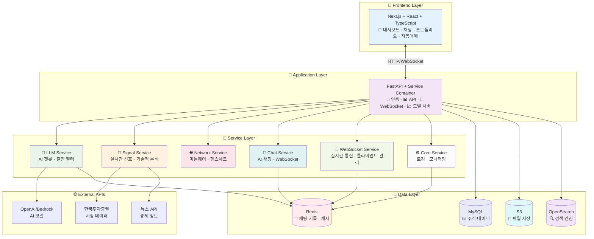
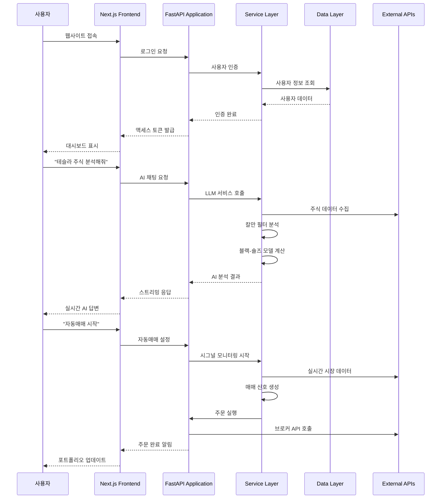
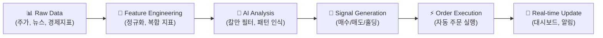

# 🏦 SKN12-FINAL-2TEAM — AI 기반 스마트 투자 플랫폼

> **"주린이도 쉽게, AI가 판단하고 실행하는 투자 시스템"**  
> **감정적 투자 NO! 데이터 기반 AI 투자 YES!**

<!-- Badges: clean dark labels + logos -->
<p align="center">
  <!-- status / langs -->
  <a href="#">
    
  </a>
  <a href="#">
    
  </a>
  <a href="#">
    
  </a>
  <a href="#">
    
  </a>
  <a href="#">
    
  </a>
  <a href="LICENSE">
    
  </a>
</p>

<p align="center">
  <!-- infra / ops -->
  <a href="#"></a>
  <a href="#"></a>
  <a href="#"></a>
  <a href="#"></a>
  <a href="#"></a>
</p>

---

## 🎯 프로젝트 목적: 왜 만들었나?

### **주린이들의 고민**
- 📊 **정보 과부하**: 너무 많은 주식 정보, 무엇을 믿어야 할지 모름
- 😰 **감정적 투자**: FOMO(놓칠까봐 두려움), 공포, 욕심으로 인한 손실
- ⏰ **타이밍 놓침**: 언제 사고, 언제 팔아야 할지 모름
- 💸 **리스크 관리 부족**: 손절매, 익절매 기준이 없음

### **우리의 솔루션**
- 🤖 **AI가 판단**: 감정 없이 데이터만 보고 투자 결정
- 📈 **자동 실행**: AI가 판단한 대로 자동으로 매매 실행
- 🎯 **개인 맞춤**: 나의 투자 성향, 목표, 리스크에 맞는 포트폴리오
- 💡 **쉬운 설명**: 복잡한 투자 용어를 쉽게 설명해주는 AI 비서

---

## 🚀 핵심 가치: AI가 판단하고 실행한다!

### **기존 투자 vs 우리 시스템**

| 구분 | 기존 투자 | AI 투자 시스템 |
|------|-----------|----------------|
| **판단** | 사람의 감정 + 직감 | AI의 데이터 분석 |
| **실행** | 수동으로 직접 주문 | AI가 자동으로 타이밍 알려줌 |
| **리스크** | 감정적 손절매 | 체계적인 리스크 관리 |
| **학습** | 개인 경험에 의존 | AI가 시장 패턴 학습 |

### **AI가 하는 일**
1. **📊 데이터 수집**: 주가, 뉴스, 경제지표, 시장 심리 등
2. **🧠 패턴 분석**: 칼만 필터로 시장 상황 파악
3. **📈 신호 생성**: 매수/매도/홀딩 신호 생성
4. **⚡ 자동 실행**: AI가 판단한 대로 시그널 보냄
5. **📱 실시간 알림**: 중요한 변화사항 즉시 알림

---

## 🏗️ 전체 시스템 구조



---

## 📁 프로젝트 구조 및 상세 문서

### **🎨 Frontend Layer** - 사용자 인터페이스
> Next.js 기반의 현대적 웹 애플리케이션

- **[📱 Frontend README](base_server/frontend/README.md)** - React 컴포넌트, 상태 관리, API 연동
- **주요 기능**: 대시보드, AI 채팅, 포트폴리오, 자동 매수/매도 시그널 설정

### **🚀 Application Layer** - 비즈니스 로직
> FastAPI 기반의 API 서버 및 마이크로서비스

- **[🔐 Application README](base_server/application/README.md)** - 메인 웹 서버, 모델 서버, API 라우터
- **주요 기능**: 사용자 인증, API 엔드포인트, WebSocket 통신

### **🔧 Service Layer** - 핵심 서비스들
> 각종 비즈니스 로직을 담당하는 서비스들

- **[🧠 LLM Service](base_server/service/llm/README.md)** - AI 챗봇, 칼만 필터, 블랙-숄즈 모델
- **[📡 Signal Service](base_server/service/signal/README.md)** - 실시간 주식 신호, 볼린저 밴드, AI 모델 연동
- **[🌐 Network Service](base_server/service/net/README.md)** - FastAPI 미들웨어, 헬스체크, 패킷 처리
- **[💬 Chat Service](base_server/service/chat/README.md)** - AI 채팅 인프라, Redis 메모리, WebSocket 스트리밍
- **[🔌 WebSocket Service](base_server/service/websocket/README.md)** - 실시간 통신, 클라이언트 관리, Redis Pub/Sub
- **[⚙️ Core Service](base_server/service/core/README.md)** - 로깅, 모니터링, 설정 관리

### **📋 Template Layer** - 비즈니스 템플릿
> 각 도메인별 비즈니스 로직 구현

- **[🏠 Base Template](base_server/template/base/README.md)** - 기본 템플릿 시스템
- **[💬 Chat Template](base_server/template/chat/README.md)** - 채팅 비즈니스 로직
- **[📊 Dashboard Template](base_server/template/dashboard/README.md)** - 대시보드 데이터 처리
- **[🤖 AutoTrade Template](base_server/template/autotrade/README.md)** - 자동매매 전략 실행

---

## 🔄 전체 시스템 흐름

### **1. 사용자 접속부터 AI 투자까지**



### **2. 데이터 파이프라인**



---

## 🎯 주요 기능 상세

### **🤖 AI 투자 비서 (LLM + 칼만 필터)**
- **자연어 질문**: "테슬라 주식 어때?" → AI가 분석해서 답변
- **칼만 필터**: 시장 상황을 실시간으로 분석하여 매매 타이밍 제시
- **블랙-숄즈**: 옵션 가격을 이론적으로 계산하여 투자 가치 판단

### **📊 실시간 대시보드**
- **포트폴리오 현황**: 보유 종목, 수익률, 리스크 지표
- **AI 신호**: 실시간 매매 신호 및 신뢰도
- **시장 동향**: 주요 지수, 섹터별 움직임

### **⚡ 자동 매수/매도 시그널 시스템**
- **AI 신호 기반**: 칼만 필터가 생성한 신호로 자동 주문
- **리스크 관리**: 손절매, 익절매, 포지션 사이징 자동화
- **백테스팅**: 과거 데이터로 전략 검증

### **💬 AI 채팅 (실시간 스트리밍)**
- **WebSocket 기반**: 실시간으로 AI 응답을 받을 수 있음
- **컨텍스트 유지**: 이전 대화 내용을 기억하여 연속성 있는 답변
- **도구 체인**: 주식 분석, 포트폴리오 조언 등 다양한 도구 연동

---

## 🚀 빠른 시작 (5분 만에 시작하기)

### **1. 프로젝트 클론**
```bash
git clone https://github.com/SKNETWORKS-FAMILY-AICAMP/SKN12-FINAL-2TEAM.git
cd SKN12-FINAL-2TEAM
```

### **2. 환경 설정 (간단 버전)**
```bash
# .env 파일 생성
echo "OPENAI_API_KEY=your_openai_key" > .env
echo "REDIS_URL=redis://localhost:6379" >> .env
```

### **3. 백엔드 실행**
```bash
cd base_server
python -m venv .venv
source .venv/bin/activate  # Windows: .venv\Scripts\activate
pip install -r requirements.txt
uvicorn application.base_web_server.main:app --reload
```

### **4. 프론트엔드 실행**
```bash
cd frontend/ai-trading-platform
npm install
npm run dev
```

### **5. 브라우저에서 확인**
- **백엔드**: http://localhost:8000
- **프론트엔드**: http://localhost:3000

---

## 🔧 개발자 가이드

### **아키텍처 원칙**
- **🎯 도메인 분리**: 각 서비스가 명확한 책임을 가짐
- **🔄 비동기 처리**: Redis MQ/EQ로 장시간 작업 분리
- **🧪 테스트 가능**: 각 계층별로 독립적인 테스트 가능
- **📈 확장 가능**: 마이크로서비스 아키텍처로 수평 확장

### **코드 구조**
- **Service Container**: 모든 서비스를 중앙에서 관리
- **Template Pattern**: 비즈니스 로직을 템플릿으로 분리
- **Event-Driven**: 이벤트 기반으로 서비스 간 통신
- **Caching Strategy**: Redis를 활용한 다층 캐싱

---

## 📚 더 자세한 정보

각 디렉토리의 README에서 더 상세한 정보를 확인할 수 있습니다:

- **[🎨 Frontend](base_server/frontend/README.md)**: React 컴포넌트, 상태 관리, API 연동
- **[🚀 Application](base_server/application/README.md)**: FastAPI 서버, 라우터, 마이크로서비스
- **[🧠 LLM Service](base_server/service/llm/README.md)**: AI 모델, 칼만 필터, 블랙-숄즈
- **[📡 Signal Service](base_server/service/signal/README.md)**: 실시간 신호, 기술적 분석
- **[🌐 Network Service](base_server/service/net/README.md)**: 네트워크 계층, 미들웨어
- **[💬 Chat Service](base_server/service/chat/README.md)**: AI 채팅, WebSocket, Redis
- **[🔌 WebSocket Service](base_server/service/websocket/README.md)**: 실시간 통신, 클라이언트 관리
- **[⚙️ Core Service](base_server/service/core/README.md)**: 핵심 인프라, 로깅, 모니터링

---

## 🎯 프로젝트 비전

### **장기 목표 **
- 🌟 고급 포트폴리오 분석 도구
- 🌟 멀티 자산 클래스 지원 (주식, 채권, 원자재)
- 🌟 개인화된 AI 투자 전략
- 🌟 글로벌 시장 지원

---

## 📄 라이선스

MIT License - 자유롭게 사용, 수정, 배포 가능

---

<div align="center">

**🚀 AI가 판단하고 실행하는 스마트 투자 시스템으로 시작하세요! 🚀**

[](https://github.com/SKNETWORKS-FAMILY-AICAMP/SKN12-FINAL-2TEAM)
[](https://github.com/SKNETWORKS-FAMILY-AICAMP/SKN12-FINAL-2TEAM)
[](https://github.com/SKNETWORKS-FAMILY-AICAMP/SKN12-FINAL-2TEAM/issues)

**주린이도 쉽게, AI가 판단하고 실행하는 투자 시스템**  
**감정적 투자 NO! 데이터 기반 AI 투자 YES!**

</div>

