# 🏦 SKN12-FINAL-2TEAM — AI 기반 스마트 투자 플랫폼

> **"주린이도 쉽게, AI가 판단하고 실행하는 투자 시스템"**  
> **감정적 투자 NO! 데이터 기반 AI 투자 YES!**

<!-- Badges: clean dark labels + logos -->
<p align="center">
  <!-- status / langs -->
  <a href="#">
    
  </a>
  <a href="#">
    
  </a>
  <a href="#">
    
  </a>
  <a href="#">
    
  </a>
  <a href="#">
    
  </a>
  <a href="LICENSE">
    
  </a>
</p>

<p align="center">
  <!-- infra / ops -->
  <a href="#"></a>
  <a href="#"></a>
  <a href="#"></a>
  <a href="#"></a>
  <a href="#"></a>
</p>


# 👨‍👩‍👧‍👦 조원 명단

<table>
  <tr>
    <td align="center">
      <br />
      <sub><b>권성호</b></sub><br />
      백엔드 총괄 · AWS · 풀스택
    </td>
    <td align="center">
      <br />
      <sub><b>지상원</b></sub><br />
      프론트엔드 총괄
    </td>
    <td align="center">
      <br />
      <sub><b>김재현</b></sub><br />
      ML 총괄
    </td>
    <td align="center">
      <br />
      <sub><b>윤권</b></sub><br />
      PM · ML 엔지니어
    </td>
    <td align="center">
      <br />
      <sub><b>박진양</b></sub><br />
      리소스 매니저 · 데이터 엔지니어
    </td>
  </tr>
</table>

---

## 🎯 프로젝트 목적: 왜 만들었나?

### **주린이들의 고민**
- 📊 **정보 과부하**: 너무 많은 주식 정보, 무엇을 믿어야 할지 모름
- 😰 **감정적 투자**: FOMO(놓칠까봐 두려움), 공포, 욕심으로 인한 손실
- ⏰ **타이밍 놓침**: 언제 사고, 언제 팔아야 할지 모름
- 💸 **리스크 관리 부족**: 손절매, 익절매 기준이 없음

### **우리의 솔루션**
- 🤖 **AI가 판단**: 감정 없이 데이터만 보고 투자 결정
- 📈 **자동 실행**: AI가 판단한 대로 자동으로 매매 실행
- 🎯 **개인 맞춤**: 나의 투자 성향, 목표, 리스크에 맞는 포트폴리오
- 💡 **쉬운 설명**: 복잡한 투자 용어를 쉽게 설명해주는 AI 비서

---

## 🚀 핵심 가치: AI가 판단하고 실행한다!

### **기존 투자 vs 우리 시스템**

| 구분 | 기존 투자 | AI 투자 시스템 |
|------|-----------|----------------|
| **판단** | 사람의 감정 + 직감 | AI의 데이터 분석 |
| **실행** | 수동으로 직접 주문 | AI가 자동으로 타이밍 알려줌 |
| **리스크** | 감정적 손절매 | 체계적인 리스크 관리 |
| **학습** | 개인 경험에 의존 | AI가 시장 패턴 학습 |

### **AI가 하는 일**
1. **📊 데이터 수집**: 주가, 뉴스, 경제지표, 시장 심리 등
2. **🧠 패턴 분석**: 칼만 필터로 시장 상황 파악
3. **📈 신호 생성**: 매수/매도/홀딩 신호 생성
4. **⚡ 자동 실행**: AI가 판단한 대로 시그널 보냄
5. **📱 실시간 알림**: 중요한 변화사항 즉시 알림

---

## 🏗️ 전체 시스템 구조

```mermaid
graph TB
    subgraph "🎨 Frontend Layer"
        FE[Next.js + React + TypeScript<br/>📱 대시보드 · 채팅 · 포트폴리오 · 자동매매]
    end
    
    subgraph "🚀 Application Layer"
        APP[FastAPI + Service Container<br/>🔐 인증 · 📊 API · 🤖 WebSocket · 📈 모델 서버]
    end
    
    subgraph "🔧 Service Layer"
        LLM[🧠 LLM Service<br/>AI 챗봇 · 칼만 필터]
        SIG[📡 Signal Service<br/>실시간 신호 · 기술적 분석]
        NET[🌐 Network Service<br/>미들웨어 · 헬스체크]
        CHAT[💬 Chat Service<br/>AI 채팅 · WebSocket]
        WS[🔌 WebSocket Service<br/>실시간 통신 · 클라이언트 관리]
        CORE[⚙️ Core Service<br/>로깅 · 모니터링]
    end
    
    subgraph "💾 Data Layer"
        MYSQL[(MySQL<br/>📊 주식 데이터)]
        REDIS[(Redis<br/>💬 채팅 기록 · 캐시)]
        S3[(S3<br/>📁 파일 저장)]
        SEARCH[(OpenSearch<br/>🔍 검색 엔진)]
    end
    
    subgraph "🌐 External APIs"
        LLM_API[OpenAI/Bedrock<br/>AI 모델]
        MARKET[한국투자증권<br/>시장 데이터]
        NEWS[뉴스 API<br/>경제 정보]
    end
    
    %% 연결 관계
    FE <-->|HTTP/WebSocket| APP
    APP --> LLM
    APP --> SIG
    APP --> NET
    APP --> CHAT
    APP --> WS
    APP --> CORE
    
    LLM --> LLM_API
    SIG --> MARKET
    SIG --> NEWS
    
    LLM --> REDIS
    CHAT --> REDIS
    WS --> REDIS
    CORE --> REDIS
    
    APP --> MYSQL
    APP --> S3
    APP --> SEARCH
    

```



---

## 📁 프로젝트 구조 및 상세 문서

### **🎨 Frontend Layer** - 사용자 인터페이스
> Next.js 기반의 현대적 웹 애플리케이션

- **[📱 Frontend README](base_server/frontend/README.md)** - React 컴포넌트, 상태 관리, API 연동
- **주요 기능**: 대시보드, AI 채팅, 포트폴리오, 자동 매수/매도 시그널 설정

### **🚀 Application Layer** - 비즈니스 로직
> FastAPI 기반의 API 서버 및 마이크로서비스

- **[🔐 Application README](base_server/application/README.md)** - 메인 웹 서버, 모델 서버, API 라우터
- **주요 기능**: 사용자 인증, API 엔드포인트, WebSocket 통신

### **🔧 Service Layer** - 핵심 서비스들
> 각종 비즈니스 로직을 담당하는 서비스들

- **[🧠 LLM Service](base_server/service/llm/README.md)** - AI 챗봇, 칼만 필터, 블랙-숄즈 모델
- **[📡 Signal Service](base_server/service/signal/README.md)** - 실시간 주식 신호, 볼린저 밴드, AI 모델 연동
- **[🌐 Network Service](base_server/service/net/README.md)** - FastAPI 미들웨어, 헬스체크, 패킷 처리
- **[💬 Chat Service](base_server/service/chat/README.md)** - AI 채팅 인프라, Redis 메모리, WebSocket 스트리밍
- **[🔌 WebSocket Service](base_server/service/websocket/README.md)** - 실시간 통신, 클라이언트 관리, Redis Pub/Sub
- **[⚙️ Core Service](base_server/service/core/README.md)** - 로깅, 모니터링, 설정 관리

### **📋 Template Layer** - 비즈니스 템플릿
> 각 도메인별 비즈니스 로직 구현

- **[🏠 Base Template](base_server/template/base/README.md)** - 기본 템플릿 시스템
- **[💬 Chat Template](base_server/template/chat/README.md)** - 채팅 비즈니스 로직
- **[📊 Dashboard Template](base_server/template/dashboard/README.md)** - 대시보드 데이터 처리
- **[🤖 AutoTrade Template](base_server/template/autotrade/README.md)** - 자동매매 전략 실행

---

## 🔄 전체 시스템 흐름

### **1. 사용자 접속부터 AI 투자까지**

```mermaid
sequenceDiagram
    participant User as 사용자
    participant Frontend as Next.js Frontend
    participant App as FastAPI Application
    participant Services as Service Layer
    participant Data as Data Layer
    participant External as External APIs

    User->>Frontend: 웹사이트 접속
    Frontend->>App: 로그인 요청
    App->>Services: 사용자 인증
    Services->>Data: 사용자 정보 조회
    Data-->>Services: 사용자 데이터
    Services-->>App: 인증 완료
    App-->>Frontend: 액세스 토큰 발급
    Frontend-->>User: 대시보드 표시

    User->>Frontend: "테슬라 주식 분석해줘"
    Frontend->>App: AI 채팅 요청
    App->>Services: LLM 서비스 호출
    Services->>External: 주식 데이터 수집
    Services->>Services: 칼만 필터 분석
    Services->>Services: 블랙-숄즈 모델 계산
    Services-->>App: AI 분석 결과
    App-->>Frontend: 스트리밍 응답
    Frontend-->>User: 실시간 AI 답변

    User->>Frontend: "자동매매 시작"
    Frontend->>App: 자동매매 설정
    App->>Services: 시그널 모니터링 시작
    Services->>External: 실시간 시장 데이터
    Services->>Services: 매매 신호 생성
    Services->>App: 주문 실행
    App->>External: 브로커 API 호출
    App-->>Frontend: 주문 완료 알림
    Frontend-->>User: 포트폴리오 업데이트
```



### **2. 데이터 파이프라인**

```mermaid
flowchart LR
    A["📊 Raw Data<br/>(주가, 뉴스, 경제지표)"] --> B["🔧 Feature Engineering<br/>(정규화, 복합 지표)"]
    B --> C["🧠 AI Analysis<br/>(칼만 필터, 패턴 인식)"]
    C --> D["📡 Signal Generation<br/>(매수/매도/홀딩)"]
    D --> E["⚡ Order Execution<br/>(자동 주문 실행)"]
    E --> F["📱 Real-time Update<br/>(대시보드, 알림)"]
    

```



---

## 🎯 주요 기능 상세

### **🤖 AI 투자 비서 (LLM + 칼만 필터)**
- **자연어 질문**: "테슬라 주식 어때?" → AI가 분석해서 답변
- **칼만 필터**: 시장 상황을 실시간으로 분석하여 매매 타이밍 제시
- **블랙-숄즈**: 옵션 가격을 이론적으로 계산하여 투자 가치 판단

### **📊 실시간 대시보드**
- **포트폴리오 현황**: 보유 종목, 수익률, 리스크 지표
- **AI 신호**: 실시간 매매 신호 및 신뢰도
- **시장 동향**: 주요 지수, 섹터별 움직임

### **⚡ 자동 매수/매도 시그널 시스템**
- **AI 신호 기반**: 칼만 필터가 생성한 신호로 자동 주문
- **리스크 관리**: 손절매, 익절매, 포지션 사이징 자동화
- **백테스팅**: 과거 데이터로 전략 검증

### **💬 AI 채팅 (실시간 스트리밍)**
- **WebSocket 기반**: 실시간으로 AI 응답을 받을 수 있음
- **컨텍스트 유지**: 이전 대화 내용을 기억하여 연속성 있는 답변
- **도구 체인**: 주식 분석, 포트폴리오 조언 등 다양한 도구 연동

---

## 🚀 빠른 시작 (5분 만에 시작하기)

### **1. 프로젝트 클론**
```bash
git clone https://github.com/SKNETWORKS-FAMILY-AICAMP/SKN12-FINAL-2TEAM.git
cd SKN12-FINAL-2TEAM
```

### **2. 환경 설정 (간단 버전)**
```bash
# .env 파일 생성
echo "OPENAI_API_KEY=your_openai_key" > .env
echo "REDIS_URL=redis://localhost:6379" >> .env
```

### **3. 백엔드 실행**
```bash
cd base_server
python -m venv .venv
source .venv/bin/activate  # Windows: .venv\Scripts\activate
pip install -r requirements.txt
uvicorn application.base_web_server.main:app --reload
```

### **4. 프론트엔드 실행**
```bash
cd frontend/ai-trading-platform
npm install
npm run dev
```

### **5. 브라우저에서 확인**
- **백엔드**: http://localhost:8000
- **프론트엔드**: http://localhost:3000

---

## 🔧 개발자 가이드

### **아키텍처 원칙**
- **🎯 도메인 분리**: 각 서비스가 명확한 책임을 가짐
- **🔄 비동기 처리**: Redis MQ/EQ로 장시간 작업 분리
- **🧪 테스트 가능**: 각 계층별로 독립적인 테스트 가능
- **📈 확장 가능**: 마이크로서비스 아키텍처로 수평 확장

### **코드 구조**
- **Service Container**: 모든 서비스를 중앙에서 관리
- **Template Pattern**: 비즈니스 로직을 템플릿으로 분리
- **Event-Driven**: 이벤트 기반으로 서비스 간 통신
- **Caching Strategy**: Redis를 활용한 다층 캐싱

---

## 📚 더 자세한 정보

각 디렉토리의 README에서 더 상세한 정보를 확인할 수 있습니다:

### **🎨 Frontend Layer**
- **[📱 Frontend](base_server/frontend/README.md)**: React 컴포넌트, 상태 관리, API 연동

### **🚀 Application Layer**
- **[🔐 Application](base_server/application/README.md)**: FastAPI 서버, 라우터, 마이크로서비스

### **🔧 Service Layer** - 핵심 서비스들
- **[🧠 LLM Service](base_server/service/llm/README.md)**: AI 챗봇, 칼만 필터, 블랙-숄즈 모델
- **[📡 Signal Service](base_server/service/signal/README.md)**: 실시간 주식 신호, 볼린저 밴드, AI 모델 연동
- **[🌐 Network Service](base_server/service/net/README.md)**: FastAPI 미들웨어, 헬스체크, 패킷 처리
- **[💬 Chat Service](base_server/service/chat/README.md)**: AI 채팅 인프라, Redis 메모리, WebSocket 스트리밍
- **[🔌 WebSocket Service](base_server/service/websocket/README.md)**: 실시간 통신, 클라이언트 관리, Redis Pub/Sub
- **[⚙️ Core Service](base_server/service/core/README.md)**: 로깅, 모니터링, 설정 관리
- **[💾 Database Service](base_server/service/db/README.md)**: MySQL 연결, 테이블 관리, 데이터베이스 서비스
- **[🔐 Cache Service](base_server/service/cache/README.md)**: Redis 캐싱, 세션 관리, 연결 풀링
- **[📁 Storage Service](base_server/service/storage/README.md)**: S3 파일 저장, 객체 관리, 스토리지 클라이언트
- **[🔍 Search Service](base_server/service/search/README.md)**: OpenSearch 연동, 검색 엔진, 인덱스 관리
- **[🧠 VectorDB Service](base_server/service/vectordb/README.md)**: 벡터 데이터베이스, 임베딩 저장, 유사도 검색
- **[📚 RAG Service](base_server/service/rag/README.md)**: Retrieval-Augmented Generation, 문서 검색, AI 응답 생성
- **[📧 Email Service](base_server/service/email/README.md)**: 이메일 발송, 템플릿 관리, SMTP 연동
- **[📱 SMS Service](base_server/service/sms/README.md)**: SMS 발송, 문자 메시지, 알림 서비스
- **[🔔 Notification Service](base_server/service/notification/README.md)**: 알림 시스템, 푸시 알림, 이벤트 관리
- **[📊 Data Service](base_server/service/data/README.md)**: 데이터 처리, ETL 파이프라인, 데이터 변환
- **[📋 Queue Service](base_server/service/queue/README.md)**: 메시지 큐, 작업 대기열, 비동기 처리
- **[🔒 Lock Service](base_server/service/lock/README.md)**: 분산 락, 동시성 제어, 리소스 관리
- **[📅 Scheduler Service](base_server/service/scheduler/README.md)**: 작업 스케줄링, 크론 작업, 백그라운드 태스크
- **[🌐 External Service](base_server/service/external/README.md)**: 외부 API 연동, 클라이언트 풀링, 통합 서비스
- **[📝 Outbox Service](base_server/service/outbox/README.md)**: 아웃박스 패턴, 메시지 전송 보장, 재시도 로직
- **[🎯 Event Service](base_server/service/event/README.md)**: 이벤트 시스템, 이벤트 버스, 메시지 브로커

### **📋 Template Layer** - 비즈니스 템플릿
- **[🏠 Base Template](base_server/template/base/README.md)**: 기본 템플릿 시스템, 공통 인터페이스
- **[💬 Chat Template](base_server/template/chat/README.md)**: 채팅 비즈니스 로직, AI 응답 처리
- **[📊 Dashboard Template](base_server/template/dashboard/README.md)**: 대시보드 데이터 처리, 차트 생성
- **[🤖 AutoTrade Template](base_server/template/autotrade/README.md)**: 자동매매 전략 실행, 시그널 처리
- **[📈 Portfolio Template](base_server/template/portfolio/README.md)**: 포트폴리오 관리, 자산 배분, 리밸런싱
- **[👤 Profile Template](base_server/template/profile/README.md)**: 사용자 프로필, 설정 관리, 개인화
- **[📈 Market Template](base_server/template/market/README.md)**: 시장 데이터, 주식 정보, 시장 분석
- **[🕷️ Crawler Template](base_server/template/crawler/README.md)**: 웹 크롤링, 데이터 수집, 스크래핑
- **[🔐 Account Template](base_server/template/account/README.md)**: 계정 관리, 인증, 권한 관리
- **[👨‍💼 Admin Template](base_server/template/admin/README.md)**: 관리자 기능, 시스템 모니터링, 사용자 관리
- **[🧠 Model Template](base_server/template/model/README.md)**: AI 모델 관리, 예측 서비스, 모델 버전 관리
- **[⚙️ Settings Template](base_server/template/settings/README.md)**: 시스템 설정, 환경 설정, 구성 관리
- **[📚 Tutorial Template](base_server/template/tutorial/README.md)**: 튜토리얼 시스템, 학습 가이드, 온보딩
- **[🔔 Notification Template](base_server/template/notification/README.md)**: 알림 템플릿, 메시지 포맷, 알림 규칙

### **🗄️ Database Layer** - 데이터베이스의 정수
- **[🏛 Database Architecture](base_server/db_scripts/README.md)**: 데이터베이스 아키텍쳐 및 구성요소
---

## 🎯 프로젝트 비전

### **장기 목표 **
- 🌟 고급 포트폴리오 분석 도구
- 🌟 멀티 자산 클래스 지원 (주식, 채권, 원자재)
- 🌟 개인화된 AI 투자 전략
- 🌟 글로벌 시장 지원

---

## 📄 라이선스

MIT License - 자유롭게 사용, 수정, 배포 가능

---

<div align="center">

**🚀 AI가 판단하고 실행하는 스마트 투자 시스템으로 시작하세요! 🚀**

[](https://github.com/SKNETWORKS-FAMILY-AICAMP/SKN12-FINAL-2TEAM)
[](https://github.com/SKNETWORKS-FAMILY-AICAMP/SKN12-FINAL-2TEAM)
[](https://github.com/SKNETWORKS-FAMILY-AICAMP/SKN12-FINAL-2TEAM/issues)

**주린이도 쉽게, AI가 판단하고 실행하는 투자 시스템**  
**감정적 투자 NO! 데이터 기반 AI 투자 YES!**

</div>

