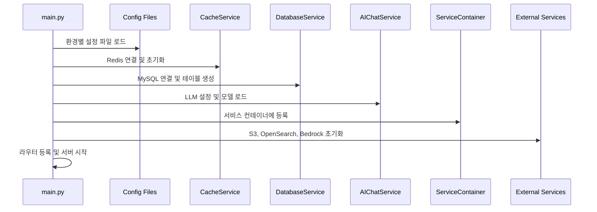
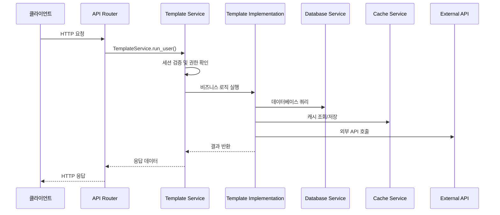
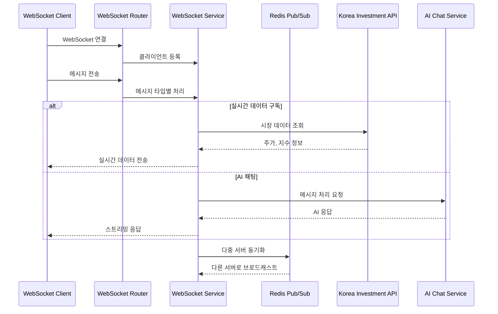

# Application Service — AI Trading Platform 애플리케이션 계층

> **v1.0.0**  
> **최종 업데이트**: 2025년 1월  
> **담당자**: Application Service Development Team

---

## 🎯 개요

Application Service는 AI Trading Platform의 핵심 애플리케이션 계층으로, **base_web_server**와 **model_server** 두 개의 독립적인 마이크로서비스로 구성됩니다. 

- **base_web_server**: 메인 웹 애플리케이션 (사용자 인증, 대시보드, 채팅, 자동매매 등)
- **model_server**: 시계열 모델 예측 전용 마이크로서비스 (LSTM, ARIMA 등)

모든 서비스는 공통 인프라(Service Container, Template System, Database Service 등)를 재사용하여 일관성과 유지보수성을 보장합니다.

---

## 🏗️ 프로젝트 구조

```
base_server/application/
├── __init__.py
├── base_web_server/                    # 메인 웹 애플리케이션
│   ├── __init__.py
│   ├── main.py                        # FastAPI 애플리케이션 메인
│   ├── base_web_server-config.json    # 운영 환경 설정
│   ├── base_web_server-config_debug.json  # 개발 환경 설정
│   ├── base_web_server-config_local.json  # 로컬 환경 설정
│   └── routers/                       # API 라우터 모음
│       ├── account.py                 # 사용자 인증/계정 관리
│       ├── admin.py                   # 관리자 기능
│       ├── autotrade.py               # 자동매매
│       ├── chat.py                    # AI 채팅
│       ├── crawler.py                 # 데이터 크롤링
│       ├── dashboard.py               # 대시보드
│       ├── market.py                  # 시장 데이터
│       ├── notification.py            # 알림 서비스
│       ├── portfolio.py               # 포트폴리오 관리
│       ├── profile.py                 # 사용자 프로필
│       ├── securities.py              # 증권 정보
│       ├── tutorial.py                # 튜토리얼
│       └── websocket.py               # 실시간 통신
└── model_server/                      # 모델 예측 마이크로서비스
    ├── main.py                        # 모델 서버 메인
    ├── model_server-config.json       # 모델 서버 설정
    └── routers/                       # 모델 관련 라우터
        ├── __init__.py
        └── model.py                   # 모델 예측 API
```

---

## 🚀 Core Features

### **1. base_web_server (메인 웹 애플리케이션)**

#### **🔐 사용자 인증 및 계정 관리**
- **JWT 기반 인증**: Access Token + Refresh Token
- **다단계 보안**: 이메일 인증, OTP, API 키 관리
- **세션 관리**: Redis 기반 세션 저장 및 만료 관리
- **권한 제어**: 사용자별 API 접근 권한 관리

#### **📊 대시보드 및 포트폴리오**
- **실시간 시장 데이터**: 한국투자증권 API 연동
- **포트폴리오 추적**: 보유 종목, 수익률, 리스크 분석
- **AI 신호**: 칼만 필터 기반 매매 신호 제공
- **차트 및 분석**: 기술적 지표, 백테스팅 결과

#### **🤖 AI 채팅 시스템**
- **LangChain 기반**: GPT-4, Claude 등 다양한 LLM 지원
- **도구 체인**: 주식 분석, 포트폴리오 조언, 시장 분석
- **세션 관리**: 대화 컨텍스트 유지 및 메모리 관리
- **실시간 스트리밍**: WebSocket 기반 응답 스트리밍

#### **📈 자동매매 시스템**
- **시그널 기반 매매**: AI 모델 예측 신호에 따른 자동 주문
- **리스크 관리**: 손절매, 익절매, 포지션 사이징
- **백테스팅**: 과거 데이터 기반 전략 검증
- **실시간 모니터링**: 주문 상태, 수익률 추적

#### **🔔 알림 서비스**
- **다중 채널**: 이메일, SMS, 푸시 알림
- **실시간 알림**: 급격한 가격 변동, 매매 신호
- **사용자 설정**: 알림 유형별 개인화 설정
- **비용 관리**: SMS 발송량 제한 및 비용 추적

#### **🌐 실시간 통신**
- **WebSocket**: 실시간 시장 데이터, 채팅, 알림
- **Redis Pub/Sub**: 다중 서버 환경에서 메시지 동기화
- **연결 관리**: 클라이언트 연결 상태, 하트비트, 자동 정리
- **채널 기반 메시징**: 주제별 메시지 브로드캐스팅

### **2. model_server (모델 예측 서비스)**

#### **📊 시계열 모델**
- **LSTM**: 장기 의존성 학습, 주가 예측
- **ARIMA**: 시계열 패턴 분석, 트렌드 예측
- **Prophet**: Facebook의 시계열 예측 모델
- **Ensemble**: 다중 모델 결합으로 예측 정확도 향상

#### **🔧 모델 관리**
- **모델 버전 관리**: 학습된 모델의 버전 추적
- **A/B 테스트**: 다양한 모델의 성능 비교
- **자동 재학습**: 새로운 데이터로 모델 업데이트
- **성능 모니터링**: 예측 정확도, 드리프트 감지

---

## 📚 사용된 라이브러리

### **FastAPI & 웹 프레임워크**
- **FastAPI**: 고성능 비동기 웹 프레임워크
- **Uvicorn**: ASGI 서버, 비동기 처리
- **Pydantic**: 데이터 검증 및 직렬화
- **CORS**: 크로스 오리진 리소스 공유

### **데이터베이스 & 캐시**
- **MySQL**: 메인 데이터베이스 (사용자, 포트폴리오, 거래 내역)
- **Redis**: 세션 관리, 캐싱, 메시지 큐
- **SQLAlchemy**: ORM 및 데이터베이스 추상화
- **AioMySQL**: 비동기 MySQL 드라이버

### **AI & 머신러닝**
- **LangChain**: LLM 통합 및 도구 체인
- **OpenAI**: GPT-4, GPT-3.5-turbo API
- **NumPy/Pandas**: 수치 계산 및 데이터 처리
- **Scikit-learn**: 머신러닝 모델 및 전처리

### **외부 API & 통신**
- **aiohttp**: 비동기 HTTP 클라이언트
- **WebSocket**: 실시간 양방향 통신
- **한국투자증권 API**: 주식 시장 데이터
- **Yahoo Finance**: 글로벌 주식 데이터

### **모니터링 & 로깅**
- **Logging**: 구조화된 로깅 시스템
- **Prometheus**: 메트릭 수집 및 모니터링
- **Health Check**: 서비스 상태 확인
- **Performance Monitoring**: 응답 시간, 처리량 추적

---

## 🔧 주요 클래스 & 메서드

### **base_web_server/main.py**

#### **FastAPI 애플리케이션 생명주기**
```python
@asynccontextmanager
async def lifespan(app: FastAPI):
    """애플리케이션 시작/종료 시 서비스 초기화/정리"""
    # 1. 로거 초기화
    # 2. 설정 파일 로드
    # 3. 데이터베이스 서비스 초기화
    # 4. 캐시 서비스 초기화
    # 5. 외부 서비스 초기화
    # 6. 템플릿 서비스 등록
    # 7. WebSocket 서비스 초기화
    # 8. 큐 시스템 테스트
```

#### **환경별 설정 파일 관리**
```python
def get_config_filename():
    """APP_ENV 환경변수에 따른 설정 파일 선택"""
    if app_env == "LOCAL":
        return "base_web_server-config_local.json"
    elif app_env == "DEBUG":
        return "base_web_server-config_debug.json"
    else:
        return "base_web_server-config.json"  # 운영 환경
```

#### **서비스 초기화 체인**
```python
# 1. CacheService (Redis)
cache_client_pool = RedisCacheClientPool(...)
CacheService.Init(cache_client_pool)

# 2. DatabaseService (MySQL)
database_service = DatabaseService(app_config.databaseConfig)
await database_service.init_service()

# 3. AIChatService (LLM)
ai_service = AIChatService(app_config.llmConfig)
ServiceContainer.init(database_service, ai_service)

# 4. 외부 서비스들
StorageService.init(app_config.storageConfig)      # S3
SearchService.init(app_config.searchConfig)        # OpenSearch
VectorDbService.init(app_config.vectorDbConfig)    # Bedrock
```

### **라우터 구조 (routers/)**

#### **공통 라우터 패턴**
```python
@router.post("/endpoint")
async def endpoint_handler(request: RequestModel, req: Request):
    """모든 라우터에서 공통으로 사용하는 패턴"""
    ip = req.headers.get("X-Forwarded-For") or req.client.host
    
    return await TemplateService.run_user(
        req.method,           # HTTP 메서드
        req.url.path,         # 요청 경로
        ip,                   # 클라이언트 IP
        request.model_dump_json(),  # 요청 데이터
        protocol_handler      # 비즈니스 로직 핸들러
    )
```

#### **WebSocket 라우터**
```python
@router.websocket("/ws")
async def websocket_endpoint(websocket: WebSocket):
    """실시간 통신을 위한 WebSocket 엔드포인트"""
    await websocket.accept()
    
    try:
        while True:
            data = await websocket.receive_text()
            message = json.loads(data)
            
            # 메시지 타입별 처리
            if message.get('type') == 'subscribe':
                # 실시간 데이터 구독
            elif message.get('type') == 'chat':
                # AI 채팅 메시지
    except WebSocketDisconnect:
        Logger.info("WebSocket 클라이언트 연결 해제")
```

### **model_server/main.py**

#### **간소화된 생명주기 관리**
```python
@asynccontextmanager
async def lifespan(app: FastAPI):
    """base_web_server 패턴을 간소화한 모델 서버"""
    # 1. 콘솔 로거 초기화
    # 2. 설정 파일 로드
    # 3. 캐시 서비스 초기화 (세션 관리용)
    # 4. 템플릿 등록 (ModelTemplateImpl)
    # 5. 서비스 컨테이너 초기화
```

---

## 🔄 API 통합 및 흐름

### **1. 서비스 초기화 흐름**



### **2. API 요청 처리 흐름**



### **3. WebSocket 메시지 흐름**



---

## 🛠️ 설정 및 환경 관리

### **환경별 설정 파일**

#### **base_web_server**
- **LOCAL**: `base_web_server-config_local.json` - 로컬 개발 환경
- **DEBUG**: `base_web_server-config_debug.json` - 개발/테스트 환경  
- **PROD/RELEASE**: `base_web_server-config.json` - 운영 환경

#### **model_server**
- **모든 환경**: `model_server-config.json` - 단일 설정 파일

### **주요 설정 항목**

```json
{
  "templateConfig": {
    "appId": "ai_trading_platform",
    "env": "production",
    "skipAwsTests": false
  },
  "databaseConfig": {
    "host": "localhost",
    "port": 3306,
    "database": "ai_trading",
    "username": "user",
    "password": "password"
  },
  "cacheConfig": {
    "host": "localhost",
    "port": 6379,
    "db": 0,
    "session_expire_seconds": 3600
  },
  "llmConfig": {
    "openai_api_key": "sk-...",
    "model": "gpt-4",
    "temperature": 0.7
  }
}
```

---

## 🔍 모니터링 및 헬스체크

### **서비스 상태 확인**

#### **메인 엔드포인트**
```bash
# 서버 상태 및 서비스 정보
GET /

# 응답 예시
{
  "message": "base_web_server 동작 중",
  "log_level": "INFO",
  "env": "PROD",
  "config_file": "/app/application/base_web_server/base_web_server-config.json",
  "services": {
    "database": "healthy",
    "cache": "healthy",
    "ai_chat": "healthy",
    "storage": "healthy"
  }
}
```

#### **관리자 엔드포인트**
```bash
# 서비스별 상세 상태
GET /api/admin/health

# 데이터베이스 연결 테스트
GET /api/admin/db/test

# Redis 연결 테스트
GET /api/admin/cache/test

# 외부 서비스 상태
GET /api/admin/external/status
```

### **로그 및 모니터링**

#### **로그 레벨**
- **DEBUG**: 상세한 디버깅 정보
- **INFO**: 일반적인 정보 메시지
- **WARN**: 경고 (서비스는 계속 동작)
- **ERROR**: 오류 (일부 기능 제한)
- **CRITICAL**: 치명적 오류 (서버 중단)

#### **성능 메트릭**
- **응답 시간**: API별 처리 시간
- **처리량**: 초당 요청 수
- **에러율**: 실패한 요청 비율
- **연결 수**: WebSocket 동시 연결 수
- **메모리 사용량**: 서비스별 리소스 사용량

---

---

## 🔧 코드 특징

### **1. 일관성과 재사용성**
- **공통 인프라**: Service Container, Template System 등 모든 서비스에서 공통 사용
- **표준화된 패턴**: 라우터, 템플릿, 서비스 계층의 일관된 구조
- **설정 기반**: 환경별 설정 파일로 유연한 배포 지원

### **2. 안정성과 장애 대응**
- **서비스 의존성**: 데이터베이스, Redis 등 핵심 서비스 실패 시 서버 시작 중단
- **재시도 메커니즘**: 지수 백오프와 지터를 통한 안정적인 외부 API 호출
- **서킷 브레이커**: 장애 전파 방지 및 자동 복구

### **3. 성능과 확장성**
- **비동기 처리**: FastAPI + asyncio 기반의 고성능 처리
- **연결 풀링**: 데이터베이스, Redis, HTTP 클라이언트의 효율적인 연결 관리
- **캐싱 전략**: Redis를 통한 세션, 데이터, 계산 결과 캐싱

### **4. 모니터링과 관찰성**
- **구조화된 로깅**: 일관된 로그 형식과 레벨링
- **메트릭 수집**: 성능, 에러율, 리소스 사용량 추적
- **헬스체크**: 서비스별 상태 확인 및 자동 복구

---


## 🎯 결론

Application Service는 AI Trading Platform의 핵심 애플리케이션 계층으로, **base_web_server**와 **model_server** 두 개의 독립적인 마이크로서비스를 제공합니다.

### **주요 특징**
- **일관된 아키텍처**: 공통 인프라와 표준화된 패턴으로 유지보수성 향상
- **고성능 처리**: FastAPI + asyncio 기반의 비동기 처리
- **확장 가능한 구조**: 마이크로서비스 아키텍처로 독립적인 스케일링
- **강력한 모니터링**: 구조화된 로깅과 메트릭 수집

### **사용 사례**
- **금융 애플리케이션**: 주식 거래, 포트폴리오 관리, AI 분석
- **실시간 시스템**: WebSocket 기반 실시간 데이터 전송
- **AI 서비스**: LangChain 기반 LLM 통합 및 도구 체인
- **마이크로서비스**: 독립적인 서비스 배포 및 관리


