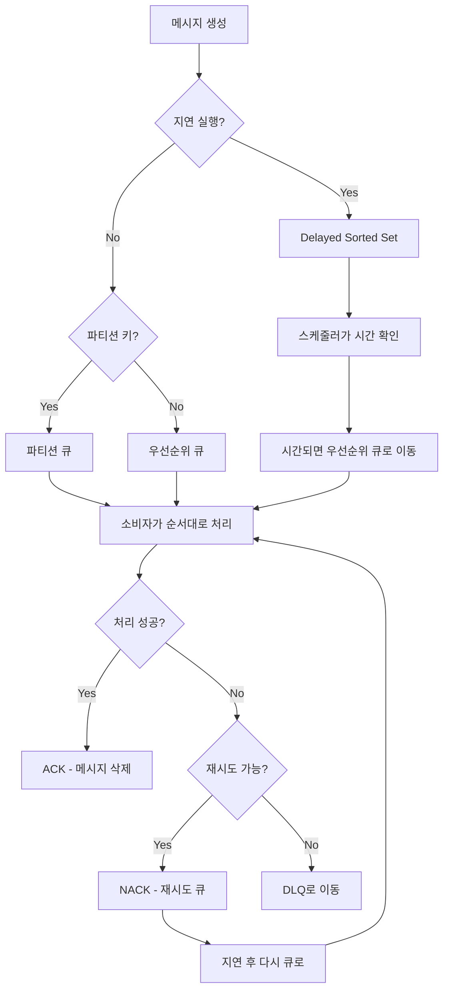

# Base Server Architecture Documentation - Part 2: 메시지큐 & 이벤트큐 시스템

## 목차
1. [큐 시스템 개요](#큐-시스템-개요)
2. [메시지큐 시스템](#메시지큐-시스템)
3. [이벤트큐 시스템](#이벤트큐-시스템)
4. [QueueService 통합 관리](#queueservice-통합-관리)
5. [아웃박스 패턴](#아웃박스-패턴)
6. [스케줄러 연동](#스케줄러-연동)

---

## 큐 시스템 개요

Base Server는 두 가지 큐 시스템을 제공합니다:

### 큐 시스템 비교

| 구분 | 메시지큐 (Message Queue) | 이벤트큐 (Event Queue) |
|------|---------------------------|-------------------------|
| **패턴** | Point-to-Point (1:1) | Publish-Subscribe (1:N) |
| **용도** | 작업 처리, 비동기 실행 | 이벤트 알림, 상태 전파 |
| **소비** | 하나의 소비자만 처리 | 여러 구독자가 동시 처리 |
| **보장** | At-least-once delivery | At-least-once broadcast |
| **예시** | 주문 처리, 이메일 발송 | 계정 생성 알림, 가격 변동 |

### 아키텍처 구조

```
Application Layer
├── QueueService (통합 관리)
│   ├── MessageQueueManager
│   │   ├── RedisCacheMessageQueue
│   │   └── MessageConsumer[]
│   ├── EventQueueManager  
│   │   ├── RedisCacheEventQueue
│   │   └── EventSubscriber[]
│   └── OutboxService (트랜잭션 일관성)
│
└── Infrastructure Layer
    ├── CacheService (Redis)
    ├── SchedulerService (백그라운드 작업)
    └── LockService (분산락)
```

---

## 메시지큐 시스템

### 메시지큐 Redis 키 구조

#### 기본 키 패턴
```
mq:message:{message_id}              # 메시지 본문 (Hash)
mq:queue:{queue_name}                # 기본 큐 (List)
mq:priority:{queue_name}:{priority}  # 우선순위별 큐 (List)
mq:partition:{queue_name}:{hash}     # 파티션별 큐 (List)
mq:delayed:messages                  # 지연 실행 메시지 (Sorted Set)
mq:processing:{queue_name}           # 처리 중인 메시지 (Hash)
mq:dlq:{queue_name}                  # 데드레터큐 (List)
mq:config:{queue_name}               # 큐 설정 (Hash)
```

#### 키별 상세 설명

**1. 메시지 저장: `mq:message:{message_id}`**
- **타입**: Hash
- **용도**: 메시지 메타데이터와 페이로드 저장
- **구조**:
  ```json
  {
    "id": "uuid-1234",
    "queue_name": "order_processing",
    "payload": "{\"order_id\": 123, \"amount\": 100}",
    "message_type": "process_order", 
    "priority": "2",
    "created_at": "2024-01-01T00:00:00",
    "retry_count": "0",
    "max_retries": "3",
    "partition_key": "user:123"
  }
  ```

**2. 우선순위 큐: `mq:priority:{queue_name}:{priority}`**
- **타입**: List (FIFO)
- **우선순위**: 4(CRITICAL) > 3(HIGH) > 2(NORMAL) > 1(LOW)
- **예시**:
  ```
  mq:priority:order_processing:4  → [uuid-1, uuid-2]  # CRITICAL
  mq:priority:order_processing:3  → [uuid-3, uuid-4]  # HIGH  
  mq:priority:order_processing:2  → [uuid-5, uuid-6]  # NORMAL
  mq:priority:order_processing:1  → [uuid-7, uuid-8]  # LOW
  ```

**3. 지연 메시지: `mq:delayed:messages`**
- **타입**: Sorted Set
- **스코어**: Unix timestamp (실행 시간)
- **용도**: 미래의 특정 시간에 실행할 메시지
- **예시**:
  ```
  ZADD mq:delayed:messages 1704067200 uuid-1234  # 2024-01-01 00:00:00에 실행
  ```

**4. 파티션 큐: `mq:partition:{queue_name}:{hash}`**
- **타입**: List (순서 보장)
- **용도**: 동일한 파티션 키를 가진 메시지들의 순서 보장
- **해시**: `hash(partition_key) % 16` (16개 파티션)
- **예시**:
  ```
  mq:partition:user_events:5  → [msg-user123-1, msg-user123-2]  # user:123의 순서 보장
  ```

### 메시지 생명주기



### 메시지큐 구현 세부사항

#### 1. 메시지 발행 (Enqueue)

```python
async def enqueue(self, message: QueueMessage) -> bool:
    # 1. 메시지 ID 생성
    if not message.id:
        message.id = str(uuid.uuid4())
    
    # 2. 메시지 메타데이터 저장
    message_data = {
        "id": str(message.id),
        "queue_name": str(message.queue_name),
        "payload": json.dumps(message.payload),
        "message_type": str(message.message_type),
        "priority": str(message.priority.value),
        "created_at": str(datetime.now().isoformat()),
        "retry_count": str(message.retry_count),
        "max_retries": str(message.max_retries),
        "partition_key": str(message.partition_key or "")
    }
    
    message_key = f"mq:message:{message.id}"
    await client.set_hash_all(message_key, message_data)
    
    # 3. 큐 라우팅
    if message.scheduled_at and message.scheduled_at > datetime.now():
        # 지연 실행 메시지
        timestamp = message.scheduled_at.timestamp()
        await client.sorted_set_add("mq:delayed:messages", timestamp, message.id)
    elif message.partition_key:
        # 파티션 큐 (순서 보장)
        partition_queue_key = f"mq:partition:{message.queue_name}:{hash(message.partition_key) % 16}"
        await client.list_push_right(partition_queue_key, message.id)
    else:
        # 우선순위 큐
        priority_queue_key = f"mq:priority:{message.queue_name}:{message.priority.value}"
        await client.list_push_right(priority_queue_key, message.id)
    
    return True
```

#### 2. 메시지 소비 (Dequeue)

```python
async def dequeue(self, queue_name: str, consumer_id: str) -> Optional[QueueMessage]:
    # 우선순위 순서대로 확인 (CRITICAL=4, HIGH=3, NORMAL=2, LOW=1)
    for priority in [4, 3, 2, 1]:
        priority_queue_key = f"mq:priority:{queue_name}:{priority}"
        
        message_id = await client.list_pop_left(priority_queue_key)
        if message_id:
            # 메시지 상세 정보 가져오기
            message_key = f"mq:message:{message_id}"
            message_data = await client.get_hash_all(message_key)
            
            if not message_data:
                continue
            
            # 처리 중 상태로 이동
            processing_key = f"mq:processing:{queue_name}"
            processing_info = {
                "message_id": message_id,
                "consumer_id": consumer_id,
                "started_at": datetime.now().isoformat(),
                "visibility_timeout": "300"
            }
            await client.set_hash_all(f"{processing_key}:{message_id}", processing_info)
            
            # QueueMessage 객체로 변환
            return QueueMessage(
                id=message_data["id"],
                queue_name=message_data["queue_name"],
                payload=json.loads(message_data["payload"]),
                message_type=message_data["message_type"],
                priority=MessagePriority(int(message_data["priority"])),
                created_at=datetime.fromisoformat(message_data["created_at"]),
                retry_count=int(message_data.get("retry_count", 0)),
                max_retries=int(message_data.get("max_retries", 3)),
                partition_key=message_data.get("partition_key") or None
            )
    
    return None
```

#### 3. 메시지 확인 (ACK/NACK)

```python
async def ack(self, message: QueueMessage, consumer_id: str) -> bool:
    # 처리 중 상태에서 제거
    processing_key = f"mq:processing:{message.queue_name}"
    await client.delete(f"{processing_key}:{message.id}")
    
    # 메시지 데이터 삭제
    message_key = f"mq:message:{message.id}"
    await client.delete(message_key)
    
    return True

async def nack(self, message: QueueMessage, consumer_id: str, requeue: bool = True) -> bool:
    # 처리 중 상태에서 제거
    processing_key = f"mq:processing:{message.queue_name}"
    await client.delete(f"{processing_key}:{message.id}")
    
    if requeue and message.retry_count < message.max_retries:
        # 재시도 카운트 증가 후 재큐잉
        message.retry_count += 1
        message_key = f"mq:message:{message.id}"
        await client.set_hash_field(message_key, "retry_count", str(message.retry_count))
        
        # 우선순위 큐에 다시 추가
        priority_queue_key = f"mq:priority:{message.queue_name}:{message.priority.value}"
        await client.list_push_right(priority_queue_key, message.id)
    else:
        # DLQ로 이동
        dlq_key = f"mq:dlq:{message.queue_name}"
        dlq_message = {
            "message_id": message.id,
            "original_queue": message.queue_name,
            "failed_at": datetime.now().isoformat(),
            "consumer_id": consumer_id,
            "retry_count": str(message.retry_count)
        }
        await client.list_push_right(dlq_key, json.dumps(dlq_message))
        
        # 원본 메시지 삭제
        message_key = f"mq:message:{message.id}"
        await client.delete(message_key)
    
    return True
```

### 메시지 소비자 (Consumer)

```python
class MessageConsumer:
    def __init__(self, queue_name: str, consumer_id: str, 
                 message_queue: IMessageQueue, handler: Callable[[QueueMessage], bool]):
        self.queue_name = queue_name
        self.consumer_id = consumer_id
        self.message_queue = message_queue
        self.handler = handler
        self.running = False
    
    async def _consume_loop(self):
        """메시지 소비 루프"""
        while self.running:
            try:
                message = await self.message_queue.dequeue(self.queue_name, self.consumer_id)
                
                if message:
                    success = False
                    try:
                        # 핸들러 실행
                        if asyncio.iscoroutinefunction(self.handler):
                            success = await self.handler(message)
                        else:
                            success = self.handler(message)
                        
                        # 처리 결과에 따른 ACK/NACK
                        if success:
                            await self.message_queue.ack(message, self.consumer_id)
                        else:
                            await self.message_queue.nack(message, self.consumer_id)
                            
                    except Exception as e:
                        Logger.error(f"메시지 처리 중 오류: {message.id} - {e}")
                        await self.message_queue.nack(message, self.consumer_id)
                else:
                    # 메시지가 없으면 짧은 시간 대기
                    await asyncio.sleep(1)
                    
            except Exception as e:
                Logger.error(f"메시지 소비 루프 오류: {e}")
                await asyncio.sleep(5)
```

---

## 이벤트큐 시스템

### 이벤트큐 Redis 키 구조

#### 기본 키 패턴
```
eq:stream:{event_type}               # 이벤트 스트림 (List)
eq:subscriptions                     # 구독 정보 (Hash)
eq:subscriber:{subscriber_id}        # 구독자별 큐 (List)
eq:history:{event_type}              # 이벤트 히스토리 (List, 제한된 크기)
```

#### 키별 상세 설명

**1. 이벤트 스트림: `eq:stream:{event_type}`**
- **타입**: List
- **용도**: 특정 타입의 이벤트들을 시간순으로 저장
- **예시**:
  ```
  eq:stream:account.created     → [event-1, event-2, event-3]
  eq:stream:market.data.updated → [event-4, event-5, event-6]
  ```

**2. 구독 정보: `eq:subscriptions`**
- **타입**: Hash  
- **구조**: `subscriber_id` → `{"event_types": [...], "callback_info": {...}}`
- **예시**:
  ```json
  {
    "notification_service": {
      "event_types": ["account.created", "trade.executed"],
      "created_at": "2024-01-01T00:00:00",
      "active": true
    },
    "audit_service": {
      "event_types": ["account.created", "account.updated", "account.deleted"],
      "created_at": "2024-01-01T00:00:00", 
      "active": true
    }
  }
  ```

**3. 구독자 큐: `eq:subscriber:{subscriber_id}`**
- **타입**: List (FIFO)
- **용도**: 각 구독자가 받을 이벤트들을 큐에 저장
- **예시**:
  ```
  eq:subscriber:notification_service → [event-1, event-4, event-7]
  eq:subscriber:audit_service       → [event-1, event-2, event-3]
  ```

**4. 이벤트 히스토리: `eq:history:{event_type}`**
- **타입**: List (크기 제한)
- **용도**: 최근 이벤트 히스토리 보관 (디버깅, 재처리용)
- **크기**: 최대 1,000개 (LTRIM으로 관리)

### 이벤트 타입 정의

```python
class EventType(Enum):
    # 계정 관련
    ACCOUNT_CREATED = "account.created"
    ACCOUNT_UPDATED = "account.updated"
    ACCOUNT_DELETED = "account.deleted"
    
    # 포트폴리오 관련
    PORTFOLIO_CREATED = "portfolio.created"
    PORTFOLIO_UPDATED = "portfolio.updated" 
    TRADE_EXECUTED = "trade.executed"
    
    # 시장 데이터 관련
    MARKET_DATA_UPDATED = "market.data.updated"
    PRICE_ALERT = "price.alert"
    
    # 시스템 관련
    SYSTEM_MAINTENANCE = "system.maintenance"
    SYSTEM_ERROR = "system.error"
```

### 이벤트 발행 (Publish)

```python
async def publish_event(self, event_type: EventType, source: str, 
                       data: Dict[str, Any], correlation_id: Optional[str] = None) -> bool:
    # 1. 이벤트 생성
    event = Event(
        id=str(uuid.uuid4()),
        event_type=event_type,
        source=source,
        data=data,
        correlation_id=correlation_id,
        timestamp=datetime.now()
    )
    
    # 2. 이벤트 스트림에 추가
    stream_key = f"eq:stream:{event_type.value}"
    event_json = json.dumps(event.to_dict())
    await client.list_push_right(stream_key, event_json)
    
    # 3. 히스토리에 추가 (크기 제한)
    history_key = f"eq:history:{event_type.value}"
    await client.list_push_right(history_key, event_json)
    await client.list_trim(history_key, -1000, -1)  # 최근 1000개만 유지
    
    # 4. 구독자들에게 이벤트 전달
    subscriptions = await client.get_hash_all("eq:subscriptions")
    
    for subscriber_id, sub_info in subscriptions.items():
        sub_data = json.loads(sub_info)
        if event_type.value in sub_data.get("event_types", []):
            subscriber_queue = f"eq:subscriber:{subscriber_id}"
            await client.list_push_right(subscriber_queue, event_json)
    
    return True
```

### 이벤트 구독 (Subscribe)

```python
async def subscribe_events(self, subscriber_id: str, event_types: List[EventType],
                          callback: Callable[[Event], bool]) -> Optional[str]:
    # 1. 구독 정보 저장
    subscription_info = {
        "event_types": [et.value for et in event_types],
        "created_at": datetime.now().isoformat(),
        "active": True
    }
    
    await client.set_hash_field("eq:subscriptions", subscriber_id, 
                               json.dumps(subscription_info))
    
    # 2. 구독자 처리 루프 시작
    asyncio.create_task(self._process_subscriber_events(subscriber_id, callback))
    
    return subscriber_id

async def _process_subscriber_events(self, subscriber_id: str, 
                                   callback: Callable[[Event], bool]):
    """구독자 이벤트 처리 루프"""
    subscriber_queue = f"eq:subscriber:{subscriber_id}"
    
    while True:
        try:
            # 큐에서 이벤트 가져오기
            event_json = await client.list_pop_left(subscriber_queue)
            
            if event_json:
                event_data = json.loads(event_json)
                event = Event.from_dict(event_data)
                
                try:
                    # 콜백 실행
                    if asyncio.iscoroutinefunction(callback):
                        success = await callback(event)
                    else:
                        success = callback(event)
                    
                    if not success:
                        # 처리 실패 시 재큐잉 (간단한 재시도)
                        await client.list_push_left(subscriber_queue, event_json)
                        await asyncio.sleep(5)  # 재시도 대기
                        
                except Exception as e:
                    Logger.error(f"이벤트 처리 실패: {subscriber_id} - {e}")
                    # 실패한 이벤트는 일단 버림 (DLQ 구현 가능)
            else:
                # 이벤트가 없으면 대기
                await asyncio.sleep(1)
                
        except Exception as e:
            Logger.error(f"구독자 이벤트 처리 오류: {subscriber_id} - {e}")
            await asyncio.sleep(5)
```

---

## QueueService 통합 관리

### QueueService 아키텍처

```python
class QueueService:
    """통합 큐 서비스 - 메시지큐/이벤트큐/아웃박스 패턴 통합 관리"""
    
    def __init__(self):
        self.message_queue_manager: MessageQueueManager
        self.event_queue_manager: EventQueueManager  
        self.outbox_service: OutboxService
        self.stats = {
            "messages_processed": 0,
            "events_published": 0,
            "outbox_events_processed": 0,
            "errors": 0
        }
```

### 통합 API

#### 메시지큐 API
```python
# 메시지 전송
await queue_service.send_message(
    queue_name="order_processing",
    payload={"order_id": 123, "amount": 100.0},
    message_type="process_order",
    priority=MessagePriority.HIGH,
    scheduled_at=datetime.now() + timedelta(minutes=5)  # 5분 후 실행
)

# 메시지 소비자 등록
await queue_service.register_message_consumer(
    queue_name="order_processing",
    consumer_id="worker_1", 
    handler=process_order_handler
)
```

#### 이벤트큐 API
```python
# 이벤트 발행
await queue_service.publish_event(
    event_type=EventType.ACCOUNT_CREATED,
    source="account_service",
    data={"account_id": "123", "user_id": "456"},
    correlation_id="txn-789"
)

# 이벤트 구독
await queue_service.subscribe_events(
    subscriber_id="notification_service",
    event_types=[EventType.ACCOUNT_CREATED, EventType.TRADE_EXECUTED],
    callback=notification_handler
)
```

### 큐 통계 및 모니터링

```python
# 큐 상태 조회
queue_stats = await queue_service.get_queue_stats("order_processing")
# {
#   "queue_name": "order_processing",
#   "priority_4_count": 5,    # CRITICAL
#   "priority_3_count": 12,   # HIGH  
#   "priority_2_count": 25,   # NORMAL
#   "priority_1_count": 8,    # LOW
#   "processing_count": 3,
#   "dlq_count": 2,
#   "delayed_count": 10
# }

# 이벤트큐 통계
event_stats = await queue_service.get_event_stats()
# {
#   "active_subscriptions": 5,
#   "total_events_today": 1250,
#   "events_by_type": {
#     "account.created": 45,
#     "trade.executed": 234,
#     "market.data.updated": 971
#   }
# }

# 전체 서비스 통계
service_stats = queue_service.get_stats()
# {
#   "messages_processed": 5420,
#   "events_published": 1250, 
#   "outbox_events_processed": 89,
#   "errors": 12
# }
```

---

## 아웃박스 패턴

### 아웃박스 패턴 개요

아웃박스 패턴은 데이터베이스 트랜잭션과 이벤트 발행의 일관성을 보장하는 패턴입니다.

```
Business Operation + Event Recording (Same Transaction)
     ↓
Outbox Processor (별도 프로세스)
     ↓  
Event Publication to Queue
```

### 아웃박스 테이블 구조

```sql
CREATE TABLE outbox_events (
  id varchar(36) NOT NULL,                    -- 이벤트 ID (UUID)
  event_type varchar(100) NOT NULL,           -- 이벤트 타입
  aggregate_id varchar(100) NOT NULL,         -- 집계 ID (account_db_key 등)
  aggregate_type varchar(50) NOT NULL,        -- 집계 타입 (account, portfolio 등)
  event_data json NOT NULL,                   -- 이벤트 데이터
  status enum('pending','published','failed','retry') DEFAULT 'pending',
  retry_count int DEFAULT 0,
  max_retries int DEFAULT 3,
  created_at datetime DEFAULT CURRENT_TIMESTAMP,
  updated_at datetime DEFAULT NULL ON UPDATE CURRENT_TIMESTAMP,
  published_at datetime DEFAULT NULL,
  PRIMARY KEY (id),
  KEY idx_status_created (status, created_at)
);
```

### 아웃박스 사용 예시

```python
async def create_account_with_event(account_data: Dict[str, Any]):
    """계정 생성과 이벤트 발행을 트랜잭션으로 처리"""
    
    async with database.transaction():
        # 1. 비즈니스 로직 실행
        account_id = await create_account(account_data)
        
        # 2. 아웃박스에 이벤트 기록 (같은 트랜잭션)
        await queue_service.publish_event_with_transaction(
            event_type="account.created",
            aggregate_id=account_id,
            aggregate_type="account",
            event_data={
                "account_id": account_id,
                "user_id": account_data["user_id"],
                "created_at": datetime.now().isoformat()
            }
        )
        
        # 3. 트랜잭션 커밋 시 둘 다 성공, 롤백 시 둘 다 실패
        
    # 4. 별도 프로세스에서 아웃박스 이벤트를 큐로 발행
    return account_id
```

### 아웃박스 처리기

```python
async def process_outbox_events():
    """아웃박스 이벤트를 큐로 발행"""
    
    # 1. 대기 중인 이벤트 조회
    pending_events = await outbox_service.get_pending_events(limit=100)
    
    stats = {"processed": 0, "failed": 0}
    
    for event in pending_events:
        try:
            # 2. 이벤트큐로 발행
            success = await event_queue_manager.publish_event(
                EventType(event.event_type),
                f"outbox:{event.aggregate_type}",
                event.event_data,
                event.aggregate_id
            )
            
            if success:
                # 3. 성공 시 상태 업데이트
                await outbox_service.mark_as_published(event.id)
                stats["processed"] += 1
            else:
                # 4. 실패 시 재시도 카운트 증가
                await outbox_service.mark_as_failed(event.id)
                stats["failed"] += 1
                
        except Exception as e:
            Logger.error(f"아웃박스 이벤트 처리 실패: {event.id} - {e}")
            await outbox_service.mark_as_failed(event.id)
            stats["failed"] += 1
    
    return stats
```

---

## 스케줄러 연동

### 스케줄러 작업 정의

QueueService는 다음과 같은 스케줄러 작업들을 등록합니다:

```python
async def _setup_scheduler_jobs(self):
    # 1. 아웃박스 이벤트 처리 (1분마다)
    outbox_job = ScheduleJob(
        job_id="process_outbox_events",
        name="아웃박스 이벤트 처리",
        schedule_type=ScheduleType.INTERVAL,
        schedule_value=60,  # 60초
        callback=self._process_outbox_events_job,
        use_distributed_lock=True,
        lock_key="scheduler:outbox_events"
    )
    
    # 2. 지연 메시지 처리 (연속 실행)
    asyncio.create_task(self._start_delayed_message_processor())
    
    # 3. 큐 상태 모니터링 (5분마다)
    monitoring_job = ScheduleJob(
        job_id="monitor_queues", 
        name="큐 상태 모니터링",
        schedule_type=ScheduleType.INTERVAL,
        schedule_value=300,  # 300초
        callback=self._monitor_queues_job,
        use_distributed_lock=False
    )
    
    # 4. 큐 정리 작업 (1시간마다)
    cleanup_job = ScheduleJob(
        job_id="cleanup_queues",
        name="큐 정리",
        schedule_type=ScheduleType.INTERVAL, 
        schedule_value=3600,  # 3600초
        callback=self._cleanup_queues_job,
        use_distributed_lock=True,
        lock_key="scheduler:cleanup_queues"
    )
```

### 지연 메시지 처리기

```python
async def _start_delayed_message_processor(self):
    """지연 메시지 처리기 - 연속 실행"""
    
    async def process_delayed_with_cache_check():
        while True:
            try:
                # Redis 연결 상태 확인
                cache_service = CacheService.get_instance()
                health_check = await cache_service.health_check()
                
                if health_check.get("healthy", False):
                    # 지연 메시지 처리
                    count = await self.message_queue_manager.message_queue.process_delayed_messages()
                    if count > 0:
                        Logger.info(f"지연 메시지 {count}개 처리 완료")
                else:
                    Logger.warn("Redis 연결 불안정, 지연 메시지 처리 건너뜀")
                
                await asyncio.sleep(10)  # 10초마다 확인
                
            except Exception as e:
                Logger.error(f"지연 메시지 처리기 오류: {e}")
                await asyncio.sleep(30)
    
    asyncio.create_task(process_delayed_with_cache_check())
```

### 큐 모니터링

```python
async def _monitor_queues_job(self):
    """큐 상태 모니터링 작업"""
    try:
        # 메시지큐 통계
        for queue_name in ["order_processing", "email_sending", "file_upload"]:
            stats = await self.message_queue_manager.message_queue.get_queue_stats(queue_name)
            if stats:
                Logger.info(f"메시지큐 [{queue_name}] 상태: {stats}")
        
        # 이벤트큐 통계
        event_stats = await self.event_queue_manager.get_stats()
        if event_stats:
            Logger.info(f"이벤트큐 상태: {event_stats}")
        
        # 전체 서비스 통계
        Logger.info(f"QueueService 통계: {self.stats}")
        
    except Exception as e:
        Logger.error(f"큐 모니터링 실패: {e}")
```

### 큐 정리 작업

```python
async def _cleanup_queues_job(self):
    """큐 정리 작업 - 오래된 데이터 정리"""
    try:
        # 1. 아웃박스 이벤트 정리 (7일 이전)
        cleaned_events = await self.outbox_service.cleanup_old_events(days=7)
        if cleaned_events > 0:
            Logger.info(f"오래된 아웃박스 이벤트 {cleaned_events}개 정리")
        
        # 2. 이벤트 히스토리 정리 (각 타입별 최대 1000개 유지)
        for event_type in EventType:
            history_key = f"eq:history:{event_type.value}"
            await client.list_trim(history_key, -1000, -1)
        
        # 3. DLQ 모니터링 및 알림
        for queue_name in ["order_processing", "email_sending"]:
            dlq_key = f"mq:dlq:{queue_name}"
            dlq_count = await client.list_length(dlq_key)
            if dlq_count > 10:
                Logger.warn(f"DLQ [{queue_name}]에 {dlq_count}개 메시지 누적")
        
    except Exception as e:
        Logger.error(f"큐 정리 작업 실패: {e}")
```

---

## 성능 최적화 및 모니터링

### 배치 처리 최적화

```python
# 메시지 배치 발행
messages = [
    QueueMessage(...),
    QueueMessage(...),
    QueueMessage(...)
]

# 한 번에 여러 메시지 처리
for message in messages:
    await queue_service.send_message(...)
```

### 연결 풀 관리

```python
# CacheService를 통한 연결 풀 사용
async with cache_service.get_client() as client:
    # 여러 Redis 작업을 같은 연결로 처리
    await client.set_hash_all(...)
    await client.list_push_right(...)
    await client.sorted_set_add(...)
```

### 메트릭 수집

```python
# 큐 성능 메트릭
queue_metrics = {
    "messages_per_second": 150,
    "average_processing_time": 0.5,
    "queue_depth": {
        "order_processing": 25,
        "email_sending": 8,
        "file_upload": 12
    },
    "consumer_count": {
        "order_processing": 3,
        "email_sending": 2,
        "file_upload": 1
    },
    "error_rate": 0.02  # 2%
}
```

---

이것으로 Part 2가 완료되었습니다. Part 3에서는 데이터베이스 시스템, 서비스 아키텍처, 그리고 전체 시스템 통합에 대해 다루겠습니다.