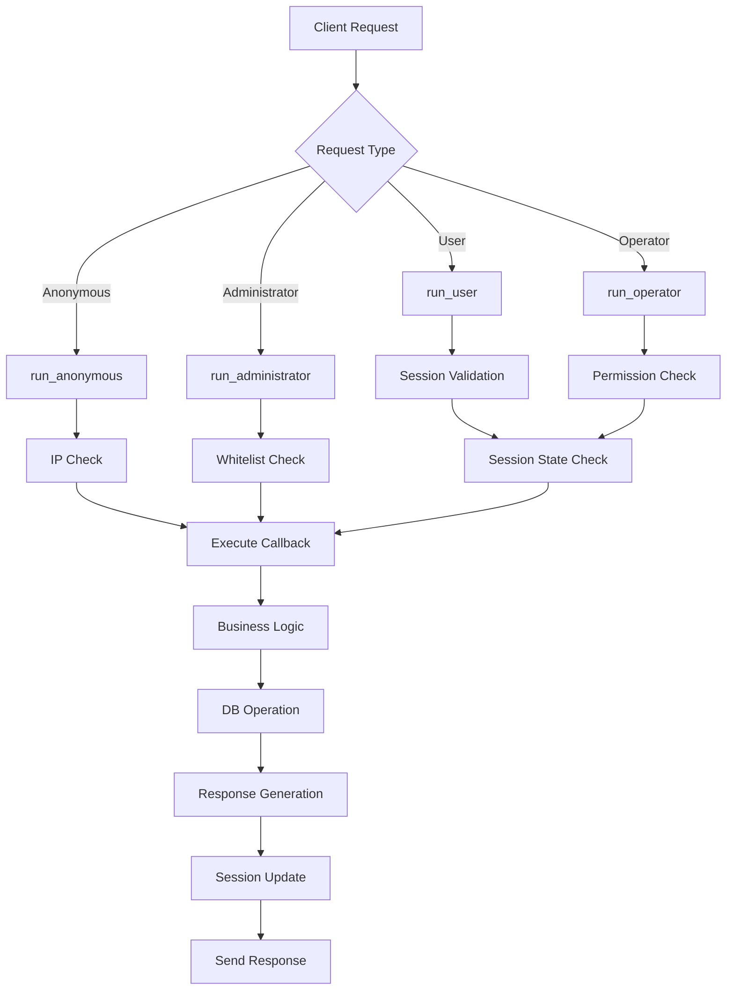

# Base Server Architecture Documentation - Part 4: 템플릿 시스템 & 라우팅

## 목차
1. [템플릿 시스템 개요](#템플릿-시스템-개요)
2. [템플릿 아키텍처](#템플릿-아키텍처)
3. [세션 관리](#세션-관리)
4. [프로토콜 및 라우팅](#프로토콜-및-라우팅)
5. [요청-응답 플로우](#요청-응답-플로우)
6. [보안 및 인증](#보안-및-인증)
7. [템플릿 구현 상세](#템플릿-구현-상세)

---

## 템플릿 시스템 개요

### 템플릿 패턴 설계

Base Server는 **템플릿 메서드 패턴**과 **프로토콜 기반 라우팅**을 결합한 구조로 설계되었습니다.

```
┌─────────────────────────────────────────────────────────────┐
│                    Application Router                       │
├─────────────────────────────────────────────────────────────┤
│                   TemplateService                           │
│  ┌─────────────────┐  ┌──────────────────────────────────┐  │
│  │ Authentication  │  │        Request Processing        │  │
│  │ - Anonymous     │  │  ┌────────────┐ ┌────────────┐   │  │
│  │ - User          │  │  │ Protocol   │ │ Controller │   │  │
│  │ - Operator      │  │  │ Parser     │ │ Callback   │   │  │
│  │ - Administrator │  │  └────────────┘ └────────────┘   │  │
│  └─────────────────┘  └──────────────────────────────────┘  │
├─────────────────────────────────────────────────────────────┤
│                  TemplateContext                            │
│  ┌─────────────────┐  ┌──────────────────────────────────┐  │
│  │ Account Template│  │        Other Templates           │  │
│  │ Portfolio       │  │  Dashboard, Market, Chat, etc    │  │
│  │ Trading         │  │                                  │  │
│  └─────────────────┘  └──────────────────────────────────┘  │
└─────────────────────────────────────────────────────────────┘
```

### 핵심 설계 원칙

1. **프로토콜 레벨 분리**: Anonymous, User, Operator, Administrator
2. **세션 기반 라우팅**: 세션 정보에 따른 자동 DB 라우팅
3. **템플릿 격리**: 각 도메인별 독립적인 템플릿 구현
4. **콜백 기반 처리**: 프로토콜 파서와 비즈니스 로직 분리
5. **상태 관리**: 세션 상태별 요청 처리 제어

---

## 템플릿 아키텍처

### TemplateService 핵심 구조

```python
class TemplateService:
    """템플릿 서비스 - 전체 요청 처리의 중앙 관리자"""
    _config = None
    SessionContextCallback: Callable[[Any, bytes, int], Any] = None
    
    @classmethod
    def init(cls, config):
        """템플릿 시스템 초기화"""
        cls._config = config
        TemplateContext.load_data_table(config)  # 데이터 테이블 로드
        TemplateContext.init_template(config)    # 템플릿 초기화
```

### 요청 처리 레벨별 메서드

#### 1. Anonymous 레벨 (로그인 이전)
```python
@classmethod
async def run_anonymous(cls, method: str, path: str, ip_address: str, req_json: str, callback: Callable[[Any, bytes, int], Any]) -> str:
    """익명 컨트롤러 함수 실행 (서버 인증 이전)"""
    client_session = None
    try:
        Logger.info(f"REQ[{method}:{path}, IP:{ip_address} - UID: ]: {req_json}")
        cls.check_allowed_request(ip_address, EProtocolType.ANONYMOUS)
        
        # 익명 요청은 세션 없이 콜백 호출
        msg = req_json.encode('utf-8')
        res = await callback(None, msg, len(msg))
        res_json = cls._serialize_response(res)
        
        # 응답에 account_info가 있으면 세션 생성 (로그인 성공 시)
        j_obj = json.loads(res_json)
        if 'account_info' in j_obj:
            account_info = j_obj['account_info']
            # accessToken 생성
            access_token = account_info.get('accessToken', str(uuid.uuid4()))
            
            # SessionInfo 객체 생성
            session_info = SessionInfo()
            session_info.account_db_key = account_info.get('account_db_key', 0)
            session_info.platform_type = account_info.get('platform_type', 1)
            session_info.account_id = account_info.get('account_id', '')
            session_info.account_level = account_info.get('account_level', 1)
            session_info.shard_id = account_info.get('shard_id', 1)
            session_info.session_state = ClientSessionState.NORMAL
            
            # Redis에 세션 정보 저장
            client_session = await cls.set_session_info(access_token, '', session_info)
            
            # 로그인 성공 시 템플릿 콜백 호출
            if client_session:
                await cls._handle_user_login_callbacks(client_session)
            
            # 응답에 accessToken 추가, account_info 제거
            j_obj['accessToken'] = access_token
            del j_obj['account_info']
            res_json = json.dumps(j_obj)
        
        return res_json
```

**Anonymous 레벨 특징:**
- 세션 검증 없음
- IP 기반 접근 제어
- 로그인 성공 시 자동 세션 생성
- 응답에서 내부 정보 제거

#### 2. User 레벨 (일반 사용자)
```python
@classmethod
async def run_user(cls, method: str, path: str, ip_address: str, req_json: str, callback: Callable[[Any, bytes, int], Any]) -> str:
    """유저 컨트롤러 함수 실행 (서버 인증 이후)"""
    client_session = None
    try:
        Logger.info(f"REQ[{method}:{path}, IP:{ip_address} - UID: ]: {req_json}")
        cls.check_allowed_request(ip_address, EProtocolType.USER)
        
        # 요청에서 세션 생성 및 검증
        client_session = await cls.create_client_session(req_json)
        
        # 세션 유효성 검증
        if client_session is None:
            raise TemplateException("SessionExpired", getattr(ENetErrorCode, 'SESSION_EXPIRED', -1))
        
        # 세션 상태 검증 (중복 로그인, 차단 계정 등)
        await cls._validate_session_state(client_session)
        
        # 유효한 세션으로 콜백 호출
        msg = req_json.encode('utf-8')
        res = await callback(client_session, msg, len(msg))
        res_json = cls._serialize_response(res)
        
        return res_json
```

**User 레벨 특징:**
- 필수 세션 검증
- 세션 상태 체크 (중복 로그인, 블록 등)
- 자동 세션 갱신
- 샤드 DB 자동 라우팅

#### 3. Operator 레벨 (운영자)
```python
@classmethod
async def run_operator(cls, method: str, path: str, ip_address: str, req_json: str, callback: Callable[[Any, bytes, int], Any]) -> str:
    """운영자 컨트롤러 함수 실행"""
    try:
        # 먼저 세션 생성 및 검증
        client_session = await cls.create_client_session(req_json)
        if client_session is None:
            raise TemplateException("SessionExpired", getattr(ENetErrorCode, 'SESSION_EXPIRED', -1))
        
        # 운영자 권한 체크 (화이트리스트 OR 계정 레벨)
        cls.check_allowed_request(ip_address, EProtocolType.OPERATOR, client_session)
        
        # 세션 상태 검증
        await cls._validate_session_state(client_session)
        
        msg = req_json.encode('utf-8')
        res = await callback(client_session, msg, len(msg))
        res_json = cls._serialize_response(res)
        
        return res_json
```

**Operator 레벨 특징:**
- 계정 레벨 검증 (account_level >= 2)
- 화이트리스트 OR 운영자 권한
- 세션 기반 권한 체크

#### 4. Administrator 레벨 (관리자)
```python
@classmethod
async def run_administrator(cls, method: str, path: str, ip_address: str, req_json: str, callback: Callable[[Any, bytes, int], Any]) -> str:
    """관리자 컨트롤러 함수 실행"""
    try:
        Logger.info(f"REQ[{method}:{path}, IP:{ip_address} - UID: ]: {req_json}")
        
        # 관리자는 반드시 화이트리스트에 있어야 함
        cls.check_allowed_request(ip_address, EProtocolType.ADMINISTRATOR)
        
        # 관리자는 세션 없이 콜백 호출
        msg = req_json.encode('utf-8')
        res = await callback(None, msg, len(msg))
        res_json = cls._serialize_response(res)
        
        return res_json
```

**Administrator 레벨 특징:**
- 필수 화이트리스트 검증
- 세션 없이 동작
- 시스템 관리용 기능

---

## 세션 관리

### SessionInfo 데이터 구조

```python
@dataclass
class SessionInfo:
    """세션 정보 - 사용자 상태와 라우팅 정보 포함"""
    shard_id: int = -1                    # 샤드 라우팅용
    account_db_key: int = 0               # 사용자 고유 키
    platform_id: str = ""                # 플랫폼 식별자
    platform_type: int = -1              # 플랫폼 타입 (웹=1, 모바일=2 등)
    account_id: str = ""                  # 계정 ID (이메일 등)
    account_level: int = 0                # 권한 레벨 (1=일반, 2=운영자, 3=개발자, 4=관리자)
    app_version: str = ""                 # 앱 버전
    os: str = ""                          # 운영체제
    country: str = ""                     # 국가 코드
    session_state: ClientSessionState = ClientSessionState.NONE  # 세션 상태

class ClientSessionState(Enum):
    """클라이언트 세션 상태"""
    NONE = "None"
    NORMAL = "Normal"          # 정상 상태
    FATAL = "Fatal"            # 치명적 오류
    EXPIRED = "Expired"        # 만료됨
    DUPLICATED = "Duplicated"  # 중복 로그인
    BLOCKED = "Blocked"        # 차단됨
    NETERROR = "NetError"      # 네트워크 오류
```

### 세션 생성 및 관리

#### 세션 생성 (로그인 시)
```python
@staticmethod
async def set_session_info(access_token: str, last_access_token: str, session_info: 'SessionInfo') -> ClientSession:
    """세션 정보를 Redis에 설정"""
    from service.cache.cache_service import CacheService
    
    try:
        async with CacheService.get_client() as client:
            # 기존 세션이 있다면 중복 로그인 처리
            if last_access_token:
                redis_key = f"accessToken:{last_access_token}"
                redis_value = await client.get_string(redis_key)
                if redis_value:
                    session_key = f"sessionInfo:{last_access_token}"
                    session_value = await client.get_string(session_key)
                    if session_value:
                        last_session_info = json.loads(session_value)
                        # 중복 로그인 상태로 설정
                        last_session_info["session_state"] = "Duplicated"
                        await client.set_string(session_key, json.dumps(last_session_info))

            # 새로운 액세스 토큰 설정
            token_key = f"accessToken:{access_token}"
            await client.set_string(token_key, access_token, expire=client.session_expire_time)
            
            # 세션 정보 설정
            session_dict = {
                "account_db_key": session_info.account_db_key,
                "platform_type": session_info.platform_type,
                "account_id": session_info.account_id,
                "account_level": session_info.account_level,
                "session_state": session_info.session_state.value,
                "shard_id": session_info.shard_id
            }
            session_key = f"sessionInfo:{access_token}"
            await client.set_string(session_key, json.dumps(session_dict), expire=client.session_expire_time)
            
            return ClientSession(access_token, session_info)
```

#### 세션 검증 및 갱신
```python
@staticmethod
async def check_session_info(access_token: str):
    """세션 정보를 읽어오고 만료시간 갱신"""
    try:
        async with CacheService.get_client() as client:
            # 액세스 토큰 확인
            redis_key = f"accessToken:{access_token}"
            redis_value = await client.get_string(redis_key)
            if not redis_value:
                return None

            # 세션 정보 확인
            session_key = f"sessionInfo:{access_token}"
            session_value = await client.get_string(session_key)
            if not session_value:
                await client.delete(redis_key)
                return None

            # 액세스 토큰이 유효하다면 만료 시간을 갱신
            if not await client.expire(redis_key, client.session_expire_time):
                return None
                
            # 세션 정보도 만료 시간 갱신
            await client.expire(session_key, client.session_expire_time)

            # SessionInfo 객체로 변환
            session_dict = json.loads(session_value)
            session_info = SessionInfo()
            session_info.account_db_key = session_dict.get("account_db_key", 0)
            session_info.account_level = session_dict.get("account_level", 0)
            session_info.shard_id = session_dict.get("shard_id", -1)
            
            # session_state 처리
            state_value = session_dict.get("session_state", "NORMAL")
            try:
                session_info.session_state = ClientSessionState(state_value)
            except (ValueError, AttributeError):
                session_info.session_state = ClientSessionState.NORMAL
            
            return session_info
```

### 세션 상태 검증

```python
@classmethod
async def _validate_session_state(cls, client_session: 'ClientSession') -> None:
    """세션 상태 검증"""
    if not client_session or not client_session.session:
        raise TemplateException("SessionInvalid", getattr(ENetErrorCode, 'SESSION_INVALID', -1))
    
    session_state = getattr(client_session.session, 'session_state', None)
    if session_state:
        if hasattr(session_state, 'value'):
            state_value = session_state.value
        else:
            state_value = str(session_state)
        
        if state_value == "Duplicated":
            raise TemplateException("DuplicatedLogin", getattr(ENetErrorCode, 'DUPLICATED_LOGIN', -1))
        elif state_value == "Blocked":
            raise TemplateException("BlockedAccount", getattr(ENetErrorCode, 'BLOCKED_ACCOUNT', -1))
```

---

## 프로토콜 및 라우팅

### TemplateContext 관리

```python
class TemplateContext:
    """템플릿 컨텍스트 - 모든 템플릿 인스턴스 관리"""
    _templates: Dict[TemplateType, BaseTemplate] = {}
    _lock = Lock()

    @classmethod
    def add_template(cls, key: TemplateType, value):
        """템플릿 등록"""
        with cls._lock:
            if key in cls._templates:
                return False
            cls._templates[key] = value
            return True
    
    @classmethod
    def get_template(cls, key: TemplateType):
        """템플릿 조회"""
        with cls._lock:
            return cls._templates.get(key, None)
```

### 프로토콜 구조 분석

#### AccountProtocol 예시
```python
class AccountProtocol:
    """계정 관련 프로토콜 처리"""
    def __init__(self):
        # 콜백 속성들
        self.on_account_login_req_callback = None
        self.on_account_logout_req_callback = None
        self.on_account_signup_req_callback = None
        self.on_account_info_req_callback = None
        # ... 기타 콜백들

    async def account_login_req_controller(self, session, msg: bytes, length: int):
        """로그인 요청 컨트롤러"""
        request = AccountLoginRequest.model_validate_json(msg)
        if self.on_account_login_req_callback:
            return await self.on_account_login_req_callback(session, request)
        raise NotImplementedError('on_account_login_req_callback is not set')
```

**프로토콜 패턴:**
1. **요청 파싱**: JSON → Pydantic 모델
2. **콜백 호출**: 등록된 비즈니스 로직 실행
3. **응답 반환**: 결과를 표준화된 형태로 반환

---

## 요청-응답 플로우

### 전체 요청 처리 플로우



### 구체적인 요청 처리 예시

#### 1. 로그인 요청 (Anonymous → User 전환)
```python
# 1. FastAPI Router에서 호출
@app.post("/api/account/login")
async def account_login(request: Request):
    req_json = await request.body()
    
    # 2. Anonymous 레벨로 처리
    result = await TemplateService.run_anonymous(
        method="POST",
        path="/api/account/login", 
        ip_address=request.client.host,
        req_json=req_json.decode(),
        callback=account_template.protocol.account_login_req_controller
    )
    
    return result

# 3. AccountTemplateImpl에서 실제 처리
async def on_account_login_req(self, client_session, request: AccountLoginRequest):
    """로그인 요청 처리"""
    response = AccountLoginResponse()
    
    # 4. 글로벌 DB에서 인증
    result = await db_service.call_global_procedure(
        "fp_user_login",
        (request.platform_type, request.account_id, hashed_password)
    )
    
    if result and result[0].get('result') == 'SUCCESS':
        # 5. 세션 생성을 위한 account_info 설정
        response.account_info = {
            "account_db_key": result[0].get('account_db_key'),
            "shard_id": result[0].get('shard_id', 1),
            "account_level": result[0].get('account_level', 1)
        }
    
    return response

# 6. TemplateService.run_anonymous에서 세션 생성
# account_info가 있으면 자동으로 세션 생성 및 Redis 저장
```

#### 2. 포트폴리오 조회 (User 레벨)
```python
# 1. 세션 검증 후 샤드 DB 라우팅
async def on_account_info_req(self, client_session, request: AccountInfoRequest):
    """계좌 정보 조회 (샤딩 DB 사용)"""
    # 세션에서 사용자 정보 추출
    account_db_key = getattr(client_session.session, 'account_db_key', 0)
    shard_id = getattr(client_session.session, 'shard_id', 1)
    
    # 2. 자동 샤드 라우팅
    result = await db_service.call_shard_procedure(
        shard_id,                    # 세션의 shard_id 사용
        "fp_get_account_info",
        (account_db_key,)
    )
    
    # 3. 계좌가 없으면 자동 생성
    if not result:
        create_result = await db_service.call_shard_procedure(
            shard_id,
            "fp_create_account",
            (account_db_key, "checking")
        )
```

---

## 보안 및 인증

### 접근 제어 구현

#### IP 기반 화이트리스트
```python
@staticmethod
def check_white_list(ip_address: str) -> bool:
    """화이트리스트 체크"""
    try:
        whitelist_patterns = [
            "127.0.0.1",    # localhost
            "localhost", 
            "::1",          # IPv6 localhost
            "192.168.*",    # 사설망
            "10.*"          # 사설망
        ]
        
        for pattern in whitelist_patterns:
            if TemplateService._match_ip_pattern(ip_address, pattern):
                return True
                
        return False
```

#### 계정 레벨 기반 권한 체크
```python
@staticmethod
def check_allowed_request(ip_address: str, protocol_type: EProtocolType, client_session: 'ClientSession' = None):
    """허용 요청 여부 체크"""
    if protocol_type == EProtocolType.ADMINISTRATOR:
        # 관리자: 반드시 화이트리스트에 있어야 함
        if not TemplateService.check_white_list(ip_address):
            raise TemplateException("AdminAccessDenied", ACCESS_DENIED)
            
    elif protocol_type == EProtocolType.OPERATOR:
        # 운영자: 화이트리스트 OR 계정 레벨 체크
        is_whitelist = TemplateService.check_white_list(ip_address)
        has_operator_level = False
        
        if client_session and client_session.session:
            account_level = getattr(client_session.session, 'account_level', 0)
            has_operator_level = account_level >= 2  # Operator level and above
        
        if not (is_whitelist or has_operator_level):
            raise TemplateException("OperatorAccessDenied", ACCESS_DENIED)
```

### 비밀번호 보안

#### 해시화 및 검증
```python
def _hash_password(self, password: str) -> str:
    """패스워드 해시화 - bcrypt 사용"""
    return SecurityUtils.hash_password(password)

def _verify_password(self, password: str, hashed_password: str) -> bool:
    """비밀번호 검증"""
    # 기존 SHA-256 해시와의 호환성 검사
    if len(hashed_password) == 64:  # SHA-256 해시 길이
        legacy_hash = SecurityUtils.hash_for_legacy_compatibility(password)
        return legacy_hash == hashed_password
    # bcrypt 검증
    return SecurityUtils.verify_password(password, hashed_password)
```

---

## 템플릿 구현 상세

### AccountTemplateImpl 분석

#### 로그인 처리 로직
```python
async def on_account_login_req(self, client_session, request: AccountLoginRequest):
    """로그인 요청 처리"""
    response = AccountLoginResponse()
    response.sequence = request.sequence
    
    try:
        # 1. 비밀번호 해시화
        hashed_password = self._hash_password(request.password)
        
        # 2. 글로벌 DB에서 계정 인증
        result = await db_service.call_global_procedure(
            "fp_user_login",
            (request.platform_type, request.account_id, hashed_password)
        )
        
        # 3. 인증 결과 처리
        if result and len(result) > 0:
            user_data = result[0]
            login_result = user_data.get('result')
            
            if login_result == 'SUCCESS':
                # 4. 세션 생성을 위한 정보 설정
                response.account_info = {
                    "account_db_key": user_data.get('account_db_key'),
                    "shard_id": user_data.get('shard_id', 1),
                    "account_level": user_data.get('account_level', 1),
                    "platform_type": request.platform_type,
                    "account_id": request.account_id
                }
                
                response.errorCode = 0
                response.nickname = user_data.get('nickname', '')
                
            elif login_result == 'BLOCKED':
                response.errorCode = 1003  # 계정 블록
            else:
                response.errorCode = 1001  # 로그인 실패
        else:
            response.errorCode = 1002  # 사용자 없음
            
    except Exception as e:
        response.errorCode = 1000  # 서버 오류
        Logger.error(f"Login error: {e}")
    
    return response
```

#### 계좌 정보 조회 (샤드 DB 활용)
```python
async def on_account_info_req(self, client_session, request: AccountInfoRequest):
    """계좌 정보 조회 (샤딩 DB 사용 예시)"""
    response = AccountInfoResponse()
    
    try:
        # 1. 세션에서 사용자 정보 추출
        account_db_key = getattr(client_session.session, 'account_db_key', 0)
        shard_id = getattr(client_session.session, 'shard_id', 1)
        
        # 2. 샤드 DB에서 계좌 정보 조회
        result = await db_service.call_shard_procedure(
            shard_id,
            "fp_get_account_info",
            (account_db_key,)
        )
        
        if result and len(result) > 0:
            # 3. 기존 계좌 정보 반환
            account_data = result[0]
            account_info = AccountInfo(
                account_number=account_data.get('account_number', ''),
                balance=float(account_data.get('balance', 0.0)),
                account_type=account_data.get('account_type', ''),
                account_status=account_data.get('account_status', ''),
                currency_code=account_data.get('currency_code', 'USD')
            )
            response.account_info = account_info
        else:
            # 4. 계좌가 없으면 새로 생성
            create_result = await db_service.call_shard_procedure(
                shard_id,
                "fp_create_account",
                (account_db_key, "checking")
            )
            
            if create_result and create_result[0].get('result') == 'SUCCESS':
                account_number = create_result[0].get('account_number', '')
                account_info = AccountInfo(
                    account_number=account_number,
                    balance=0.0,
                    account_type="checking",
                    account_status="active",
                    currency_code="USD"
                )
                response.account_info = account_info
        
        response.errorCode = 0
        
    except Exception as e:
        response.errorCode = 2000
        Logger.error(f"Account info error: {e}")
    
    return response
```

### 템플릿 생명주기 관리

#### 데이터 로딩
```python
def on_load_data(self, config):
    """계정 템플릿 전용 데이터 로딩"""
    try:
        Logger.info("Account 템플릿 데이터 로드 시작")
        
        # 공통 데이터 테이블 접근 예시
        items_table = DataTableManager.get_table("items")
        if items_table:
            Logger.info(f"아이템 테이블 접근 가능: {items_table.count()}개")
        
        Logger.info("Account 템플릿 데이터 로드 완료")
```

#### 클라이언트 생명주기 콜백
```python
def on_client_create(self, db_client, client_session):
    """신규 클라이언트 생성 시 호출"""
    try:
        Logger.info(f"신규 클라이언트 생성 - Account DB Key: {client_session.session.account_db_key}")
        
        # 신규 유저 혜택 지급 로직
        items_table = DataTableManager.get_table("items")
        if items_table:
            starter_sword = items_table.get("1001")  # 초급 검
            starter_armor = items_table.get("2001")  # 초급 갑옷
            
            if starter_sword and starter_armor:
                Logger.info(f"신규 유저 시작 아이템 지급: {starter_sword.name}, {starter_armor.name}")
                # TODO: 실제 DB에 아이템 추가
                
def on_client_update(self, db_client, client_session):
    """클라이언트 업데이트 시 호출 (재로그인)"""
    try:
        Logger.info(f"클라이언트 업데이트 - Account DB Key: {client_session.session.account_db_key}")
        # 로그인 시간 업데이트, 일일 보상 체크 등
```

### 로그인 카운트 기반 첫 로그인 감지

```python
@classmethod
async def _handle_user_login_callbacks(cls, client_session: 'ClientSession'):
    """로그인 성공 시 템플릿 콜백 처리"""
    try:
        db_service = ServiceContainer.get_database_service()
        account_db_key = getattr(client_session.session, 'account_db_key', 0)
        account_id = getattr(client_session.session, 'account_id', '')
        
        # 로그인 카운트 기반 첫 로그인 체크
        is_first_login = await cls._check_is_first_login_by_count(db_service, account_db_key, account_id)
        
        if is_first_login:
            Logger.info(f"첫 로그인 감지 - 템플릿 CreateClient 호출: account_db_key={account_db_key}")
            TemplateContext.create_client(db_service, client_session)
        else:
            Logger.info(f"재로그인 감지 - 템플릿 UpdateClient 호출: account_db_key={account_db_key}")
            TemplateContext.update_client(db_service, client_session)

@staticmethod
async def _check_is_first_login_by_count(db_service, account_db_key: int, account_id: str) -> bool:
    """로그인 카운트로 첫 로그인 여부 확인"""
    try:
        # 1. 계정 복구 체크
        if '_restore' in account_id:
            Logger.info(f"계정 복구 감지: {account_id}")
            await cls._process_account_restore(db_service, account_db_key, account_id)
            return True
        
        # 2. 현재 로그인 카운트 조회
        query = "SELECT login_count FROM table_accountid WHERE account_db_key = %s"
        result = await db_service.call_global_read_query(query, (account_db_key,))
        
        if result and len(result) > 0:
            login_count = result[0].get('login_count', 0)
            
            # 로그인 카운트 증가
            await cls._increment_login_count(db_service, account_db_key)
            
            # 첫 로그인 판정 (카운트가 0이면 첫 로그인)
            return login_count == 0
        
        return False
```

---

## 오류 처리 및 예외 관리

### TemplateException 처리
```python
@classmethod
def _handle_template_exception(cls, ex: 'TemplateException', method: str, path: str, ip_address: str) -> str:
    """TemplateException 처리"""
    Logger.error(f"TemplateException: errorCode: {ex.error_code}, message: {ex}")
    
    if hasattr(ex, 'response') and ex.response is not None:
        res_json = json.dumps(ex.response)
    else:
        response = BaseResponse()
        response.errorCode = ex.error_code
        res_json = json.dumps(response.__dict__)
    
    return res_json

@classmethod
def _handle_general_exception(cls, ex: Exception, method: str, path: str, ip_address: str) -> str:
    """일반 Exception 처리"""
    Logger.error(f"Exception: message: {ex}")
    Logger.error(f"StackTrace: {traceback.format_exc()}")
    
    response = BaseResponse()
    response.errorCode = getattr(ENetErrorCode, 'FATAL', -1)
    res_json = json.dumps(response.__dict__)
    
    return res_json
```

---

## 추후 보완 필요 사항

### 1. 시퀀스 검증 구현
```python
# TODO: 시퀀스 검증 구현 필요
# 클라이언트 요청 순서 보장 및 중복 요청 방지
class SequenceValidator:
    def validate_sequence(self, client_session, request_sequence: int) -> bool:
        # 이전 시퀀스와 비교하여 유효성 검증
        pass
```

### 2. API 경로 기반 권한 체크
```python
# TODO: API 경로를 사용자 캐시에 저장
# 사용자별 접근 가능한 API 경로 캐싱
class APIAccessControl:
    def check_api_permission(self, user_level: int, api_path: str) -> bool:
        # 사용자 레벨에 따른 API 접근 권한 체크
        pass
```

### 3. 보안 강화
```python
# TODO: JWT 토큰 기반 인증
class JWTTokenManager:
    def generate_jwt_token(self, session_info: SessionInfo) -> str:
        # JWT 토큰 생성
        pass
    
    def validate_jwt_token(self, token: str) -> Optional[SessionInfo]:
        # JWT 토큰 검증
        pass
```

---

이것으로 Part 4가 완료되었습니다. Part 5에서는 서비스 컨테이너와 의존성 관리에 대해 상세히 다루겠습니다.