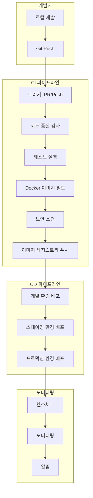

# base_server CI/CD 파이프라인 구축 가이드

## 📋 목차
1. [프로젝트 개요](#1-프로젝트-개요)
2. [현재 상태 분석](#2-현재-상태-분석)
3. [CI/CD 파이프라인 아키텍처](#3-cicd-파이프라인-아키텍처)
4. [구현 가이드](#4-구현-가이드)
5. [환경별 배포 전략](#5-환경별-배포-전략)
6. [모니터링 및 운영](#6-모니터링-및-운영)
7. [트러블슈팅](#7-트러블슈팅)
8. [구현 로드맵](#8-구현-로드맵)

---

## 1. 프로젝트 개요

### 프로젝트 구조
```
base_server/
├── application/base_web_server/    # FastAPI 메인 애플리케이션
├── service/                        # 핵심 서비스 레이어
│   ├── db/                        # MySQL 데이터베이스 서비스
│   ├── cache/                     # Redis 캐시 서비스
│   ├── storage/                   # AWS S3 스토리지
│   ├── search/                    # OpenSearch 서비스
│   ├── vectordb/                  # AWS Bedrock 벡터DB
│   ├── llm/                       # LLM 서비스
│   ├── external/                  # 외부 API 연동
│   └── queue/                     # 메시지 큐 서비스
├── template/                      # 비즈니스 로직 템플릿
│   ├── account/                   # 계정 관리
│   ├── portfolio/                 # 포트폴리오 관리
│   ├── market/                    # 시장 데이터
│   ├── autotrade/                 # 자동매매
│   └── chat/                      # AI 채팅
├── db_scripts/                    # 데이터베이스 스크립트
├── logs/                         # 로그 파일
├── requirements.txt              # Python 의존성 (프로젝트 루트)
└── frontend/ai-trading-platform/  # Next.js 프론트엔드 (개발 중)
```

### 기술 스택
- **Backend**: Python 3.11, FastAPI, uvicorn
- **Database**: MySQL (샤딩), Redis
- **Cloud Services**: AWS (S3, OpenSearch, Bedrock)
- **Frontend**: Next.js, TypeScript (개발 중)

---

## 2. 현재 상태 분석

### 현재 인프라 특징
- ✅ **Python 버전**: 3.11 사용
- ✅ **설정 파일 관리**: 각 환경별로 사전 배치 (Git 제외)
- ✅ **보안**: 민감한 정보가 코드에서 분리됨
- ❌ **Dockerfile**: 없음 (작성 필요)
- ❌ **CI/CD 파이프라인**: 미구축
- ⚠️ **프론트엔드**: package.json 없음 (개발 진행 중)

### 테스트 파일 현황
```
test_import.py              # 임포트 테스트
test_data_table.py         # 데이터 테이블 테스트
test_bedrock_connection.py # AWS Bedrock 연결 테스트
test_storage_fix.py        # 스토리지 테스트
service/test_services.py   # 서비스 레이어 테스트
```

---

## 3. CI/CD 파이프라인 아키텍처

### 전체 흐름도



### 환경별 설정 관리 전략

현재 방식 유지: **각 서버에 환경별 설정 파일 사전 배치**

```
# 각 환경 서버의 설정 파일 위치
/opt/base_server/config/
├── base_web_server-config.json       # 프로덕션용
├── base_web_server-config_local.json # 로컬 개발용
└── base_web_server-config_debug.json # 디버그용
```

---

## 4. 구현 가이드

### 4.1 Dockerfile 작성

#### Backend Dockerfile
```dockerfile
# base_server/Dockerfile
FROM python:3.11-slim as builder

# 시스템 의존성 설치
RUN apt-get update && apt-get install -y \
    gcc \
    g++ \
    curl \
    && rm -rf /var/lib/apt/lists/*

# 작업 디렉토리 설정
WORKDIR /app

# Python 의존성 설치 (requirements.txt가 base_server 폴더에 있음)
COPY requirements.txt .
RUN pip install --no-cache-dir --user -r requirements.txt

# 프로덕션 스테이지
FROM python:3.11-slim

# curl 설치 (헬스체크용)
RUN apt-get update && apt-get install -y \
    curl \
    && rm -rf /var/lib/apt/lists/*

# 비루트 사용자 생성
RUN groupadd -r appuser && useradd -r -g appuser appuser

# 빌더에서 패키지 복사
COPY --from=builder /root/.local /home/appuser/.local

# 애플리케이션 코드 복사
WORKDIR /app
COPY --chown=appuser:appuser . .

# 설정 파일을 위한 디렉토리 생성
RUN mkdir -p /app/config && chown -R appuser:appuser /app/config

# 환경 변수 설정
ENV PATH=/home/appuser/.local/bin:$PATH
ENV PYTHONPATH=/app

# 사용자 전환
USER appuser

# 포트 노출
EXPOSE 8000

# 헬스체크
HEALTHCHECK --interval=30s --timeout=10s --start-period=60s --retries=3 \
    CMD curl -f http://localhost:8000/api/admin/ping || exit 1

# 실행 명령 (설정 파일은 볼륨 마운트로 제공)
CMD ["uvicorn", "application.base_web_server.main:app", \
     "--host", "0.0.0.0", "--port", "8000", \
     "--workers", "4"]
```

### 4.2 GitHub Actions 워크플로우

#### CI 워크플로우
```yaml
# .github/workflows/ci.yml
name: CI Pipeline

on:
  push:
    branches: [ main, develop ]
  pull_request:
    branches: [ main ]

env:
  PYTHON_VERSION: '3.11'
  AWS_REGION: 'ap-northeast-2'

jobs:
  lint-and-test:
    runs-on: ubuntu-latest
    
    steps:
    - uses: actions/checkout@v3
    
    - name: Set up Python
      uses: actions/setup-python@v4
      with:
        python-version: ${{ env.PYTHON_VERSION }}
    
    - name: Cache pip packages
      uses: actions/cache@v3
      with:
        path: ~/.cache/pip
        key: ${{ runner.os }}-pip-${{ hashFiles('base_server/requirements.txt') }}
        restore-keys: |
          ${{ runner.os }}-pip-
    
    - name: Install dependencies
      run: |
        cd base_server
        python -m pip install --upgrade pip
        pip install -r requirements.txt
        pip install flake8 black bandit safety pytest pytest-asyncio pytest-cov
    
    - name: Lint with flake8
      run: |
        cd base_server
        flake8 . --count --select=E9,F63,F7,F82 --show-source --statistics
        flake8 . --count --max-complexity=10 --max-line-length=127 --statistics
    
    - name: Format check with black
      run: |
        cd base_server
        black --check --diff .
    
    - name: Security scan with bandit
      run: |
        cd base_server
        bandit -r application/ service/ template/ -f json -o bandit-report.json || true
    
    - name: Dependency security check
      run: |
        cd base_server
        safety check --json --output safety-report.json || true
    
    - name: Run tests
      run: |
        cd base_server
        # 테스트 환경 설정
        export APP_ENV=TEST
        export LOG_LEVEL=DEBUG
        
        # 테스트 실행
        pytest -v \
          test_import.py \
          test_data_table.py \
          service/test_services.py \
          --cov=application \
          --cov=service \
          --cov=template \
          --cov-report=xml \
          --cov-report=html
    
    - name: Upload coverage reports
      uses: codecov/codecov-action@v3
      with:
        file: ./base_server/coverage.xml
        flags: unittests
        name: codecov-umbrella
    
    - name: Upload artifacts
      uses: actions/upload-artifact@v3
      with:
        name: test-reports
        path: |
          base_server/bandit-report.json
          base_server/safety-report.json
          base_server/htmlcov/

  build-and-push:
    needs: lint-and-test
    runs-on: ubuntu-latest
    if: github.event_name == 'push'
    
    steps:
    - uses: actions/checkout@v3
    
    - name: Configure AWS credentials
      uses: aws-actions/configure-aws-credentials@v2
      with:
        aws-access-key-id: ${{ secrets.AWS_ACCESS_KEY_ID }}
        aws-secret-access-key: ${{ secrets.AWS_SECRET_ACCESS_KEY }}
        aws-region: ${{ env.AWS_REGION }}
    
    - name: Login to Amazon ECR
      id: login-ecr
      uses: aws-actions/amazon-ecr-login@v1
    
    - name: Build and push Docker image
      env:
        ECR_REGISTRY: ${{ steps.login-ecr.outputs.registry }}
        IMAGE_TAG: ${{ github.sha }}
      run: |
        cd base_server
        docker build -t $ECR_REGISTRY/base-server:$IMAGE_TAG .
        docker tag $ECR_REGISTRY/base-server:$IMAGE_TAG $ECR_REGISTRY/base-server:latest
        docker push $ECR_REGISTRY/base-server:$IMAGE_TAG
        docker push $ECR_REGISTRY/base-server:latest
    
    - name: Update deployment manifest
      run: |
        echo "IMAGE_TAG=${{ github.sha }}" >> $GITHUB_ENV
```

#### CD 워크플로우
```yaml
# .github/workflows/cd.yml
name: CD Pipeline

on:
  workflow_run:
    workflows: ["CI Pipeline"]
    types:
      - completed
    branches: [main]

jobs:
  deploy-staging:
    if: ${{ github.event.workflow_run.conclusion == 'success' }}
    runs-on: ubuntu-latest
    environment: staging
    
    steps:
    - name: Configure AWS credentials
      uses: aws-actions/configure-aws-credentials@v2
      with:
        aws-access-key-id: ${{ secrets.AWS_ACCESS_KEY_ID }}
        aws-secret-access-key: ${{ secrets.AWS_SECRET_ACCESS_KEY }}
        aws-region: ap-northeast-2
    
    - name: Deploy to ECS Staging
      run: |
        aws ecs update-service \
          --cluster base-server-staging \
          --service base-server-backend \
          --force-new-deployment
        
        # 배포 완료 대기
        aws ecs wait services-stable \
          --cluster base-server-staging \
          --services base-server-backend
    
    - name: Health check
      run: |
        sleep 30
        curl -f https://staging-api.baseserver.com/api/admin/ping || exit 1

  deploy-production:
    needs: deploy-staging
    runs-on: ubuntu-latest
    environment: production
    
    steps:
    - name: Configure AWS credentials
      uses: aws-actions/configure-aws-credentials@v2
      with:
        aws-access-key-id: ${{ secrets.AWS_ACCESS_KEY_ID }}
        aws-secret-access-key: ${{ secrets.AWS_SECRET_ACCESS_KEY }}
        aws-region: ap-northeast-2
    
    - name: Blue-Green Deployment to Production
      run: |
        # Blue-Green 배포 스크립트 실행
        ./scripts/blue-green-deploy.sh production
```

### 4.3 Docker Compose (로컬 개발)

```yaml
# docker-compose.yml
version: '3.8'

services:
  backend:
    build:
      context: ./base_server
      dockerfile: Dockerfile
    ports:
      - "8000:8000"
    environment:
      - APP_ENV=LOCAL
      - LOG_LEVEL=DEBUG
    volumes:
      # 코드 마운트 (개발 시 hot reload)
      - ./base_server:/app
      # 설정 파일 마운트
      - ./base_server/application/base_web_server/base_web_server-config_local.json:/app/config/config.json:ro
    depends_on:
      - mysql
      - redis
    command: uvicorn application.base_web_server.main:app --reload --host 0.0.0.0 --port 8000

  mysql:
    image: mysql:8.0
    environment:
      MYSQL_ROOT_PASSWORD: localpassword
      MYSQL_DATABASE: finance_global
    ports:
      - "3306:3306"
    volumes:
      - mysql_data:/var/lib/mysql
      - ./base_server/db_scripts:/docker-entrypoint-initdb.d:ro
    command: --character-set-server=utf8mb4 --collation-server=utf8mb4_unicode_ci

  redis:
    image: redis:7-alpine
    ports:
      - "6379:6379"
    volumes:
      - redis_data:/data

volumes:
  mysql_data:
  redis_data:
```

### 4.4 테스트 스크립트

```python
# scripts/run_tests.py
#!/usr/bin/env python
"""
base_server 테스트 실행 스크립트
Python 3.11 환경에서 실행
"""
import os
import sys
import subprocess

def run_tests():
    """모든 테스트 실행"""
    test_files = [
        "test_import.py",
        "test_data_table.py",
        "test_bedrock_connection.py",
        "test_storage_fix.py",
        "service/test_services.py"
    ]
    
    # pytest 명령 구성
    cmd = [
        "pytest", "-v",
        "--cov=application",
        "--cov=service",
        "--cov=template",
        "--cov-report=term-missing",
        "--cov-report=html",
        "--cov-report=xml"
    ] + test_files
    
    # 테스트 실행
    result = subprocess.run(cmd, cwd="base_server")
    return result.returncode

if __name__ == "__main__":
    sys.exit(run_tests())
```

---

## 5. 환경별 배포 전략

### 5.1 개발 환경 (Development)

```yaml
환경 특성:
  - Python: 3.11
  - 자동 배포: develop 브랜치 push 시
  - 인프라: 단일 EC2 인스턴스
  - 설정: base_web_server-config_debug.json
  - 특징: Hot reload 활성화, 디버그 로깅

배포 프로세스:
  1. GitHub Actions 트리거
  2. 테스트 실행
  3. Docker 이미지 빌드 (python:3.11-slim 베이스)
  4. EC2 인스턴스에 배포
  5. 헬스체크
```

### 5.2 스테이징 환경 (Staging)

```yaml
환경 특성:
  - Python: 3.11
  - 자동 배포: main 브랜치 merge 시
  - 인프라: ECS Fargate (2개 태스크)
  - 설정: base_web_server-config.json (프로덕션과 동일)
  - 특징: 프로덕션 미러링, 성능 테스트

배포 프로세스:
  1. CI 파이프라인 완료
  2. ECS 서비스 업데이트
  3. Rolling update (1개씩 교체)
  4. 헬스체크 및 smoke test
  5. 성능 테스트 실행
```

### 5.3 프로덕션 환경 (Production)

```yaml
환경 특성:
  - Python: 3.11
  - 수동 승인 배포: 릴리즈 태그 생성 시
  - 인프라: ECS Fargate (Auto Scaling 3-10 태스크)
  - 설정: base_web_server-config.json
  - 특징: Blue-Green 배포, 무중단 서비스

배포 프로세스:
  1. 수동 승인 요청
  2. Blue 환경에 새 버전 배포
  3. 트래픽 점진적 전환 (10% → 50% → 100%)
  4. Green 환경 모니터링
  5. 문제 발생 시 자동 롤백
```

---

## 6. 모니터링 및 운영

### 6.1 헬스체크 엔드포인트

```python
# application/base_web_server/routers/admin.py
@router.get("/api/admin/ping")
async def health_check():
    """헬스체크 엔드포인트"""
    return {
        "status": "healthy",
        "timestamp": datetime.utcnow().isoformat(),
        "version": os.getenv("APP_VERSION", "unknown"),
        "python_version": sys.version.split()[0]  # Python 3.11.x
    }

@router.get("/api/admin/health/detailed")
async def detailed_health_check(
    db: DatabaseService = Depends(get_db),
    cache: CacheService = Depends(get_cache)
):
    """상세 헬스체크"""
    health_status = {
        "status": "healthy",
        "timestamp": datetime.utcnow().isoformat(),
        "python_version": sys.version.split()[0],
        "services": {}
    }
    
    # 데이터베이스 체크
    try:
        await db.execute("SELECT 1")
        health_status["services"]["database"] = "healthy"
    except Exception as e:
        health_status["services"]["database"] = f"unhealthy: {str(e)}"
        health_status["status"] = "degraded"
    
    # Redis 체크
    try:
        await cache.ping()
        health_status["services"]["redis"] = "healthy"
    except Exception as e:
        health_status["services"]["redis"] = f"unhealthy: {str(e)}"
        health_status["status"] = "degraded"
    
    return health_status
```

### 6.2 CloudWatch 메트릭

```python
# monitoring/metrics.py
import boto3
from datetime import datetime

class MetricsCollector:
    def __init__(self):
        self.cloudwatch = boto3.client('cloudwatch', region_name='ap-northeast-2')
    
    def send_metric(self, metric_name: str, value: float, unit: str = 'Count'):
        """CloudWatch로 메트릭 전송"""
        self.cloudwatch.put_metric_data(
            Namespace='BaseServer',
            MetricData=[
                {
                    'MetricName': metric_name,
                    'Value': value,
                    'Unit': unit,
                    'Timestamp': datetime.utcnow()
                }
            ]
        )
    
    def track_request(self, endpoint: str, duration: float, status_code: int):
        """API 요청 추적"""
        # 요청 수
        self.send_metric(f'RequestCount_{endpoint}', 1)
        
        # 응답 시간
        self.send_metric(f'ResponseTime_{endpoint}', duration, 'Milliseconds')
        
        # 에러율
        if status_code >= 400:
            self.send_metric(f'ErrorCount_{endpoint}', 1)
```

### 6.3 알람 설정

```yaml
# cloudformation/alarms.yml
Resources:
  HighErrorRateAlarm:
    Type: AWS::CloudWatch::Alarm
    Properties:
      AlarmName: BaseServer-HighErrorRate
      MetricName: ErrorCount
      Namespace: BaseServer
      Statistic: Sum
      Period: 300
      EvaluationPeriods: 2
      Threshold: 10
      ComparisonOperator: GreaterThanThreshold
      AlarmActions:
        - !Ref SNSTopic

  HighResponseTimeAlarm:
    Type: AWS::CloudWatch::Alarm
    Properties:
      AlarmName: BaseServer-HighResponseTime
      MetricName: ResponseTime
      Namespace: BaseServer
      Statistic: Average
      Period: 300
      EvaluationPeriods: 2
      Threshold: 1000
      ComparisonOperator: GreaterThanThreshold
      AlarmActions:
        - !Ref SNSTopic
```

---

## 7. 트러블슈팅

### 7.1 자주 발생하는 문제

#### Python 3.11 관련 이슈
```bash
# Python 버전 확인
python --version  # Python 3.11.x

# 패키지 호환성 문제 해결
pip install --upgrade pip
pip install -r requirements.txt --no-cache-dir
```

#### Docker 빌드 실패
```bash
# 문제: pip 패키지 설치 실패
# 해결:
docker build --no-cache -t base-server .

# Python 3.11 이미지 확인
docker run python:3.11-slim python --version
```

#### 헬스체크 실패
```bash
# 컨테이너 내부에서 직접 확인
docker exec -it <container_id> /bin/bash
curl http://localhost:8000/api/admin/ping

# 로그 확인
docker logs <container_id>
```

#### 데이터베이스 연결 실패
```python
# 연결 테스트 스크립트 (Python 3.11)
import aiomysql
import asyncio

async def test_connection():
    try:
        conn = await aiomysql.connect(
            host='localhost',
            port=3306,
            user='root',
            password='password',
            db='finance_global'
        )
        async with conn.cursor() as cursor:
            await cursor.execute("SELECT 1")
            result = await cursor.fetchone()
            print(f"Connection successful: {result}")
        conn.close()
    except Exception as e:
        print(f"Connection failed: {e}")

asyncio.run(test_connection())
```

### 7.2 성능 최적화

#### Python 3.11 최적화 활용
```python
# Python 3.11의 성능 개선 활용
# 1. 더 빠른 CPython 인터프리터
# 2. 개선된 에러 메시지
# 3. 타입 힌트 성능 향상

# uvicorn 워커 설정
workers = (2 * cpu_count) + 1

# 프로덕션 실행 예시 (4코어 CPU)
uvicorn application.base_web_server.main:app \
    --host 0.0.0.0 \
    --port 8000 \
    --workers 9 \
    --loop uvloop \
    --access-log
```

#### 데이터베이스 연결 풀
```python
# 환경별 연결 풀 설정
POOL_SIZES = {
    "development": {"pool_size": 5, "max_overflow": 10},
    "staging": {"pool_size": 10, "max_overflow": 20},
    "production": {"pool_size": 20, "max_overflow": 50}
}
```

---

## 8. 구현 로드맵

### Phase 1: 기본 인프라 구축 (1주차)
- [ ] Python 3.11 기반 Dockerfile 작성 및 테스트
- [ ] Docker Compose 로컬 환경 구성
- [ ] GitHub Actions CI 파이프라인 구축
- [ ] AWS ECR 레지스트리 설정

### Phase 2: 배포 자동화 (2주차)
- [ ] ECS 클러스터 및 서비스 구성
- [ ] GitHub Actions CD 파이프라인 구축
- [ ] 개발/스테이징 환경 자동 배포
- [ ] 헬스체크 및 모니터링 구현

### Phase 3: 프로덕션 준비 (3주차)
- [ ] Blue-Green 배포 구현
- [ ] CloudWatch 메트릭 및 알람 설정
- [ ] 부하 테스트 및 성능 최적화
- [ ] 롤백 프로세스 구현

### Phase 4: 운영 고도화 (4주차)
- [ ] 로그 집계 시스템 구축
- [ ] APM(Application Performance Monitoring) 도입
- [ ] 자동 스케일링 정책 수립
- [ ] 재해 복구 계획 수립

---

## 📝 체크리스트

### 배포 전 체크리스트
- [ ] Python 3.11 환경 확인
- [ ] 모든 테스트 통과
- [ ] 보안 스캔 완료
- [ ] 설정 파일 확인
- [ ] 데이터베이스 마이그레이션 확인
- [ ] 롤백 계획 수립

### 배포 후 체크리스트
- [ ] 헬스체크 정상
- [ ] 주요 API 동작 확인
- [ ] 에러율 모니터링
- [ ] 성능 메트릭 확인
- [ ] 로그 수집 정상

---

## 📚 참고 자료

- [Python 3.11 새로운 기능](https://docs.python.org/3.11/whatsnew/3.11.html)
- [FastAPI 프로덕션 가이드](https://fastapi.tiangolo.com/deployment/)
- [Docker 베스트 프랙티스](https://docs.docker.com/develop/dev-best-practices/)
- [GitHub Actions 문서](https://docs.github.com/en/actions)
- [AWS ECS 가이드](https://docs.aws.amazon.com/ecs/)

---

작성일: 2024-01-19
작성자: DevOps Team
버전: 1.0.0