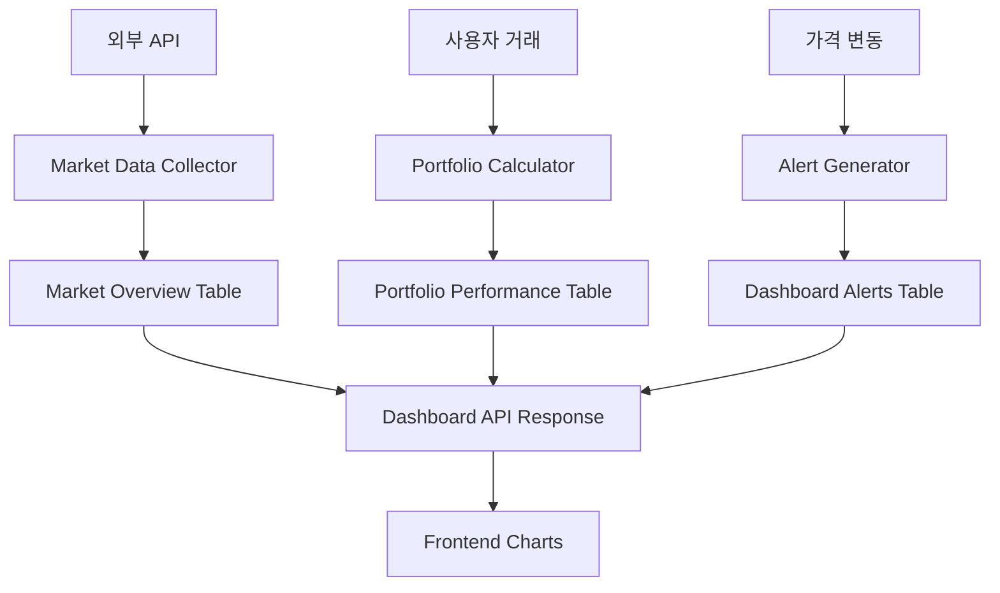

# Dashboard 데이터 채우기 구현 가이드

## 📋 목차
1. [개요](#개요)
2. [데이터 플로우 아키텍처](#데이터-플로우-아키텍처)
3. [단계별 구현 계획](#단계별-구현-계획)
4. [구현 상세 가이드](#구현-상세-가이드)
5. [테스트 및 검증](#테스트-및-검증)
6. [운영 및 모니터링](#운영-및-모니터링)

---

## 📖 개요

Dashboard Template의 차트 활성화는 완료되었으나, 실제 데이터를 채우기 위한 **데이터 수집**, **처리**, **업데이트** 시스템이 필요합니다.

### 🎯 목표
- **실시간 시장 데이터** 수집 및 업데이트
- **사용자 포트폴리오 성과** 자동 계산 및 기록
- **알림 시스템** 구축
- **데이터 일관성** 보장

### 📊 관련 테이블
- `table_market_overview`: 시장 개요 데이터
- `table_portfolio_performance`: 포트폴리오 성과 히스토리
- `table_dashboard_alerts`: 대시보드 알림
- `table_user_portfolios`: 사용자 보유 종목
- `table_user_accounts`: 사용자 계좌 정보

---

## 🏗️ 데이터 플로우 아키텍처



### 📈 데이터 흐름
1. **외부 API**: 실시간 주가 데이터 수집
2. **Portfolio Calculator**: 사용자 거래/가격 변동 시 포트폴리오 재계산
3. **Alert Generator**: 조건 충족 시 알림 생성
4. **Dashboard API**: 통합 데이터 제공

---

## 🚀 단계별 구현 계획

### **Phase 1: 기본 데이터 수집 시스템 (2-3일)**
- [x] DB 스키마 확인 및 프로시저 검증
- [ ] 외부 API 연동 서비스 구축
- [ ] 기본 시장 데이터 수집기 구현
- [ ] 초기 테스트 데이터 생성

### **Phase 2: 포트폴리오 계산 엔진 (2-3일)**
- [ ] 포트폴리오 가치 계산 로직
- [ ] 수익률 계산 알고리즘
- [ ] 일일 성과 기록 시스템
- [ ] 히스토리 데이터 생성

### **Phase 3: 실시간 업데이트 시스템 (3-4일)**
- [ ] 스케줄러 기반 자동 업데이트
- [ ] 웹소켓 실시간 데이터 전송
- [ ] 가격 변동 알림 시스템
- [ ] 사용자별 알림 설정

### **Phase 4: 최적화 및 운영 (1-2일)**
- [ ] 성능 최적화
- [ ] 에러 처리 및 로깅
- [ ] 모니터링 시스템
- [ ] 백업 및 복구 전략

---

## 🔧 구현 상세 가이드

### **1. 외부 API 연동 서비스**

#### 1.1 Market Data Service 구현
```python
# base_server/service/market/market_data_service.py
from typing import Dict, List, Optional
from service.service_container import ServiceContainer
from service.core.logger import Logger
import aiohttp
import asyncio

class MarketDataService:
    def __init__(self):
        self.api_config = {
            'korea_investment': {
                'base_url': 'https://openapi.koreainvestment.com:9443',
                'app_key': 'YOUR_APP_KEY',
                'app_secret': 'YOUR_APP_SECRET'
            }
        }
        self.session = None
    
    async def init(self):
        """서비스 초기화"""
        self.session = aiohttp.ClientSession()
        await self.authenticate()
    
    async def authenticate(self):
        """한국투자증권 API 인증"""
        try:
            url = f"{self.api_config['korea_investment']['base_url']}/oauth2/tokenP"
            headers = {
                'content-type': 'application/json; charset=utf-8'
            }
            data = {
                'grant_type': 'client_credentials',
                'appkey': self.api_config['korea_investment']['app_key'],
                'appsecret': self.api_config['korea_investment']['app_secret']
            }
            
            async with self.session.post(url, headers=headers, json=data) as response:
                result = await response.json()
                self.access_token = result.get('access_token')
                Logger.info("Market API authentication successful")
                
        except Exception as e:
            Logger.error(f"Market API authentication failed: {e}")
    
    async def get_stock_price(self, symbol: str) -> Optional[Dict]:
        """개별 종목 현재가 조회"""
        try:
            url = f"{self.api_config['korea_investment']['base_url']}/uapi/domestic-stock/v1/quotations/inquire-price"
            headers = {
                'authorization': f'Bearer {self.access_token}',
                'appkey': self.api_config['korea_investment']['app_key'],
                'appsecret': self.api_config['korea_investment']['app_secret'],
                'tr_id': 'FHKST01010100'
            }
            params = {
                'fid_cond_mrkt_div_code': 'J',
                'fid_input_iscd': symbol
            }
            
            async with self.session.get(url, headers=headers, params=params) as response:
                result = await response.json()
                
                if result.get('rt_cd') == '0':
                    output = result.get('output', {})
                    return {
                        'symbol': symbol,
                        'current_price': float(output.get('stck_prpr', 0)),
                        'change_amount': float(output.get('prdy_vrss', 0)),
                        'change_rate': float(output.get('prdy_ctrt', 0)),
                        'volume': int(output.get('acml_vol', 0)),
                        'name': output.get('hts_kor_isnm', symbol)
                    }
                
        except Exception as e:
            Logger.error(f"Failed to get stock price for {symbol}: {e}")
            
        return None
    
    async def get_market_indices(self) -> List[Dict]:
        """주요 지수 조회 (코스피, 코스닥 등)"""
        indices = ['KOSPI', 'KOSDAQ']
        results = []
        
        for index in indices:
            try:
                # 실제로는 지수 전용 API 호출
                # 여기서는 샘플 데이터로 대체
                results.append({
                    'symbol': index,
                    'name': index,
                    'current_price': 2650.0 if index == 'KOSPI' else 875.0,
                    'change_amount': 15.5 if index == 'KOSPI' else -3.2,
                    'change_rate': 0.59 if index == 'KOSPI' else -0.36,
                    'volume': 520000000 if index == 'KOSPI' else 320000000
                })
                
            except Exception as e:
                Logger.error(f"Failed to get market index {index}: {e}")
        
        return results
    
    async def update_market_overview_data(self):
        """시장 개요 데이터 업데이트"""
        try:
            db_service = ServiceContainer.get_database_service()
            
            # 1. 주요 지수 업데이트
            indices = await self.get_market_indices()
            for index_data in indices:
                for shard_id in [1, 2]:  # 모든 샤드에 업데이트
                    await db_service.execute_shard_query(
                        shard_id,
                        """
                        UPDATE table_market_overview 
                        SET current_price = %s, change_amount = %s, change_rate = %s, 
                            volume = %s, last_updated = NOW()
                        WHERE symbol = %s
                        """,
                        (index_data['current_price'], index_data['change_amount'], 
                         index_data['change_rate'], index_data['volume'], index_data['symbol'])
                    )
            
            # 2. 주요 종목 가격 업데이트
            major_stocks = ['005930', '051910', '035420', '035720', '000660']  # 삼성전자, LG화학, 네이버, 카카오, SK하이닉스
            
            for symbol in major_stocks:
                stock_data = await self.get_stock_price(symbol)
                if stock_data:
                    for shard_id in [1, 2]:
                        await db_service.execute_shard_query(
                            shard_id,
                            """
                            INSERT INTO table_market_overview 
                            (symbol, name, current_price, change_amount, change_rate, volume, last_updated)
                            VALUES (%s, %s, %s, %s, %s, %s, NOW())
                            ON DUPLICATE KEY UPDATE
                                current_price = VALUES(current_price),
                                change_amount = VALUES(change_amount),
                                change_rate = VALUES(change_rate),
                                volume = VALUES(volume),
                                last_updated = NOW()
                            """,
                            (stock_data['symbol'], stock_data['name'], stock_data['current_price'],
                             stock_data['change_amount'], stock_data['change_rate'], stock_data['volume'])
                        )
            
            Logger.info("Market overview data updated successfully")
            
        except Exception as e:
            Logger.error(f"Failed to update market overview data: {e}")
```

#### 1.2 Portfolio Calculator Service
```python
# base_server/service/portfolio/portfolio_calculator.py
from typing import Dict, List, Optional
from decimal import Decimal
from datetime import datetime, date
from service.service_container import ServiceContainer
from service.core.logger import Logger

class PortfolioCalculator:
    def __init__(self):
        self.db_service = ServiceContainer.get_database_service()
    
    async def calculate_portfolio_value(self, account_db_key: int, shard_id: int) -> Dict:
        """포트폴리오 전체 가치 계산"""
        try:
            # 1. 현금 잔고 조회
            cash_result = await self.db_service.call_shard_procedure(
                shard_id, "fp_get_account_info", (account_db_key,)
            )
            
            cash_balance = 0.0
            if cash_result and cash_result[0]:
                cash_balance = float(cash_result[0][0].get('balance', 0.0))
            
            # 2. 보유 종목 및 현재가 조회
            holdings_result = await self.db_service.execute_shard_query(
                shard_id,
                """
                SELECT 
                    up.asset_code as symbol,
                    up.quantity,
                    up.average_cost,
                    COALESCE(mo.current_price, up.average_cost) as current_price,
                    (up.quantity * COALESCE(mo.current_price, up.average_cost)) as market_value
                FROM table_user_portfolios up
                LEFT JOIN table_market_overview mo ON up.asset_code = mo.symbol
                WHERE up.account_db_key = %s AND up.quantity > 0
                """,
                (account_db_key,)
            )
            
            stock_value = 0.0
            total_cost = 0.0
            
            if holdings_result:
                for holding in holdings_result:
                    stock_value += float(holding['market_value'])
                    total_cost += float(holding['quantity']) * float(holding['average_cost'])
            
            # 3. 총 자산 및 수익률 계산
            total_assets = cash_balance + stock_value
            total_return = stock_value - total_cost
            return_rate = (total_return / total_cost * 100) if total_cost > 0 else 0.0
            
            return {
                'total_assets': total_assets,
                'cash_balance': cash_balance,
                'stock_value': stock_value,
                'invested_amount': total_cost,
                'total_return': total_return,
                'return_rate': return_rate
            }
            
        except Exception as e:
            Logger.error(f"Failed to calculate portfolio value: {e}")
            return {
                'total_assets': 0.0, 'cash_balance': 0.0, 'stock_value': 0.0,
                'invested_amount': 0.0, 'total_return': 0.0, 'return_rate': 0.0
            }
    
    async def record_daily_performance(self, account_db_key: int, shard_id: int, target_date: date = None):
        """일일 포트폴리오 성과 기록"""
        try:
            if target_date is None:
                target_date = date.today()
            
            # 포트폴리오 가치 계산
            portfolio_data = await self.calculate_portfolio_value(account_db_key, shard_id)
            
            # 성과 기록 저장
            await self.db_service.call_shard_procedure(
                shard_id,
                "fp_record_portfolio_performance",
                (
                    account_db_key,
                    target_date,
                    portfolio_data['total_assets'],
                    portfolio_data['cash_balance'],
                    portfolio_data['invested_amount']
                )
            )
            
            Logger.info(f"Daily performance recorded for account {account_db_key}")
            
        except Exception as e:
            Logger.error(f"Failed to record daily performance: {e}")
    
    async def update_portfolio_holdings_value(self, account_db_key: int, shard_id: int):
        """보유 종목의 현재 가치 업데이트"""
        try:
            # 보유 종목 목록 조회
            holdings = await self.db_service.execute_shard_query(
                shard_id,
                "SELECT asset_code, quantity FROM table_user_portfolios WHERE account_db_key = %s AND quantity > 0",
                (account_db_key,)
            )
            
            for holding in holdings:
                symbol = holding['asset_code']
                quantity = holding['quantity']
                
                # 현재가 조회
                price_result = await self.db_service.execute_shard_query(
                    shard_id,
                    "SELECT current_price FROM table_market_overview WHERE symbol = %s",
                    (symbol,)
                )
                
                if price_result:
                    current_price = float(price_result[0]['current_price'])
                    current_value = quantity * current_price
                    
                    # 포트폴리오 가치 업데이트
                    await self.db_service.execute_shard_query(
                        shard_id,
                        "UPDATE table_user_portfolios SET current_value = %s WHERE account_db_key = %s AND asset_code = %s",
                        (current_value, account_db_key, symbol)
                    )
            
        except Exception as e:
            Logger.error(f"Failed to update portfolio holdings value: {e}")
```

#### 1.3 Alert Generator Service
```python
# base_server/service/alert/alert_generator.py
from typing import Dict, List, Optional
from datetime import datetime
from service.service_container import ServiceContainer
from service.core.logger import Logger
import uuid

class AlertGenerator:
    def __init__(self):
        self.db_service = ServiceContainer.get_database_service()
    
    async def check_price_alerts(self):
        """가격 변동 알림 체크"""
        try:
            # 모든 샤드의 사용자 체크
            for shard_id in [1, 2]:
                # 보유 종목이 있는 사용자 조회
                users = await self.db_service.execute_shard_query(
                    shard_id,
                    """
                    SELECT DISTINCT account_db_key 
                    FROM table_user_portfolios 
                    WHERE quantity > 0
                    """
                )
                
                for user in users:
                    await self._check_user_price_alerts(user['account_db_key'], shard_id)
                    
        except Exception as e:
            Logger.error(f"Failed to check price alerts: {e}")
    
    async def _check_user_price_alerts(self, account_db_key: int, shard_id: int):
        """개별 사용자 가격 알림 체크"""
        try:
            # 사용자 보유 종목 조회
            holdings = await self.db_service.execute_shard_query(
                shard_id,
                """
                SELECT up.asset_code, up.quantity, up.average_cost,
                       mo.current_price, mo.change_rate, mo.name
                FROM table_user_portfolios up
                JOIN table_market_overview mo ON up.asset_code = mo.symbol
                WHERE up.account_db_key = %s AND up.quantity > 0
                """,
                (account_db_key,)
            )
            
            for holding in holdings:
                change_rate = float(holding['change_rate'])
                symbol = holding['asset_code']
                name = holding['name']
                
                # 큰 변동폭 알림 (±3% 이상)
                if abs(change_rate) >= 3.0:
                    direction = "상승" if change_rate > 0 else "하락"
                    severity = "WARNING" if abs(change_rate) >= 5.0 else "INFO"
                    
                    await self.create_alert(
                        account_db_key, shard_id,
                        alert_type="PRICE_CHANGE",
                        title=f"{name} {change_rate:+.1f}% {direction}",
                        message=f"{name}이(가) 전일 대비 {change_rate:+.1f}% {direction}했습니다.",
                        severity=severity,
                        symbol=symbol
                    )
                
                # 수익률 목표 달성 알림
                current_price = float(holding['current_price'])
                avg_cost = float(holding['average_cost'])
                return_rate = ((current_price - avg_cost) / avg_cost * 100) if avg_cost > 0 else 0
                
                if return_rate >= 20.0:  # 20% 수익률 달성
                    await self.create_alert(
                        account_db_key, shard_id,
                        alert_type="TARGET_REACHED",
                        title=f"{name} 수익률 목표 달성!",
                        message=f"{name}에서 {return_rate:.1f}% 수익을 달성했습니다!",
                        severity="WARNING",
                        symbol=symbol
                    )
                    
        except Exception as e:
            Logger.error(f"Failed to check user price alerts: {e}")
    
    async def check_portfolio_alerts(self, account_db_key: int, shard_id: int):
        """포트폴리오 전체 알림 체크"""
        try:
            # 최근 성과 조회
            performance = await self.db_service.execute_shard_query(
                shard_id,
                """
                SELECT return_rate, total_return
                FROM table_portfolio_performance 
                WHERE account_db_key = %s 
                ORDER BY date DESC 
                LIMIT 1
                """,
                (account_db_key,)
            )
            
            if performance:
                return_rate = float(performance[0]['return_rate'])
                total_return = float(performance[0]['total_return'])
                
                # 월간 목표 수익률 달성 (20%)
                if return_rate >= 20.0:
                    await self.create_alert(
                        account_db_key, shard_id,
                        alert_type="PORTFOLIO_ALERT",
                        title="포트폴리오 목표 달성!",
                        message=f"월간 수익률 목표 20%를 달성했습니다! 현재 수익률: {return_rate:.1f}%",
                        severity="WARNING"
                    )
                
                # 손실 주의 알림 (-10% 이하)
                elif return_rate <= -10.0:
                    await self.create_alert(
                        account_db_key, shard_id,
                        alert_type="PORTFOLIO_ALERT",
                        title="포트폴리오 손실 주의",
                        message=f"포트폴리오 손실이 {abs(return_rate):.1f}%에 도달했습니다. 리밸런싱을 고려해보세요.",
                        severity="CRITICAL"
                    )
                    
        except Exception as e:
            Logger.error(f"Failed to check portfolio alerts: {e}")
    
    async def create_alert(self, account_db_key: int, shard_id: int, 
                          alert_type: str, title: str, message: str, 
                          severity: str = "INFO", symbol: str = None):
        """알림 생성"""
        try:
            alert_id = f"alert_{uuid.uuid4().hex[:8]}"
            
            await self.db_service.call_shard_procedure(
                shard_id,
                "fp_create_dashboard_alert",
                (account_db_key, alert_type, title, message, severity, symbol, None)
            )
            
            Logger.info(f"Alert created: {alert_id} for account {account_db_key}")
            
        except Exception as e:
            Logger.error(f"Failed to create alert: {e}")
```

### **2. 스케줄러 시스템**

#### 2.1 Portfolio Scheduler
```python
# base_server/service/scheduler/portfolio_scheduler.py
from service.scheduler.base_scheduler import BaseScheduler
from service.market.market_data_service import MarketDataService
from service.portfolio.portfolio_calculator import PortfolioCalculator
from service.alert.alert_generator import AlertGenerator
from service.service_container import ServiceContainer
from service.core.logger import Logger
from datetime import datetime, date
import asyncio

class PortfolioScheduler(BaseScheduler):
    def __init__(self):
        super().__init__()
        self.market_service = MarketDataService()
        self.portfolio_calculator = PortfolioCalculator()
        self.alert_generator = AlertGenerator()
    
    async def init(self):
        """스케줄러 초기화"""
        await self.market_service.init()
        
        # 스케줄 등록
        self.register_job("market_data_update", self.update_market_data, interval=300)  # 5분마다
        self.register_job("portfolio_performance", self.update_portfolio_performance, interval=3600)  # 1시간마다
        self.register_job("price_alerts", self.check_price_alerts, interval=60)  # 1분마다
        self.register_job("daily_summary", self.daily_portfolio_summary, cron="0 0 * * *")  # 매일 자정
    
    async def update_market_data(self):
        """시장 데이터 업데이트 작업"""
        try:
            Logger.info("Starting market data update...")
            await self.market_service.update_market_overview_data()
            Logger.info("Market data update completed")
            
        except Exception as e:
            Logger.error(f"Market data update failed: {e}")
    
    async def update_portfolio_performance(self):
        """포트폴리오 성과 업데이트 작업"""
        try:
            Logger.info("Starting portfolio performance update...")
            
            # 모든 샤드의 활성 사용자 조회
            db_service = ServiceContainer.get_database_service()
            
            for shard_id in [1, 2]:
                users = await db_service.execute_shard_query(
                    shard_id,
                    "SELECT DISTINCT account_db_key FROM table_user_portfolios WHERE quantity > 0"
                )
                
                for user in users:
                    account_db_key = user['account_db_key']
                    
                    # 포트폴리오 보유 종목 가치 업데이트
                    await self.portfolio_calculator.update_portfolio_holdings_value(account_db_key, shard_id)
                    
                    # 포트폴리오 알림 체크
                    await self.alert_generator.check_portfolio_alerts(account_db_key, shard_id)
            
            Logger.info("Portfolio performance update completed")
            
        except Exception as e:
            Logger.error(f"Portfolio performance update failed: {e}")
    
    async def check_price_alerts(self):
        """가격 알림 체크 작업"""
        try:
            await self.alert_generator.check_price_alerts()
            
        except Exception as e:
            Logger.error(f"Price alerts check failed: {e}")
    
    async def daily_portfolio_summary(self):
        """일일 포트폴리오 요약 작업"""
        try:
            Logger.info("Starting daily portfolio summary...")
            
            db_service = ServiceContainer.get_database_service()
            today = date.today()
            
            for shard_id in [1, 2]:
                users = await db_service.execute_shard_query(
                    shard_id,
                    "SELECT DISTINCT account_db_key FROM table_user_portfolios WHERE quantity > 0"
                )
                
                for user in users:
                    account_db_key = user['account_db_key']
                    
                    # 일일 성과 기록
                    await self.portfolio_calculator.record_daily_performance(account_db_key, shard_id, today)
            
            Logger.info("Daily portfolio summary completed")
            
        except Exception as e:
            Logger.error(f"Daily portfolio summary failed: {e}")
```

### **3. 서비스 통합**

#### 3.1 Service Container 확장
```python
# base_server/service/service_container.py 에 추가
from service.market.market_data_service import MarketDataService
from service.portfolio.portfolio_calculator import PortfolioCalculator
from service.alert.alert_generator import AlertGenerator
from service.scheduler.portfolio_scheduler import PortfolioScheduler

class ServiceContainer:
    # 기존 코드...
    
    @classmethod
    def get_market_data_service(cls) -> MarketDataService:
        if not hasattr(cls, '_market_data_service'):
            cls._market_data_service = MarketDataService()
        return cls._market_data_service
    
    @classmethod
    def get_portfolio_calculator(cls) -> PortfolioCalculator:
        if not hasattr(cls, '_portfolio_calculator'):
            cls._portfolio_calculator = PortfolioCalculator()
        return cls._portfolio_calculator
    
    @classmethod
    def get_alert_generator(cls) -> AlertGenerator:
        if not hasattr(cls, '_alert_generator'):
            cls._alert_generator = AlertGenerator()
        return cls._alert_generator
    
    @classmethod
    def get_portfolio_scheduler(cls) -> PortfolioScheduler:
        if not hasattr(cls, '_portfolio_scheduler'):
            cls._portfolio_scheduler = PortfolioScheduler()
        return cls._portfolio_scheduler
```

#### 3.2 서버 시작 시 초기화
```python
# base_server/application/base_web_server/main.py 에 추가
from service.service_container import ServiceContainer

async def startup_event():
    """서버 시작 시 실행"""
    try:
        # 기존 초기화...
        
        # 마켓 데이터 서비스 초기화
        market_service = ServiceContainer.get_market_data_service()
        await market_service.init()
        
        # 스케줄러 시작
        scheduler = ServiceContainer.get_portfolio_scheduler()
        await scheduler.init()
        await scheduler.start()
        
        Logger.info("All portfolio services initialized")
        
    except Exception as e:
        Logger.error(f"Failed to initialize portfolio services: {e}")

# FastAPI 앱에 이벤트 핸들러 등록
app.add_event_handler("startup", startup_event)
```

---

## 🧪 테스트 및 검증

### **1. 단위 테스트**
```python
# tests/test_portfolio_calculator.py
import pytest
from service.portfolio.portfolio_calculator import PortfolioCalculator

class TestPortfolioCalculator:
    @pytest.fixture
    async def calculator(self):
        return PortfolioCalculator()
    
    async def test_calculate_portfolio_value(self, calculator):
        # 테스트 데이터로 포트폴리오 가치 계산 테스트
        result = await calculator.calculate_portfolio_value(1001, 1)
        
        assert result['total_assets'] > 0
        assert result['return_rate'] is not None
```

### **2. 통합 테스트**
```python
# tests/test_dashboard_integration.py
async def test_dashboard_data_flow():
    # 1. 시장 데이터 업데이트
    market_service = ServiceContainer.get_market_data_service()
    await market_service.update_market_overview_data()
    
    # 2. 포트폴리오 계산
    calculator = ServiceContainer.get_portfolio_calculator()
    result = await calculator.calculate_portfolio_value(1001, 1)
    
    # 3. Dashboard API 호출
    # 실제 Dashboard Template API 테스트
    
    assert result is not None
```

### **3. 성능 테스트**
```python
# tests/test_performance.py
async def test_market_data_update_performance():
    start_time = time.time()
    
    market_service = ServiceContainer.get_market_data_service()
    await market_service.update_market_overview_data()
    
    end_time = time.time()
    duration = end_time - start_time
    
    # 5초 이내 완료 확인
    assert duration < 5.0
```

---

## 📊 운영 및 모니터링

### **1. 로깅 및 모니터링**
```python
# 각 서비스에 상세 로깅 추가
Logger.info(f"Market data updated: {len(updated_symbols)} symbols")
Logger.info(f"Portfolio calculated for {account_db_key}: {total_value}")
Logger.warning(f"Price alert triggered: {symbol} changed {change_rate}%")
Logger.error(f"API call failed: {error_message}")
```

### **2. 헬스체크 엔드포인트**
```python
# base_server/application/base_web_server/routers/health.py
@router.get("/health/portfolio")
async def portfolio_health_check():
    """포트폴리오 서비스 헬스체크"""
    try:
        # 마켓 데이터 서비스 상태 확인
        market_service = ServiceContainer.get_market_data_service()
        
        # 최근 업데이트 시간 확인
        # DB 연결 상태 확인
        
        return {"status": "healthy", "timestamp": datetime.now()}
        
    except Exception as e:
        return {"status": "unhealthy", "error": str(e)}
```

### **3. 알림 및 오류 처리**
```python
# 크리티컬 오류 시 관리자 알림
async def send_admin_alert(error_type: str, message: str):
    """관리자 알림 발송"""
    # 이메일/슬랙 등으로 관리자에게 알림
    pass

# 서비스별 오류 복구 로직
async def retry_with_backoff(func, max_retries=3):
    """재시도 로직"""
    for attempt in range(max_retries):
        try:
            return await func()
        except Exception as e:
            if attempt == max_retries - 1:
                raise
            await asyncio.sleep(2 ** attempt)  # 지수 백오프
```

---

## ✅ 구현 체크리스트

### **Phase 1: 기본 데이터 수집**
- [ ] MarketDataService 구현
- [ ] 한국투자증권 API 연동
- [ ] 기본 시장 데이터 수집 확인
- [ ] 데이터베이스 업데이트 로직 테스트

### **Phase 2: 포트폴리오 계산**
- [ ] PortfolioCalculator 구현
- [ ] 포트폴리오 가치 계산 로직
- [ ] 수익률 계산 알고리즘
- [ ] 일일 성과 기록 시스템

### **Phase 3: 실시간 업데이트**
- [ ] PortfolioScheduler 구현
- [ ] 스케줄 작업 등록 및 실행
- [ ] AlertGenerator 구현
- [ ] 실시간 알림 시스템

### **Phase 4: 통합 및 테스트**
- [ ] ServiceContainer 통합
- [ ] 서버 시작 시 초기화
- [ ] 단위 테스트 작성
- [ ] 통합 테스트 실행
- [ ] 성능 테스트 및 최적화

### **Phase 5: 운영 준비**
- [ ] 로깅 시스템 완비
- [ ] 헬스체크 엔드포인트
- [ ] 에러 처리 및 복구 로직
- [ ] 모니터링 대시보드

---

## 🎯 예상 결과

구현 완료 후 Dashboard는 다음과 같이 동작합니다:

1. **실시간 차트 데이터**: 사용자의 포트폴리오 가치 변화를 실시간으로 표시
2. **자동 알림 시스템**: 가격 변동, 목표 달성 등 자동 알림 생성
3. **정확한 성과 분석**: 실제 거래 데이터 기반의 정확한 수익률 계산
4. **안정적인 운영**: 오류 처리, 재시도, 모니터링 시스템 완비

이 가이드에 따라 단계별로 구현하면 완전히 동작하는 Dashboard 데이터 시스템을 구축할 수 있습니다.