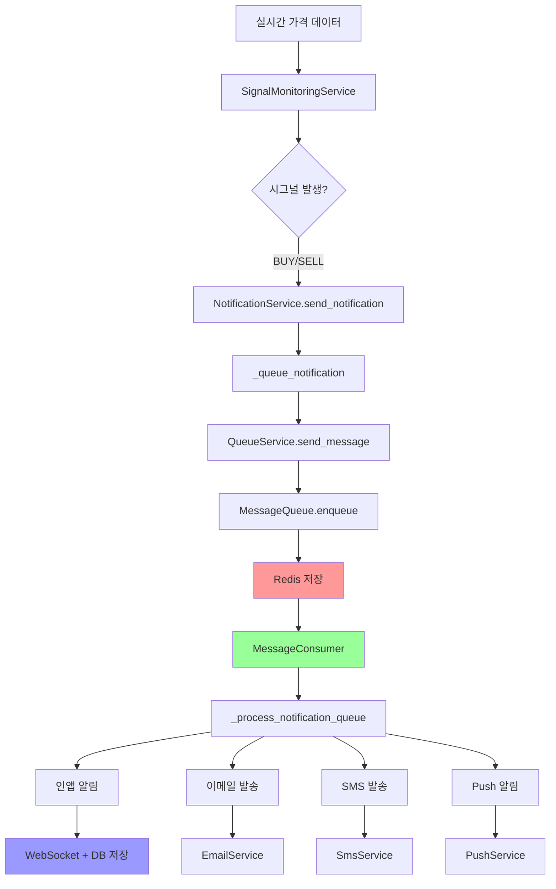

# Redis 메시지 큐 기반 알람 처리 시스템 구현 가이드

## 📋 목차
1. [시스템 개요](#1-시스템-개요)
2. [아키텍처 다이어그램](#2-아키텍처-다이어그램)
3. [Step 1: 시그널 발생 및 알림 요청](#3-step-1-시그널-발생-및-알림-요청)
4. [Step 2: NotificationService 큐 발행](#4-step-2-notificationservice-큐-발행)
5. [Step 3: QueueService 메시지 전송](#5-step-3-queueservice-메시지-전송)
6. [Step 4: Redis 메시지 큐 저장](#6-step-4-redis-메시지-큐-저장)
7. [Step 5: 메시지 Consumer 처리](#7-step-5-메시지-consumer-처리)
8. [Step 6: 채널별 알림 발송](#8-step-6-채널별-알림-발송)
9. [Step 7: 재시도 및 에러 처리](#9-step-7-재시도-및-에러-처리)
10. [Redis 데이터 구조](#10-redis-데이터-구조)
11. [성능 최적화](#11-성능-최적화)
12. [모니터링 및 로깅](#12-모니터링-및-로깅)

---

## 1. 시스템 개요

### 🎯 실제 구현된 알람 시스템
- **메시지 큐 패턴**: Redis 기반 직접 메시지 큐 (Outbox 패턴 미사용)
- **채널별 큐잉**: 인앱/이메일/SMS/Push 각각 개별 메시지로 큐에 저장
- **우선순위 처리**: HIGH/NORMAL 우선순위에 따른 처리 순서
- **비동기 Consumer**: 지속적인 큐 모니터링 및 메시지 처리
- **재시도 메커니즘**: ACK/NACK 패턴으로 안정성 보장

### 🏗️ 핵심 컴포넌트
```
SignalMonitoringService → NotificationService → QueueService → Redis → MessageConsumer
```

---

## 2. 아키텍처 다이어그램



---

## 3. Step 1: 시그널 발생 및 알림 요청

### 📍 위치: `signal_monitoring_service.py:1292`

```python
async def _send_signal_notification(cls, account_db_key: int, shard_id: int, symbol: str, 
                                   signal_type: str, price: float, band_data: Dict, confidence: float = 0.7):
    """NotificationService 큐를 통한 시그널 알림 전송"""
    try:
        # 1-1. 사용자 알림 설정 조회
        database_service = ServiceContainer.get_database_service()
        settings_result = await database_service.call_global_procedure(
            "fp_get_user_notification_settings",
            (account_db_key,)
        )
        
        # 1-2. 사용자 설정 파싱
        if not settings_result or len(settings_result) < 2:
            Logger.warn(f"사용자 알림 설정 조회 실패, 기본값 사용: account_db_key={account_db_key}")
            user_settings = {
                'email_notifications_enabled': 0,
                'sms_notifications_enabled': 0,
                'push_notifications_enabled': 0,
                'trade_alert_enabled': 0
            }
        else:
            settings_data = settings_result[1]
            user_settings = {
                'email_notifications_enabled': int(settings_data.get('email_notifications_enabled', 0)),
                'sms_notifications_enabled': int(settings_data.get('sms_notifications_enabled', 0)),
                'push_notifications_enabled': int(settings_data.get('push_notifications_enabled', 0)),
                'trade_alert_enabled': int(settings_data.get('trade_alert_enabled', 0))
            }
        
        # 1-3. 거래 알림 비활성화 체크
        if not user_settings['trade_alert_enabled']:
            Logger.info(f"거래 알림 비활성화됨, 전송 건너뜀: user={account_db_key}, {symbol} {signal_type}")
            return
        
        # 1-4. 시그널 타입별 메시지 생성
        if signal_type == "BUY":
            title = f"📈 {symbol} 매수 시그널"
            message = f"{symbol} 종목에서 매수 신호가 발생했습니다. 현재가: ${price:.2f}"
        else:  # SELL
            title = f"📉 {symbol} 매도 시그널"
            message = f"{symbol} 종목에서 매도 신호가 발생했습니다. 현재가: ${price:.2f}"
        
        # 1-5. 알림 데이터 구성
        notification_data = {
            'symbol': symbol,
            'signal_type': signal_type,
            'price': price,
            'confidence': confidence,
            'bollinger': {
                'upper': band_data['upper_band'],
                'middle': band_data['avg_price'],
                'lower': band_data['lower_band']
            },
            'timestamp': datetime.now().isoformat()
        }
        
        # 1-6. 우선순위 결정 (신뢰도 기반)
        if confidence >= 0.8:
            priority = 2  # HIGH
        elif confidence >= 0.6:
            priority = 3  # NORMAL  
        else:
            priority = 4  # LOW
        
        # 1-7. 사용자 설정에 따른 채널 결정
        channels = [NotificationChannel.IN_APP]  # 인앱 알림은 항상 포함
        
        if user_settings['email_notifications_enabled']:
            channels.append(NotificationChannel.EMAIL)
        if user_settings['sms_notifications_enabled']:
            channels.append(NotificationChannel.SMS)  
        if user_settings['push_notifications_enabled']:
            channels.append(NotificationChannel.PUSH)
        
        # 1-8. NotificationService 호출
        success = await NotificationService.send_notification(
            user_id=str(account_db_key),
            shard_id=shard_id,
            notification_type=NotificationType.PREDICTION_ALERT,
            title=title,
            message=message,
            data=notification_data,
            priority=priority,
            channels=channels
        )
        
        if success:
            channel_names = [ch.value for ch in channels]
            Logger.info(f"📢 시그널 알림 큐 발송 성공: user={account_db_key}, {symbol} {signal_type}, 채널={channel_names}")
        else:
            Logger.error(f"시그널 알림 큐 발송 실패: user={account_db_key}, {symbol} {signal_type}")
            
    except Exception as e:
        Logger.error(f"시그널 알림 전송 실패: {e}")
```

---

## 4. Step 2: NotificationService 큐 발행

### 📍 위치: `notification_service.py:150`

```python
@classmethod
async def send_notification(cls, user_id: str, shard_id: int, notification_type: NotificationType,
                          title: str, message: str, data: Dict[str, Any], 
                          priority: int = 3, channels: List[NotificationChannel] = None) -> bool:
    """
    알림 발송 (큐 방식)
    """
    if not cls._initialized:
        Logger.error("NotificationService not initialized")
        return False
    
    try:
        # 2-1. 알림 객체 생성
        import uuid
        notification = Notification(
            id=str(uuid.uuid4()),
            user_id=user_id,
            shard_id=shard_id,
            type=notification_type,
            title=title,
            message=message,
            data=data,
            priority=priority,
            created_at=datetime.utcnow()
        )
        
        # 2-2. 중복 체크 (Redis 기반)
        if await cls._is_duplicate(notification):
            Logger.info(f"중복 알림 건너뜀: {notification.id}")
            return True
        
        # 2-3. Rate limit 체크 (사용자별)
        if not await cls._check_rate_limit(user_id):
            Logger.warn(f"Rate limit 초과: user={user_id}")
            return False
        
        # 2-4. 활성화된 채널만 필터링
        target_channels = []
        for channel in NotificationChannel:
            if cls._config.enabled_channels.get(channel.value, False):
                target_channels.append(channel)
        
        # 2-5. 큐에 알림 추가
        await cls._queue_notification(notification, target_channels)
        
        # 2-6. 이벤트 발행 (통계용)
        if QueueService._initialized:
            await QueueService.get_instance().publish_event(
                EventType.NOTIFICATION_CREATED,
                "notification_service",
                notification.to_dict()
            )
        
        return True
        
    except Exception as e:
        Logger.error(f"알림 발송 실패: {e}")
        return False

@classmethod
async def _is_duplicate(cls, notification: Notification) -> bool:
    """중복 알림 체크 (Redis 기반)"""
    try:
        if not CacheService.is_initialized():
            return False
        
        # 중복 체크 키: user_id:type:data_hash
        import hashlib
        data_str = json.dumps(notification.data, sort_keys=True)
        data_hash = hashlib.md5(data_str.encode()).hexdigest()[:8]
        
        dedup_key = f"notif:dedup:{notification.user_id}:{notification.type.value}:{data_hash}"
        
        async with CacheService.get_client() as client:
            exists = await client.exists(dedup_key)
            if exists:
                return True
            
            # 키가 없으면 설정 (24시간 TTL)
            ttl = cls._config.dedup_window_hours * 3600
            await client.setex(dedup_key, ttl, "1")
            
        return False
        
    except Exception as e:
        Logger.error(f"중복 체크 실패: {e}")
        return False

@classmethod
async def _check_rate_limit(cls, user_id: str) -> bool:
    """Rate limiting 체크 (사용자별 1분당 최대 10개)"""
    try:
        if not CacheService.is_initialized():
            return True
        
        rate_key = f"notif:rate:{user_id}"
        max_per_minute = 10
        
        async with CacheService.get_client() as client:
            current = await client.get(rate_key)
            if current and int(current) >= max_per_minute:
                return False
            
            # 카운터 증가
            await client.incr(rate_key)
            await client.expire(rate_key, 60)  # 1분 TTL
            
        return True
        
    except Exception as e:
        Logger.error(f"Rate limit 체크 실패: {e}")
        return True
```

---

## 5. Step 3: QueueService 메시지 전송

### 📍 위치: `notification_service.py:281`

```python
@classmethod
async def _queue_notification(cls, notification: Notification, channels: List[NotificationChannel]):
    """
    알림을 큐에 추가 - 채널별 개별 메시지 생성
    """
    if not QueueService._initialized:
        # 큐 서비스가 초기화되지 않은 경우 직접 발송
        await cls._send_notification_direct(notification, channels)
        return
    
    queue_service = QueueService.get_instance()
    
    # 3-1. 채널별로 개별 메시지 생성 및 큐 추가
    for channel in channels:
        message_payload = {
            "notification": notification.to_dict(),
            "channel": channel.value,  # "inapp", "email", "sms", "push"
            "account_db_key": int(notification.user_id),
            "shard_id": notification.shard_id,
            "processing_metadata": {
                "queued_at": datetime.now().isoformat(),
                "retry_count": 0,
                "max_retries": 3
            }
        }
        
        # 3-2. 우선순위 결정
        from service.queue.message_queue import MessagePriority
        if notification.priority <= 2:
            priority = MessagePriority.HIGH
        elif notification.priority == 3:
            priority = MessagePriority.NORMAL
        else:
            priority = MessagePriority.LOW
        
        # 3-3. QueueService로 메시지 전송
        success = await queue_service.send_message(
            queue_name="notification_queue",
            payload=message_payload,
            message_type=f"notification_{channel.value}",  # "notification_inapp"
            priority=priority,
            partition_key=notification.user_id  # 사용자별 순서 보장
        )
        
        if success:
            Logger.info(f"✅ 큐 추가 성공: {channel.value}, user={notification.user_id}")
        else:
            Logger.error(f"❌ 큐 추가 실패: {channel.value}, user={notification.user_id}")
```

### 📍 위치: `queue_service.py:245`

```python
async def send_message(self, queue_name: str, payload: Dict[str, Any], 
                      message_type: str, priority: MessagePriority = MessagePriority.NORMAL,
                      scheduled_at: Optional[datetime] = None,
                      partition_key: Optional[str] = None) -> bool:
    """메시지 큐에 전송"""
    try:
        # 4-1. QueueMessage 객체 생성
        message = QueueMessage(
            id=None,  # Redis에서 자동 생성
            queue_name=queue_name,
            payload=payload,
            message_type=message_type,
            priority=priority,
            scheduled_at=scheduled_at,
            partition_key=partition_key,
            created_at=datetime.now()
        )
        
        # 4-2. MessageQueue의 enqueue 호출
        success = await self.message_queue_manager.message_queue.enqueue(message)
        
        if success:
            self.stats["messages_processed"] += 1
            Logger.info(f"메시지 큐 전송 완료: {queue_name} ({message_type})")
        else:
            Logger.error(f"메시지 큐 전송 실패: {queue_name} ({message_type})")
        
        return success
        
    except Exception as e:
        Logger.error(f"메시지 전송 실패: {queue_name} - {e}")
        self.stats["errors"] += 1
        return False
```

---

## 6. Step 4: Redis 메시지 큐 저장

### 📍 위치: `message_queue.py:155` (RedisCacheMessageQueue)

```python
async def enqueue(self, message: QueueMessage) -> bool:
    """Redis에 메시지 저장"""
    try:
        async with self.cache_service.get_client() as client:
            # 5-1. 메시지 ID 생성
            if not message.id:
                message.id = str(uuid.uuid4())
            
            # 5-2. 메시지 상태 설정
            message.status = MessageStatus.PENDING
            message.created_at = datetime.now()
            
            # 5-3. 메시지 데이터 직렬화
            message_data = {
                "id": message.id,
                "queue_name": message.queue_name,
                "payload": json.dumps(message.payload),
                "message_type": message.message_type,
                "priority": message.priority.value,
                "status": message.status.value,
                "retry_count": message.retry_count,
                "max_retries": message.max_retries,
                "created_at": message.created_at.isoformat(),
                "partition_key": message.partition_key or ""
            }
            
            # 5-4. Redis에 메시지 저장
            message_key = self.message_key_pattern.format(message_id=message.id)
            await client.hmset(message_key, message_data)
            await client.expire(message_key, 86400)  # 24시간 TTL
            
            # 5-5. 우선순위 큐에 메시지 ID 추가
            priority_queue_key = self.priority_queue_pattern.format(
                queue_name=message.queue_name,
                priority=message.priority.name  # "HIGH", "NORMAL", "LOW"
            )
            await client.rpush(priority_queue_key, message.id)
            
            # 5-6. 지연 실행 메시지 처리
            if message.scheduled_at and message.scheduled_at > datetime.now():
                delayed_score = message.scheduled_at.timestamp()
                await client.zadd(self.delayed_key_pattern, {message.id: delayed_score})
            
            Logger.debug(f"Redis 큐 저장 완료: {message.id} ({message.message_type})")
            return True
            
    except Exception as e:
        Logger.error(f"Redis 큐 저장 실패: {e}")
        return False
```

### Redis 데이터 구조 예시
```redis
# 메시지 데이터
HMSET mq:message:12345-67890 {
  "id": "12345-67890",
  "queue_name": "notification_queue",
  "payload": "{\"notification\": {...}, \"channel\": \"inapp\"}",
  "message_type": "notification_inapp",
  "priority": 3,
  "status": "pending",
  "created_at": "2024-12-13T10:30:00"
}

# 우선순위 큐 (LIST)
RPUSH mq:priority:notification_queue:HIGH "12345-67890"
RPUSH mq:priority:notification_queue:NORMAL "23456-78901"
```

---

## 7. Step 5: 메시지 Consumer 처리

### 📍 위치: `message_queue.py:300` (MessageConsumer)

```python
class MessageConsumer:
    """Redis 큐 메시지 소비자"""
    
    def __init__(self, queue_name: str, consumer_id: str, handler: Callable, message_queue: RedisCacheMessageQueue):
        self.queue_name = queue_name
        self.consumer_id = consumer_id
        self.handler = handler  # NotificationService._process_notification_queue
        self.message_queue = message_queue
        self.running = False
        self.stats = {"processed": 0, "failed": 0}
    
    async def start(self):
        """컨슈머 시작 - 지속적인 큐 모니터링"""
        self.running = True
        Logger.info(f"메시지 컨슈머 시작: {self.queue_name}:{self.consumer_id}")
        
        while self.running:
            try:
                # 6-1. Redis에서 메시지 dequeue (우선순위 순서)
                message = await self.message_queue.dequeue(self.queue_name, self.consumer_id)
                
                if message:
                    Logger.info(f"메시지 처리 시작: {message.id} ({message.message_type})")
                    
                    # 6-2. 핸들러 호출 (NotificationService._process_notification_queue)
                    try:
                        success = await asyncio.wait_for(self.handler(message), timeout=30.0)
                        
                        if success:
                            # 6-3. 처리 성공 - ACK
                            await self.message_queue.ack(message.id, self.consumer_id)
                            self.stats["processed"] += 1
                            Logger.info(f"✅ 메시지 처리 완료: {message.id}")
                        else:
                            # 6-4. 처리 실패 - NACK (재시도)
                            await self.message_queue.nack(message.id, self.consumer_id, retry=True)
                            self.stats["failed"] += 1
                            Logger.warn(f"❌ 메시지 처리 실패 (재시도): {message.id}")
                            
                    except asyncio.TimeoutError:
                        Logger.error(f"메시지 처리 타임아웃: {message.id}")
                        await self.message_queue.nack(message.id, self.consumer_id, retry=True)
                        self.stats["failed"] += 1
                        
                else:
                    # 메시지 없으면 1초 대기
                    await asyncio.sleep(1.0)
                    
            except Exception as e:
                Logger.error(f"컨슈머 처리 오류: {e}")
                await asyncio.sleep(5.0)

async def dequeue(self, queue_name: str, consumer_id: str) -> Optional[QueueMessage]:
    """Redis에서 메시지 가져오기 (우선순위 순서)"""
    try:
        async with self.cache_service.get_client() as client:
            # 우선순위 순서로 큐 체크: CRITICAL → HIGH → NORMAL → LOW
            priority_order = ["CRITICAL", "HIGH", "NORMAL", "LOW"]
            
            for priority in priority_order:
                queue_key = f"mq:priority:{queue_name}:{priority}"
                
                # LPOP으로 메시지 ID 가져오기
                message_id = await client.lpop(queue_key)
                
                if message_id:
                    # 메시지 데이터 조회
                    message_key = f"mq:message:{message_id}"
                    message_data = await client.hgetall(message_key)
                    
                    if message_data:
                        # processing 상태로 변경
                        await client.hset(message_key, "status", MessageStatus.PROCESSING.value)
                        await client.hset(message_key, "consumer_id", consumer_id)
                        await client.hset(message_key, "processing_started_at", datetime.now().isoformat())
                        
                        # QueueMessage 객체 생성
                        return QueueMessage(
                            id=message_data["id"],
                            queue_name=message_data["queue_name"],
                            payload=json.loads(message_data["payload"]),
                            message_type=message_data["message_type"],
                            priority=MessagePriority(int(message_data["priority"])),
                            status=MessageStatus.PROCESSING,
                            retry_count=int(message_data.get("retry_count", 0)),
                            max_retries=int(message_data.get("max_retries", 3))
                        )
            
            return None  # 처리할 메시지 없음
            
    except Exception as e:
        Logger.error(f"Redis dequeue 실패: {e}")
        return None
```

---

## 8. Step 6: 채널별 알림 발송

### 📍 위치: `notification_service.py:314`

```python
@classmethod
async def _process_notification_queue(cls, message: QueueMessage) -> bool:
    """
    큐에서 받은 메시지를 채널별로 처리
    """
    try:
        # 7-1. 메시지 데이터 파싱
        data = message.payload
        notification_data = data["notification"]
        channel = NotificationChannel(data["channel"])  # "inapp", "email", "sms", "push"
        account_db_key = data["account_db_key"]
        shard_id = data["shard_id"]
        
        # 7-2. Notification 객체 재구성
        notification = Notification(
            id=notification_data["id"],
            user_id=notification_data["user_id"],
            shard_id=shard_id,
            type=NotificationType(notification_data["type"]),
            title=notification_data["title"],
            message=notification_data["message"],
            data=notification_data["data"],
            priority=notification_data["priority"],
            created_at=datetime.fromisoformat(notification_data["created_at"])
        )
        
        Logger.info(f"알림 처리 시작: {notification.id} - {channel.value}")
        
        # 7-3. 채널별 핸들러 호출
        handler = cls._channel_handlers.get(channel)
        if handler:
            success = await handler(notification)
            
            # 7-4. 처리 결과 이벤트 발행
            if QueueService._initialized:
                event_type = EventType.NOTIFICATION_SENT if success else EventType.NOTIFICATION_FAILED
                await QueueService.get_instance().publish_event(
                    event_type,
                    "notification_service",
                    {
                        "notification_id": notification.id,
                        "channel": channel.value,
                        "user_id": notification.user_id,
                        "success": success,
                        "processed_at": datetime.now().isoformat()
                    }
                )
            
            return success
        else:
            Logger.error(f"채널 핸들러 없음: {channel.value}")
            return False
        
    except Exception as e:
        Logger.error(f"알림 큐 처리 실패: {e}")
        return False
```

### 채널별 구체적 처리

#### A. 인앱 알림 (WebSocket + DB 저장)
```python
@classmethod
async def _send_websocket(cls, notification: Notification) -> bool:
    """WebSocket 실시간 알림 + DB 저장"""
    try:
        # 1. WebSocket 실시간 전송
        websocket_success = False
        if WebSocketService.is_initialized():
            websocket_data = {
                "type": "notification",
                "id": notification.id,
                "title": notification.title,
                "message": notification.message,
                "data": notification.data,
                "created_at": notification.created_at.isoformat()
            }
            
            websocket_success = await WebSocketService.send_to_user(
                user_id=notification.user_id,
                message=websocket_data
            )
        
        # 2. DB에 인앱 알림 저장
        db_success = await cls._save_inapp_notification(notification)
        
        # 하나라도 성공하면 성공으로 간주
        return websocket_success or db_success
        
    except Exception as e:
        Logger.error(f"인앱 알림 발송 실패: {e}")
        return False

async def _save_inapp_notification(cls, notification: Notification) -> bool:
    """인앱 알림 DB 저장"""
    try:
        database_service = ServiceContainer.get_database_service()
        
        # 샤드 DB에 저장
        result = await database_service.call_shard_procedure(
            notification.shard_id,
            "fp_inapp_notification_create",
            (
                notification.id,
                int(notification.user_id),
                "SIGNAL",  # type_id
                notification.title,
                notification.message,
                json.dumps(notification.data),
                notification.priority,
                None  # expires_at
            )
        )
        
        if result and result[0].get('result') == 'SUCCESS':
            Logger.info(f"인앱 알림 DB 저장 완료: {notification.id}")
            return True
        else:
            Logger.error(f"인앱 알림 DB 저장 실패: {notification.id}")
            return False
            
    except Exception as e:
        Logger.error(f"인앱 알림 DB 저장 오류: {e}")
        return False
```

#### B. 이메일 알림
```python
@classmethod
async def _send_email(cls, notification: Notification) -> bool:
    """이메일 알림 발송"""
    try:
        # 사용자 이메일 조회
        user_email = await cls._get_user_email(notification.user_id)
        if not user_email:
            Logger.warn(f"사용자 이메일 없음: {notification.user_id}")
            return False
        
        # 이메일 서비스 호출
        email_service = ServiceContainer.get_email_service()
        
        # 시그널 타입별 이메일 템플릿
        signal_data = notification.data
        template_data = {
            "user_name": await cls._get_user_name(notification.user_id),
            "symbol": signal_data.get("symbol", ""),
            "signal_type": signal_data.get("signal_type", ""),
            "signal_emoji": "🟢" if signal_data.get("signal_type") == "BUY" else "🔴",
            "price": signal_data.get("price", 0),
            "confidence": signal_data.get("confidence", 0),
            "timestamp": signal_data.get("timestamp", ""),
            "app_link": "https://app.example.com/dashboard",
            "unsubscribe_link": f"https://app.example.com/unsubscribe/{notification.user_id}"
        }
        
        success = await email_service.send_template_email(
            to_email=user_email,
            template_name="signal_notification",
            template_data=template_data,
            subject=notification.title
        )
        
        if success:
            Logger.info(f"이메일 발송 완료: {notification.id}")
        else:
            Logger.error(f"이메일 발송 실패: {notification.id}")
        
        return success
        
    except Exception as e:
        Logger.error(f"이메일 발송 오류: {e}")
        return False
```

#### C. SMS 알림 (프리미엄 전용)
```python
@classmethod
async def _send_sms(cls, notification: Notification) -> bool:
    """SMS 알림 발송 (프리미엄 사용자만)"""
    try:
        # 프리미엄 사용자 확인
        user_plan = await cls._get_user_plan(notification.user_id)
        if user_plan != "PREMIUM":
            Logger.info(f"SMS 권한 없음 (플랜: {user_plan}): {notification.user_id}")
            return True  # 권한 없음은 성공으로 처리
        
        # 사용자 전화번호 조회
        user_phone = await cls._get_user_phone(notification.user_id)
        if not user_phone:
            Logger.warn(f"사용자 전화번호 없음: {notification.user_id}")
            return False
        
        # SMS 메시지 생성 (160자 제한)
        signal_data = notification.data
        symbol = signal_data.get("symbol", "")
        signal_type = signal_data.get("signal_type", "")
        price = signal_data.get("price", 0)
        
        sms_message = f"[AI트레이딩] {signal_type} {symbol} ${price:.2f} - 지금 확인하세요!"
        
        # SMS 서비스 호출
        sms_service = ServiceContainer.get_sms_service()
        success = await sms_service.send_sms(
            to_phone=user_phone,
            message=sms_message
        )
        
        if success:
            Logger.info(f"SMS 발송 완료: {notification.id}")
        else:
            Logger.error(f"SMS 발송 실패: {notification.id}")
        
        return success
        
    except Exception as e:
        Logger.error(f"SMS 발송 오류: {e}")
        return False
```

#### D. Push 알림 (FCM/APNS)
```python
@classmethod
async def _send_push(cls, notification: Notification) -> bool:
    """Push 알림 발송"""
    try:
        # Push 토큰 조회
        push_token = await cls._get_user_push_token(notification.user_id)
        if not push_token:
            Logger.info(f"Push 토큰 없음: {notification.user_id}")
            return True  # 토큰 없음은 성공으로 처리
        
        # Push 메시지 구성
        signal_data = notification.data
        push_data = {
            "title": notification.title,
            "body": notification.message,
            "data": {
                "type": "signal_notification",
                "notification_id": notification.id,
                "symbol": signal_data.get("symbol", ""),
                "signal_type": signal_data.get("signal_type", ""),
                "deep_link": f"app://trading/{signal_data.get('symbol', '')}"
            },
            "badge": await cls._get_user_unread_count(notification.user_id)
        }
        
        # Push 서비스 호출 (FCM/APNS)
        push_service = ServiceContainer.get_push_service()
        success = await push_service.send_push_notification(
            user_id=notification.user_id,
            push_data=push_data
        )
        
        if success:
            Logger.info(f"Push 알림 발송 완료: {notification.id}")
        else:
            Logger.error(f"Push 알림 발송 실패: {notification.id}")
        
        return success
        
    except Exception as e:
        Logger.error(f"Push 알림 발송 오류: {e}")
        return False
```

---

## 9. Step 7: 재시도 및 에러 처리

### ACK/NACK 패턴
```python
async def ack(self, message_id: str, consumer_id: str) -> bool:
    """메시지 처리 성공 확인"""
    try:
        async with self.cache_service.get_client() as client:
            message_key = f"mq:message:{message_id}"
            
            # 상태를 COMPLETED로 변경
            await client.hset(message_key, "status", MessageStatus.COMPLETED.value)
            await client.hset(message_key, "processed_at", datetime.now().isoformat())
            
            # processing 큐에서 제거
            processing_key = f"mq:processing:{message_id}"
            await client.delete(processing_key)
            
            Logger.debug(f"메시지 ACK 완료: {message_id}")
            return True
            
    except Exception as e:
        Logger.error(f"메시지 ACK 실패: {e}")
        return False

async def nack(self, message_id: str, consumer_id: str, retry: bool = True) -> bool:
    """메시지 처리 실패 처리"""
    try:
        async with self.cache_service.get_client() as client:
            message_key = f"mq:message:{message_id}"
            message_data = await client.hgetall(message_key)
            
            if not message_data:
                return False
            
            retry_count = int(message_data.get("retry_count", 0))
            max_retries = int(message_data.get("max_retries", 3))
            
            if retry and retry_count < max_retries:
                # 재시도 가능 - 재시도 큐에 추가
                retry_count += 1
                await client.hset(message_key, "retry_count", retry_count)
                await client.hset(message_key, "status", MessageStatus.RETRY.value)
                
                # 지수 백오프로 지연 시간 계산
                delay_seconds = min(300, 30 * (2 ** (retry_count - 1)))  # 최대 5분
                scheduled_at = datetime.now() + timedelta(seconds=delay_seconds)
                
                # 지연 큐에 추가
                await client.zadd(
                    self.delayed_key_pattern,
                    {message_id: scheduled_at.timestamp()}
                )
                
                Logger.info(f"메시지 재시도 예약: {message_id} (시도 {retry_count}/{max_retries}, 지연 {delay_seconds}초)")
                
            else:
                # 재시도 불가 - DLQ로 이동
                await client.hset(message_key, "status", MessageStatus.FAILED.value)
                await client.hset(message_key, "failed_at", datetime.now().isoformat())
                
                # Dead Letter Queue에 추가
                dlq_key = self.dlq_key_pattern.format(
                    queue_name=message_data["queue_name"]
                )
                await client.rpush(dlq_key, message_id)
                
                Logger.error(f"메시지 최종 실패 - DLQ 이동: {message_id}")
            
            # processing 큐에서 제거
            processing_key = f"mq:processing:{message_id}"
            await client.delete(processing_key)
            
            return True
            
    except Exception as e:
        Logger.error(f"메시지 NACK 실패: {e}")
        return False
```

### 지연된 메시지 처리
```python
async def _process_delayed_messages(self):
    """지연된 메시지를 정시에 큐로 이동"""
    try:
        async with self.cache_service.get_client() as client:
            current_time = datetime.now().timestamp()
            
            # 실행 시간이 된 메시지들 조회
            delayed_messages = await client.zrangebyscore(
                self.delayed_key_pattern,
                0, current_time,
                withscores=True
            )
            
            for message_id, score in delayed_messages:
                # 메시지 데이터 조회
                message_key = f"mq:message:{message_id}"
                message_data = await client.hgetall(message_key)
                
                if message_data:
                    # 원래 큐로 다시 추가
                    priority = MessagePriority(int(message_data["priority"]))
                    queue_name = message_data["queue_name"]
                    
                    priority_queue_key = f"mq:priority:{queue_name}:{priority.name}"
                    await client.rpush(priority_queue_key, message_id)
                    
                    # 상태를 PENDING으로 변경
                    await client.hset(message_key, "status", MessageStatus.PENDING.value)
                
                # 지연 큐에서 제거
                await client.zrem(self.delayed_key_pattern, message_id)
                
                Logger.info(f"지연된 메시지 큐 복귀: {message_id}")
                
    except Exception as e:
        Logger.error(f"지연된 메시지 처리 실패: {e}")
```

---

## 10. Redis 데이터 구조

### 키 패턴 정의
```python
# 메시지 데이터
mq:message:{message_id}          # HASH - 메시지 전체 데이터

# 우선순위 큐 (처리 대기)
mq:priority:{queue_name}:CRITICAL  # LIST - 긴급 우선순위
mq:priority:{queue_name}:HIGH      # LIST - 높은 우선순위  
mq:priority:{queue_name}:NORMAL    # LIST - 보통 우선순위
mq:priority:{queue_name}:LOW       # LIST - 낮은 우선순위

# 지연 실행 큐
mq:delayed:messages              # ZSET - score는 실행 시간 timestamp

# 처리 중 큐 (Visibility Timeout)
mq:processing:{queue_name}       # HASH - 처리 중인 메시지들

# Dead Letter Queue
mq:dlq:{queue_name}             # LIST - 처리 실패한 메시지들

# 중복 방지
notif:dedup:{user_id}:{type}:{hash}  # STRING - 중복 체크용

# Rate Limiting  
notif:rate:{user_id}            # STRING - 사용자별 Rate Limit 카운터
```

### 실제 Redis 데이터 예시
```redis
# 1. 시그널 알림 메시지 데이터
HMSET mq:message:a1b2c3d4-e5f6-7890-abcd-ef1234567890 
  "id" "a1b2c3d4-e5f6-7890-abcd-ef1234567890"
  "queue_name" "notification_queue"
  "payload" "{\"notification\":{\"id\":\"n123\",\"user_id\":\"12345\",\"title\":\"📈 AAPL 매수 시그널\",\"message\":\"AAPL 종목에서 매수 신호가 발생했습니다. 현재가: $195.89\",\"data\":{\"symbol\":\"AAPL\",\"signal_type\":\"BUY\",\"price\":195.89,\"confidence\":0.85}},\"channel\":\"inapp\",\"account_db_key\":12345,\"shard_id\":1}"
  "message_type" "notification_inapp"
  "priority" "3"
  "status" "pending"
  "retry_count" "0"
  "max_retries" "3"
  "created_at" "2024-12-13T10:30:00Z"
  "partition_key" "12345"

# 2. 우선순위 큐에 메시지 ID 저장
RPUSH mq:priority:notification_queue:HIGH "a1b2c3d4-e5f6-7890-abcd-ef1234567890"

# 3. 중복 방지 키
SETEX notif:dedup:12345:PREDICTION_ALERT:abc12345 86400 "1"

# 4. Rate Limiting 카운터
SETEX notif:rate:12345 60 "3"
```

---

## 11. 성능 최적화

### A. 배치 처리
```python
async def dequeue_batch(self, queue_name: str, consumer_id: str, batch_size: int = 10) -> List[QueueMessage]:
    """배치 단위로 메시지 가져오기"""
    try:
        messages = []
        async with self.cache_service.get_client() as client:
            
            # Lua 스크립트로 원자적 배치 dequeue
            lua_script = """
            local messages = {}
            local queue_keys = {KEYS[1], KEYS[2], KEYS[3], KEYS[4]}
            local batch_size = tonumber(ARGV[1])
            
            for i = 1, 4 do
                local count = 0
                while count < batch_size do
                    local message_id = redis.call('LPOP', queue_keys[i])
                    if not message_id then break end
                    
                    local message_key = 'mq:message:' .. message_id
                    local exists = redis.call('EXISTS', message_key)
                    if exists == 1 then
                        table.insert(messages, message_id)
                        count = count + 1
                    end
                end
                if #messages >= batch_size then break end
            end
            
            return messages
            """
            
            keys = [
                f"mq:priority:{queue_name}:CRITICAL",
                f"mq:priority:{queue_name}:HIGH", 
                f"mq:priority:{queue_name}:NORMAL",
                f"mq:priority:{queue_name}:LOW"
            ]
            
            message_ids = await client.eval(lua_script, keys, [batch_size])
            
            # 메시지 데이터 병렬 조회
            if message_ids:
                pipe = client.pipeline()
                for message_id in message_ids:
                    message_key = f"mq:message:{message_id}"
                    pipe.hgetall(message_key)
                
                message_data_list = await pipe.execute()
                
                for message_id, message_data in zip(message_ids, message_data_list):
                    if message_data:
                        # 상태 업데이트
                        await client.hset(f"mq:message:{message_id}", "status", MessageStatus.PROCESSING.value)
                        
                        messages.append(QueueMessage(
                            id=message_data["id"],
                            queue_name=message_data["queue_name"],
                            payload=json.loads(message_data["payload"]),
                            message_type=message_data["message_type"],
                            priority=MessagePriority(int(message_data["priority"])),
                            status=MessageStatus.PROCESSING
                        ))
            
        return messages
        
    except Exception as e:
        Logger.error(f"배치 dequeue 실패: {e}")
        return []
```

### B. 병렬 처리
```python
async def process_batch_messages(self, messages: List[QueueMessage]):
    """메시지 배치 병렬 처리"""
    tasks = []
    for message in messages:
        task = asyncio.create_task(self._process_single_message(message))
        tasks.append(task)
    
    # 모든 메시지 병렬 처리
    results = await asyncio.gather(*tasks, return_exceptions=True)
    
    # 결과 처리
    for message, result in zip(messages, results):
        if isinstance(result, Exception):
            await self.message_queue.nack(message.id, self.consumer_id, retry=True)
        elif result:
            await self.message_queue.ack(message.id, self.consumer_id)
        else:
            await self.message_queue.nack(message.id, self.consumer_id, retry=True)
```

### C. 연결 풀링
```python
class RedisConnectionPool:
    """Redis 연결 풀 관리"""
    
    def __init__(self, cache_service):
        self.cache_service = cache_service
        self.pool_size = 20
        self.connections = asyncio.Queue(maxsize=self.pool_size)
    
    async def get_connection(self):
        """연결 풀에서 연결 가져오기"""
        try:
            return await asyncio.wait_for(self.connections.get(), timeout=5.0)
        except asyncio.TimeoutError:
            # 풀이 비어있으면 새 연결 생성
            return await self.cache_service.get_client()
    
    async def return_connection(self, connection):
        """연결을 풀로 반환"""
        try:
            await self.connections.put(connection)
        except asyncio.QueueFull:
            # 풀이 가득하면 연결 닫기
            await connection.close()
```

---

## 12. 모니터링 및 로깅

### A. 메트릭 수집
```python
class QueueMetrics:
    """큐 메트릭 수집"""
    
    def __init__(self):
        self.stats = {
            "messages_enqueued": 0,
            "messages_processed": 0,
            "messages_failed": 0,
            "processing_time_total": 0.0,
            "queue_depths": {},
            "consumer_stats": {}
        }
    
    async def collect_queue_depths(self):
        """큐 깊이 수집"""
        try:
            async with self.cache_service.get_client() as client:
                queue_names = ["notification_queue"]
                priorities = ["CRITICAL", "HIGH", "NORMAL", "LOW"]
                
                for queue_name in queue_names:
                    total_depth = 0
                    priority_depths = {}
                    
                    for priority in priorities:
                        key = f"mq:priority:{queue_name}:{priority}"
                        depth = await client.llen(key)
                        priority_depths[priority] = depth
                        total_depth += depth
                    
                    self.stats["queue_depths"][queue_name] = {
                        "total": total_depth,
                        "by_priority": priority_depths
                    }
                    
        except Exception as e:
            Logger.error(f"큐 깊이 수집 실패: {e}")
    
    async def log_metrics(self):
        """메트릭 로깅"""
        await self.collect_queue_depths()
        
        Logger.info(f"큐 통계: {json.dumps(self.stats, indent=2)}")
        
        # Redis에 메트릭 저장 (시계열 데이터)
        try:
            async with self.cache_service.get_client() as client:
                timestamp = datetime.now().isoformat()
                metrics_key = f"queue:metrics:{timestamp[:13]}"  # 시간별 집계
                
                await client.hmset(metrics_key, {
                    "enqueued": self.stats["messages_enqueued"],
                    "processed": self.stats["messages_processed"],
                    "failed": self.stats["messages_failed"],
                    "queue_depth": sum(q.get("total", 0) for q in self.stats["queue_depths"].values())
                })
                await client.expire(metrics_key, 86400 * 7)  # 7일 보관
                
        except Exception as e:
            Logger.error(f"메트릭 저장 실패: {e}")
```

### B. 알림 발송 추적
```python
async def track_notification_delivery(notification_id: str, channel: str, status: str, metadata: dict = None):
    """알림 발송 결과 추적"""
    try:
        tracking_data = {
            "notification_id": notification_id,
            "channel": channel,
            "status": status,  # "queued", "processing", "sent", "failed"
            "timestamp": datetime.now().isoformat(),
            "metadata": metadata or {}
        }
        
        # Redis에 추적 데이터 저장
        cache_service = ServiceContainer.get_cache_service()
        async with cache_service.get_client() as client:
            tracking_key = f"notification:tracking:{notification_id}:{channel}"
            await client.hmset(tracking_key, tracking_data)
            await client.expire(tracking_key, 86400 * 30)  # 30일 보관
            
            # 실시간 통계 업데이트
            stats_key = f"notification:stats:{datetime.now().strftime('%Y-%m-%d:%H')}"
            await client.hincrby(stats_key, f"{channel}:{status}", 1)
            await client.expire(stats_key, 86400 * 7)  # 7일 보관
        
    except Exception as e:
        Logger.error(f"알림 추적 저장 실패: {e}")
```

### C. 대시보드 데이터
```python
async def get_queue_dashboard_data():
    """큐 대시보드용 데이터 조회"""
    try:
        cache_service = ServiceContainer.get_cache_service()
        async with cache_service.get_client() as client:
            
            # 현재 큐 상태
            queue_status = {}
            priorities = ["CRITICAL", "HIGH", "NORMAL", "LOW"]
            
            for priority in priorities:
                key = f"mq:priority:notification_queue:{priority}"
                depth = await client.llen(key)
                queue_status[priority] = depth
            
            # 지연된 메시지 수
            delayed_count = await client.zcard("mq:delayed:messages")
            
            # DLQ 메시지 수
            dlq_count = await client.llen("mq:dlq:notification_queue")
            
            # 최근 1시간 통계
            current_hour = datetime.now().strftime('%Y-%m-%d:%H')
            hourly_stats = await client.hgetall(f"notification:stats:{current_hour}")
            
            return {
                "queue_depths": queue_status,
                "delayed_messages": delayed_count,
                "dlq_messages": dlq_count,
                "hourly_stats": hourly_stats,
                "total_pending": sum(queue_status.values())
            }
            
    except Exception as e:
        Logger.error(f"대시보드 데이터 조회 실패: {e}")
        return {}
```

---

## 🎯 핵심 구현 포인트

### ✅ 실제 구현된 기능
1. **Redis 기반 메시지 큐**: Outbox 패턴 대신 직접 Redis 큐 사용
2. **채널별 개별 메시지**: 인앱/이메일/SMS/Push 각각 큐에 추가
3. **우선순위 처리**: CRITICAL → HIGH → NORMAL → LOW 순서
4. **재시도 메커니즘**: 지수 백오프 + DLQ 처리
5. **배치 처리**: 성능 최적화를 위한 배치 dequeue
6. **모니터링**: 실시간 메트릭 수집 및 대시보드

### 🚀 장점
- **단순함**: Outbox 패턴 없이 직접 큐 사용으로 구현 단순화
- **성능**: Redis 기반 고성능 메시지 처리
- **안정성**: ACK/NACK + 재시도 + DLQ로 메시지 유실 방지
- **확장성**: 우선순위 큐 + 배치 처리로 대량 처리 가능
- **유연성**: 채널별 개별 처리로 독립적 에러 핸들링

### 💡 최적화 포인트
- **Lua 스크립트**: 원자적 배치 연산으로 성능 향상
- **연결 풀링**: Redis 연결 재사용으로 리소스 효율화  
- **병렬 처리**: 채널별 동시 발송으로 처리 시간 단축
- **메트릭 수집**: 실시간 모니터링으로 병목 지점 파악

이것이 실제 구현된 **Redis 메시지 큐 기반 알람 처리 시스템**의 완전한 가이드입니다!