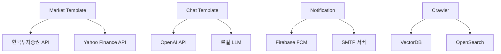
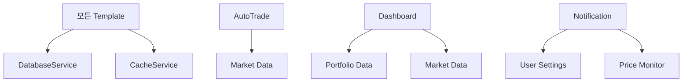

# Template 구현 로드맵 및 우선순위 가이드

## 📋 목차
1. [개요](#개요)
2. [현재 구현 상태 분석](#현재-구현-상태-분석)
3. [우선순위별 구현 계획](#우선순위별-구현-계획)
4. [상세 구현 가이드](#상세-구현-가이드)
5. [기술적 의존성 분석](#기술적-의존성-분석)
6. [예상 개발 일정](#예상-개발-일정)
7. [성공 지표 및 검증 방법](#성공-지표-및-검증-방법)

---

## 📖 개요

본 문서는 `base_server/template/` 하위 모든 템플릿의 구현 상태를 분석하고, 개발 난이도와 비즈니스 임팩트를 고려한 구현 우선순위를 제시합니다.

### 🎯 목표
- **빠른 성과 창출**: 쉬운 것부터 우선 구현하여 조기 가치 창출
- **점진적 복잡도 증가**: 단계적으로 복잡한 기능 구현
- **리스크 최소화**: 의존성이 적은 기능부터 안정적 구현

### 📊 평가 기준
- **구현 난이도** (1-5점): 기술적 복잡성, 외부 의존성
- **비즈니스 임팩트** (1-5점): 사용자 경험, 핵심 기능 여부
- **완성도** (0-100%): 현재 구현 상태
- **의존성 레벨** (1-5점): 다른 시스템과의 결합도

---

## 🔍 현재 구현 상태 분석

| Template | 완성도 | 구현 난이도 | 비즈니스 임팩트 | 의존성 | 우선순위 |
|----------|--------|-------------|----------------|--------|----------|
| Account | 100% ✅ | - | 5 | 2 | **완료** |
| Admin | 100% ✅ | - | 3 | 5 | **완료** |
| Tutorial | 20% ⚠️ | 1 | 4 | 1 | **P1** |
| Dashboard | 95% ⚠️ | 1 | 5 | 3 | **P1** |
| Settings | 80% ⚠️ | 2 | 4 | 2 | **P2** |
| Notification | 75% ⚠️ | 2 | 4 | 3 | **P2** |
| Market | 70% ⚠️ | 3 | 5 | 4 | **P3** |
| Chat | 70% ⚠️ | 3 | 4 | 4 | **P3** |
| Portfolio | 85% ⚠️ | 3 | 5 | 3 | **P3** |
| AutoTrade | 60% ⚠️ | 4 | 4 | 3 | **P4** |
| Crawler | 25% ⚠️ | 5 | 3 | 5 | **P4** |

### 범례
- ✅ **완료**: 프로덕션 준비 완료
- ⚠️ **부분 구현**: 추가 개발 필요
- ❌ **미구현**: 새로 개발 필요

---

## 🚀 우선순위별 구현 계획

### 🟢 **PRIORITY 1: 즉시 구현 (Quick Wins)**
> **목표**: 1-2주 내 완성, 즉시 사용 가능한 기능

#### 1.1 Tutorial Template 완성
```yaml
예상 기간: 2-3일
난이도: ⭐☆☆☆☆
비즈니스 임팩트: ⭐⭐⭐⭐☆
```

**현재 상태**
- ✅ 기본 API 구조 완성
- ❌ DB 연동 없음 (하드코딩된 더미 데이터)
- ❌ 진행상황 저장 기능 없음
- ❌ 튜토리얼 컨텐츠 관리 시스템 없음

**구현 작업**
1. **DB 스키마 확장**
   ```sql
   -- 이미 존재: table_tutorial_progress
   -- 추가 필요: tutorial content 관리 테이블
   ```

2. **핵심 기능 구현**
   - 튜토리얼 진행률 실시간 저장
   - 단계별 완료 체크포인트
   - 완료 보상 시스템
   - 튜토리얼 재시작 기능

3. **검증 기준**
   - [ ] 사용자별 진행률 저장/조회
   - [ ] 단계별 완료 상태 관리
   - [ ] 완료 보상 지급 확인
   - [ ] 튜토리얼 재시작 동작

#### 1.2 Dashboard Template 차트 활성화
```yaml
예상 기간: 0.5일
난이도: ⭐☆☆☆☆
비즈니스 임팩트: ⭐⭐⭐⭐⭐
```

**현재 상태**
- ✅ 99% 구현 완료
- ❌ 차트 데이터 응답 필드 주석 처리 (123-124줄)

**구현 작업**
```python
# dashboard_template_impl.py:123-124
# 현재 주석 처리된 부분 활성화
response.portfolio_chart = portfolio_chart  # 주석 해제
response.allocation_chart = allocation_chart  # 주석 해제
```

**검증 기준**
- [ ] 포트폴리오 차트 데이터 정상 출력
- [ ] 자산 배분 차트 데이터 정상 출력
- [ ] 프론트엔드 차트 렌더링 확인

### 🟡 **PRIORITY 2: 단기 구현 (Core Features)**
> **목표**: 2-3주 내 완성, 핵심 사용자 경험 개선

#### 2.1 Settings Template OTP 및 보안 강화
```yaml
예상 기간: 1-2일
난이도: ⭐⭐☆☆☆
비즈니스 임팩트: ⭐⭐⭐⭐☆
```

**현재 상태**
- ✅ 기본 설정 CRUD 완성
- ❌ OTP 하드코딩 (`pyotp` 라이브러리 미사용)
- ❌ 데이터 내보내기 실제 파일 생성 안됨

**구현 작업**
1. **OTP 시스템 개선**
   ```python
   # 현재: 하드코딩된 OTP
   def setup_otp(self, account_id):
       return "hardcoded_secret"
   
   # 개선: 실제 OTP 라이브러리 사용
   import pyotp
   def setup_otp(self, account_id):
       secret = pyotp.random_base32()
       return pyotp.totp.TOTP(secret).provisioning_uri(
           name=account_id,
           issuer_name="Investment Platform"
       )
   ```

2. **데이터 내보내기 구현**
   - JSON/CSV 형태 사용자 데이터 추출
   - 개인정보 마스킹 처리
   - 파일 다운로드 엔드포인트

**검증 기준**
- [ ] Google Authenticator와 OTP 연동 확인
- [ ] 데이터 내보내기 파일 생성 확인
- [ ] 개인정보 보호 규정 준수

#### 2.2 Notification Template 실시간 알림
```yaml
예상 기간: 2-3일
난이도: ⭐⭐☆☆☆
비즈니스 임팩트: ⭐⭐⭐⭐☆
```

**현재 상태**
- ✅ 알림 CRUD 기능 완성
- ❌ 실시간 알림 트리거 시스템 없음
- ❌ 가격 알림 조건 모니터링 없음

**구현 작업**
1. **백그라운드 모니터링 서비스**
   ```python
   # 새로운 서비스: notification_monitor.py
   class NotificationMonitor:
       async def monitor_price_alerts(self):
           # 가격 조건 체크
           # 알림 발송 트리거
   ```

2. **실시간 알림 발송**
   - WebSocket 기반 브라우저 알림
   - 이메일 알림 (선택적)
   - 조건별 알림 우선순위

**검증 기준**
- [ ] 가격 조건 달성 시 즉시 알림
- [ ] 사용자별 알림 설정 적용
- [ ] 알림 이력 관리

### 🟠 **PRIORITY 3: 중기 구현 (Advanced Features)**
> **목표**: 3-4주 내 완성, 고급 기능 및 외부 연동

#### 3.1 Market Template 실제 데이터 연동
```yaml
예상 기간: 3-4일
난이도: ⭐⭐⭐☆☆
비즈니스 임팩트: ⭐⭐⭐⭐⭐
```

**현재 상태**
- ✅ 시장 데이터 API 구조 완성
- ❌ 더미 데이터 사용 중
- ❌ 실제 증권사 API 연동 없음

**구현 작업**
1. **증권사 API 연동**
   ```python
   # 추천 API: 한국투자증권 OpenAPI
   class KISMarketData:
       def get_stock_price(self, symbol):
           # 실시간 주가 조회
       
       def get_market_news(self):
           # 시장 뉴스 조회
   ```

2. **기술적 분석 도구**
   - 이동평균선, RSI, MACD 계산
   - 차트 패턴 인식
   - 거래량 분석

**외부 의존성**
- 한국투자증권 API 키 발급
- 실시간 데이터 요금제 검토
- API 사용량 제한 관리

#### 3.2 Chat Template AI 분석 기능
```yaml
예상 기간: 3-4일
난이도: ⭐⭐⭐☆☆
비즈니스 임팩트: ⭐⭐⭐⭐☆
```

**현재 상태**
- ✅ 채팅 인터페이스 완성
- ❌ AI 분석 더미 응답
- ❌ 실제 투자 분석 로직 없음

**구현 작업**
1. **AI 모델 연동**
   ```python
   # OpenAI API 또는 로컬 LLM 연동
   class InvestmentAnalyzer:
       def analyze_portfolio(self, portfolio_data):
           # 포트폴리오 분석
       
       def generate_recommendation(self, market_data):
           # 투자 추천 생성
   ```

2. **분석 알고리즘**
   - 포트폴리오 위험도 분석
   - 시장 동향 분석
   - 개인 맞춤형 추천

**외부 의존성**
- OpenAI API 키 또는 로컬 LLM 설정
- 투자 데이터 분석 모델 구축
- 금융 규제 준수 확인

#### 3.3 Portfolio Template 고급 기능
```yaml
예상 기간: 2-3일
난이도: ⭐⭐⭐☆☆
비즈니스 임팩트: ⭐⭐⭐⭐⭐
```

**현재 상태**
- ✅ 기본 포트폴리오 관리 완성
- ❌ 고급 리밸런싱 알고리즘 부족
- ❌ 리스크 관리 도구 부족

**구현 작업**
1. **고급 리밸런싱**
   - 목표 비중 기반 자동 리밸런싱
   - 세금 최적화 리밸런싱
   - 비용 최소화 전략

2. **리스크 관리**
   - VaR (Value at Risk) 계산
   - 포트폴리오 베타 분석
   - 상관관계 분석

### 🔴 **PRIORITY 4: 장기 구현 (Complex Systems)**
> **목표**: 4-6주 내 완성, 고도로 복잡한 시스템

#### 4.1 AutoTrade Template 백테스팅 엔진
```yaml
예상 기간: 4-5일
난이도: ⭐⭐⭐⭐☆
비즈니스 임팩트: ⭐⭐⭐⭐☆
```

**구현 작업**
1. **백테스팅 프레임워크**
   ```python
   class BacktestEngine:
       def run_backtest(self, strategy, start_date, end_date):
           # 과거 데이터 기반 전략 검증
       
       def calculate_metrics(self, results):
           # 샤프 비율, 최대 낙폭 등 계산
   ```

2. **전략 최적화**
   - 매개변수 최적화
   - 몬테카를로 시뮬레이션
   - 리스크 조정 수익률

#### 4.2 Crawler Template 데이터 수집 시스템
```yaml
예상 기간: 5-7일
난이도: ⭐⭐⭐⭐⭐
비즈니스 임팩트: ⭐⭐⭐☆☆
```

**구현 작업**
1. **웹 크롤링 엔진**
   ```python
   class NewsrawCrawler:
       def crawl_financial_news(self):
           # 금융 뉴스 수집
       
       def extract_sentiment(self, articles):
           # 감정 분석
   ```

2. **데이터 파이프라인**
   - VectorDB 저장
   - OpenSearch 인덱싱
   - 실시간 데이터 처리

---

## 🔧 상세 구현 가이드

### Tutorial Template 구현 예시

#### 1. DB 스키마 확장
```sql
-- 튜토리얼 컨텐츠 테이블 추가
CREATE TABLE IF NOT EXISTS `table_tutorial_content` (
  `tutorial_id` varchar(50) NOT NULL,
  `step_number` int NOT NULL,
  `title` varchar(200) NOT NULL,
  `description` text,
  `action_type` enum('READ','click','input','navigate') NOT NULL,
  `target_element` varchar(100),
  `completion_criteria` text,
  `reward_points` int DEFAULT 0,
  PRIMARY KEY (`tutorial_id`, `step_number`)
);
```

#### 2. 진행률 관리 프로시저
```sql
-- 튜토리얼 진행률 업데이트 프로시저 개선
DROP PROCEDURE IF EXISTS `fp_tutorial_update_progress`;
DELIMITER ;;
CREATE PROCEDURE `fp_tutorial_update_progress`(
    IN p_account_db_key BIGINT UNSIGNED,
    IN p_tutorial_type VARCHAR(50),
    IN p_current_step INT,
    IN p_action_data TEXT
)
BEGIN
    -- 진행률 계산 및 보상 지급 로직
    -- 실제 구현 필요
END ;;
DELIMITER ;
```

#### 3. 구현 코드 예시
```python
async def on_tutorial_start_req(self, client_session, request: TutorialStartRequest):
    """튜토리얼 시작 - 실제 DB 연동"""
    response = TutorialStartResponse()
    response.sequence = request.sequence
    
    try:
        account_db_key = getattr(client_session.session, 'account_db_key', 0)
        
        # 1. 튜토리얼 컨텐츠 조회
        tutorial_content = await self._get_tutorial_content(request.tutorial_type)
        
        # 2. 진행률 초기화
        await self._initialize_tutorial_progress(account_db_key, request.tutorial_type)
        
        # 3. 첫 번째 단계 반환
        response.errorCode = 0
        response.tutorial_id = request.tutorial_type
        response.total_steps = len(tutorial_content)
        response.current_step = 1
        response.step_data = tutorial_content[0]
        
    except Exception as e:
        response.errorCode = 1000
        Logger.error(f"Tutorial start error: {e}")
    
    return response
```

---

## 📈 기술적 의존성 분석

### 외부 API 의존성


### 내부 서비스 의존성


---

## 📅 예상 개발 일정

### Phase 1: Quick Wins (1-2주)
```gantt
dateFormat  YYYY-MM-DD
title       Phase 1 Implementation

section Priority 1
Tutorial Complete    :p1-1, 2024-12-08, 3d
Dashboard Charts     :p1-2, 2024-12-09, 1d
```

### Phase 2: Core Features (2-3주)
```gantt
dateFormat  YYYY-MM-DD
title       Phase 2 Implementation

section Priority 2
Settings OTP         :p2-1, 2024-12-11, 2d
Notification RT      :p2-2, 2024-12-13, 3d
```

### Phase 3: Advanced Features (3-4주)
```gantt
dateFormat  YYYY-MM-DD
title       Phase 3 Implementation

section Priority 3
Market API           :p3-1, 2024-12-16, 4d
Chat AI              :p3-2, 2024-12-20, 4d
Portfolio Advanced   :p3-3, 2024-12-18, 3d
```

### Phase 4: Complex Systems (4-6주)
```gantt
dateFormat  YYYY-MM-DD
title       Phase 4 Implementation

section Priority 4
AutoTrade Backtest   :p4-1, 2024-12-24, 5d
Crawler System       :p4-2, 2024-12-30, 7d
```

---

## 📊 성공 지표 및 검증 방법

### 정량적 지표
| 기능 | 성공 지표 | 측정 방법 |
|------|-----------|-----------|
| Tutorial | 완료율 > 80% | DB 진행률 통계 |
| Dashboard | 로딩 시간 < 2초 | 성능 모니터링 |
| Notification | 알림 정확도 > 95% | 알림 로그 분석 |
| Market Data | 데이터 지연 < 5초 | API 응답 시간 |

### 정성적 지표
- **사용자 경험**: 직관적이고 원활한 기능 동작
- **안정성**: 에러율 < 1%, 24/7 안정 운영
- **확장성**: 사용자 증가에 따른 성능 유지
- **보안**: 개인정보 보호 및 금융 규제 준수

### 검증 체크리스트

#### Tutorial Template
- [ ] 모든 튜토리얼 타입별 정상 동작
- [ ] 진행률 실시간 저장/조회
- [ ] 완료 보상 정확한 지급
- [ ] 중도 이탈 후 재시작 기능
- [ ] 다국어 지원 (한국어/영어)

#### Dashboard Template
- [ ] 실시간 데이터 업데이트
- [ ] 차트 인터랙션 기능
- [ ] 모바일 반응형 지원
- [ ] 데이터 필터링 기능
- [ ] 내보내기 기능

#### 각 Template별 상세 검증 기준
```yaml
공통 검증 기준:
  - API 응답 시간 < 1초
  - 에러 처리 및 로깅 완비
  - 인증/권한 체크 정상
  - 입력값 검증 완료
  - 한글 문자열 정상 처리

보안 검증:
  - SQL 인젝션 방어
  - XSS 방어
  - CSRF 방어
  - 민감 정보 마스킹

성능 검증:
  - 동시 사용자 100명 이상
  - 메모리 사용량 < 512MB
  - CPU 사용률 < 50%
  - DB 커넥션 풀 최적화
```

---

## 🎯 결론 및 권장사항

### 1. 즉시 시작 권장: Tutorial Template
- **이유**: 가장 낮은 리스크, 높은 사용자 가치
- **기간**: 2-3일 내 완성 가능
- **효과**: 신규 사용자 온보딩 개선

### 2. 단계적 접근법
- Phase 1 완료 후 Phase 2 진행
- 각 단계별 테스트 및 검증 완료 후 다음 단계
- 위험도 높은 기능은 충분한 테스트 후 적용

### 3. 리스크 관리
- 외부 API 의존성: 대안 API 준비
- 복잡한 알고리즘: 단계적 복잡도 증가
- 성능 이슈: 지속적 모니터링 및 최적화

### 4. 협업 방안
- 기능별 담당자 지정
- 코드 리뷰 필수
- API 문서 실시간 업데이트
- 테스트 케이스 작성 및 자동화

이 로드맵을 따라 체계적으로 구현하면 안정적이고 확장 가능한 투자 플랫폼을 구축할 수 있습니다.

---

*문서 버전: v1.0*  
*최종 업데이트: 2024.12.07*  
*작성자: AI Assistant*