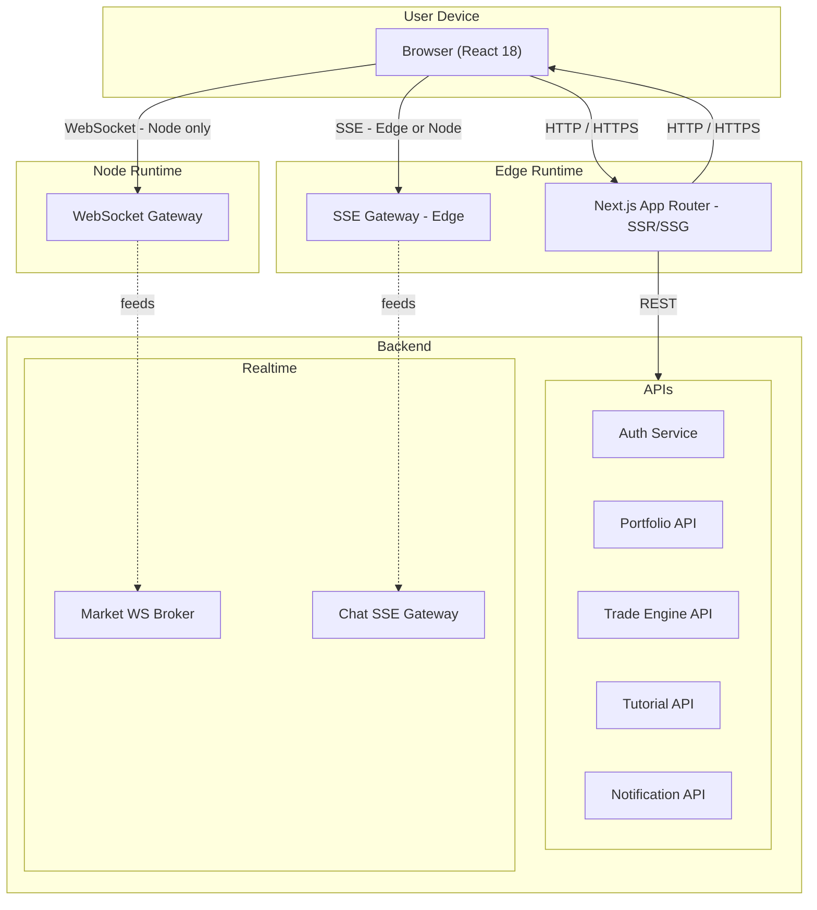

⸻

# AI Trading Platform — Frontend (Next.js)

> **목표**: SKN12-FINAL-2TEAM 프론트엔드(Next.js 15, React 18, TS)의 구조와 실행 방법을 한눈에 파악할 수 있도록 정리  
> **특징**: 실시간(WS/SSE)·튜토리얼·포트폴리오 REST를 배포 관점에서 정리

<p align="center">
  <a href="#-quickstart">Quickstart</a> •
  <a href="#-architecture">Architecture</a> •
  <a href="#-realtime">Realtime</a> •
  <a href="#-env">ENV</a> •
  <a href="#-scripts">Scripts</a> •
  <a href="#-quality">Quality</a>
</p>

---

## ✨ Tech Stack

- **Framework**: Next.js (App Router, RSC), React 18, TypeScript
- **State**: React local, Zustand (global), (SWR/React Query 선택)
- **Network**: REST (axios), WebSocket(시세), SSE(챗봇)
- **Styling**: TailwindCSS (선택), PostCSS
- **Build**: Vite/Next 빌드, ESLint, TS
- **Testing**: Playwright (e2e), Vitest/Jest(선택)

---

## 🏁 Quickstart

### 1) 의존성 설치
```bash
npm install
```

### 2) 로컬 환경 변수 생성
```bash
# .env.local (예시)
cat > .env.local << 'EOF'
NEXT_PUBLIC_API_URL=http://localhost:8000
NEXT_PUBLIC_WS_URL=ws://localhost:8000
NEXT_PUBLIC_API_TIMEOUT=10000
EOF
```

### 3) 개발 서버
```bash
npm run dev   # http://localhost:3000
```

> **참고**: 배포용 최소 패키징 가이드는 하단 "📦 배포 팁" 참고

---

## 🗂️ Project Structure (핵심)

```
ai-trading-platform/
├── app/                  # App Router (pages, layouts, RSC)
├── components/           # UI/도메인 컴포넌트
├── hooks/                # use-xxx 훅 (auth, ws 등)
├── lib/                  # axios client, api wrappers, utils
├── providers/            # React Providers (Auth 등)
├── public/               # 정적 리소스
├── styles/               # globals.css, tailwind.css
├── types/                # 공용 타입 & zod schema
├── next.config.mjs
├── tsconfig.json
├── tailwind.config.ts
└── package.json
```

---

## 🧭 Architecture

### 컴포넌트/외부 연동 (As-Is)

```mermaid
graph LR
  subgraph NextJS[Next.js App (Edge/Node)]
    Next[Next App]
  end

  subgraph Browser[Browser (React 18)]
    AuthCtx[Auth Context/Provider]
    Zustand[Zustand Stores]
    Axios[Axios Client]
    WSClient[WS Client]
    SSEClient[SSE Client]
  end

  subgraph APIs[External APIs]
    PortfolioAPI[Portfolio API]
    TradeEngine[Trade Engine API]
    AuthService[Auth Service]
    MarketWS[Market WS Broker]
    ChatSSE[Chat SSE Gateway]
    TutorialAPI[Tutorial API]
    NotificationAPI[Notification API]
  end

  AuthCtx --- Zustand
  Axios --> PortfolioAPI
  Axios --> TradeEngine
  Axios --> AuthService
  Axios --> TutorialAPI
  Axios --> NotificationAPI
  WSClient --> MarketWS
  SSEClient --> ChatSSE

  Next -.-> PortfolioAPI
  Next -.-> TradeEngine
  Next -.-> AuthService
```

### 배포 다이어그램 (Edge/Node/Backend)



> **Legend**: 실선=현재 / 점선=계획  
> **계획 항목**: SharedWorker, ServiceWorker, IndexedDB, Analytics (추후 추가)

---

## 🔌 Realtime

- **WebSocket (시세)**: 멀티 심볼 구독, 끊김 시 지수 백오프 + 재구독 + 백필
- **SSE (챗봇)**: 토큰 스트리밍, heartbeat(15–30s), 120s 타임아웃 처리
- **Fallback(계획)**: WS → SSE → Polling 순차 전환

---

## 🔐 Auth

- **토큰 기반**: Access/Refresh 토큰 사용
- **현재**: LocalStorage + Context
- **개선안**: httpOnly 쿠키 + CSRF, CSP 강화, DOMPurify

---

## ⚙️ ENV

### 필수 키 (예시)

```bash
NEXT_PUBLIC_API_URL=http://localhost:8000
NEXT_PUBLIC_WS_URL=ws://localhost:8000
NEXT_PUBLIC_API_TIMEOUT=10000
```

> **⚠️ 주의**: `NEXT_PUBLIC_*` 만 브라우저 노출. 민감 값은 노출 금지.

---

## 🧪 Scripts

```bash
npm run dev          # dev server
npm run build        # production build
npm run start        # start prod
npm run lint         # eslint
npm run type-check   # tsc --noEmit
# 테스트 스크립트는 선택: e2e(unit) 도입 시 추가
```

---

## ✅ 품질 체크(발췌)

- [ ] WS 재연결 시 구독 큐 비우기 + 백필 병합 정상
- [ ] SSE heartbeat/timeout 동작
- [ ] requestId/traceId 로깅, 에러 코드 표준화
- [ ] 대용량 리스트 가상화
- [ ] 코드 스플릿: 차트/무거운 위젯 지연 로딩
- [ ] 접근성: prefers-reduced-motion, 키보드 탐색

---

## 📦 배포 팁 (작게 전달)

### 1) 배포용 정리

```powershell
Remove-Item node_modules, .next -Recurse -Force -ErrorAction SilentlyContinue
Remove-Item .env, .env.local -Force -ErrorAction SilentlyContinue
Compress-Archive -Path . -DestinationPath ..\ai-trading-platform-deploy.zip
```

### 2) 설치 측

```powershell
npm install
@"
NEXT_PUBLIC_API_URL=http://localhost:8000
NEXT_PUBLIC_WS_URL=ws://localhost:8000
NEXT_PUBLIC_API_TIMEOUT=10000
"@ | Out-File -FilePath .env.local -Encoding UTF8
npm run dev
```

---

## 🖨️ PDF로 내보내기 (Mermaid 포함)

### A) 브라우저(권장, GitHub 렌더 그대로)
1. GitHub에서 README 페이지 open
2. 브라우저 Print(인쇄) → Save as PDF
   - **Chrome**: More settings → Background graphics 체크
   - 다이어그램/표 그대로 보존

### B) VSCode (Markdown PDF 확장)
1. `yzane.markdown-pdf` 설치
2. `Ctrl+Shift+P` → Markdown PDF: Export (pdf)
3. 결과 파일은 현재 폴더에 `README.pdf` 로 생성
   - 안 보이면: Output 패널(→ Markdown PDF)에서 경로 확인
   - Mermaid가 안 나온다면: `markdown-pdf.mermaidServer` (혹은 Markdown Preview Mermaid Support 확장) 사용

### C) 로컬 HTML → PDF

```bash
npm i -g marked
marked README.md > out.html
# out.html 브라우저로 열고 Print to PDF
```

---

## 🔭 Roadmap (요약)

- **P0**: rAF 타이핑, WS 백필/백오프, SSE heartbeat/timeout
- **P1**: OpenTelemetry, CSP + DOMPurify, 코드 스플릿
- **P2**: Fallback(WS→SSE→Polling), SharedWorker, 리스트 가상화
- **P3**: PWA/오프라인, 소셜 트레이딩, 고급 분석

---

## 🤝 Contributing

- **브랜치 규칙**: `feat/*`, `fix/*`, `docs/*`
- **커밋 컨벤션**: Conventional Commits 권장
- **PR 체크**: lint, type-check, (선택) e2e

---

## 📝 License

MIT (또는 팀 정책에 맞춰 업데이트)

