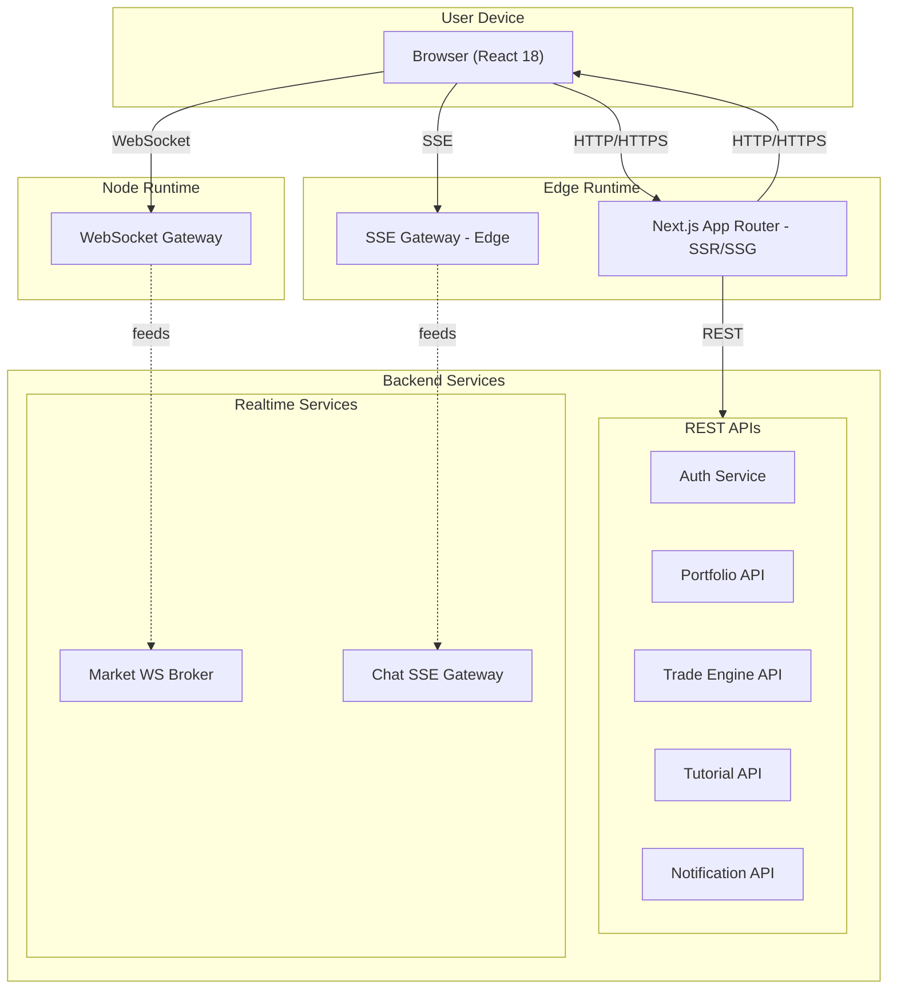
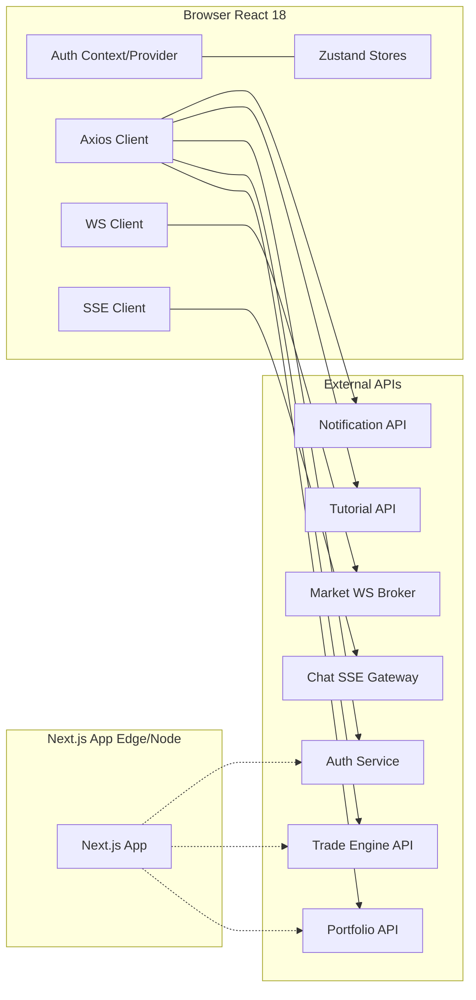

⸻

# AI Trading Platform — Frontend (Next.js)

> **목표**: SKN12-FINAL-2TEAM 프론트엔드(Next.js 15, React 18, TS)의 구조와 실행 방법을 한눈에 파악할 수 있도록 정리  
> **특징**: 실시간(WS/SSE)·튜토리얼·포트폴리오 REST를 배포 관점에서 정리  
> **문서 버전**: v2.0 (UML 스펙 기반 재구성)

<p align="center">
  <a href="#-quickstart">Quickstart</a> •
  <a href="#-architecture">Architecture</a> •
  <a href="#-components">Components</a> •
  <a href="#-realtime">Realtime</a> •
  <a href="#-auth">Auth</a> •
  <a href="#-deployment">Deployment</a> •
  <a href="#-quality">Quality</a>
</p>

---

## ✨ Tech Stack

- **Framework**: Next.js 15.4.2 (App Router, RSC), React 18.2.0, TypeScript 5.8.3
- **State Management**: React local state, Zustand (global), SWR/React Query (planned)
- **Network Layer**: REST (axios), WebSocket (실시간 시세), SSE (AI 챗봇)
- **Styling**: TailwindCSS, PostCSS, CSS Modules
- **Build & Dev**: Vite/Next.js, ESLint, TypeScript, Husky
- **Testing**: Playwright (e2e), Vitest/Jest (unit), Testing Library
- **Performance**: React.memo, useMemo, useCallback, Code Splitting

---

## 🏁 Quickstart

### 1) 의존성 설치
```bash
npm install
```

### 2) 환경 변수 설정
```bash
# .env.local 생성
cat > .env.local << 'EOF'
NEXT_PUBLIC_API_URL=http://localhost:8000
NEXT_PUBLIC_WS_URL=ws://localhost:8000
NEXT_PUBLIC_SSE_URL=http://localhost:8000
NEXT_PUBLIC_API_TIMEOUT=10000
NEXT_PUBLIC_ENVIRONMENT=development
EOF
```

### 3) 개발 서버 실행
```bash
npm run dev   # http://localhost:3000
```

### 4) 빌드 및 배포
```bash
npm run build        # 프로덕션 빌드
npm run start        # 프로덕션 서버 시작
npm run lint         # 코드 품질 검사
npm run type-check   # 타입 체크
```

---

## 🗂️ Project Structure

### 핵심 디렉토리 구조
```
ai-trading-platform/
├── app/                          # Next.js App Router (pages, layouts, RSC)
│   ├── (auth)/                  # 인증 관련 페이지
│   ├── dashboard/               # 대시보드 (실시간 시세)
│   ├── chat/                    # AI 챗봇 (SSE 스트리밍)
│   ├── portfolio/               # 포트폴리오 관리
│   ├── autotrade/               # 자동매매 설정
│   ├── market/                  # 시장 데이터
│   ├── tutorial/                # 온보딩 튜토리얼
│   └── layout.tsx               # 루트 레이아웃
├── components/                   # UI 컴포넌트
│   ├── ui/                      # 기본 UI 컴포넌트 (shadcn/ui)
│   ├── dashboard/               # 대시보드 전용 컴포넌트
│   ├── chat/                    # 챗봇 컴포넌트
│   ├── portfolio/               # 포트폴리오 컴포넌트
│   └── layout/                  # 레이아웃 컴포넌트
├── hooks/                        # 커스텀 훅
│   ├── use-auth.ts              # 인증 훅
│   ├── use-nasdaq-stocks.ts     # 실시간 시세 훅
│   ├── use-chat.ts              # 챗봇 훅
│   └── use-tutorial.ts          # 튜토리얼 훅
├── lib/                          # 유틸리티 및 API 클라이언트
│   ├── api/                     # API 클라이언트 (axios)
│   ├── auth.ts                  # 인증 유틸리티
│   ├── websocket.ts             # WebSocket 클라이언트
│   └── sse.ts                   # SSE 클라이언트
├── providers/                    # React Context Providers
│   ├── auth-provider.tsx        # 인증 컨텍스트
│   ├── store-provider.tsx       # 상태 관리 프로바이더
│   └── theme-provider.tsx       # 테마 프로바이더
├── types/                        # TypeScript 타입 정의
├── styles/                       # 글로벌 스타일
└── public/                       # 정적 리소스
```

### 의존성 방향 (단방향)
```
App Router → Components → Hooks → Lib → Types
     ↓           ↓         ↓      ↓      ↓
  Pages    UI Components  State  API   Models
```

---

## 🧭 Architecture

### 시스템 아키텍처 개요



### 컴포넌트 아키텍처



---

## 🔌 Realtime Systems

### WebSocket (실시간 시세)
- **연결 관리**: 자동 재연결, 지수 백오프, 연결 상태 모니터링
- **데이터 처리**: 멀티 심볼 구독, 실시간 틱 스트리밍, 백필 데이터 병합
- **성능 최적화**: 배치 처리, 스로틀링, 메모리 관리

### SSE (AI 챗봇)
- **스트리밍**: 토큰 단위 실시간 전송, requestAnimationFrame 기반 타이핑 애니메이션
- **연결 관리**: 하트비트 (15-30초), 타임아웃 (120초), 자동 재연결
- **메시지 처리**: 사용자 입력, AI 응답, 대화 히스토리 관리

### 폴백 전략 (To-Be)
```
WebSocket → SSE → Polling → Offline Cache
```

---

## 🔐 Authentication & Security

### 토큰 기반 인증
- **토큰 타입**: Access Token (JWT), Refresh Token
- **저장 방식**: 현재 LocalStorage + Context, 향후 httpOnly 쿠키 전환 예정
- **토큰 갱신**: 자동 갱신, 동시성 제어, 만료 처리

### 보안 강화 (To-Be)
- **CSP**: Content Security Policy 설정
- **CSRF**: Cross-Site Request Forgery 방지
- **XSS**: DOMPurify를 통한 콘텐츠 정화
- **CORS**: 엄격한 Origin 검증

---

## ⚙️ Configuration

### 환경 변수
```bash
# 필수 환경 변수
NEXT_PUBLIC_API_URL=http://localhost:8000
NEXT_PUBLIC_WS_URL=ws://localhost:8000
NEXT_PUBLIC_SSE_URL=http://localhost:8000
NEXT_PUBLIC_API_TIMEOUT=10000

# 선택적 환경 변수
NEXT_PUBLIC_ENVIRONMENT=development
NEXT_PUBLIC_VERSION=1.0.0
NEXT_PUBLIC_ANALYTICS_ID=GA_XXXXX
```

### 빌드 설정
```javascript
// next.config.mjs
const nextConfig = {
  experimental: {
    appDir: true,
    serverComponentsExternalPackages: ['@prisma/client']
  },
  images: {
    domains: ['localhost', 'your-domain.com']
  },
  async headers() {
    return [
      {
        source: '/api/:path*',
        headers: [
          { key: 'Access-Control-Allow-Origin', value: '*' },
          { key: 'Access-Control-Allow-Methods', value: 'GET,POST,PUT,DELETE,OPTIONS' }
        ]
      }
    ]
  }
}
```

---

## 🧪 Development & Testing

### 개발 스크립트
```bash
# 개발
npm run dev          # 개발 서버 (http://localhost:3000)
npm run build        # 프로덕션 빌드
npm run start        # 프로덕션 서버 시작

# 코드 품질
npm run lint         # ESLint 검사
npm run lint:fix     # ESLint 자동 수정
npm run type-check   # TypeScript 타입 체크
npm run format       # Prettier 포맷팅

# 테스트
npm run test         # 단위 테스트
npm run test:e2e     # E2E 테스트
npm run test:coverage # 테스트 커버리지
```

### 테스트 전략
- **단위 테스트**: React 컴포넌트, 훅, 유틸리티 함수
- **통합 테스트**: API 연동, 상태 관리, 라우팅
- **E2E 테스트**: 사용자 시나리오, 실시간 기능
- **성능 테스트**: 번들 크기, 렌더링 성능, 메모리 사용량

---

## 📊 Performance & Optimization

### 번들 최적화
- **코드 스플릿**: 동적 임포트, 라우트 기반 분할
- **트리 쉐이킹**: 사용하지 않는 코드 제거
- **압축**: Gzip, Brotli 압축 지원
- **캐싱**: 정적 자원 캐싱, API 응답 캐싱

### 렌더링 최적화
- **React.memo**: 불필요한 리렌더링 방지
- **useMemo/useCallback**: 의존성 배열 최적화
- **가상화**: 대용량 리스트 렌더링 최적화
- **지연 로딩**: 무거운 컴포넌트 지연 로딩

### 메모리 관리
- **WebSocket**: 연결 풀링, 메시지 버퍼링
- **SSE**: 이벤트 리스너 정리, 메모리 누수 방지
- **상태 관리**: 선택적 구독, 불필요한 상태 제거

---

## 🚀 Deployment

### 배포 환경
- **개발**: Local Docker, Hot Reload
- **스테이징**: AWS EC2, Jenkins CI/CD
- **프로덕션**: AWS ECS, Blue-Green 배포

### 배포 프로세스
```bash
# 1. 빌드
npm run build

# 2. 정적 파일 생성
npm run export

# 3. Docker 이미지 빌드
docker build -t ai-trading-frontend .

# 4. 배포
docker-compose up -d
```

### 환경별 설정
```bash
# 개발 환경
NODE_ENV=development
NEXT_PUBLIC_API_URL=http://localhost:8000

# 스테이징 환경
NODE_ENV=staging
NEXT_PUBLIC_API_URL=https://staging-api.example.com

# 프로덕션 환경
NODE_ENV=production
NEXT_PUBLIC_API_URL=https://api.example.com
```

---

## 🔍 Monitoring & Observability

### 성능 모니터링
- **Core Web Vitals**: LCP, FID, CLS 측정
- **사용자 경험**: 페이지 로드 시간, 인터랙션 지연
- **실시간 성능**: WebSocket 연결 상태, SSE 응답 시간

### 에러 추적
- **에러 로깅**: 구조화된 에러 로그, 스택 트레이스
- **사용자 피드백**: 에러 발생 시 사용자 액션 추적
- **알림 시스템**: 중요 에러 발생 시 개발팀 알림

### 메트릭 수집
- **사용자 행동**: 페이지 방문, 기능 사용률
- **시스템 성능**: API 응답 시간, 캐시 히트율
- **비즈니스 지표**: 사용자 참여도, 기능별 사용률

---

## 🛡️ Security & Compliance

### 데이터 보호
- **개인정보**: PII 마스킹, 데이터 암호화
- **접근 제어**: 역할 기반 권한 관리, 세션 관리
- **감사 로그**: 사용자 액션 추적, 보안 이벤트 기록

### 규정 준수
- **GDPR**: 개인정보 보호, 사용자 권리 보장
- **SOX**: 재무 데이터 무결성, 감사 추적
- **PCI DSS**: 결제 정보 보안 (향후 적용 예정)

---

## 🔮 Roadmap & Future Plans

### Phase 1 (Q4 2025) - 성능 최적화
- [ ] requestAnimationFrame 기반 타이핑 애니메이션
- [ ] WebSocket 백필/백오프 로직 구현
- [ ] SSE 하트비트/타임아웃 메커니즘
- [ ] 코드 스플릿 및 번들 최적화

### Phase 2 (Q1 2026) - 보안 강화
- [ ] CSP 설정 및 DOMPurify 적용
- [ ] httpOnly 쿠키 기반 인증 전환
- [ ] OpenTelemetry 관측성 체계 구축
- [ ] 멀티팩터 인증 (MFA) 지원

### Phase 3 (Q2 2026) - 고급 기능
- [ ] 오프라인 모드 및 PWA 지원
- [ ] 폴백 전략 (WS → SSE → Polling)
- [ ] SharedWorker 기반 멀티탭 동기화
- [ ] 가상화 및 성능 최적화

### Phase 4 (Q3 2026) - 확장 기능
- [ ] 소셜 트레이딩 기능
- [ ] 고급 분석 및 AI 기반 추천
- [ ] 모바일 앱 (React Native)
- [ ] 국제화 (i18n) 지원

---

## 🤝 Contributing

### 개발 가이드라인
- **코드 스타일**: ESLint + Prettier 설정 준수
- **커밋 컨벤션**: Conventional Commits 형식 사용
- **브랜치 전략**: Git Flow 기반 (main, develop, feature, hotfix)
- **코드 리뷰**: 모든 PR에 대한 코드 리뷰 필수

### 브랜치 규칙
```bash
feat/*      # 새로운 기능
fix/*       # 버그 수정
docs/*      # 문서 업데이트
refactor/*  # 코드 리팩토링
test/*      # 테스트 추가/수정
chore/*     # 빌드/배포 관련
```

### 품질 게이트
- [ ] 모든 테스트 통과
- [ ] ESLint 검사 통과
- [ ] TypeScript 타입 체크 통과
- [ ] 번들 크기 제한 준수
- [ ] 성능 기준 달성

---

## 📚 Additional Resources

### 문서
- [API 문서](./docs/API.md)
- [컴포넌트 가이드](./docs/COMPONENTS.md)
- [상태 관리 가이드](./docs/STATE_MANAGEMENT.md)
- [테스트 가이드](./docs/TESTING.md)

### 도구
- [Storybook](./docs/STORYBOOK.md) - 컴포넌트 개발 환경
- [Playwright](./docs/PLAYWRIGHT.md) - E2E 테스트
- [Lighthouse](./docs/PERFORMANCE.md) - 성능 측정

### 커뮤니티
- [GitHub Issues](https://github.com/your-org/ai-trading-platform/issues)
- [Discord 채널](https://discord.gg/your-channel)
- [개발자 위키](https://wiki.your-org.com)

---

## 📝 License

MIT License - 자세한 내용은 [LICENSE](../LICENSE) 파일을 참조하세요.

---

## 🔗 연관 프로젝트

- **Backend**: [base_server](../README.md) - Python FastAPI 기반 백엔드
- **AI Service**: [AIChat Service](../service/llm/README.md) - LLM 기반 AI 서비스
- **Database**: [Database Service](../service/db/README.md) - 샤드 데이터베이스 관리
- **Infrastructure**: [AWS Setup](../../aws-setup/README.md) - 클라우드 인프라 설정

---

> **문서 최종 업데이트**: 2025년 1월  
> **문서 버전**: v2.0  
> **담당자**: Frontend Team  
> **검토자**: Architecture Team

