⸻

# SKN12-FINAL-2TEAM — Frontend UML Specification

> **목표**: 이 문서는 SKN12-FINAL-2TEAM 프론트엔드(Next.js 15.4.2, React 18.2.0, TypeScript 5.8.3)의 구조를 **UML 중심**으로 정밀 해부한다. 설계 의도, 모듈 경계, 상호작용, 수명주기, 오류/재시도, 보안, 성능까지 **실전 배포 관점**에서 다룬다. AI가 학습해도 손색없는 수준으로 명세화한다.

> **문서 버전**: v3.0 (UML 스펙 완전 반영)  
> **최종 업데이트**: 2025년 1월  
> **담당자**: Frontend Architecture Team

<p align="center">
  <a href="#0-전제와-범위">전제와 범위</a> •
  <a href="#1-유스케이스-모델">유스케이스</a> •
  <a href="#2-패키지-다이어그램">패키지</a> •
  <a href="#3-컴포넌트-다이어그램">컴포넌트</a> •
  <a href="#4-클래스-모델">클래스</a> •
  <a href="#5-시퀀스-다이어그램">시퀀스</a> •
  <a href="#6-액티비티-다이어그램">액티비티</a> •
  <a href="#7-상태-머신">상태머신</a> •
  <a href="#8-배포-다이어그램">배포</a> •
  <a href="#9-데이터-계약">데이터계약</a> •
  <a href="#10-성능자원-설계">성능</a> •
  <a href="#11-보안권한">보안</a> •
  <a href="#12-장애회복관측성">관측성</a> •
  <a href="#13-코드-매핑">코드매핑</a> •
  <a href="#14-확장-로드맵">로드맵</a> •
  <a href="#15-품질-게이지">품질</a>
</p>

---

## 0. 전제와 범위"?

* **대상 범위:** `base_server/frontend/ai-trading-platform/`의 `app/`(App Router), `components/`, `hooks/`, `lib/`, `providers/`, `types/` 그리고 브라우저 ↔ Edge/Node 런타임 ↔ 백엔드(API, WS, SSE) 인터랙션.
* **통신 프로토콜:** REST(axios), SSE(EventSource), WebSocket.
* **상태관리:** 로컬 상태(React), 전역(Zustand), 서버 상태(SWR/React Query 가정 가능).
* **인증:** 토큰 기반 (UUID 문자열). 토큰 저장소는 브라우저(Storage) + Context.
* **가정:** 실시간 시세는 WS로, 챗봇은 SSE로, 포트폴리오/설정은 REST로 운용. Next.js 서버 컴포넌트와 클라이언트 컴포넌트 분리를 적극 활용.

> **NOTE:** 이 문서는 **As-Is(현재 구현)**와 **To-Be(개선안)**를 명확히 구분한다.
> - **실선 + 기본색**: 현재 구현된 기능
> - **점선 + <<planned>>**: 향후 개선 계획
> - **Gap 분석**: 현재와 목표 간 차이점
> - **마이그레이션**: 개선 적용 절차

---

## 1. 유스케이스 모델 (Use‑Case)

### 1.1 액터 & 유스케이스 개요 (As-Is)

* **액터**
  * *User* (투자자, 일반 사용자)
  * *Auth Service* (토큰 발급/검증)
  * *Market WS Broker* (시세 푸시)
  * *Chat SSE Gateway* (AI 응답 스트림)
  * *Portfolio API* (자산/거래/리밸런싱)
  * *Trade Engine API* (자동매매 설정/시그널)

```mermaid
graph LR
    User((User))
    
    subgraph Frontend[Frontend]
        UC_Login[로그인/세션확립]
        UC_ViewDashboard[대시보드 실시간 보기]
        UC_ChatAI[AI 챗봇 대화 SSE]
        UC_ManagePortfolio[포트폴리오 조회/편집]
        UC_Autotrade[자동매매 전략 구성]
        UC_Settings[사용자 설정]
        UC_Tutorial[온보딩 튜토리얼]
        UC_MarketData[시장 데이터 조회]
    end
    
    subgraph External[External Services]
        AuthService[Auth Service]
        MarketWS[Market WS Broker]
        ChatSSE[Chat SSE Gateway]
        PortfolioAPI[Portfolio API]
        TradeEngine[Trade Engine API]
        TutorialAPI[Tutorial API]
    end
    
    User --> UC_Login
    User --> UC_ViewDashboard
    User --> UC_ChatAI
    User --> UC_ManagePortfolio
    User --> UC_Autotrade
    User --> UC_Settings
    User --> UC_Tutorial
    User --> UC_MarketData
    
    UC_Login --> AuthService
    UC_ViewDashboard --> MarketWS
    UC_ChatAI --> ChatSSE
    UC_ManagePortfolio --> PortfolioAPI
    UC_Autotrade --> TradeEngine
    UC_Settings --> PortfolioAPI
    UC_MarketData --> MarketWS
    UC_Tutorial --> TutorialAPI
```



**핵심 시나리오 요약 (As-Is)**

1. 로그인 성공 → 토큰 획득 → 보호 라우트 진입.
2. 대시보드 진입 시, WS 연결 수립 → 관심 심볼 구독 → 실시간 반영.
3. 챗 입력 → SSE 스트림 수신 → requestAnimationFrame 타이핑 애니메이션.
4. 포트폴리오 CRUD → REST 교환 후 전역/서버 상태 동기화.
5. 자동매매 설정 변경 → 서버 반영 + 로컬 스냅샷.
6. 튜토리얼 진행 → 단계별 가이드 → 완료 상태 저장.

---

## 2. 패키지 다이어그램 (Package)

### 2.1 현재 구조 (As-Is)

소스 트리의 **의존 방향**과 층위를 명확히 한다. `components`는 `hooks/lib/providers/types`에 **의존**하되, 역의존을 금한다.


**규율:** 상위 레이어는 하위 레이어로만 의존(단방향). `lib/`는 순수 유틸/클라이언트로 유지, React 의존 최소화.

---

## 3. 컴포넌트 다이어그램 (Component)

### 3.1 현재 구조 (As-Is)

페이지/경계 컴포넌트가 어떤 런타임 자원(SSE/WS/REST)에 붙는지 시각화.


---

## 4. 클래스 모델 (주요 도메인 & 클라이언트)

### 4.1 인증/컨텍스트/가드


### 4.2 WS(시세) 스토어 & 클라이언트


---

### 4.3 챗(SSE) & UI


### 4.4 REST API 래퍼


---

### 4.5 튜토리얼 시스템


---

## 5. 시퀀스 다이어그램 (핵심 플로우)

### 5.1 로그인/가드/페이지 전개

```mermaid
sequenceDiagram
    actor User
    participant Browser
    participant AuthProvider as AP
    participant RouteGuard as RG
    participant ApiClient as API
    participant AuthService as AS
    
    User->>Browser: /dashboard 접근
    Browser->>RG: requireAuth()
    Note over RG: <<planned>> RouteGuard 구현 후 활성화
    
    alt token 없음
        RG->>Browser: redirect(/login)
        User->>Browser: submit credentials
        Browser->>AS: POST /auth/login
        AS-->>Browser: {token, refreshToken, exp}
        Browser->>AP: setToken(token, refreshToken, exp)
    else token 있음
        RG->>Browser: render(dashboard)
        Browser->>API: GET /portfolio Authorization Bearer
        API-->>Browser: Portfolio JSON
    end
```



---

### 5.1.1 토큰 리프레시 동시성 제어 (<<planned>>)


### 5.2 대시보드 실시간(WS)

```mermaid
sequenceDiagram
    actor User
    participant Dashboard
    participant NasdaqStocksStore as Store
    participant WSClient as WS
    participant Broker as MWS
    
    User->>Dashboard: 페이지 진입
    Dashboard->>Store: initWs()
    Store->>WS: connect WS_URL
    WS->>MWS: WS Handshake
    MWS-->>WS: 101 Switching Protocols
    Dashboard->>Store: addSymbol INDEX PORTF
    Store->>WS: SUBSCRIBE symbols
    MWS-->>WS: TICK sym price ts stream
    WS-->>Store: onmessage TICK
    Store->>Dashboard: setState(price update)
```



---

### 5.2.1 WS 재연결 + 재구독 + 백필(Backfill)


**백필 정합 규칙**: Backfill merge는 (1) ts 단조 증가 보장, (2) symbol+ts 중복 제거, (3) 서버시각과의 Δ 보정(절대시간 기준), (4) 라이브 틱과 백필의 단일 병합 패스로 완료한다. O(n log n) 정렬 1회 + O(n) 머지, 링버퍼 길이 N=1024 유지.

### 5.3 챗봇(SSE) 스트리밍 + requestAnimationFrame 타이핑

```mermaid
sequenceDiagram
    actor User
    participant ChatPage as UI
    participant ChatStore as CS
    participant Api as ChatAPI
    participant SSE as EventSource
    
    User->>UI: 입력 제출 prompt
    UI->>CS: appendUser prompt
    UI->>ChatAPI: POST /api/chat/start
    ChatAPI-->>UI: streamUrl
    UI->>SSE: open streamUrl
    SSE-->>UI: onmessage delta
    UI->>CS: appendAssistant delta
    UI->>UI: render delta setInterval 18ms 기반 문자 단위 처리
    Note over UI,SSE: 반복...
    SSE-->>UI: DONE
    UI->>SSE: close()
```



---

### 5.3.1 SSE 하트비트/타임아웃/조기 종료

```mermaid
sequenceDiagram
    actor User
    participant ChatPage as UI
    participant ChatStore as CS
    participant SSE as EventSource
    
    UI->>SSE: open streamUrl
    loop 15초마다
        SSE-->>UI: :heartbeat
        UI->>UI: updateLastHeartbeat()
    end
    alt 120초 무응답
        UI->>UI: timeout detected
        UI->>SSE: close()
        UI->>UI: restartSSE()
    else 정상 종료
        SSE-->>UI: DONE
        UI->>SSE: close()
    end
```



### 5.4 튜토리얼 진행 플로우

```mermaid
sequenceDiagram
    actor User
    participant TutorialOverlay as TO
    participant useTutorial as UT
    participant ApiClient as API
    participant TutorialAPI as TA
    
    User->>TO: 튜토리얼 시작
    TO->>UT: currentTutorial 정보 로드
    UT->>API: getTutorialProgress
    API->>TA: POST /api/tutorial/progress
    TA-->>API: currentStep completedSteps
    API-->>UT: TutorialProgress
    UT-->>TO: 현재 단계 정보 표시
    
    User->>TO: 다음 단계 진행
    TO->>UT: nextStep
    UT->>API: updateTutorialProgress step
    API->>TA: POST /api/tutorial/complete/step
    TA-->>API: success true
    API-->>UT: 업데이트 완료
    UT-->>TO: 다음 단계 표시
```



---

## 6. 액티비티 다이어그램 (흐름/분기)

### 6.1 자동매매 설정 저장

```mermaid
flowchart TD
    A[시작] --> B[사용자 입력 검증]
    B --> C{유효}
    C -->|예| D[로컬 미리보기 반영]
    C -->|아니오| E[폼 에러 강조]
    D --> F[변경 diff 산출]
    F --> G[REST PATCH /autotrade]
    G --> H{200 OK}
    H -->|성공| I[전역 상태 invalidate]
    H -->|실패| J[로컬 롤백]
    I --> K[Toast 성공]
    J --> L[에러 토스트 및 재시도 버튼]
    E --> M[종료]
    K --> M
    L --> M
```



---

### 6.2 시세 구독 관리 (심볼 추가/삭제)

```mermaid
flowchart TD
    A[시작] --> B[사용자 심볼 추가]
    B --> C[Store.addSymbol]
    C --> D{WS 연결됨}
    D -->|예| E[WS.SUBSCRIBE]
    D -->|아니오| F[대기 OnOpen 후 큐 처리]
    E --> G[종료]
    F --> G
```



### 6.3 튜토리얼 단계 진행

```mermaid
flowchart TD
    A[시작] --> B[현재 단계 정보 로드]
    B --> C[사용자 액션 감지]
    C --> D{단계 완료 조건 충족}
    D -->|예| E[완료 상태 저장]
    D -->|아니오| F[현재 단계 계속 진행]
    E --> G[다음 단계 정보 로드]
    G --> H{모든 단계 완료}
    H -->|예| I[튜토리얼 완료 축하]
    H -->|아니오| J[다음 단계 안내]
    I --> K[보상 지급]
    F --> L[종료]
    J --> L
    K --> L
```



---

## 7. 상태 머신 (State Machines)

### 7.1 TypingMessage


### 7.2 WS 연결 재시도(백오프)


---

### 7.3 인증 세션

```mermaid
stateDiagram-v2
    [*] --> Anonymous
    Anonymous --> Authenticated : login(token)
    Authenticated --> Anonymous : logout/expire
    Authenticated --> Refreshing : t-Δ before exp
    Refreshing --> Authenticated : refresh OK
    Refreshing --> Anonymous : refresh FAIL
```

### 7.4 튜토리얼 진행 상태

```mermaid
stateDiagram-v2
    [*] --> NotStarted
    NotStarted --> InProgress : startTutorial()
    InProgress --> StepComplete : completeStep()
    StepComplete --> InProgress : nextStep()
    InProgress --> Completed : allStepsComplete()
    Completed --> NotStarted : resetTutorial()
```

---

## 8. 배포 다이어그램 (Deployment)

```mermaid
graph TB
  subgraph UD["User Device"]
    BR["Browser (React 18)"]
  end

  subgraph EDGE["Edge Runtime"]
    APP["Next.js App Router - SSR/SSG"]
    SSE_GW["SSE Gateway - Edge"]
  end

  subgraph NODE["Node Runtime"]
    WS_GW["WebSocket Gateway"]
  end

  subgraph BE["Backend"]
    subgraph APIs["APIs"]
      AuthService["Auth Service"]
      PortfolioAPI["Portfolio API"]
      TradeEngine["Trade Engine API"]
      TutorialAPI["Tutorial API"]
      NotificationAPI["Notification API"]
    end
    subgraph Realtime["Realtime"]
      MarketWS["Market WS Broker"]
      ChatSSE["Chat SSE Gateway"]
    end
  end

  %% Edges
  BR -->|HTTP / HTTPS| APP
  APP -->|HTTP / HTTPS| BR
  BR -->|WebSocket - Node only| WS_GW
  BR -->|SSE - Edge or Node| SSE_GW
  APP -->|REST| APIs
  WS_GW -.->|feeds| MarketWS
  SSE_GW -.->|feeds| ChatSSE
```

---

## 9. 데이터 계약(스키마) & 타입 경계

### 9.1 공통 타입 (TypeScript)

```ts
// types/
export type Symbol = string;

// 표준 API 응답 래퍼
export type ApiResult<T> =
  | { ok: true; data: T; requestId: string; traceId?: string }
  | { ok: false; error: { code: string; message: string; details?: unknown }; requestId: string; traceId?: string };

// 에러 코드 집합
export type ErrorCode = 
  | 'AUTH_EXPIRED' | 'AUTH_REVOKED' | 'RATE_LIMITED' 
  | 'WS_PROTOCOL' | 'SSE_TIMEOUT' | 'VALIDATION_FAILED'
  | 'NETWORK_ERROR' | 'SERVER_ERROR' | 'UNKNOWN_ERROR';

export interface PriceTick { 
  symbol: Symbol; 
  price: number; 
  changePct: number;
  ts: number;
}

// 런타임 스키마 검증 (Zod)
import { z } from 'zod';
export const PriceTickSchema = z.object({
  symbol: z.string(),
  price: z.number().positive(),
  changePct: z.number(),
  ts: z.number().int().positive()
});
export type ValidatedPriceTick = z.infer<typeof PriceTickSchema>;
export interface Message { 
  role: 'user'|'assistant'|'system'; 
  content: string; 
  ts: number;
  requestId: string;
}
export interface Portfolio { 
  positions: Position[];
  requestId: string;
}
export interface Position { 
  symbol: Symbol; 
  qty: number; 
  avg: number 
}
export interface Settings { 
  locale: string; 
  theme: 'light'|'dark' 
}
export interface TutorialProgress {
  currentStep: number;
  completedSteps: string[];
  totalSteps: number;
  requestId: string;
}
export interface StepInfo {
  title: string;
  description: string;
  target: string;
  position: 'top' | 'bottom' | 'left' | 'right';
}
```

---

## 10. 성능/자원 설계

* **Streaming 우선 UX:** SSE로 토큰 단위 전달 → `TypingMessage(setInterval 18ms)`로 점진적 렌더.
* **메모리 압박 완화:** `useRef` 인덱스, 언마운트 시 인터벌 정리. 메시지 히스토리 **스냅/가상화** 고려.
* **WS 백오프:** 지수 백오프 + Jitter. 최대 재시도/냉각시간 상한.
* **렌더 최적화:** `React.memo`, `useMemo`, `useCallback` 및 선택적 `zustand` selector로 **정밀 구독**.
* **코드 스플릿:** `dynamic(import, { ssr:false })`로 무거운 그래프/차트 지연 로딩.
* **튜토리얼 최적화:** 단계별 지연 로딩, 진행 상태 캐싱, 불필요한 리렌더 방지.
* **WS 스로틀/배치:** 50~100ms 단위로 틱 배치 후 상태 갱신, 렌더 폭주 방지.
* **링버퍼:** 차트용 틱은 심볼당 고정 길이(1,024) 링버퍼로 메모리 상한.
* **CI 가드:** bundlesize(라우트별 gzip 제한) + depcruiser(역의존 금지) 자동 검증.

---

## 11. 보안/권한

* **토큰 저장:** 가능하면 httpOnly 쿠키 + CSRF 토큰. 로컬스토리지는 XSS에 취약. 지금 구조 유지해도 CSP(script-src 'self' + nonce), DOMPurify로 SSE/채팅 콘텐츠 정화.
* **라우트 가드:** 현재는 직접 구현, 향후 `useAuth().accessTokenReady` 기준 보호 라우트로 전환 예정.
* **전송 보안:** HTTPS 고정, WS/WSS 업그레이드. SSE는 CORS/Origin 엄격화.
* **권한 레벨:** 토큰에 역할/스코프를 넣고, 클라에서는 UI 가드만; 진짜 권한 판정은 백엔드.
* **튜토리얼 보안:** 사용자별 진행 상태 격리, 무결성 검증.
* **에러 정보 누설 차단:** 에러 메시지에 내부 스택/쿼리 안 담기. code 기준으로 클라 매핑.

---

## 12. 장애/회복/관측성

* **로깅:** 연결 단계, 구독/해제, 오류 코드, 백오프 시간, SSE 종료 이유.
* **헬스체크:** WS 핑/퐁, SSE 하트비트(주기 메타). 타임아웃 시 재수립.
* **에러 전파:** 사용자에겐 토스트/스낵바, 개발자에겐 콘솔 + 원격 로거.
* **메트릭:** LCP/FID/CLS + WS 재연결 카운트, SSE 중단 빈도, 평균 응답 토큰 latency.
* **튜토리얼 모니터링:** 단계별 완료율, 중단 지점, 사용자 행동 패턴.
* **OpenTelemetry(OTEL) 프론트 적용:**
  * **Traces:** login, ws_connect, ws_resubscribe, sse_open, sse_timeout, portfolio_fetch.
  * **Metrics:** ws_reconnect_count, sse_drop_count, chat_token_latency_ms, fps_drops, LCP/FID/CLS.
  * **로깅 표준:** level|timestamp|event|requestId|traceId|userId(partial) 포맷. PII 마스킹.
  * **Server-Timing:** 서버 응답 헤더의 db;dur=12, api;dur=34를 RUM에 연동.

---

## 13. 코드 매핑(문서 ↔ 구현)

* `hooks/use-auth.ts` → **§4.1, §7.3**
* `hooks/use-nasdaq-stocks.ts`(Zustand) → **§4.2, §5.2, §7.2**
* `components/chat/chat-message.tsx` → **§4.3, §5.3, §7.1**
* `lib/api/` → **§4.4, §9**
* `app/dashboard/DashboardPageClient.tsx` → **§5.2**
* `app/chat/page.tsx` → **§5.3**
* `components/tutorial/tutorial-overlay.tsx` → **§4.5, §5.4, §7.4**
* `hooks/use-tutorial.ts` → **§4.5, §7.4**

---

## 14. 확장 로드맵 (프론트 관점)

* **Edge Runtime 전환 검토:** SSE/WS 프록시를 Edge에서 핸들, TTFB 단축.
* **서버 컴포넌트 확장:** 비실시간 페이지의 SSR 데이터 패치 비용 절감.
* **PWA/오프라인:** 포트폴리오 마지막 스냅샷 캐시, 연결 복구 시 동기화.
* **접근성 레벨‑AA:** 키보드 포커스, 스크린리더 레이블, 모션 감도 옵션.
* **튜토리얼 고도화:** AI 기반 개인화 가이드, 진행률 예측, 적응형 난이도.
* **Feature Flag 시스템:** tutorial v2, sse_heartbeat, ws_backfill 등 점진 배포.
* **환경 분리:** NEXT_PUBLIC_* 최소화, 비공개 값은 절대 클라에 노출 금지.

---

## 15. 품질 게이지(체크리스트)

* [ ] 보호 라우트에서 토큰 만료 edge‑case 테스트(만료 직전/직후).
* [ ] WS re‑subscribe 누락 없는지(연결 재수립 후 큐 비우기).
* [ ] SSE 종료 신호 누락 시 타임아웃/하트비트로 종료 감지.
* [ ] 대용량 메시지 히스토리 가상화로 렌더 스톨 제거.
* [ ] 메트릭/로그 상시 수집 + 대시보드화.
* [ ] 튜토리얼 진행 상태 동기화 및 복구 메커니즘 검증.
* [ ] setInterval 18ms → requestAnimationFrame 기반 타이핑 애니메이션 성능 최적화 및 프레임 드롭 방지.
* [ ] WS 스로틀/배치 처리로 렌더 폭주 방지.
* [ ] SSE 하트비트/타임아웃 메커니즘 검증.
* [ ] 폴백 전략(WS → SSE → Polling) 테스트.
* [ ] 에러 코드 표준화 및 requestId/traceId 추적.
* [ ] 접근성 테스트 (axe-core) 및 prefers-reduced-motion 대응.

---

---

### 끝. 이 스펙은 프론트가 **무엇을, 어디서, 어떻게** 연결하고 책임지는지 딱 잘라 보여준다.

**실제 프로젝트 분석 결과 반영:**
- 튜토리얼 시스템 추가 (§4.5, §5.4, §7.4)
- 온보딩 및 에러 테스트 페이지 포함
- 실제 컴포넌트 구조 및 훅 매핑
- requestAnimationFrame 기반 타이핑 애니메이션 상세 분석
- WebSocket 실시간 시세 시스템 구체화

**실전 배포 보강 사항:**
- TAPI 네임 충돌 해결 (TEAPI, TutAPI로 분리)
- 토큰 리프레시 동시성 제어 (§5.1.1)
- WS 재연결 + 재구독 + 백필 (§5.2.1)
- SSE 하트비트/타임아웃 (§5.3.1)
- 표준 API 응답 래퍼 (requestId/traceId 포함)
- 에러 코드 집합 및 보안 강화
- OpenTelemetry 관측성 체계
- Edge/Node 런타임 제약 명시
- 폴백 전략 (WS → SSE → Polling)
- Feature Flag 시스템 및 환경 분리

---

## 📝 License

MIT License - 자세한 내용은 [LICENSE](../LICENSE) 파일을 참조하세요.

---

## 🔗 연관 프로젝트

- **Backend**: [base_server](../README.md) - Python FastAPI 기반 백엔드
- **AI Service**: [AIChat Service](../service/llm/README.md) - LLM 기반 AI 서비스
- **Database**: [Database Service](../service/db/README.md) - 샤드 데이터베이스 관리
- **Infrastructure**: [AWS Setup](../../aws-setup/README.md) - 클라우드 인프라 설정

---

> **문서 최종 업데이트**: 2025년 1월  
> **문서 버전**: v3.0 (UML 스펙 완전 반영)  
> **담당자**: Frontend Architecture Team  
> **검토자**: Architecture Team

