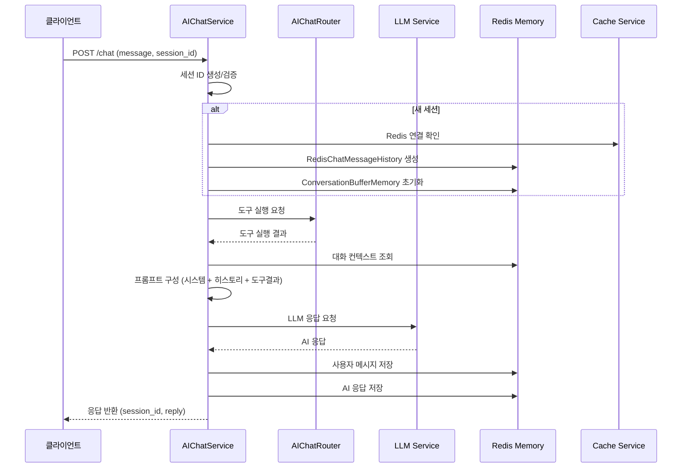
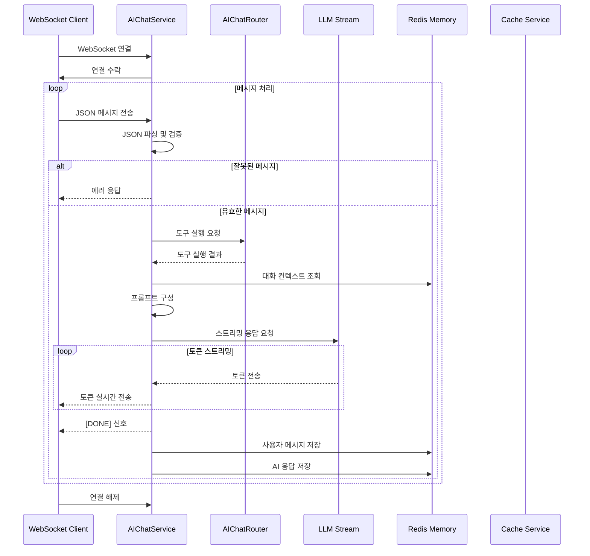
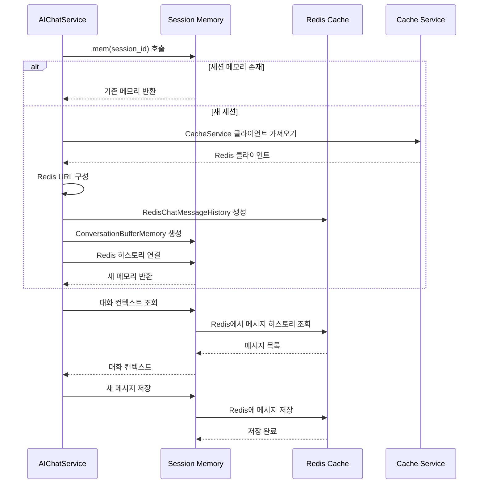
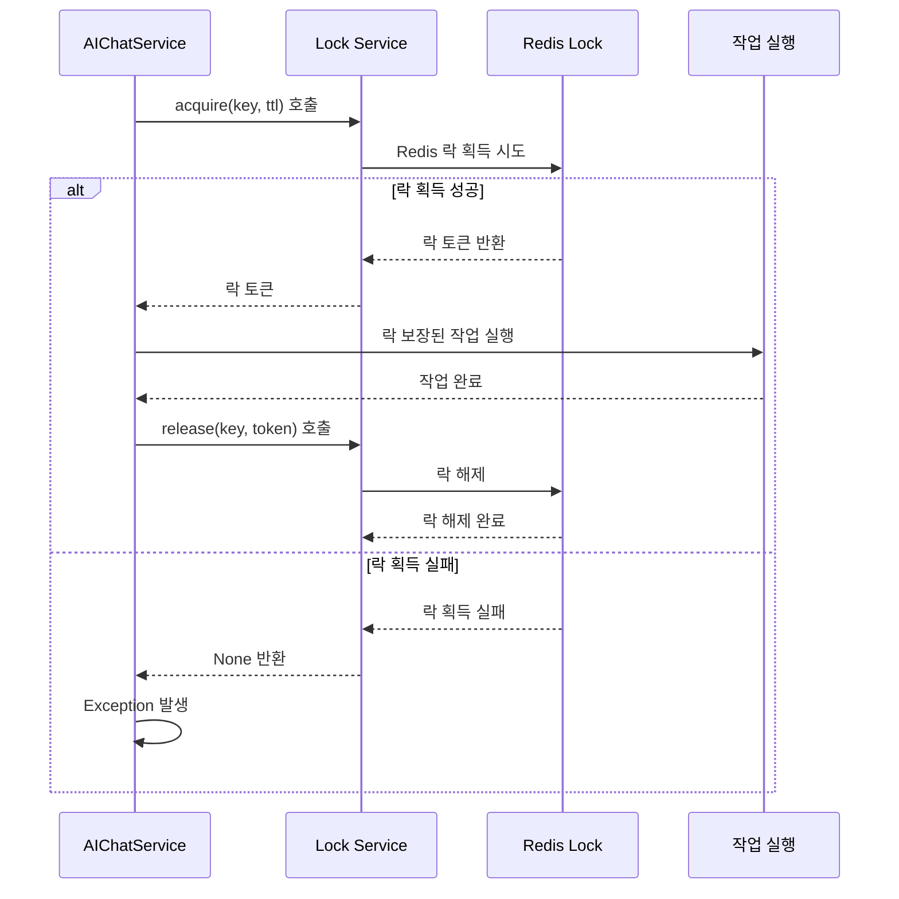

# Chat Service — AI Trading Platform 채팅 인프라

> **v1.0.0**  
> **최종 업데이트**: 2025년 1월  
> **담당자**: Chat Service Development Team

---

## 🎯 개요

Chat Service는 AI Trading Platform의 채팅 인프라 계층으로, AI 채팅 시스템의 핵심 기능을 제공합니다. 

- **AIChatService**: LLM 기반 AI 채팅 응답 생성 및 세션 관리
- **Redis 기반 메모리**: 대화 컨텍스트 유지 및 세션별 메모리 관리
- **WebSocket 스트리밍**: 실시간 스트리밍 채팅 응답
- **분산 락**: 동시 요청 처리 시 데이터 일관성 보장

이 계층은 LLM 서비스와 연동하여 사용자와의 자연스러운 대화를 지원하며, Redis를 통한 효율적인 세션 관리와 WebSocket을 통한 실시간 통신을 제공합니다.

---

## 🏗️ 프로젝트 구조

```
base_server/service/chat/
├── __init__.py                    # 패키지 초기화
└── chat_cache_service.py          # AI 채팅 서비스 핵심
```

---

## 🚀 Core Features

### **1. AI 채팅 서비스 (AIChatService)**

#### **🤖 LLM 통합**
- **LangChain 기반**: OpenAI GPT 모델과의 통합
- **도구 체인**: AIChatRouter를 통한 다양한 도구 실행
- **프롬프트 관리**: 시스템 프롬프트와 사용자 메시지 조합

#### **💬 세션 관리**
- **Redis 기반 메모리**: 영구적인 대화 컨텍스트 저장
- **세션별 분리**: 사용자별 독립적인 대화 히스토리
- **자동 세션 생성**: UUID 기반 고유 세션 ID 생성

#### **📡 실시간 통신**
- **WebSocket 지원**: 실시간 양방향 통신
- **스트리밍 응답**: 토큰 단위 실시간 응답 전송
- **REST API 지원**: 일반적인 HTTP 요청/응답 처리

### **2. 메모리 관리 시스템**

#### **🔐 Redis 통합**
- **네임스페이스 관리**: `{cache_key}:chat:` 접두사로 채팅 데이터 분리
- **연결 풀링**: CacheService를 통한 효율적인 Redis 연결 관리
- **비밀번호 지원**: 보안이 설정된 Redis 환경 지원

#### **📝 대화 히스토리**
- **ConversationBufferMemory**: LangChain 기반 대화 메모리
- **RedisChatMessageHistory**: Redis에 대화 내용 영구 저장
- **자동 정리**: 세션 만료 시 메모리 자동 정리

### **3. 분산 처리 및 동시성**

#### **🔒 분산 락 시스템**
- **동시성 제어**: 동일 세션에 대한 동시 요청 처리 시 데이터 일관성 보장
- **TTL 설정**: 락의 자동 만료 시간 설정 (기본 10초)
- **자동 해제**: 작업 완료 후 락 자동 해제

#### **⚡ 비동기 처리**
- **asyncio 기반**: 비동기 WebSocket 및 HTTP 요청 처리
- **이벤트 루프**: Python 이벤트 루프를 통한 효율적인 비동기 처리
- **동시 요청**: 다중 사용자의 동시 채팅 요청 처리

---

## 📚 사용된 라이브러리

### **AI & 머신러닝**
- **LangChain**: LLM 통합 및 프롬프트 관리
- **LangChain Community**: Redis 기반 채팅 메시지 히스토리
- **LangChain Core**: 프롬프트 템플릿 및 체인 실행

### **웹 프레임워크 & 통신**
- **FastAPI**: WebSocket 및 HTTP 요청 처리
- **WebSocket**: 실시간 양방향 통신
- **HTTPException**: HTTP 오류 응답 처리

### **데이터베이스 & 캐시**
- **Redis**: 대화 히스토리 및 세션 데이터 저장
- **RedisChatMessageHistory**: Redis 기반 채팅 메시지 관리

### **비동기 처리**
- **asyncio**: 비동기 프로그래밍 및 이벤트 루프 관리
- **asyncio.get_event_loop()**: 이벤트 루프 접근
- **asyncio.run_in_executor()**: 동기 함수를 비동기로 실행

### **유틸리티**
- **uuid**: 고유 식별자 생성
- **json**: JSON 데이터 파싱 및 직렬화
- **os**: 운영체제 관련 기능

---

## 🔧 주요 클래스 & 메서드

### **AIChatService (메인 클래스)**

#### **초기화 및 설정**
```python
class AIChatService:
    def __init__(self):
        # LLM 서비스 가져오기
        self.llm = ServiceContainer.get_llm()
        self.llm_stream = ServiceContainer.get_llm_stream() or self.llm
        
        # 세션 메모리 초기화
        self._session_mem: dict[str, ConversationBufferMemory] = {}
        
        # CacheService 의존성 확인
        if not CacheService.is_initialized():
            raise RuntimeError("CacheService is not initialized")
        
        # Redis 키 접두사 설정
        cache_client = self.cache_service.get_client()
        self.KEY_PREFIX = f"{cache_client.cache_key}:chat:"
```

#### **세션 메모리 관리**
```python
def mem(self, session_id: str) -> ConversationBufferMemory:
    """세션별 대화 메모리 관리 (Redis 기반)"""
    if session_id not in self._session_mem:
        # Redis 연결 URL 구성
        cache_client = self.cache_service.get_client()
        redis_url = f"redis://{cache_client._host}:{cache_client._port}/{cache_client._db}"
        
        # 비밀번호가 있는 경우 포함
        if cache_client._password:
            redis_url = f"redis://:{cache_client._password}@{cache_client._host}:{cache_client._port}/{cache_client._db}"
        
        # Redis 기반 채팅 히스토리 생성
        history = RedisChatMessageHistory(
            session_id=session_id,
            url=redis_url,
            key_prefix=self.KEY_PREFIX,
        )
        
        # LangChain 메모리 생성
        self._session_mem[session_id] = ConversationBufferMemory(
            chat_memory=history,
            return_messages=True
        )
    
    return self._session_mem[session_id]
```

#### **REST API 채팅**
```python
async def chat(self, message: str, session_id: str = ""):
    """REST API용 채팅 응답 생성"""
    if not message.strip():
        raise HTTPException(400, "message empty")
    
    # 세션 ID 생성 또는 사용
    sid = session_id or str(uuid.uuid4())
    
    # 이벤트 루프에서 도구 실행
    loop = asyncio.get_event_loop()
    router = AIChatRouter()
    tool_out = await loop.run_in_executor(None, router.run_question, message)
    
    # 전체 응답 생성
    answer = await self._full_answer(sid, message, tool_out)
    
    return {"session_id": sid, "reply": answer}
```

#### **WebSocket 스트리밍 채팅**
```python
async def stream(self, ws: WebSocket):
    """WebSocket용 스트리밍 채팅 응답 생성"""
    await ws.accept()
    
    try:
        while True:
            # 클라이언트로부터 메시지 수신
            data = await ws.receive_text()
            
            try:
                req = json.loads(data)
                q = req["message"].strip()
                sid = req.get("session_id") or str(uuid.uuid4())
            except (KeyError, json.JSONDecodeError):
                await ws.send_text(json.dumps({"error": "bad payload"}))
                continue
            
            if not q:
                await ws.send_text(json.dumps({"error": "empty message"}))
                continue
            
            # 도구 실행
            router = AIChatRouter()
            tool_out = await asyncio.get_running_loop().run_in_executor(
                None, router.run_question, q
            )
            
            # 도구 결과 결합
            joined = "\n".join(tool_out) if isinstance(tool_out, list) else str(tool_out)
            
            # 메모리에서 대화 컨텍스트 가져오기
            memory = self.mem(sid)
            
            # 프롬프트 구성
            prompt = ChatPromptTemplate.from_messages(
                [("system", "당신은 친절하고 정확한 AI 비서입니다.")] +
                memory.buffer +
                [("user", f'{q}\n\n🛠 도구 결과:\n{joined}')]
            )
            
            # 스트리밍 응답 생성
            stream = (prompt | self.llm_stream).astream({})
            full_resp = ""
            
            async for chunk in stream:
                token = getattr(chunk, "content", "")
                if token:
                    full_resp += token
                    await ws.send_text(token)
            
            # 스트리밍 완료 신호
            await ws.send_text("[DONE]")
            
            # 대화 히스토리에 저장
            memory.chat_memory.add_user_message(q)
            memory.chat_memory.add_ai_message(full_resp)
            
    except WebSocketDisconnect:
        return
```

#### **전체 응답 생성**
```python
async def _full_answer(self, sid: str, question: str, tool_out):
    """전체 응답 생성 (REST API용)"""
    # 도구 결과 결합
    joined = "\n".join(tool_out) if isinstance(tool_out, list) else str(tool_out)
    
    # 메모리에서 대화 컨텍스트 가져오기
    memory = self.mem(sid)
    
    # 프롬프트 구성
    prompt = ChatPromptTemplate.from_messages(
        [("system", "당신은 친절하고 정확한 AI 비서입니다.")] +
        memory.buffer +
        [("user", f'{question}\n\n🛠 도구 결과:\n{joined}')]
    )
    
    # LLM 응답 생성
    answer = (prompt | self.llm).invoke({}).content
    
    # 대화 히스토리에 저장
    memory.chat_memory.add_user_message(question)
    
    # 응답 형식 정규화
    if isinstance(answer, list):
        answer = "\n".join(str(x) for x in answer)
    
    memory.chat_memory.add_ai_message(answer)
    return answer
```

#### **분산 락 처리**
```python
async def do_with_lock(self, key: str, ttl: int = 10):
    """분산 락을 사용한 작업 실행"""
    lock_service = ServiceContainer.get_lock_service()
    
    # 락 획득
    token = await lock_service.acquire(key, ttl=ttl)
    if not token:
        raise Exception("락 획득 실패")
    
    try:
        # 락이 보장된 작업 수행
        pass
    finally:
        # 락 해제
        await lock_service.release(key, token)
```

---

## 🔄 서비스 흐름 및 아키텍처

### **1. REST API 채팅 흐름**



### **2. WebSocket 스트리밍 채팅 흐름**



### **3. 세션 메모리 관리 흐름**



### **4. 분산 락 처리 흐름**



---

## 🛠️ 설정 및 사용법

### **서비스 초기화**

#### **기본 초기화**
```python
from service.chat.chat_cache_service import AIChatService

# AIChatService 인스턴스 생성
chat_service = AIChatService()

# 의존성 확인
# - CacheService가 초기화되어 있어야 함
# - ServiceContainer에 LLM 서비스가 등록되어 있어야 함
```

#### **의존성 설정**
```python
from service.service_container import ServiceContainer
from service.cache.cache_service import CacheService

# 1. CacheService 초기화 (Redis 연결)
cache_service = CacheService.get_instance()

# 2. LLM 서비스 등록
llm_service = get_llm_service()  # OpenAI 등
ServiceContainer.register_llm(llm_service)

# 3. AIChatService 생성
chat_service = AIChatService()
```

### **REST API 채팅 사용**

#### **단일 채팅 요청**
```python
# 채팅 요청
response = await chat_service.chat(
    message="테슬라 주식 분석해줘",
    session_id="user_123_session"
)

# 응답
# {
#     "session_id": "user_123_session",
#     "reply": "테슬라 주식에 대한 분석 결과..."
# }
```

#### **세션 관리**
```python
# 기존 세션으로 계속 대화
response1 = await chat_service.chat(
    message="테슬라 주식 분석해줘",
    session_id="user_123_session"
)

response2 = await chat_service.chat(
    message="그럼 포트폴리오에 추가하는 게 좋을까?",
    session_id="user_123_session"  # 같은 세션 ID 사용
)
```

### **WebSocket 스트리밍 채팅 사용**

#### **WebSocket 엔드포인트 설정**
```python
from fastapi import WebSocket
from service.chat.chat_cache_service import AIChatService

@app.websocket("/ws/chat")
async def websocket_endpoint(websocket: WebSocket):
    chat_service = AIChatService()
    await chat_service.stream(websocket)
```

#### **클라이언트 메시지 형식**
```json
{
    "message": "테슬라 주식 분석해줘",
    "session_id": "user_123_session"
}
```

#### **서버 응답 형식**
```
테슬라 주식에 대한 분석을 시작하겠습니다...

테슬라(TSLA)는 전기차 시장의 선두주자로...

[DONE]
```

### **분산 락 사용**

#### **동시성 제어가 필요한 작업**
```python
async def process_critical_operation(self, user_id: str):
    """중요한 작업을 분산 락으로 보호"""
    lock_key = f"user_operation:{user_id}"
    
    try:
        await self.do_with_lock(lock_key, ttl=30)
        # 락이 보장된 작업 수행
        result = await self.perform_critical_operation(user_id)
        return result
    except Exception as e:
        Logger.error(f"중요 작업 실패: {e}")
        raise
```

---

## 🔍 모니터링 및 디버깅

### **서비스 상태 확인**

#### **CacheService 의존성 확인**
```python
from service.cache.cache_service import CacheService

# CacheService 초기화 상태 확인
if CacheService.is_initialized():
    print("✅ CacheService 정상 초기화됨")
else:
    print("❌ CacheService 초기화되지 않음")
```

#### **Redis 연결 상태 확인**
```python
from service.cache.cache_service import CacheService

try:
    cache_service = CacheService.get_instance()
    cache_client = cache_service.get_client()
    
    # Redis 연결 테스트
    test_key = "chat_test_connection"
    await cache_client.set_string(test_key, "test", expire=10)
    result = await cache_client.get_string(test_key)
    
    if result == "test":
        print("✅ Redis 연결 정상")
    else:
        print("❌ Redis 연결 문제")
        
except Exception as e:
    print(f"❌ Redis 연결 실패: {e}")
```

### **세션 메모리 디버깅**

#### **세션별 메모리 상태 확인**
```python
# 특정 세션의 메모리 상태 확인
session_id = "user_123_session"
memory = chat_service.mem(session_id)

print(f"세션 ID: {session_id}")
print(f"메모리 타입: {type(memory)}")
print(f"버퍼 길이: {len(memory.buffer)}")

# 대화 히스토리 확인
for i, message in enumerate(memory.buffer):
    print(f"{i}: {message.type} - {message.content[:100]}...")
```

#### **Redis 키 패턴 확인**
```python
# Redis에 저장된 채팅 데이터 확인
import redis

redis_client = redis.Redis(host='localhost', port=6379, db=0)

# 채팅 관련 키 패턴 검색
chat_keys = redis_client.keys("finance_app:chat:*")
print(f"채팅 관련 키 수: {len(chat_keys)}")

for key in chat_keys[:5]:  # 처음 5개만 출력
    print(f"키: {key.decode()}")
    value = redis_client.get(key)
    print(f"값: {value.decode()[:100]}...")
```

### **성능 모니터링**

#### **응답 시간 측정**
```python
import time

async def measure_chat_performance():
    """채팅 성능 측정"""
    start_time = time.time()
    
    response = await chat_service.chat(
        message="간단한 질문",
        session_id="perf_test_session"
    )
    
    end_time = time.time()
    response_time = (end_time - start_time) * 1000
    
    print(f"응답 시간: {response_time:.2f}ms")
    print(f"응답 길이: {len(response['reply'])} 문자")
    
    return response_time
```

#### **메모리 사용량 모니터링**
```python
import psutil
import os

def monitor_memory_usage():
    """메모리 사용량 모니터링"""
    process = psutil.Process(os.getpid())
    memory_info = process.memory_info()
    
    print(f"RSS 메모리: {memory_info.rss / 1024 / 1024:.2f} MB")
    print(f"VMS 메모리: {memory_info.vms / 1024 / 1024:.2f} MB")
    
    # 세션 메모리 개수
    session_count = len(chat_service._session_mem)
    print(f"활성 세션 수: {session_count}")
    
    return memory_info.rss
```

---

## 🔧 코드 특징

### **1. 확장성과 유연성**
- **인터페이스 기반**: ServiceContainer를 통한 의존성 주입
- **플러그인 아키텍처**: 다양한 LLM 서비스 쉽게 교체 가능
- **설정 기반**: Redis 키 접두사, TTL 등 설정 가능

### **2. 성능과 안정성**
- **비동기 처리**: asyncio 기반의 고성능 비동기 처리
- **메모리 최적화**: 세션별 메모리 캐싱 및 자동 정리
- **연결 풀링**: CacheService를 통한 효율적인 Redis 연결 관리

### **3. 운영 편의성**
- **자동 세션 관리**: UUID 기반 자동 세션 생성 및 관리
- **에러 처리**: WebSocket 연결 해제, 잘못된 메시지 등 예외 상황 처리
- **로깅 지원**: ServiceContainer를 통한 중앙화된 로깅

### **4. 실시간 통신**
- **스트리밍 응답**: 토큰 단위 실시간 응답으로 사용자 경험 향상
- **양방향 통신**: WebSocket을 통한 실시간 양방향 대화
- **연결 관리**: 자동 연결 해제 처리 및 에러 복구

---

### **테스트 환경**

#### **1. 단위 테스트**
```python
# test_chat_service.py
import pytest
import asyncio
from service.chat.chat_cache_service import AIChatService

@pytest.mark.asyncio
async def test_chat_service_initialization():
    """AIChatService 초기화 테스트"""
    try:
        chat_service = AIChatService()
        assert chat_service is not None
        print("✅ AIChatService 초기화 성공")
    except Exception as e:
        pytest.fail(f"AIChatService 초기화 실패: {e}")

@pytest.mark.asyncio
async def test_session_memory_management():
    """세션 메모리 관리 테스트"""
    chat_service = AIChatService()
    session_id = "test_session_001"
    
    # 새 세션 메모리 생성
    memory = chat_service.mem(session_id)
    assert memory is not None
    assert len(memory.buffer) == 0
    
    print("✅ 세션 메모리 관리 테스트 성공")
```

#### **2. 통합 테스트**
```python
# integration_test.py
import asyncio
from service.chat.chat_cache_service import AIChatService

async def test_full_chat_flow():
    """전체 채팅 플로우 테스트"""
    chat_service = AIChatService()
    session_id = "integration_test_session"
    
    # 1. 첫 번째 질문
    response1 = await chat_service.chat(
        message="안녕하세요",
        session_id=session_id
    )
    
    print(f"첫 번째 응답: {response1['reply'][:100]}...")
    
    # 2. 두 번째 질문 (컨텍스트 유지)
    response2 = await chat_service.chat(
        message="제 이름이 뭐였죠?",
        session_id=session_id
    )
    
    print(f"두 번째 응답: {response2['reply'][:100]}...")
    
    # 3. 세션 메모리 확인
    memory = chat_service.mem(session_id)
    print(f"대화 히스토리 길이: {len(memory.buffer)}")
    
    print("✅ 전체 채팅 플로우 테스트 성공")

if __name__ == "__main__":
    asyncio.run(test_full_chat_flow())
```

#### **3. WebSocket 테스트**
```python
# test_websocket.py
import asyncio
import websockets
import json

async def test_websocket_chat():
    """WebSocket 채팅 테스트"""
    uri = "ws://localhost:8000/ws/chat"
    
    async with websockets.connect(uri) as websocket:
        print("WebSocket 연결됨")
        
        # 메시지 전송
        message = {
            "message": "테슬라 주식 분석해줘",
            "session_id": "websocket_test_session"
        }
        
        await websocket.send(json.dumps(message))
        print(f"메시지 전송: {message}")
        
        # 스트리밍 응답 수신
        full_response = ""
        while True:
            try:
                response = await websocket.recv()
                if response == "[DONE]":
                    break
                full_response += response
                print(f"토큰 수신: {response}")
            except websockets.exceptions.ConnectionClosed:
                break
        
        print(f"전체 응답: {full_response[:200]}...")

if __name__ == "__main__":
    asyncio.run(test_websocket_chat())
```


---

## 🎯 결론

Chat Service는 AI Trading Platform의 채팅 인프라 계층으로, **AIChatService**를 통해 LLM 기반의 지능형 채팅 시스템을 제공합니다.

### **주요 특징**
- **LLM 통합**: LangChain 기반의 다양한 LLM 서비스 지원
- **실시간 통신**: WebSocket을 통한 스트리밍 채팅 응답
- **세션 관리**: Redis 기반의 영구적인 대화 컨텍스트 유지
- **확장 가능한 구조**: ServiceContainer를 통한 유연한 의존성 관리

### **사용 사례**
- **AI 비서**: 주식 분석, 포트폴리오 조언, 시장 정보 제공
- **실시간 지원**: 사용자 질문에 대한 즉시 응답 및 도움
- **대화형 인터페이스**: 자연스러운 대화를 통한 복잡한 작업 수행
- **멀티 세션**: 다중 사용자의 동시 채팅 지원


