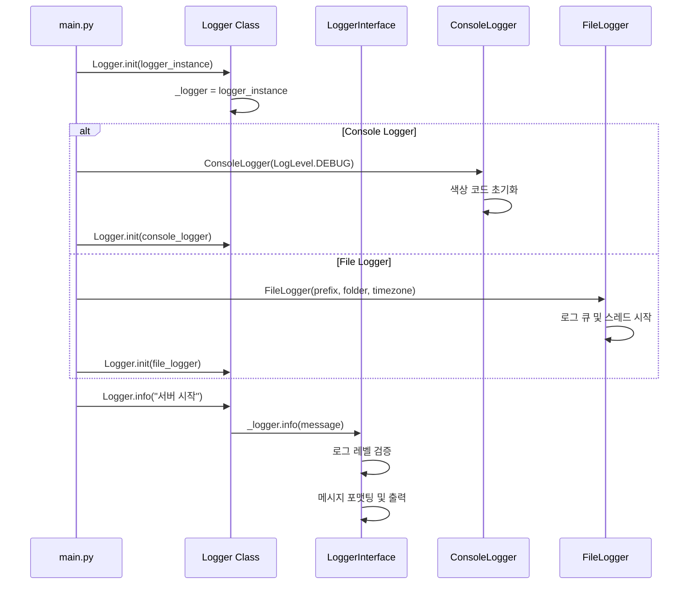
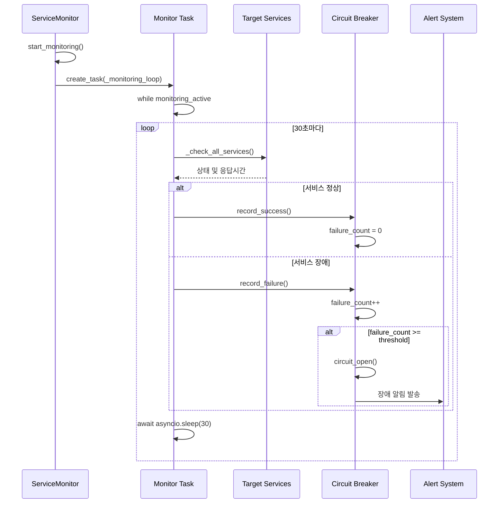
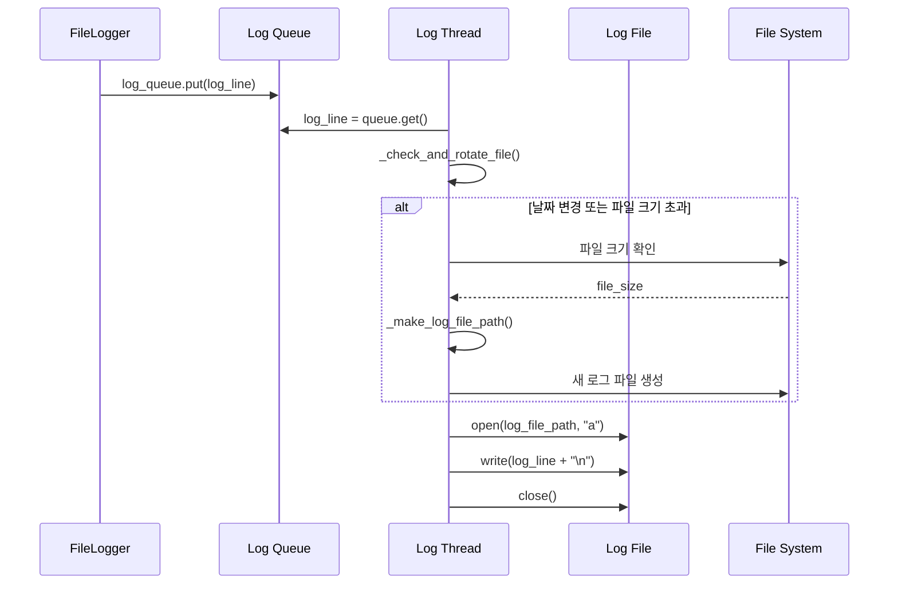
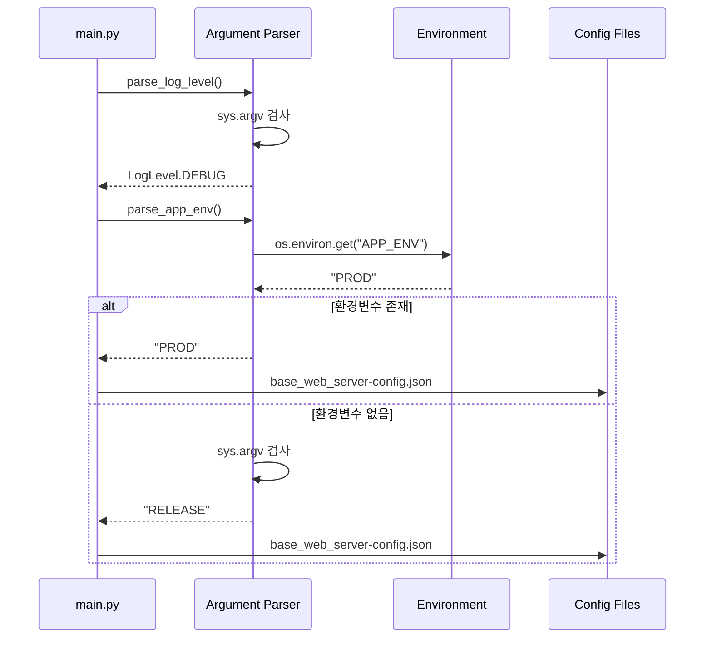

# Core Service — AI Trading Platform 핵심 인프라

> **v1.0.0**  
> **최종 업데이트**: 2025년 1월  
> **담당자**: Core Service Development Team

---

## 🎯 개요

Core Service는 AI Trading Platform의 핵심 인프라 계층으로, 모든 서비스에서 공통으로 사용되는 기본 기능들을 제공합니다. 

- **Logger**: 구조화된 로깅 시스템 (콘솔, 파일, 색상 구분)
- **Service Monitor**: 런타임 서비스 상태 모니터링 및 자동 복구
- **Argument Parser**: 명령행 인자 및 환경 변수 파싱 유틸리티

이 계층은 다른 모든 서비스의 기반이 되며, 일관된 로깅, 모니터링, 설정 관리를 보장합니다.

---

## 🏗️ 프로젝트 구조

```
base_server/service/core/
├── __init__.py                    # 패키지 초기화
├── logger.py                      # 로깅 시스템 핵심
├── service_monitor.py             # 서비스 상태 모니터링
└── argparse_util.py               # 명령행 인자 파싱 유틸리티
```

---

## 🚀 Core Features

### **1. Logger System (logger.py)**

#### **🔧 로그 레벨 시스템**
- **7단계 로그 레벨**: FATAL(1) → ERROR(2) → INFO(3) → WARN(4) → DEBUG(5) → TRACE(6) → ALL(7)
- **레벨별 색상 구분**: 콘솔 출력 시 로그 레벨별 색상 적용
- **동적 레벨 조정**: 런타임에 로그 레벨 변경 가능

#### **📝 로거 구현체**
- **ConsoleLogger**: 콘솔 전용 로거 (개발/디버깅용)
- **FileLogger**: 파일 기반 로거 (운영/프로덕션용)
- **LoggerInterface**: 모든 로거의 공통 인터페이스

#### **🔄 파일 로테이션 시스템**
- **날짜 기반**: 매일 새로운 로그 파일 생성
- **크기 기반**: 설정된 크기 초과 시 자동 파일 전환
- **시간대 지원**: KST(한국), UTC 등 다양한 시간대 지원

### **2. Service Monitor (service_monitor.py)**

#### **🏥 서비스 상태 모니터링**
- **실시간 체크**: 30초마다 모든 서비스 상태 확인
- **Circuit Breaker 패턴**: 연쇄 장애 방지 및 자동 복구
- **상태 분류**: HEALTHY, DEGRADED, UNHEALTHY, UNKNOWN

#### **📊 모니터링 대상 서비스**
- **데이터베이스**: MySQL 연결 및 쿼리 성능
- **캐시**: Redis 연결 및 데이터 읽기/쓰기
- **외부 서비스**: S3, OpenSearch, Bedrock 등
- **비즈니스 서비스**: 한국투자증권 API, 알림 서비스 등

#### **🔄 자동 복구 메커니즘**
- **실패 임계값**: 3회 연속 실패 시 circuit open
- **복구 타임아웃**: 5분 후 circuit half-open으로 전환
- **성공 시 복구**: 성공 시 circuit closed로 자동 복구

### **3. Argument Parser (argparse_util.py)**

#### **⚙️ 환경 설정 파싱**
- **로그 레벨**: `logLevel=DEBUG` 형태의 명령행 인자 파싱
- **애플리케이션 환경**: `app_env=LOCAL` 형태의 환경 설정
- **환경변수 우선**: Docker/CI/CD 환경에서 환경변수 우선 적용

#### **🎯 환경별 설정 파일 선택**
- **LOCAL**: `base_web_server-config_local.json` (로컬 개발)
- **DEBUG**: `base_web_server-config_debug.json` (개발/테스트)
- **PROD/RELEASE**: `base_web_server-config.json` (운영)

---

## 📚 사용된 라이브러리

### **Python 표준 라이브러리**
- **enum**: 로그 레벨 열거형 정의
- **datetime**: 시간대별 로그 파일명 생성
- **threading**: 비동기 파일 로깅을 위한 스레드 관리
- **queue**: 로그 메시지 큐 관리
- **os**: 파일 시스템 조작 및 경로 관리

### **비동기 처리**
- **asyncio**: 서비스 모니터링의 비동기 태스크 관리
- **asyncio.Task**: 백그라운드 모니터링 태스크 생성

### **타입 힌팅**
- **typing**: Optional, Dict, Any, List 등 타입 힌트
- **dataclass**: 서비스 상태 정보를 위한 데이터 클래스

---

## 🔧 주요 클래스 & 메서드

### **Logger System**

#### **LoggerInterface (추상 클래스)**
```python
class LoggerInterface:
    def set_level(self, level: LogLevel): ...
    def info(self, text: str): ...
    def error(self, text: str): ...
    def warn(self, text: str): ...
    def debug(self, text: str): ...
    def trace(self, text: str): ...
    def close(self): ...
```

#### **ConsoleLogger (콘솔 전용)**
```python
class ConsoleLogger(LoggerInterface):
    def __init__(self, log_level: LogLevel):
        # ANSI 색상 코드로 로그 레벨별 색상 구분
        self._color_codes = {
            LogLevel.FATAL: "\033[41;97m",  # 빨간색 배경 + 흰색
            LogLevel.ERROR: "\033[91m",     # 빨간색
            LogLevel.WARN: "\033[93m",      # 노란색
            LogLevel.INFO: "\033[92m",      # 녹색
            LogLevel.DEBUG: "\033[94m",     # 파란색
            LogLevel.TRACE: "\033[95m"      # 자주색
        }
```

#### **FileLogger (파일 기반)**
```python
class FileLogger(LoggerInterface):
    def __init__(self, log_level: LogLevel = LogLevel.INFO, 
                 use_console: bool = True, prefix: str = "App", 
                 folder: str = "log", timezone: str = "UTC", 
                 max_file_size_kb: int = 1024):
        # 비동기 파일 로깅을 위한 큐 및 스레드 관리
        self._log_queue = Queue()
        self._thread = threading.Thread(target=self._run, daemon=True)
        self._thread.start()
    
    def _make_log_file_path(self):
        # 시간대별 로그 파일명 생성
        # 예: App_2025-01-20_001_KST.log
```

#### **Logger (정적 싱글톤)**
```python
class Logger:
    _logger: Optional[LoggerInterface] = None
    
    @classmethod
    def init(cls, logger: LoggerInterface):
        cls._logger = logger
    
    @classmethod
    def info(cls, log: str):
        if cls._logger:
            cls._logger.info(log)
```

### **Service Monitor**

#### **ServiceStatus (열거형)**
```python
class ServiceStatus(Enum):
    HEALTHY = "healthy"      # 정상 동작
    DEGRADED = "degraded"    # 성능 저하
    UNHEALTHY = "unhealthy"  # 장애 상태
    UNKNOWN = "unknown"      # 상태 불명
```

#### **ServiceHealth (데이터 클래스)**
```python
@dataclass
class ServiceHealth:
    name: str                    # 서비스 이름
    status: ServiceStatus        # 현재 상태
    last_check: datetime         # 마지막 체크 시간
    response_time_ms: float      # 응답 시간 (밀리초)
    error_message: Optional[str] = None  # 오류 메시지
    consecutive_failures: int = 0        # 연속 실패 횟수
    last_success: Optional[datetime] = None  # 마지막 성공 시간
```

#### **ServiceMonitor (메인 클래스)**
```python
class ServiceMonitor:
    def __init__(self):
        self._service_health: Dict[str, ServiceHealth] = {}
        self._monitoring_active = False
        self._monitor_task: Optional[asyncio.Task] = None
        self._check_interval = 30        # 30초마다 체크
        self._failure_threshold = 3      # 3회 연속 실패시 circuit open
        self._recovery_timeout = 300     # 5분 후 circuit half-open
    
    async def start_monitoring(self):
        """모니터링 시작 - 백그라운드 태스크로 실행"""
        self._monitor_task = asyncio.create_task(self._monitoring_loop())
    
    async def _check_all_services(self):
        """모든 서비스 상태 체크 - 17개 서비스 대상"""
        checks = [
            ("database", self._check_database),
            ("cache", self._check_cache),
            ("lock", self._check_lock_service),
            # ... 기타 서비스들
        ]
```

### **Argument Parser**

#### **로그 레벨 파싱**
```python
def parse_log_level(args: Optional[List[str]] = None) -> LogLevel:
    """명령행 인자에서 로그 레벨 추출"""
    if args is None:
        args = sys.argv[1:]
    
    for arg in args:
        if arg.lower().startswith("loglevel="):
            level_str = arg.split("=", 1)[1].upper()
            try:
                return LogLevel[level_str]
            except KeyError:
                pass
    
    return LogLevel.ALL  # 기본값
```

#### **애플리케이션 환경 파싱**
```python
def parse_app_env(args: Optional[List[str]] = None) -> str:
    """환경 설정 우선순위에 따른 환경 결정"""
    # 🥇 1순위: 환경변수 APP_ENV (Docker/CI/CD 표준)
    env_from_env = os.environ.get("APP_ENV")
    if env_from_env:
        return env_from_env.upper()
    
    # 🥈 2순위: 명령행 인자 app_env=VALUE
    for arg in args:
        if arg.lower().startswith("app_env="):
            return arg.split("=", 1)[1].upper()
    
    # 🥉 3순위: 기본값 RELEASE
    return "RELEASE"
```

---

## 🔄 서비스 흐름 및 아키텍처

### **1. 로깅 시스템 초기화 흐름**



### **2. 서비스 모니터링 흐름**



### **3. 로그 파일 로테이션 흐름**



### **4. 환경 설정 파싱 흐름**



---

## 🛠️ 설정 및 사용법

### **로거 초기화**

#### **ConsoleLogger (개발용)**
```python
from service.core.logger import Logger, ConsoleLogger, LogLevel

# 콘솔 전용 로거 (개발/디버깅)
console_logger = ConsoleLogger(log_level=LogLevel.DEBUG)
Logger.init(console_logger)

# 사용
Logger.info("서버 시작됨")
Logger.debug("디버그 정보")
Logger.error("오류 발생")
```

#### **FileLogger (운영용)**
```python
from service.core.logger import Logger, FileLogger, LogLevel

# 파일 기반 로거 (운영/프로덕션)
file_logger = FileLogger(
    log_level=LogLevel.INFO,
    use_console=True,           # 콘솔에도 출력
    prefix="base_web_server",   # 로그 파일 접두사
    folder="logs",              # 로그 디렉토리
    timezone="KST",             # 한국 시간대
    max_file_size_kb=10240      # 10MB 제한
)
Logger.init(file_logger)

# 사용
Logger.info("운영 로그 기록")
Logger.warn("경고 메시지")
Logger.error("오류 로그")
```

### **서비스 모니터링 설정**

#### **모니터링 시작**
```python
from service.core.service_monitor import ServiceMonitor

# 서비스 모니터링 시작
monitor = ServiceMonitor()
await monitor.start_monitoring()

# 모니터링 중지
await monitor.stop_monitoring()
```

#### **커스텀 체크 함수 추가**
```python
class CustomServiceMonitor(ServiceMonitor):
    async def _check_custom_service(self, service_name: str):
        """커스텀 서비스 상태 체크"""
        start_time = time.time()
        
        try:
            # 커스텀 서비스 체크 로직
            result = await custom_service.health_check()
            response_time = (time.time() - start_time) * 1000
            
            if result:
                self._record_success(service_name, response_time)
            else:
                raise Exception("Custom service check failed")
                
        except Exception as e:
            response_time = (time.time() - start_time) * 1000
            self._record_failure(service_name, str(e), response_time)
```

### **명령행 인자 파싱**

#### **로그 레벨 설정**
```bash
# 명령행에서 로그 레벨 설정
python main.py logLevel=DEBUG

# 환경변수로 설정
export LOG_LEVEL=DEBUG
python main.py

# 기본값: LogLevel.ALL (모든 로그 출력)
```

#### **애플리케이션 환경 설정**
```bash
# 명령행에서 환경 설정
python main.py app_env=LOCAL

# 환경변수로 설정 (Docker/CI/CD 권장)
export APP_ENV=PROD
python main.py

# 우선순위: 환경변수 > 명령행 인자 > 기본값(RELEASE)
```

---

## 🔍 모니터링 및 디버깅

### **로거 상태 확인**

#### **로거 활성화 상태**
```python
from service.core.logger import Logger

# 로거가 초기화되었는지 확인
if Logger.is_active():
    Logger.info("로거가 정상 동작 중")
else:
    print("로거가 초기화되지 않음")
```

#### **로그 레벨 변경**
```python
from service.core.logger import Logger, LogLevel

# 런타임에 로그 레벨 변경
Logger.set_level(LogLevel.DEBUG)  # 디버그 레벨로 변경
Logger.set_level(LogLevel.INFO)   # 정보 레벨로 변경
```

### **서비스 모니터링 상태**

#### **모니터링 상태 확인**
```python
from service.core.service_monitor import ServiceMonitor

monitor = ServiceMonitor()

# 모니터링 활성 상태
if monitor._monitoring_active:
    print("서비스 모니터링이 활성화됨")
else:
    print("서비스 모니터링이 비활성화됨")

# 특정 서비스 상태 확인
service_health = monitor._service_health.get("database")
if service_health:
    print(f"데이터베이스 상태: {service_health.status}")
    print(f"응답 시간: {service_health.response_time_ms}ms")
```

#### **모니터링 설정 조정**
```python
# 체크 간격 조정 (초 단위)
monitor._check_interval = 60  # 1분마다 체크

# 실패 임계값 조정
monitor._failure_threshold = 5  # 5회 연속 실패시 circuit open

# 복구 타임아웃 조정 (초 단위)
monitor._recovery_timeout = 600  # 10분 후 circuit half-open
```

### **로그 파일 관리**

#### **로그 파일 경로 확인**
```python
from service.core.logger import FileLogger

file_logger = FileLogger(prefix="test", folder="logs")
print(f"현재 로그 파일: {file_logger._log_file_path}")
print(f"로그 디렉토리: {file_logger._folder}")
print(f"최대 파일 크기: {file_logger._max_file_size_bytes} bytes")
```

#### **로그 파일 로테이션 강제**
```python
# 파일 크기 체크 및 로테이션 강제 실행
file_logger._check_and_rotate_file()

# 새 로그 파일 경로 생성
new_path = file_logger._make_log_file_path()
print(f"새 로그 파일: {new_path}")
```

---

## 🔧 코드 특징

### **1. 확장성과 유연성**
- **인터페이스 기반**: LoggerInterface로 다양한 로거 구현체 지원
- **플러그인 아키텍처**: 새로운 로거 타입 쉽게 추가 가능
- **설정 기반**: 런타임에 로그 레벨, 모니터링 간격 등 조정 가능

### **2. 성능과 안정성**
- **비동기 처리**: 서비스 모니터링을 백그라운드 태스크로 실행
- **큐 기반 로깅**: 파일 I/O를 별도 스레드로 처리하여 성능 향상
- **Circuit Breaker**: 연쇄 장애 방지 및 자동 복구 메커니즘

### **3. 운영 편의성**
- **자동 로테이션**: 로그 파일 크기 및 날짜 기반 자동 관리
- **시간대 지원**: KST, UTC 등 다양한 시간대 지원
- **색상 구분**: 콘솔 출력 시 로그 레벨별 색상으로 가독성 향상

### **4. 모니터링 및 관찰성**
- **실시간 상태 체크**: 17개 서비스의 실시간 상태 모니터링
- **상세한 메트릭**: 응답 시간, 연속 실패 횟수, 마지막 성공 시간 등
- **자동 알림**: 장애 발생 시 자동 알림 및 복구 시도

---


## 🚀 개발 환경 설정

### **로컬 개발 환경**

#### **1. 로거 테스트**
```python
# test_logger.py
from service.core.logger import Logger, ConsoleLogger, FileLogger, LogLevel

def test_console_logger():
    """콘솔 로거 테스트"""
    console_logger = ConsoleLogger(LogLevel.DEBUG)
    Logger.init(console_logger)
    
    Logger.info("정보 메시지")
    Logger.debug("디버그 메시지")
    Logger.warn("경고 메시지")
    Logger.error("오류 메시지")

def test_file_logger():
    """파일 로거 테스트"""
    file_logger = FileLogger(
        log_level=LogLevel.INFO,
        prefix="test",
        folder="test_logs",
        timezone="KST"
    )
    Logger.init(file_logger)
    
    Logger.info("파일 로그 테스트")
    Logger.warn("경고 메시지 테스트")

if __name__ == "__main__":
    test_console_logger()
    test_file_logger()
```

#### **2. 서비스 모니터링 테스트**
```python
# test_monitor.py
import asyncio
from service.core.service_monitor import ServiceMonitor

async def test_service_monitor():
    """서비스 모니터링 테스트"""
    monitor = ServiceMonitor()
    
    # 모니터링 시작
    await monitor.start_monitoring()
    
    # 2분간 모니터링 실행
    await asyncio.sleep(120)
    
    # 모니터링 중지
    await monitor.stop_monitoring()
    
    # 결과 확인
    for service_name, health in monitor._service_health.items():
        print(f"{service_name}: {health.status}")

if __name__ == "__main__":
    asyncio.run(test_service_monitor())
```

#### **3. 인자 파싱 테스트**
```python
# test_argparse.py
from service.core.argparse_util import parse_log_level, parse_app_env

def test_log_level_parsing():
    """로그 레벨 파싱 테스트"""
    # 시뮬레이션된 명령행 인자
    test_args = ["logLevel=DEBUG", "other_arg=value"]
    
    level = parse_log_level(test_args)
    print(f"파싱된 로그 레벨: {level}")

def test_app_env_parsing():
    """애플리케이션 환경 파싱 테스트"""
    # 시뮬레이션된 명령행 인자
    test_args = ["app_env=LOCAL", "other_arg=value"]
    
    env = parse_app_env(test_args)
    print(f"파싱된 환경: {env}")

if __name__ == "__main__":
    test_log_level_parsing()
    test_app_env_parsing()
```

### **통합 테스트**

#### **전체 시스템 테스트**
```python
# integration_test.py
import asyncio
import os
from service.core.logger import Logger, FileLogger, LogLevel
from service.core.service_monitor import ServiceMonitor
from service.core.argparse_util import parse_log_level, parse_app_env

async def integration_test():
    """Core 서비스 통합 테스트"""
    
    # 1. 로거 초기화
    file_logger = FileLogger(
        log_level=LogLevel.DEBUG,
        prefix="integration_test",
        folder="test_logs",
        timezone="KST"
    )
    Logger.init(file_logger)
    
    # 2. 인자 파싱 테스트
    test_args = ["logLevel=DEBUG", "app_env=LOCAL"]
    log_level = parse_log_level(test_args)
    app_env = parse_app_env(test_args)
    
    Logger.info(f"로그 레벨: {log_level}")
    Logger.info(f"애플리케이션 환경: {app_env}")
    
    # 3. 서비스 모니터링 테스트
    monitor = ServiceMonitor()
    await monitor.start_monitoring()
    
    # 1분간 모니터링
    await asyncio.sleep(60)
    
    # 결과 출력
    for service_name, health in monitor._service_health.items():
        Logger.info(f"{service_name}: {health.status}")
    
    await monitor.stop_monitoring()
    Logger.info("통합 테스트 완료")

if __name__ == "__main__":
    asyncio.run(integration_test())
```


---

## 🎯 결론

Core Service는 AI Trading Platform의 핵심 인프라 계층으로, **Logger**, **Service Monitor**, **Argument Parser** 세 가지 핵심 기능을 제공합니다.

### **주요 특징**
- **일관된 로깅**: 구조화된 로깅 시스템으로 모든 서비스의 로그 통합 관리
- **실시간 모니터링**: 17개 서비스의 실시간 상태 체크 및 자동 복구
- **유연한 설정**: 명령행 인자와 환경변수를 통한 유연한 환경 설정
- **고성능 처리**: 비동기 처리와 큐 기반 로깅으로 성능 최적화

### **사용 사례**
- **개발 환경**: ConsoleLogger를 통한 즉시 피드백과 디버깅
- **운영 환경**: FileLogger와 ServiceMonitor를 통한 안정적인 운영
- **CI/CD 파이프라인**: 환경변수 기반의 자동화된 설정 관리
- **마이크로서비스**: 분산 환경에서의 중앙화된 로깅 및 모니터링


