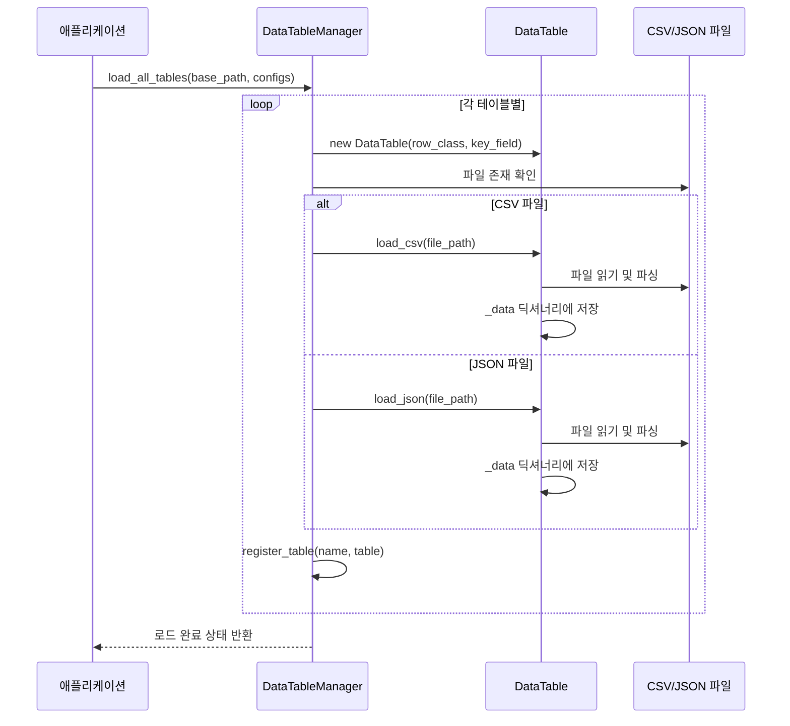
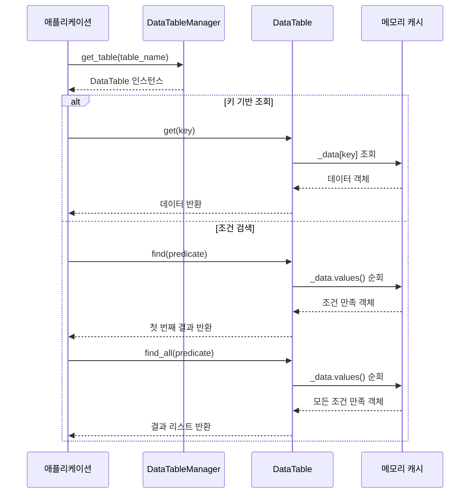
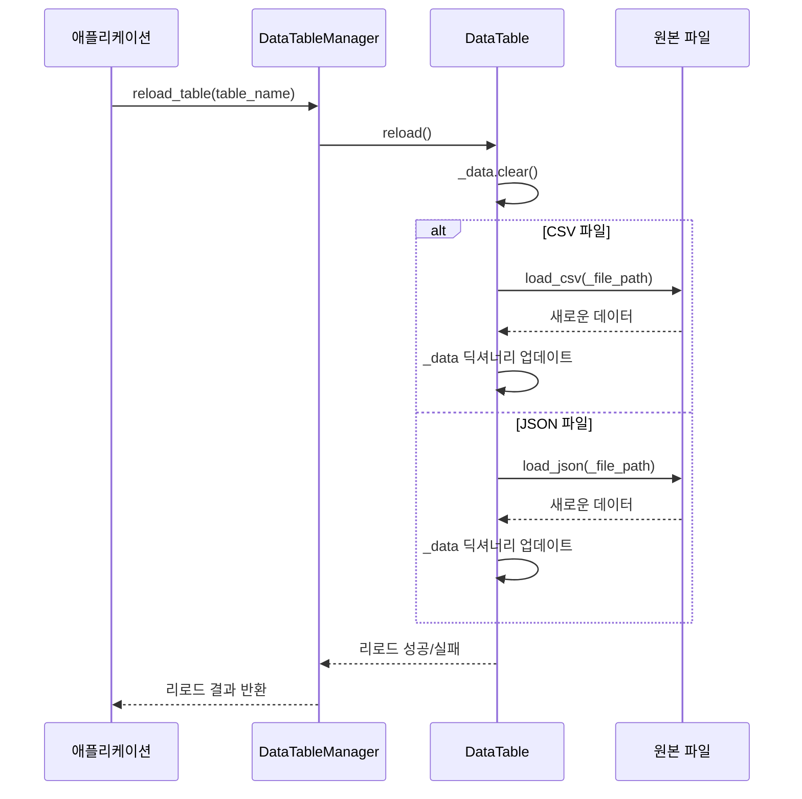

# AI Trading Platform — Data Service

> **개요**: SKN12-FINAL-2TEAM의 AI 트레이딩 플랫폼 백엔드 Data 서비스입니다. CSV/JSON 파일을 메모리에 로드하고 관리하는 데이터 테이블 시스템으로, 정적 데이터 관리와 게임 아이템 데이터 등을 제공합니다. 싱글톤 패턴의 DataTableManager와 제네릭 DataTable 클래스로 구성되어 있습니다.

---

## 🏗️ 프로젝트 구조

### 디렉토리 구조
```
data/
├── __init__.py                                    # 패키지 초기화
├── data_table.py                                  # 제네릭 데이터 테이블 클래스
├── data_table_manager.py                          # 전역 테이블 관리자 (싱글톤)
└── test_data_models.py                            # 테스트용 데이터 모델
```

---

## 🔧 핵심 기능

### 1. **데이터 테이블 관리 (Data Table Management)**
- **제네릭 테이블**: `DataTable<T>` 클래스로 타입 안전한 데이터 관리
- **파일 형식 지원**: CSV, JSON 파일 로드 및 파싱
- **키 기반 접근**: 지정된 키 필드 또는 행 번호로 데이터 조회
- **메모리 기반**: 모든 데이터를 메모리에 로드하여 빠른 접근

### 2. **전역 테이블 관리자 (Global Table Manager)**
- **싱글톤 패턴**: `DataTableManager`로 전역 테이블 관리
- **테이블 등록/조회**: 이름 기반 테이블 등록 및 접근
- **일괄 로드**: 설정 기반으로 모든 테이블을 한 번에 로드
- **동적 리로드**: 개별 테이블 또는 전체 테이블 재로드

### 3. **데이터 모델 시스템 (Data Model System)**
- **추상 베이스 클래스**: `DataRow`를 상속받아 커스텀 데이터 모델 정의
- **딕셔너리 변환**: `from_dict()` 메서드로 데이터 직렬화/역직렬화
- **타입 안전성**: Python 타입 힌트를 통한 데이터 구조 검증

### 4. **파일 처리 및 에러 핸들링**
- **인코딩 지원**: UTF-8 등 다양한 인코딩 형식 지원
- **중복 키 처리**: 중복 키 발견 시 경고 로그 및 처리
- **에러 복구**: 개별 행 파싱 실패 시에도 전체 로드 계속 진행

---

## 📚 사용된 라이브러리

### **파일 처리**
- **csv**: CSV 파일 읽기 및 파싱
- **json**: JSON 파일 읽기 및 파싱
- **os**: 파일 경로 및 존재 여부 확인

### **타입 시스템**
- **typing**: 제네릭 타입, 타입 힌트, Optional 등
- **abc**: 추상 베이스 클래스 (ABC, abstractmethod)

### **로깅 및 모니터링**
- **service.core.logger.Logger**: 구조화된 로깅

---

## 🪝 핵심 클래스 및 메서드

### **DataTable - 제네릭 데이터 테이블**

```python
class DataTable(Generic[T]):
    """CSV 데이터를 메모리에 로드하고 관리하는 테이블 클래스"""
    
    def __init__(self, row_class: Type[T], key_field: str = None):
        self._data: Dict[str, T] = {}
        self._row_class = row_class
        self._key_field = key_field
        self._file_path: Optional[str] = None
        
    def load_csv(self, file_path: str, encoding: str = 'utf-8') -> bool:
        """CSV 파일을 로드"""
        
    def load_json(self, file_path: str) -> bool:
        """JSON 파일을 로드"""
        
    def get(self, key: str) -> Optional[T]:
        """키로 데이터 조회"""
        
    def get_all(self) -> List[T]:
        """모든 데이터 반환"""
        
    def find(self, predicate) -> Optional[T]:
        """조건에 맞는 첫 번째 항목 찾기"""
        
    def find_all(self, predicate) -> List[T]:
        """조건에 맞는 모든 항목 찾기"""
        
    def get_dict(self) -> Dict[str, T]:
        """딕셔너리 형태로 모든 데이터 반환"""
        
    def reload(self) -> bool:
        """파일 다시 로드"""
        
    def count(self) -> int:
        """데이터 개수"""
        
    def clear(self):
        """데이터 초기화"""
```

**동작 방식**:
- 제네릭 타입 T로 타입 안전한 데이터 테이블 구현
- CSV/JSON 파일을 메모리에 로드하여 딕셔너리로 관리
- 키 필드 지정 시 해당 필드를 키로 사용, 미지정 시 행 번호 사용

### **DataTableManager - 전역 테이블 관리자**

```python
class DataTableManager:
    """전역 데이터 테이블 관리자"""
    
    _instance = None
    _tables: Dict[str, DataTable] = {}
    
    def __new__(cls):
        if cls._instance is None:
            cls._instance = super(DataTableManager, cls).__new__(cls)
        return cls._instance
        
    @classmethod
    def register_table(cls, name: str, table: DataTable) -> bool:
        """테이블 등록"""
        
    @classmethod
    def get_table(cls, name: str) -> Optional[DataTable]:
        """테이블 조회"""
        
    @classmethod
    def load_all_tables(cls, base_path: str, table_configs: Dict[str, dict]) -> bool:
        """모든 테이블 로드"""
        
    @classmethod
    def reload_table(cls, name: str) -> bool:
        """특정 테이블 다시 로드"""
        
    @classmethod
    def reload_all_tables(cls) -> int:
        """모든 테이블 다시 로드"""
        
    @classmethod
    def clear(cls):
        """모든 테이블 초기화"""
```

**동작 방식**:
- 싱글톤 패턴으로 전역 테이블 관리
- 이름 기반 테이블 등록 및 조회
- 설정 기반 일괄 테이블 로드 및 동적 리로드

### **DataRow - 데이터 모델 베이스**

```python
class DataRow(ABC):
    """CSV 행 데이터의 베이스 클래스"""
    @abstractmethod
    def from_dict(self, data: dict):
        """딕셔너리에서 객체로 변환"""
        pass

class ItemData(DataRow):
    """아이템 데이터 모델 (테스트용)"""
    
    def __init__(self):
        self.id: int = 0
        self.name: str = ""
        self.type: str = ""
        self.level: int = 0
        self.price: int = 0
        self.description: str = ""
        
    def from_dict(self, data: dict):
        """딕셔너리에서 객체로 변환"""
        self.id = int(data.get('id', 0))
        self.name = data.get('name', '')
        self.type = data.get('type', '')
        self.level = int(data.get('level', 0))
        self.price = int(data.get('price', 0))
        self.description = data.get('description', '')
```

**동작 방식**:
- 추상 베이스 클래스로 데이터 모델 인터페이스 정의
- `from_dict()` 메서드로 딕셔너리 데이터를 객체로 변환
- 타입 힌트를 통한 데이터 구조 명시

---

## 🌐 API 연동 방식

### **데이터 테이블 생성 및 로드**

```python
from service.data.data_table import DataTable
from service.data.data_table_manager import DataTableManager
from .test_data_models import ItemData

# 1. 데이터 테이블 생성
items_table = DataTable(ItemData, key_field="id")

# 2. CSV 파일 로드
success = items_table.load_csv("data/items.csv")
if success:
    print(f"아이템 {items_table.count()}개 로드 완료")

# 3. 전역 관리자에 등록
DataTableManager.register_table("items", items_table)
```

### **테이블 설정 기반 일괄 로드**

```python
# 테이블 설정 정의
table_configs = {
    "items": {
        "file": "items.csv",
        "row_class": ItemData,
        "key_field": "id"
    },
    "monsters": {
        "file": "monsters.json",
        "row_class": MonsterData,
        "key_field": "monster_id"
    }
}

# 모든 테이블 일괄 로드
success = DataTableManager.load_all_tables("data/", table_configs)
if success:
    print("모든 테이블 로드 완료")
```

### **데이터 조회 및 검색**

```python
# 전역 관리자에서 테이블 가져오기
items_table = DataTableManager.get_table("items")
if items_table:
    # 키로 조회
    sword = items_table.get("1001")
    if sword:
        print(f"검: {sword.name}, 레벨: {sword.level}")
    
    # 조건 검색
    weapons = items_table.find_all(lambda item: item.type == "weapon")
    print(f"무기 {len(weapons)}개 발견")
    
    # 모든 데이터
    all_items = items_table.get_all()
    print(f"총 아이템 {len(all_items)}개")
```

---

## 🔄 데이터 서비스 전체 흐름

### **1. 테이블 초기화 플로우**


### **2. 데이터 조회 플로우**


### **3. 데이터 리로드 플로우**


---

## 🔌 데이터 서비스 구현 상세

### **CSV 파일 파싱 시스템**

```python
def load_csv(self, file_path: str, encoding: str = 'utf-8') -> bool:
    """CSV 파일을 로드"""
    try:
        if not os.path.exists(file_path):
            Logger.error(f"CSV 파일이 존재하지 않습니다: {file_path}")
            return False
            
        self._file_path = file_path
        self._data.clear()
        
        with open(file_path, 'r', encoding=encoding) as file:
            reader = csv.DictReader(file)
            
            for row_num, row in enumerate(reader, start=2):  # 헤더 제외하고 2번째 줄부터
                try:
                    # 빈 값 처리
                    cleaned_row = {k: v.strip() if v else '' for k, v in row.items()}
                    
                    # 행 객체 생성
                    row_obj = self._row_class()
                    row_obj.from_dict(cleaned_row)
                    
                    # 키 필드가 지정된 경우 해당 필드를 키로 사용
                    if self._key_field and hasattr(row_obj, self._key_field):
                        key = str(getattr(row_obj, self._key_field))
                        if key in self._data:
                            Logger.warn(f"중복 키 발견: {key} (파일: {file_path}, 행: {row_num})")
                        self._data[key] = row_obj
                    else:
                        # 키 필드가 없으면 행 번호를 키로 사용
                        self._data[str(row_num)] = row_obj
                        
                except Exception as e:
                    Logger.error(f"CSV 행 파싱 실패 (파일: {file_path}, 행: {row_num}): {e}")
                    continue
                    
        Logger.info(f"CSV 로드 완료: {file_path} ({len(self._data)}개 행)")
        return True
        
    except Exception as e:
        Logger.error(f"CSV 파일 로드 실패: {file_path} - {e}")
        return False
```

**파싱 특징**:
- **헤더 제외**: 첫 번째 줄을 헤더로 인식하고 2번째 줄부터 데이터 처리
- **빈 값 처리**: 빈 값은 빈 문자열로 정규화
- **중복 키 감지**: 동일한 키 발견 시 경고 로그 출력
- **에러 복구**: 개별 행 파싱 실패 시에도 전체 로드 계속 진행

### **JSON 파일 파싱 시스템**

```python
def load_json(self, file_path: str) -> bool:
    """JSON 파일을 로드"""
    try:
        if not os.path.exists(file_path):
            Logger.error(f"JSON 파일이 존재하지 않습니다: {file_path}")
            return False
            
        self._file_path = file_path
        self._data.clear()
        
        with open(file_path, 'r', encoding='utf-8') as file:
            data = json.load(file)
            
            if isinstance(data, list):
                for idx, item in enumerate(data):
                    row_obj = self._row_class()
                    row_obj.from_dict(item)
                    
                    if self._key_field and hasattr(row_obj, self._key_field):
                        key = str(getattr(row_obj, self._key_field))
                        self._data[key] = row_obj
                    else:
                        self._data[str(idx)] = row_obj
                        
            elif isinstance(data, dict):
                for key, item in data.items():
                    row_obj = self._row_class()
                    row_obj.from_dict(item)
                    self._data[key] = row_obj
                    
        Logger.info(f"JSON 로드 완료: {file_path} ({len(self._data)}개 항목)")
        return True
        
    except Exception as e:
        Logger.error(f"JSON 파일 로드 실패: {file_path} - {e}")
        return False
```

**파싱 특징**:
- **리스트/딕셔너리 지원**: JSON 배열과 객체 모두 지원
- **자동 키 생성**: 리스트의 경우 인덱스를 키로 사용
- **키 보존**: 딕셔너리의 경우 원본 키를 그대로 사용

### **싱글톤 패턴 구현**

```python
class DataTableManager:
    """전역 데이터 테이블 관리자"""
    
    _instance = None
    _tables: Dict[str, DataTable] = {}
    
    def __new__(cls):
        if cls._instance is None:
            cls._instance = super(DataTableManager, cls).__new__(cls)
        return cls._instance
```

**싱글톤 특징**:
- **전역 인스턴스**: 애플리케이션 전체에서 하나의 인스턴스만 존재
- **테이블 풀**: 모든 등록된 테이블을 중앙에서 관리
- **메모리 효율성**: 중복 인스턴스 생성 방지

---

## 📊 사용 예제

### **기본 데이터 테이블 사용**

```python
from service.data.data_table import DataTable
from .test_data_models import ItemData

# 1. 데이터 테이블 생성
items_table = DataTable(ItemData, key_field="id")

# 2. CSV 파일 로드
if items_table.load_csv("data/items.csv"):
    print(f"아이템 {items_table.count()}개 로드 완료")
    
    # 3. 데이터 조회
    sword = items_table.get("1001")
    if sword:
        print(f"검: {sword.name}, 가격: {sword.price}원")
    
    # 4. 조건 검색
    weapons = items_table.find_all(lambda item: item.type == "weapon")
    print(f"무기 {len(weapons)}개:")
    for weapon in weapons:
        print(f"  - {weapon.name} (레벨 {weapon.level})")
```

### **전역 테이블 관리자 사용**

```python
from service.data.data_table_manager import DataTableManager
from service.data.data_table import DataTable
from .test_data_models import ItemData

# 1. 테이블 설정 정의
table_configs = {
    "items": {
        "file": "items.csv",
        "row_class": ItemData,
        "key_field": "id"
    }
}

# 2. 모든 테이블 일괄 로드
success = DataTableManager.load_all_tables("data/", table_configs)
if success:
    print("테이블 로드 완료")
    
    # 3. 등록된 테이블 조회
    items_table = DataTableManager.get_table("items")
    if items_table:
        print(f"아이템 테이블: {items_table.count()}개 항목")
        
        # 4. 데이터 접근
        all_items = items_table.get_all()
        for item in all_items[:5]:  # 처음 5개만
            print(f"  {item.id}: {item.name}")
```

### **커스텀 데이터 모델 정의**

```python
from service.data.data_table import DataRow

class MonsterData(DataRow):
    """몬스터 데이터 모델"""
    
    def __init__(self):
        self.monster_id: str = ""
        self.name: str = ""
        self.level: int = 0
        self.hp: int = 0
        self.attack: int = 0
        self.defense: int = 0
        self.exp_reward: int = 0
        
    def from_dict(self, data: dict):
        """딕셔너리에서 객체로 변환"""
        self.monster_id = data.get('monster_id', '')
        self.name = data.get('name', '')
        self.level = int(data.get('level', 0))
        self.hp = int(data.get('hp', 0))
        self.attack = int(data.get('attack', 0))
        self.defense = int(data.get('defense', 0))
        self.exp_reward = int(data.get('exp_reward', 0))
        
    def __repr__(self):
        return f"MonsterData(id={self.monster_id}, name='{self.name}', level={self.level})"

# 몬스터 테이블 생성 및 사용
monsters_table = DataTable(MonsterData, key_field="monster_id")
if monsters_table.load_json("data/monsters.json"):
    boss_monsters = monsters_table.find_all(lambda m: m.level >= 50)
    print(f"보스 몬스터 {len(boss_monsters)}마리:")
    for monster in boss_monsters:
        print(f"  {monster.name} (레벨 {monster.level}, HP {monster.hp})")
```

---

## ⚙️ 설정

### **테이블 설정 구조**

```python
# 테이블 설정 예시
table_configs = {
    "items": {
        "file": "items.csv",           # 파일명
        "row_class": ItemData,         # 데이터 모델 클래스
        "key_field": "id"              # 키 필드 (선택사항)
    }
}
```

### **파일 경로 설정**

```python
# 기본 데이터 경로 설정
base_path = "data/"  # CSV/JSON 파일들이 있는 기본 경로

# 전체 테이블 로드
success = DataTableManager.load_all_tables(base_path, table_configs)
```

---

## 🔗 연관 폴더

### **사용하는 Service**
- **service.core.logger.Logger**: 구조화된 로깅

### **사용하는 Template**
- **template.account.account_template_impl**: 계정 템플릿에서 아이템 테이블 접근
  - `DataTableManager.get_table("items")`로 아이템 데이터 조회
  - 신규 유저 시작 아이템 지급 로직에서 사용

### **의존성 관계**
- **csv**: CSV 파일 파싱
- **json**: JSON 파일 파싱
- **os**: 파일 경로 및 존재 여부 확인
- **typing**: 제네릭 타입 및 타입 힌트
- **abc**: 추상 베이스 클래스

---

## 📚 외부 시스템

### **파일 시스템**
- **CSV 파일**: 콤마로 구분된 데이터 파일
- **JSON 파일**: JavaScript Object Notation 데이터 파일
- **인코딩**: UTF-8 등 다양한 텍스트 인코딩 지원

### **메모리 시스템**
- **인메모리 저장**: 모든 데이터를 메모리에 로드하여 빠른 접근
- **딕셔너리 구조**: 키-값 쌍으로 데이터 관리
- **가비지 컬렉션**: Python 자동 메모리 관리

---

## 🚀 성능 최적화

### **메모리 기반 접근**
- **빠른 조회**: 메모리 딕셔너리 기반 O(1) 시간 복잡도
- **캐싱 효과**: 파일 I/O 없이 메모리에서 직접 데이터 접근
- **지연 로딩**: 필요할 때만 파일에서 데이터 로드

### **효율적인 데이터 구조**
- **제네릭 타입**: 타입 안전성과 성능의 균형
- **키 기반 인덱싱**: 빠른 데이터 검색 및 접근
- **메모리 효율성**: 중복 인스턴스 방지

### **에러 처리 및 안정성**
- **부분 실패 허용**: 개별 행 파싱 실패 시에도 전체 로드 계속
- **로깅 시스템**: 상세한 에러 정보 및 처리 과정 기록
- **자동 복구**: 파일 리로드를 통한 데이터 갱신

이 데이터 서비스는 **메모리 기반 빠른 데이터 접근**과 **유연한 파일 형식 지원**을 통해 AI 트레이딩 플랫폼의 정적 데이터 관리 능력을 크게 향상시킵니다.
