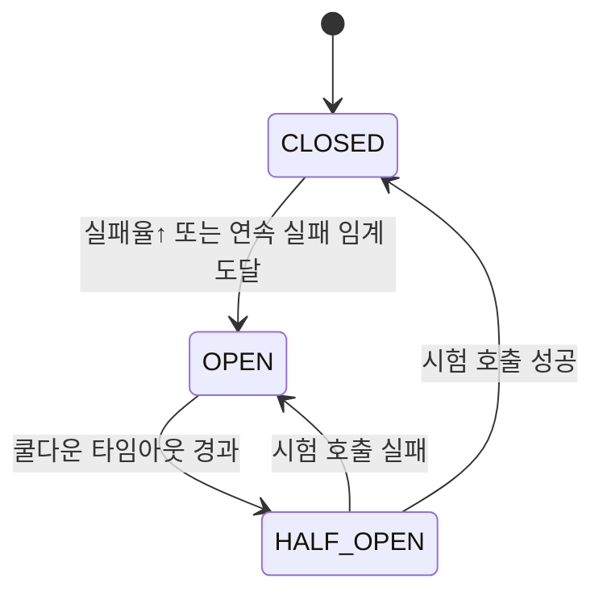

# External Service — 어떻게 동작해요?

> **v1.2.1**

### 0) 한 줄 요약

설정(외부 API 목록) → 클라이언트 풀 준비 → 요청 수신 → (RateLimit 체크 → CircuitBreaker 체크 → 재시도+백오프) → 응답/에러 기록 & 메트릭 집계

*모든 API는 하나의 정적 진입점인 `ExternalService`를 통해 호출됩니다.*

---

### 1) 요청 1건이 지나가는 길 (시퀀스)

```mermaid
sequenceDiagram
    participant Caller as 호출자(예: MarketDataTool)
    participant ES as ExternalService
    participant Pool as ClientPool
    participant HC as HttpExternalClient
    participant API as External API

    Caller->>ES: get("stock_market", "/quote", params)
    ES->>Pool: get_client("stock_market")
    Pool-->>ES: HttpExternalClient 인스턴스
    
    ES->>HC: request("GET", "/quote", params)
    HC->>HC: RateLimit 토큰 획득 (대기/거절)
    HC->>HC: CircuitBreaker 상태 확인 (CLOSED?)
    loop 재시도 n회 (지수 백오프(+지터))
        HC->>API: HTTP 요청 (aiohttp 세션/커넥션풀)
        alt 성공 (2xx)
            API-->>HC: JSON 응답
            HC->>HC: CircuitBreaker.record_success()
            HC-->>ES: 결과 반환
            ES-->>Caller: 데이터
            break
        else 실패 (네트워크/5xx/타임아웃)
            API-->>HC: 오류
            HC->>HC: CircuitBreaker.record_failure()
            Note right of HC: 남은 재시도 있으면<br/>백오프 후 재시도
        end
    end
```

---

### 2) 안쪽 구성요소가 하는 일

-   **`ExternalService` (정적 싱글톤 진입점)**
    -   `init(config)`에서 모든 API 설정을 읽고, API별 `HttpExternalClient`를 풀에 등록합니다.
    -   `get/post/request(api_name, url, **kwargs)`로 호출자 코드를 단순화합니다.

-   **`ClientPool`**
    -   `api_name`에 대응하는 `HttpExternalClient`를 반환합니다.
    -   여러 API를 설정 기반으로 쉽게 확장할 수 있도록 돕습니다.

-   **`HttpExternalClient` (aiohttp 기반)**
    -   **연결 재사용**: `aiohttp.TCPConnector`로 커넥션 풀을 관리합니다.
    -   **Rate Limiting**: 토큰 버킷(초당 N건) 알고리즘으로 API 제공사 요청 제한에 대응합니다.
    -   **Circuit Breaker**: 실패율/연속 실패 기준으로 `CLOSED` → `OPEN` → `HALF_OPEN` 상태를 전환하며 장애 전파를 막습니다.
    -   **Retry + Exponential Backoff (+지터)**: 일시적인 오류에 대한 회복탄력성을 가집니다.
    -   **메트릭/로깅**: 요청 수, 성공/실패, 지연 시간을 기록합니다.

---

### 3) 서킷 브레이커 상태 전이



*   **CLOSED**: 정상 상태. 모든 요청을 허용합니다.
*   **OPEN**: 차단 상태. 일정 시간 동안 모든 요청을 즉시 실패 처리하여 다운스트림 시스템을 보호합니다.
*   **HALF_OPEN**: 시험 상태. 일부 요청만 허용하여 API 복구 여부를 확인하고, 성공 시 `CLOSED`로, 실패 시 다시 `OPEN`으로 전환됩니다.

---

### 4) 재시도 & 백오프 로직(의사코드)

```python
for attempt in range(retry_count + 1):
    try:
        resp = await session.request(method, full_url, timeout=timeout, **kwargs)
        if 200 <= resp.status < 300:
            breaker.record_success()
            return await resp.json()
        else:
            raise ExternalError(resp.status)
    except Exception as e:
        breaker.record_failure()
        if attempt == retry_count:
            raise
        # 지수 백오프(+지터)
        sleep = base * (2 ** attempt) + random.uniform(0, jitter)
        await asyncio.sleep(sleep)
```

---

### 5) 오류 유형별 처리 정책

| 상황 | 재시도 | 서킷 브레이커 카운트 | 메모 |
| :--- | :---: | :---: | :--- |
| 5xx (502/503/504) | ✅ | ✅ | 지수 백오프 적용 |
| 네트워크/타임아웃 | ✅ | ✅ | 커넥션/읽기 타임아웃 분리 권장 |
| 429 (Too Many Req) | ✅ | ✅ | `Retry-After` 헤더 존중(가능시) |
| 4xx (400/401/403) | ❌ | ✅(선택) | 설정/인증 오류는 재시도 금지 |
| 404 (Not Found) | ❌ | ❌ | 리소스 없음—브레이커 제외 권장 |

---

### 6) 설정은 이렇게 읽혀요 (예시)

#### Pydantic 스키마 예시
```python
from pydantic import BaseModel, AnyHttpUrl
from typing import Literal

class ApiEndpointConfig(BaseModel):
    base_url: AnyHttpUrl
    api_key_env: str | None = None  # 환경변수에서 API 키를 가져올 경우, 해당 환경변수의 이름
    timeout: float = 10.0
    retry_count: int = 2
    rate_limit_per_sec: int = 5
    rate_limit_mode: Literal["wait","reject"] = "wait"
    connect_timeout: float | None = None
    read_timeout: float | None = None
```

#### 설정 파일 예시 (`external_config.py`)
```python
ExternalConfig(
  apis={
    "stock_market": ApiEndpointConfig(
      base_url="https://api.stock.example.com",
      api_key_env="STOCK_API_KEY",
      timeout=10,
      retry_count=2,
      rate_limit_per_sec=5
    ),
    "news": ApiEndpointConfig(
      base_url="https://news.example.com",
      api_key_env="NEWS_API_KEY",
      timeout=8,
      retry_count=1,
      rate_limit_per_sec=10,
      rate_limit_mode="reject"
    ),
  }
)
```
*   API별로 URL, 키, 타임아웃, 재시도, 레이트리밋을 각각 독립적으로 운용할 수 있습니다.

---

### 7) 레이트리밋 정책

*   **`rate_limit_mode: "wait"` (기본값)**: 설정된 초당 요청 수를 초과하면, 다음 토큰이 채워질 때까지 비동기적으로 대기합니다.
*   **`rate_limit_mode: "reject"`**: 요청 수를 초과하면 즉시 에러를 반환하여 호출자가 직접 처리하도록 합니다.

---

### 8) 초기화 & 호출하는 코드 예시

```python
# 앱 시작 시 1회
from external.external_service import ExternalService
from external.external_config import ExternalConfig

config = ExternalConfig(apis={...})
await ExternalService.init(config)

# 어디서든 호출 (예: MarketDataTool)
data = await ExternalService.get(
  api_name="stock_market",
  url="/quote",
  params={"symbol": "AAPL"}
)
```

---

### 9) 모니터링 포인트

#### 메트릭 이름 예시 (Prometheus)
*   `external_requests_total{api=...}`
*   `external_request_duration_seconds{api=...,status=2xx/5xx/timeout}`
*   `external_failures_total{api=...,reason=timeout/network/...}`
*   `external_circuit_state{api=...,state=CLOSED|OPEN|HALF_OPEN}`
*   `external_ratelimit_wait_seconds{api=...}`

#### 구조화된 로깅 필드 예시 (ELK)
*   `ts, api, method, path, status, latency_ms, attempt, cb_state, rl_wait_ms, req_id, trace_id`

---

### 10) 테스트 가이드

*   **Postman 테스트 세트 제공**: 이 서비스의 API 동작을 검증하기 위한 Postman 파일이 제공됩니다.
    *   **Collection**: `Account_Profile_Test_Collection.json` (실제로는 External 서비스용 Collection이 필요)
    *   **Environment**: `Account_Profile_Test_Environment.json`
*   **실행 방법**:
    1.  로컬 개발 환경에서 서버를 실행합니다.
    2.  Postman에서 `Environment`를 `local`로 선택합니다.
    3.  `Collection`을 실행하여 각 API의 요청/응답을 확인합니다.

---

### 11) 자주 묻는 질문(FAQ)

**Q. 특정 API만 계속 실패하는데, 왜 바로 에러가 떨어져요?**

A. 해당 API의 Circuit Breaker가 `OPEN`일 가능성이 큽니다. 설정된 쿨다운 시간(예: 30초)이 지나면 `HALF_OPEN` 상태로 전환되어 복구를 시도하고, 성공 시 `CLOSED`로 자동 복귀합니다.

**Q. 속도가 느린데요?**

A. Rate Limit 대기, 백오프 지연, 외부 API 자체의 지연이 원인일 수 있습니다. 모니터링 메트릭에서 `duration`과 `ratelimit_wait` 값을 확인해보세요.

**Q. 재시도는 어디까지 해요?**

A. 각 API별 `retry_count`에 설정된 횟수만큼 재시도합니다. 멱등성이 보장되는 `GET`과 같은 요청에 사용하는 것을 권장합니다.
