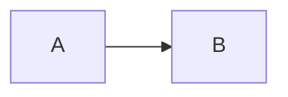
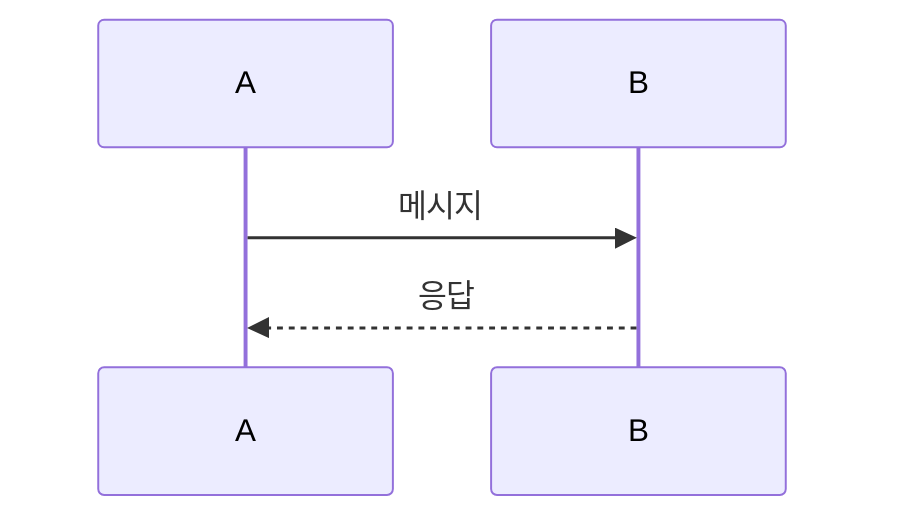
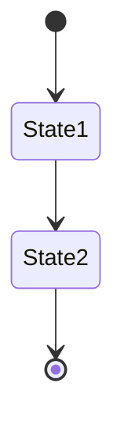

# Mermaid 다이어그램

이 폴더는 SKN12-FINAL-2TEAM 프로젝트의 프론트엔드 Mermaid 다이어그램을 포함합니다.

## 📁 파일 구조

### 유스케이스 다이어그램
- `use-case-as-is.md` - 현재 구현된 기능들
- `use-case-to-be.md` - 향후 개선 계획

### 구조 다이어그램
- `package-structure.md` - 패키지 의존 관계
- `component-diagram.md` - 컴포넌트 관계

### 시퀀스 다이어그램
- `login-sequence.md` - 로그인/인증 플로우
- `websocket-sequence.md` - WebSocket 실시간 시세
- `chat-sse-sequence.md` - AI 챗봇 SSE 스트리밍
- `tutorial-sequence.md` - 튜토리얼 진행 플로우

### 상태 머신
- `state-machines.md` - 주요 상태 머신들 (TypingMessage, WebSocket, Auth, Tutorial)

## 🔄 Mermaid 사용

GitHub에서 Mermaid 다이어그램이 자동으로 렌더링됩니다.

### 마크다운에서 사용
```markdown

```

### 지원되는 다이어그램 타입
- **Graph**: 노드와 엣지 관계
- **Sequence Diagram**: 시퀀스 플로우
- **State Diagram**: 상태 머신
- **Class Diagram**: 클래스 구조
- **Flowchart**: 프로세스 플로우

## 📝 사용법

### 기본 그래프


### 시퀀스 다이어그램


### 상태 머신


## 🎯 장점

- **GitHub 네이티브**: 별도 설정 없이 자동 렌더링
- **간단한 문법**: 직관적이고 배우기 쉬움
- **실시간 편집**: 마크다운 편집기에서 바로 확인
- **버전 관리**: 코드와 함께 Git으로 관리
- **협업 친화적**: 팀원들이 쉽게 이해하고 수정 가능

## 📋 다이어그램 추가 시

1. 마크다운 문서에 Mermaid 코드 블록 추가
2. GitHub에 푸시하면 자동으로 렌더링
3. 별도 파일 생성 불필요

## 🔧 문제 해결

### 다이어그램이 표시되지 않는 경우
- Mermaid 문법 오류 체크
- GitHub에서 Mermaid 지원 확인
- 코드 블록이 올바르게 작성되었는지 확인

### 문법 오류가 있는 경우
- Mermaid 공식 문서 참조
- GitHub의 Mermaid 지원 범위 확인
- 간단한 예제부터 시작하여 단계별로 복잡도 증가
